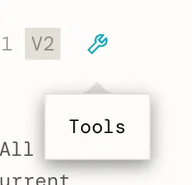
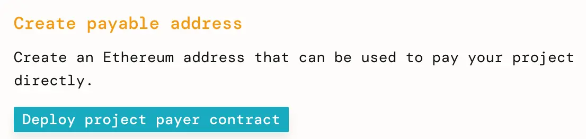
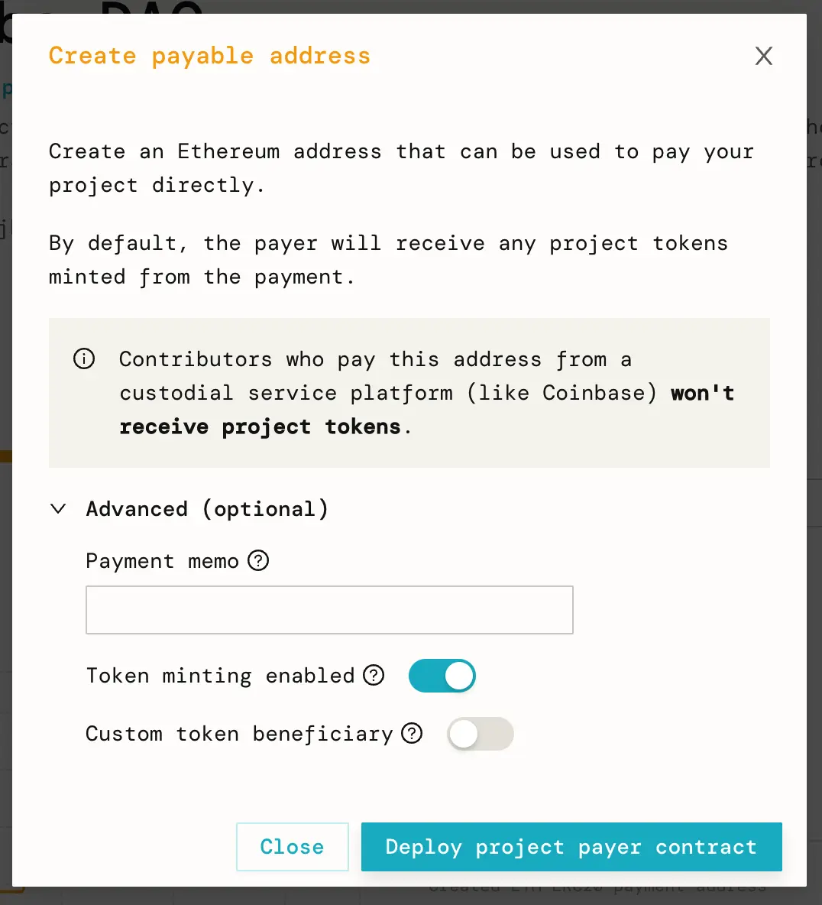
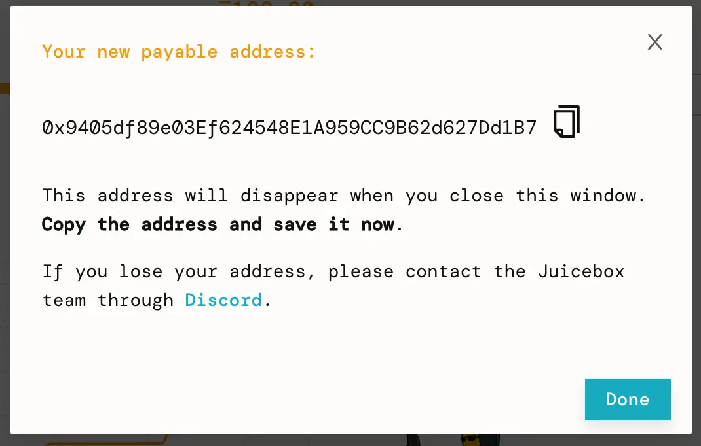
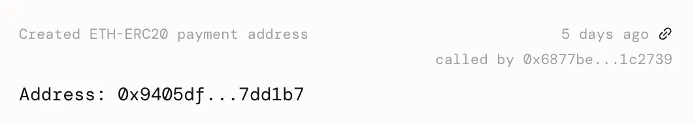
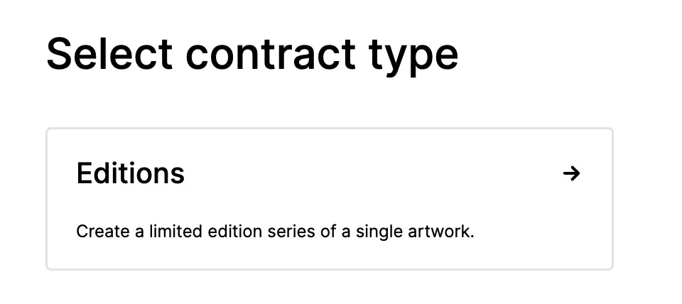
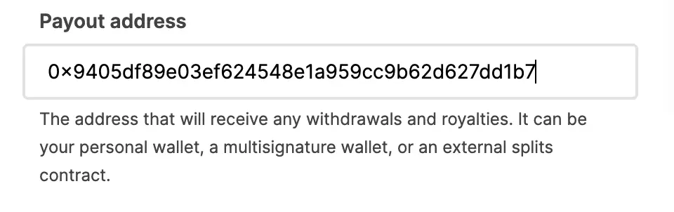
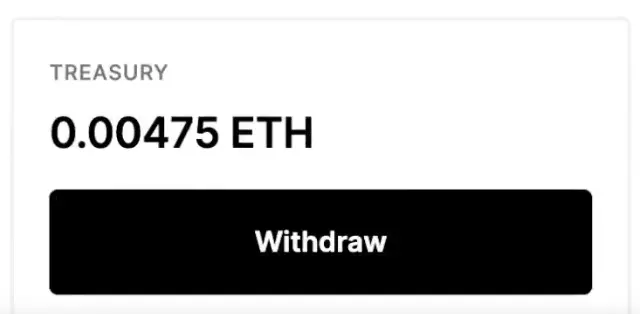
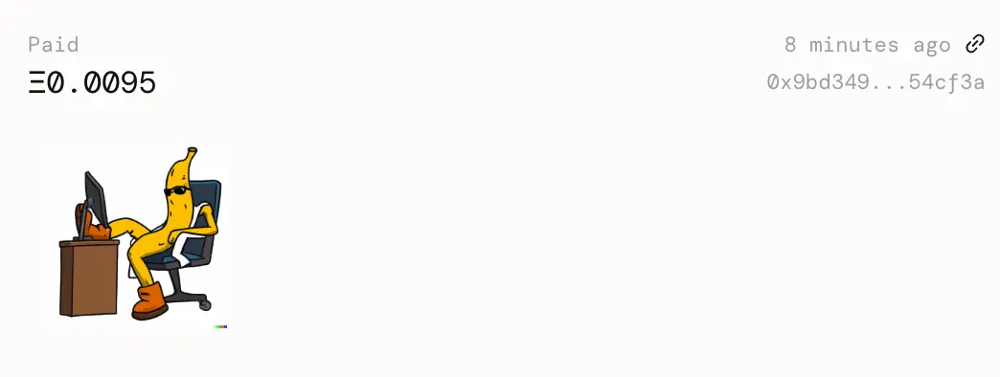

# How to Create an NFT on Zora and forward proceeds to a Juicebox project

In this guide, I’ll show you how to deploy an NFT drop to Ethereum with Zora’s creator tools, and forward the mint sale proceeds to a Juicebox Project.

*As of 2022-08-01, Zora charges a 5% fee on primary sales. This may change in future.*

**Before you start,** you should have:
- At least one piece of artwork for your NFT (image, audio, video).
- A Juicebox project you’d like to fund. This can be your project or someone else’s.

<iframe width="560" height="315" src="https://www.youtube.com/embed/Ss35n_eZwj4" title="YouTube video player" frameborder="0" allow="accelerometer; autoplay; clipboard-write; encrypted-media; gyroscope; picture-in-picture" allowfullscreen></iframe>

### 1. Navigate to Project tools
Go to the project you would like to pay on [juicebox.money](http://juicebox.money). Click the Tools button at the top-right of the page.

Project tools on <a href="https://juicebox.money">juicebox.money</a>

### 2. Create payable address

Click `Deploy project payer contract` in the project tools.

### 3. Deploy your Project Payer
Click `Deploy project payer contract`. Leave the Advanced features set to their defaults. Verify that the transaction looks good in your wallet, then sign it.

Bonus: If you include text or an `ipfs://Qm...` link to an image in the memo field, every contribution to the project made via this Project Payer will have that text and/or image in the Juicebox project's activity feed.

### 4. Copy Project Payer address
When the transaction succeeds, a pop-up will display the new Project Payer’s address.

Project Payer creation successful pop-up.

A new event called “Created ETH-ERC20 payment address” will also appear in the project’s activity feed with the same information. Copy the Project Payer address to your clipboard.

The new Project Payer in the Project's Activity feed.

### 5. Create your NFT
Go to [create.zora.co/create](https://create.zora.co/create) and select an NFT drop type. I’ll be selecting Editions. Fill out your NFT’s data and upload the NFT media. Paste the Project Payer address we copied earlier into the Funds Recipient input.

### 6. Forward ETH to the Juicebox Project
As your NFTs sell, ETH accumulates in the NFT contract. To move the funds to the Juicebox project, navigate to [create.zora.co/collections](http://create.zora.co/collections), select your NFT collection, then click Withdraw, and sign the transaction. The payment to the Juicebox project will appear in the Activity feed when the transaction succeeds.

That’s it! Try minting an NFT to see it in action! For support, visit [discord.gg/juicebox](http://discord.gg/juicebox).
