# How to Create an NFT on Thirdweb and forward proceeds to a Juicebox project

In this guide, I’ll show you how to deploy an NFT to Ethereum with Thirdweb's NFT Edition Drop and forward the mint sale proceeds to a Juicebox Project.

*Thirdweb contracts have no fees.*

**Before you start,** you should have:
- At least one piece of artwork for your NFT (image, audio, video).
- A Juicebox project you’d like to fund. This can be your project or someone else’s.

<iframe width="560" height="315" src="https://www.youtube-nocookie.com/embed/9LHVt2xgTNg" title="YouTube video player" frameborder="0" allow="accelerometer; autoplay; clipboard-write; encrypted-media; gyroscope; picture-in-picture" allowfullscreen></iframe>

### 1. Navigate to Project tools
Go to the project you would like to pay on [juicebox.money](http://juicebox.money). Click the Tools button at the top-right of the page.

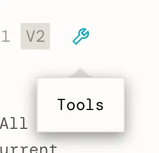

Project tools on <a href="https://juicebox.money">juicebox.money</a>

### 2. Create payable address
Click `Deploy project payer contract` in the project tools.

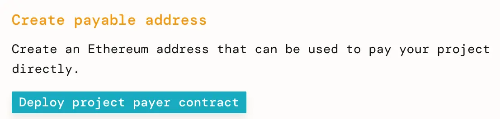

### 3. Deploy your Project Payer
Click `Deploy project payer contract`. Leave the Advanced features set to their defaults. Verify that the transaction looks good in your wallet, then sign it.

Bonus: If you include text or an `ipfs://Qm...` link to an image in the memo field, every contribution to the project made via this Project Payer will have that text and/or image in the Juicebox project's activity feed. An image representing your colleciton is a good choice.

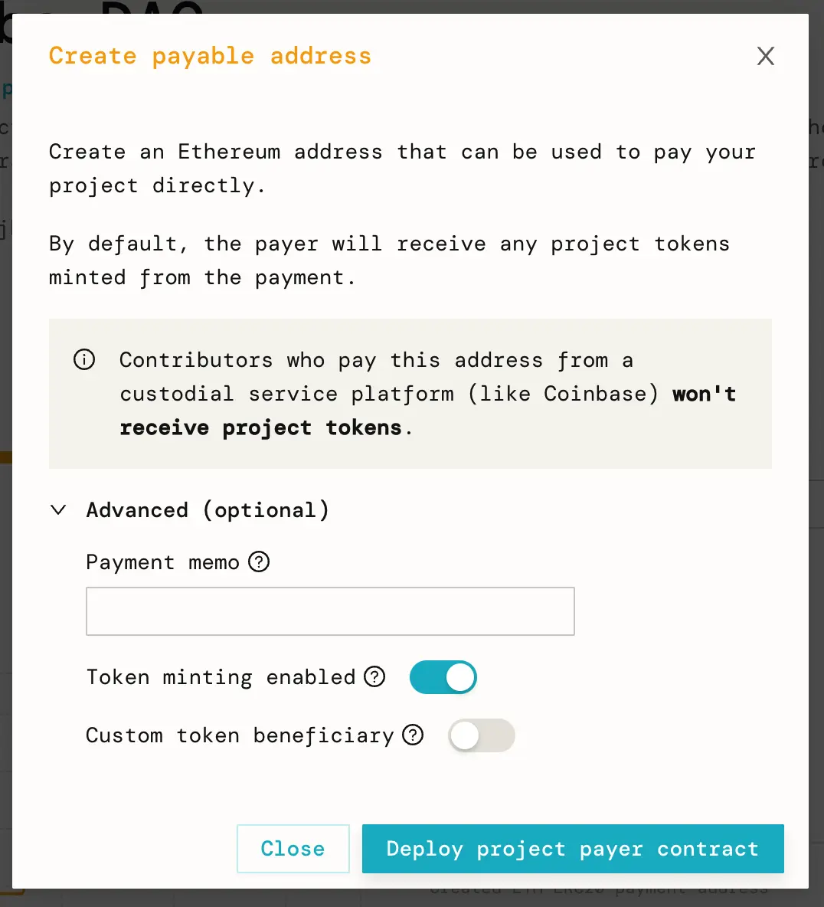

### 4. Copy Project Payer address
When the transaction succeeds, a pop-up will display the new Project Payer’s address.

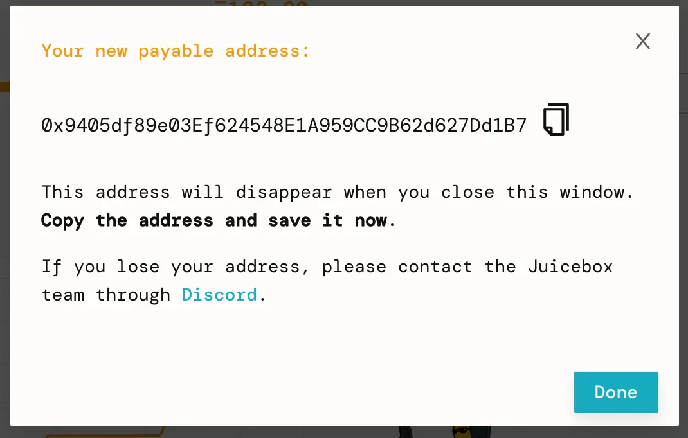

Project Payer creation successful pop-up.

A new event called “Created ETH-ERC20 payment address” will also appear in the project’s activity feed with the same information. Copy the Project Payer address to your clipboard.

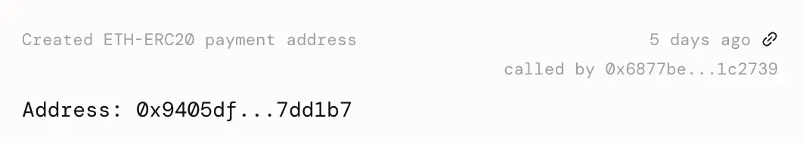

The new Project Payer in the project's Activity feed.

### 5. Create your NFT Collection
Go to [thirdweb's drop page](https://thirdweb.com/contracts/new/pre-built/drop) and select an NFT drop type, or browse [the differences between their drop types](https://portal.thirdweb.com/pre-built-contracts/nfts) in their docs. I’ll be selecting Edition Drop.

First, fill out your NFT Collection’s metadata. Then, paste the Project Payer address we copied earlier into the Funds Recipient input. Click `Deploy` to create your NFT collection.

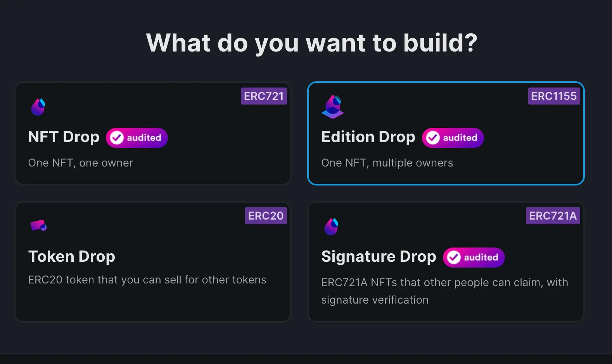

I'm going to do an Edition Drop.

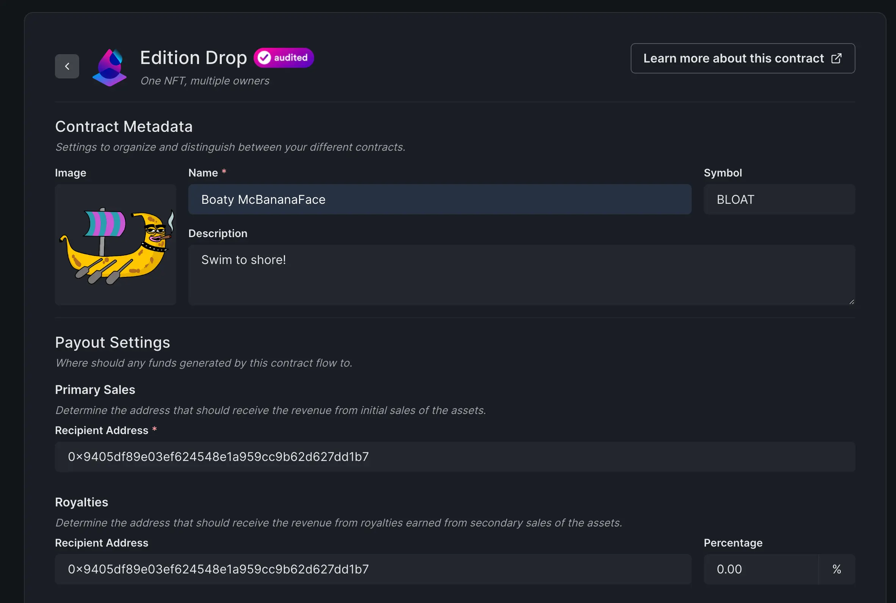

Paste the Project Payer address into the Primary Sales and Royalties recipient inputs.

### 6. Create an NFT
On the Collection page, click `Create` to create your first NFT in the collection.

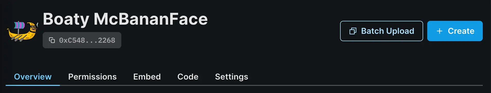

Click Create on the Collection page.

Input your NFT's metadata and click Create Edition Drop

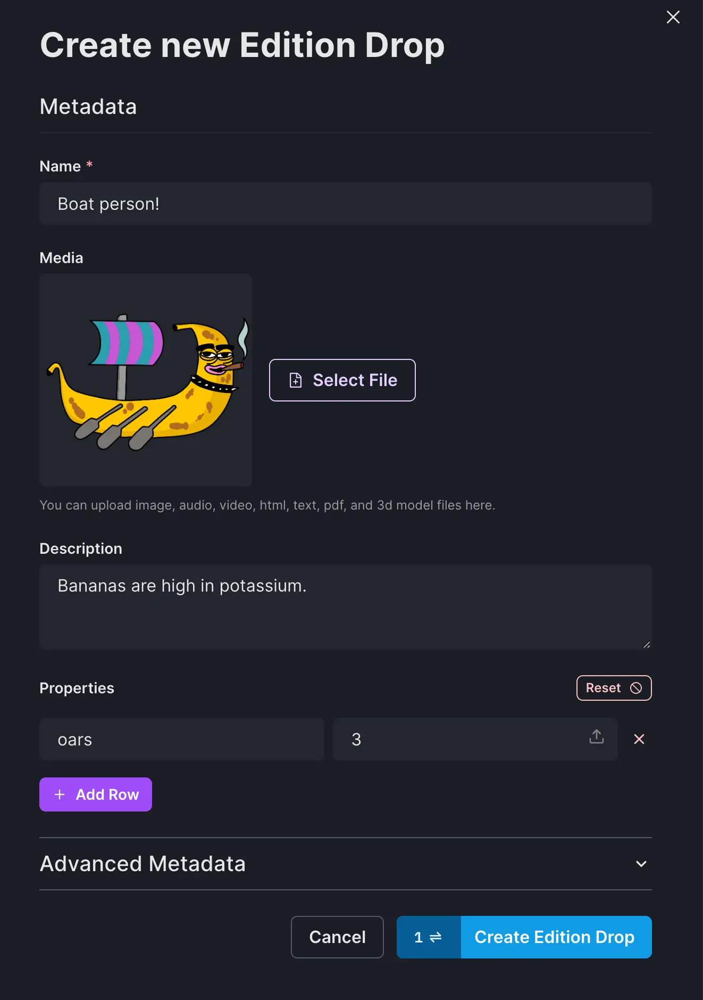

Input your NFT's metadata.

### 7. Create a Claim Phase
Return to the Collection page, click `Claim Phases`, then `Add Initial Claim Phase`

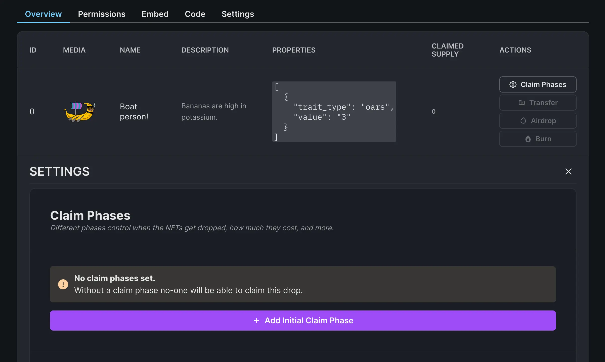

Create a new Claim Phase.

Set a start date, price, and quantity for your claim phase, then click Save Claim Phases when you are satisfied.

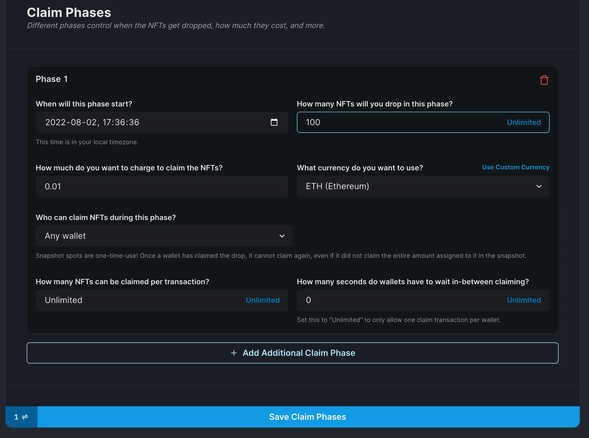

Configure the Claim Phase and Save.

Switch to the Embed tab, then copy-paste the iframe embed code into your own website.

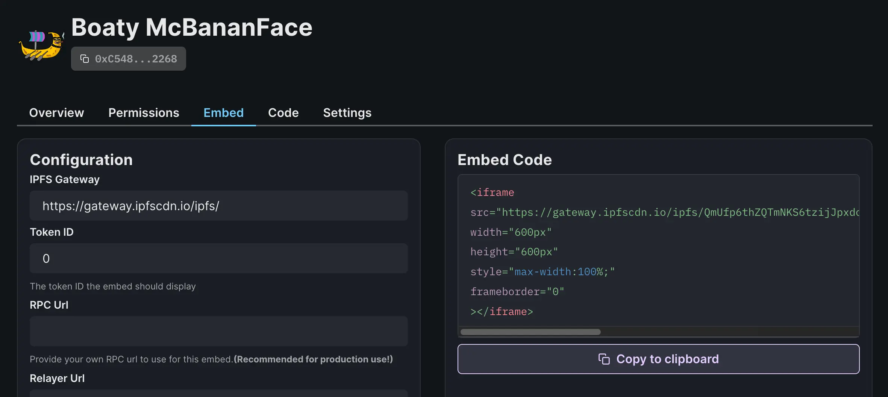

Switch to the Embed tab and click `Copy to clipboard`

You can mint from the preview at the bottom of the page if you would like to test the NFT drop and Juicebox integration.

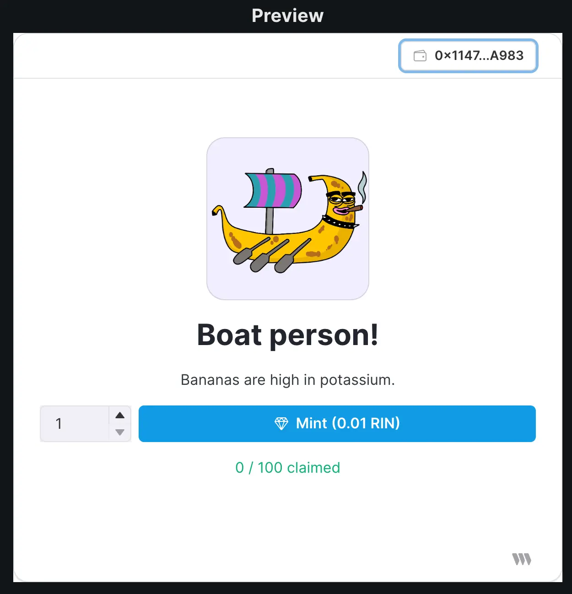

Mint embed preview.

NFT mint proceeds are forwarded directly to the Juicebox project and show up on the Juicebox Project's Activity feed.

That’s it! Try minting an NFT to see it in action!

For support, visit [discord.gg/juicebox](http://discord.gg/juicebox).
