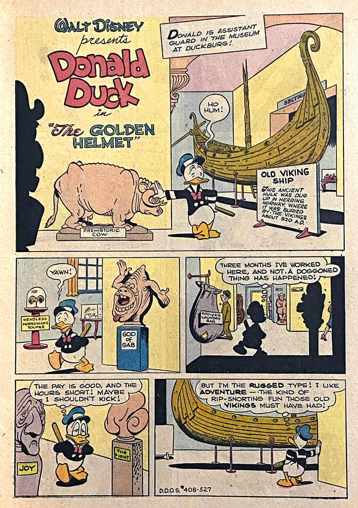
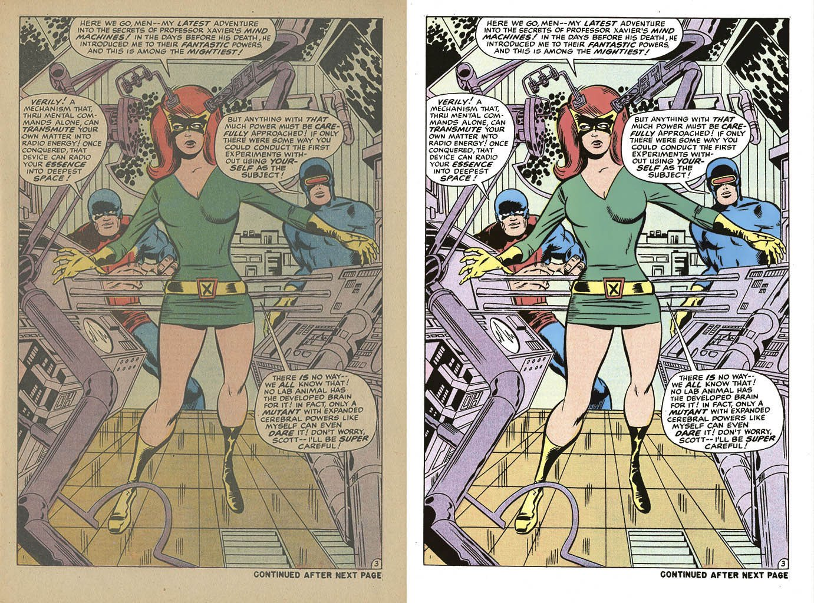
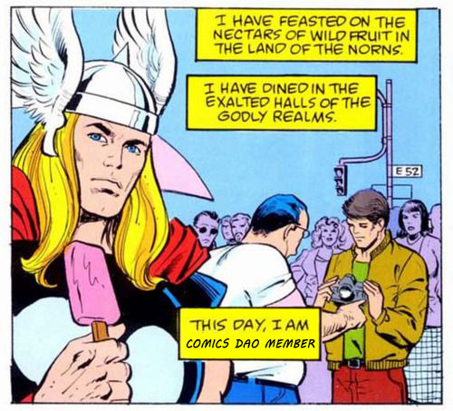
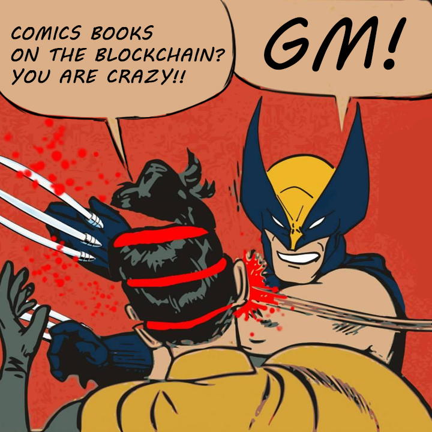
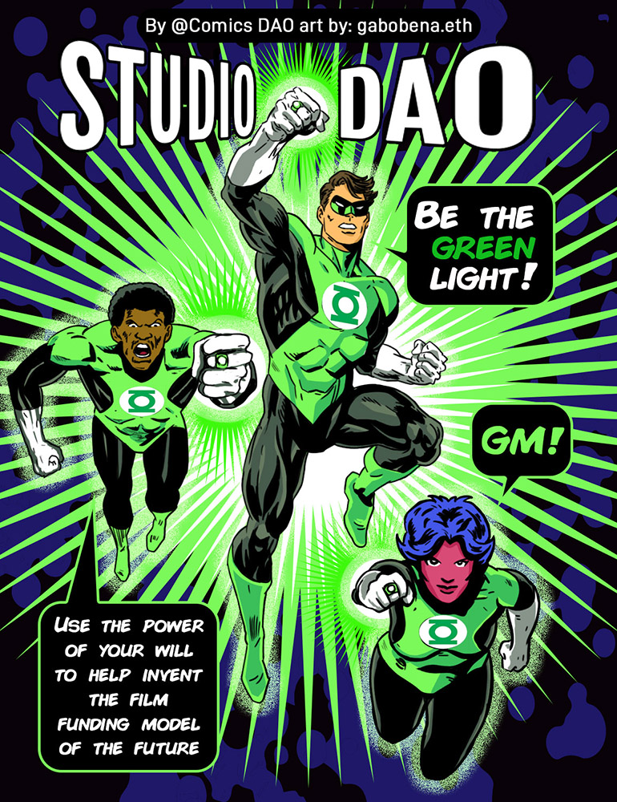
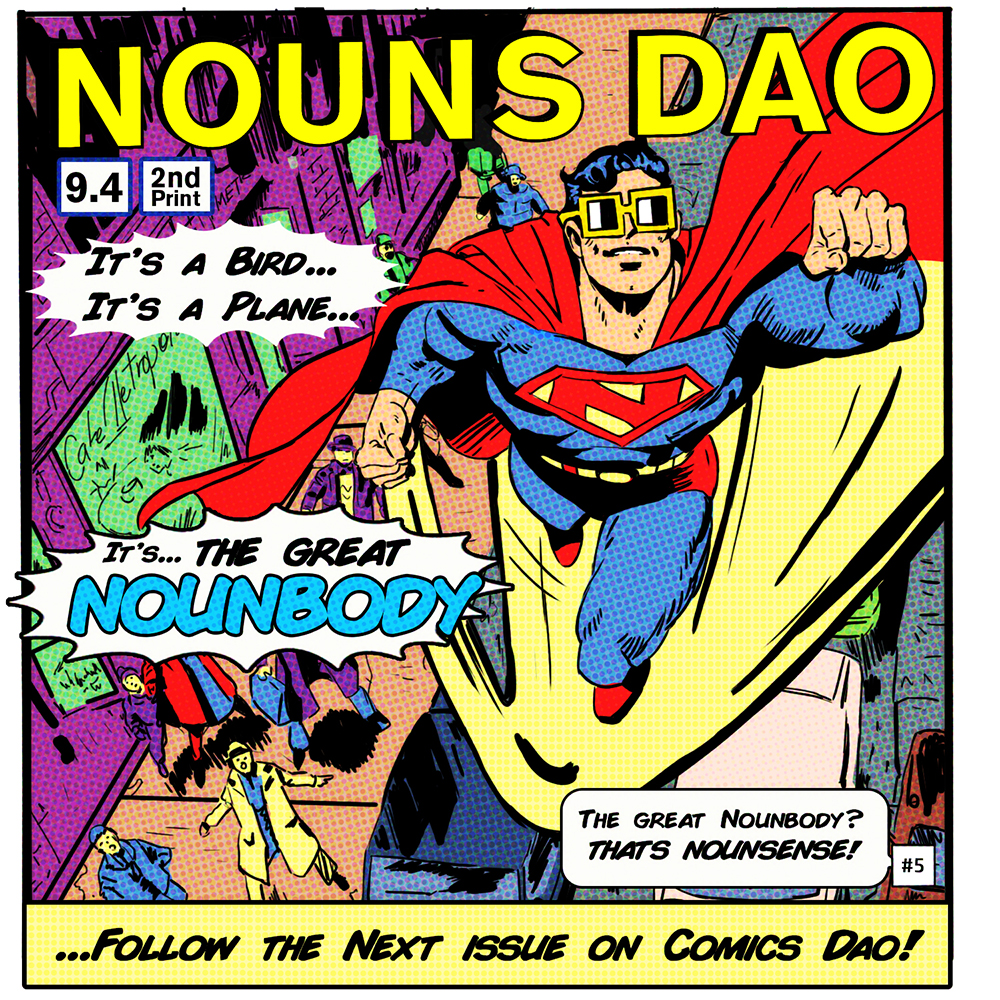

# ComicsDAO - The Whole Enchilada

You ever wonder what people do with those collectible rare comic books that they paid hundreds of thousands of dollars for? Not a whole lot, apparently.

“Because of the way the grading works, unsealing the comic almost by definition damages it. So you have these people who spend hundreds, thousands, or even millions on comics that they never look at. It’s like buying a Picasso and leaving it in a dark locked closet forever,” Adam (discord: Defaulteduser#2001), founder of ComicsDAO, explained recently on a call.

If that sounds underwhelming, well, that’s because it is. The real tragedy is that there are scores of comic fans around the world who would love to get a glimpse of these rare pieces of history. But now, thanks to Adam and a very cool piece of technology, that’s all going to change.

### “Gentlemen, we can rebuild it. We have the technology.”

Central to the cause of ComicsDAO is a wild piece of technology that allows the unthinkable: scanning a closed comic book and getting a high-quality, readable image. It does it by “reading the air pockets at a very specific depth, and then measuring the metal content in the ink,” Adam explained. Whereas newer ink is non-metallic, the ink of olden days used metals, the content of which varied by color. By using both air pockets to calibrate depth, and what’s known about metal content in old ink, a totally closed and sealed comic book can be read page-by-page with striking clarity.

Don’t believe it? Check out this image Adam provided of an original, 1952 Donald Duck comic. The image you see below was extracted from a comic book that was closed and sealed. The scanning machine literally looked *through* the cover to reconstruct this image.

*“We use something called T-Rays (think X-Rays, just a bit different) to read each page without opening up the book at all.” - Adam from ComicsDAO*

### Exciting, sure, but so what?

To the chorus of voices who say fine, this is neat but impractical because let’s face it, reprints of all these comics exist and are readily available, Adam has this to say: the newer reprints of original comics are far from exact replicas. These newer versions are in fact *redrawn* comics, and thus quite different from their original, oftentimes-sealed counterparts.

Adam puts it like this: “It would be like if you had a poster an artist made on your wall of the Mona Lisa. It may look a lot like the Mona Lisa, but the artist who drew it wasn’t da Vinci, it was someone else. Does that mean you’d never want to see the real thing in the Louvre?”

For an example, the image below shows both an original (left) and redraw (right) of the same page of a comic. The first has some fading from the passage of time, but beyond that a quick glance will show you that the style and feel are quite different. That’s the difference between the real thing and a reprint, Adam argues.

*The original (left) and the redrawn, re-issued reprint on the right.*

### ComicsDAO springs onto the scene

Less than six months after springing up, ComicsDAO has over 300 followers on twitter and a growing community on discord. With Adam at the helm of twitter and talented artist gabobena doing art, the team still has allstar Gogo keeping it all together and working on infrastructure and strategy. A steady flow of good shitposts and memes coupled with in inclusive community designed to attract and marry comic book nerds and web3 enthusiasts seems to be finding much success.

*Shitposting memes isn’t the only thing ComicsDAO slays at.*

With the advent of the scanning technology, ComicsDAO also hopes to be able to offer glimpses of rare comics to its members. The goal is to source, fund raise and purchase old comics that would otherwise be cost-prohibitive for any single investor. From there, ComicsDAO will scan the comic and have it on loan as an NFT for members who wish to check it out to read it. This allows the whole community to share in the comic and to appreciate the unique artwork that would be otherwise completely unavailable, and it allows ComicsDAO to amass a collection of comics and build out a full library of collectibles.

### And we haven’t even mentioned the partnerships.

Beyond all that, ComicsDAO has also been creating partnerships with other DAOs in unique and fun ways. Two such examples (pictured below) are their cover-series, where they create comic-style covers for noteworthy DAOs. In the case of ComicsDAO, this has led to a partnership with NounsDAO that is poised to culminate in the creation of a paperback comic book to be distributed nationwide.

*ComicsDAO cover collaboration with StudioDAO and NounsDAO. “This will be an awesome way to take something web3, like ComicsDAO, and put it back into the real world. Imagine being able to buy a NounsDAO comic book at your local bookstore!” -Adam from ComicsDAO*

### The state of ComicsDAO today

A quick jump into the ComicsDAO discord will show you a bustling community spreading out in many different directions. Between partnerships, scanning collectible comics, unapologetic shitposting and building a community of active comic readers, the days are long and fruitful at ComicsDAO. Stop by and say hello in their discord if you want to learn more about what they’re up to and where they’re going. They’d love to see you.

Want to get in on the action? Join ComicsDAO on [discord](https://discord.gg/d9BF6a5Z) or follow them on [twitter](http://twitter.com/comicsdao).
