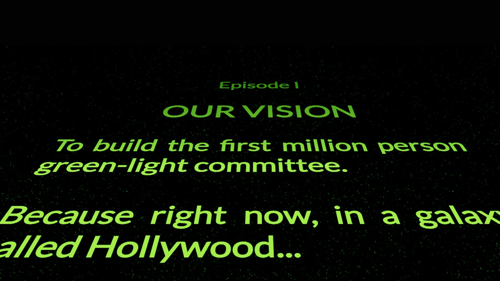
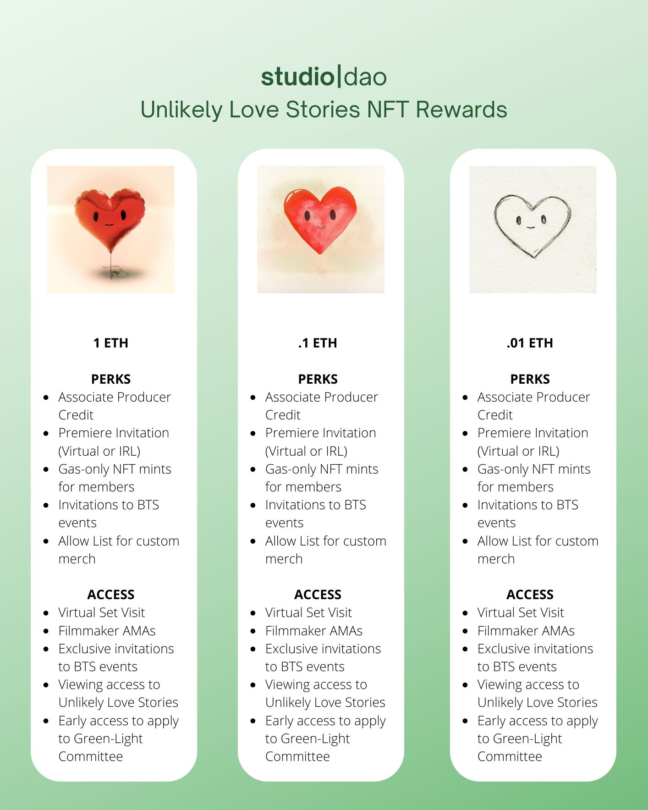

# 🎬 StudioDAO: A Decentralized Movie Studio Flipping the Script on Funding Films

***How StudioDAO is building the first million person green-light committee on Juicebox.***

:::tip
To learn more about how StudioDAO and its sub-projects are configured on Juicebox, read this [companion article](https://docs.juicebox.money/blog/2022-09-20-studiodao-config/).
:::

### 🥱 Prequels, sequels, reboots

If you’ve streamed movies recently, you might have noticed that everything is starting to become homogenized. Superhero mix and match, cinderella with the latest celebrity, maybe an apocalypse or two. It’s becoming increasingly clear that we are no longer paving new roads but rather returning to the same old well-trodden paths. The traditional studio model behind film production is, at least, partly to blame for this. And StudioDAO is trying to fix it.

These constant reboots are often favoured over new ideas that seem like too much of a risk to investors. And to make matters worse, the filmmakers don’t reap nearly as much profits as the financiers. **Here is how films are funded in the traditional studio model:**

- Filmmakers create a budget and pitch their film to financiers
- Financiers provide funding, get repaid once the film is made, and get an extra 20-30% of the films profit
- Financiers then receive ~ 50% of all revenue going forward and the filmmakers the other 50%

Other than the exorbitant take rates (50%? hmmm…), the problem is that financiers are assuming the risk of the success of the film. In other words, they are not incentivized to invest in new films without a proven track record and are much more amenable to franchises with successful past releases. This has lead to the franchise overload that we are currently experiencing where every movie in theaters or on streaming platforms seems to be a prequel, sequel, or reboot.

### 🟢 Enter StudioDAO, stage left

Rather than relying on a centralized financier, StudioDAO is a decentralized movie studio working to become the first million person committee of fans green-lighting movies. By combining the power of collective action with NFT sales to fund films, anyone can participate regardless if they have 0.01, 0.1, or 1 ETH to contribute. For the first time ever the audience will have the opportunity to decide which films they want to fund and watch, all while building community and gaining behind-the-scenes access in the process.

> Our goal is to have a million people come together to fund a movie for the price of a movie ticket
>
>— [Kenny](https://twitter.com/kenbot)

### 💸 StudioDAO’s hybrid funding model

While the idea behind StudioDAO is simple—fans coming together to fund films—their innovative funding model is complex, so let’s break it down. StudioDAO has three methods for funding films:

**1) Retail NFTs**

Using Juicebox’s new NFT rewards feature *(coming soon to a mainnet near you)*, anyone can support projects at three different price points: 0.01, 0.1, and 1 ETH. These NFTs help fund the film’s production budget and are also collectibles that grant governance rights to the StudioDAO community wallet.

**2) Community wallet**

The StudioDAO treasury receives 30% of profits from projects. This community wallet is controlled by members of the DAO and can help fill in the gaps for films in the StudioDAO network that are raising funds for production. This process democratizes the experience of movie production by allowing DAO members to vote on which films should receive treasury funds.

**3) Film financing fund**

Last but not least, this method opens the door to the traditional financing world outside of NFTs and the crypto community. This fund requires investors to KYC and work together with the StudioDAO community to reach an agreement.

### 🎬 How does this work for filmmakers?

- Filmmakers receive 70% of all profits made from their films;
- Retain ownership of their film;
- Control the distribution of their film

A DAO member will act as a filmmaker’s representative, make a pitch to the DAO on their behalf, and seek approval via governance. All DAO members are able to create and vote on proposals, allowing the community to curate content and vote on which films they want to see come to life. Once the vote gets approved, the DAO opens a new Juicebox project with  three funding tiers and fundraising begins.

### ❤️ StudioDAO’s first project: Unlikely Love Stories

*[Unlikely Love Stories](https://www.studiodao.xyz/unlikely-love-stories)* is a dark comedy animated anthology that explores the highest highs and lowest lows of unexpected love in the most unexpected places. The anthology is inspired by the real life love story of Oscar-nominated producer [Rosa Tran](https://www.imdb.com/name/nm1533266/) ([Anomalisa](https://en.wikipedia.org/wiki/Anomalisa), [Robot Chicken](https://en.wikipedia.org/wiki/Robot_Chicken)) and Emmy-winning VFX artist [Derek Smith](https://www.imdb.com/name/nm2894052/) who met at the 2010 Emmy awards and fell in love 7 dates later. *Part 1: Tender Vittles* tells a hilarious, slightly fucked up story about love when a sweet mouse falls in love with a dangerous yet delicious gingerbread cookie.

The first goal for Unlikely Love Stories is to raise $305,000 USD for the pilot episode *Tender Vittles*. To continue the anthology, the project will be aiming to raise $2,000,000 USD to produce a half season and $5,000,000 USD to fund the entire season. 90% of proceeds go towards funding the project and 10% goes to the StudioDAO community fund governed by DAO members.

### 🧃 A transparent way forward

The idea of crowdfunding films isn’t new: [Kickstarter](https://www.kickstarter.com/watch?ref=category_spotlight) has helped raise $500M USD for films over the last ten years, including [5.7 million for Veronica Mars](https://www.kickstarter.com/projects/559914737/the-veronica-mars-movie-project?) in 2019. Fast forward to 2022, crowdfunding on Ethereum has opened up new ways for fans around the world to support films, like filmmaker [Miguel Faus](https://www.miguelfaus.com/) who crowdfunded his film [Calladita](https://calladita.film/) with tiered NFTs. Going one step further than a one-time fundraise, StudioDAO is building a regenerative model in which project creators get to make their dream projects while fans get unprecedented access to the green-lighting process. And all of this magic happens transparently and out in the open on Juicebox.

> There is a two trillion dollar entertainment market and there is a clear scenario for a decentralized studio to do one billion dollars of production 3-4 years from now.
>
>— [Kenny](https://twitter.com/kenbot)

### Relevant links

🎙️ Listen to Kenny tell the story of StudioDAO on episode 9 of the Juicecast on [Spotify](https://open.spotify.com/episode/7ueh4wW79XFIkTnAxgtiV7?si=3824158b264f4867) and [Apple Podcasts](https://podcasts.apple.com/us/podcast/ep-9-kenny-from-studiodao/id1623504302?i=1000576149672)

🟢 Follow StudioDAO on Twitter: [@studioDao](https://twitter.com/studioDao)

💬 Join StudioDAO’s Discord: [https://discord.com/invite/YxPGn9pcdr](https://discord.com/invite/YxPGn9pcdr)

🐦 Follow Juicebox on Twitter: [@JuiceboxETH](https://twitter.com/juiceboxETH)

🚀 [Trending projects on Juicebox](https://juicebox.money/projects)

📚 [Project Creator Docs](https://docs.juicebox.money/user/)

📹 [YouTube Tutorials](https://www.youtube.com/c/JuiceboxDAO)
