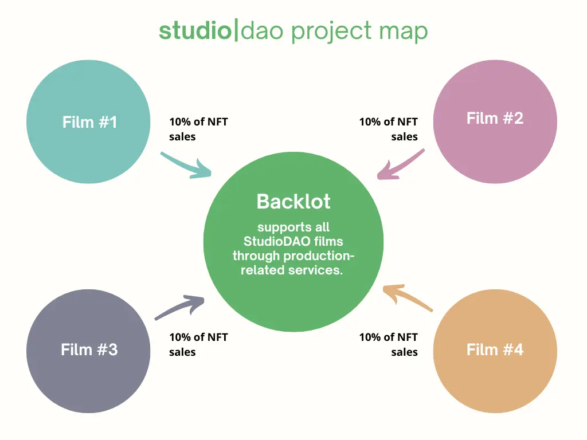
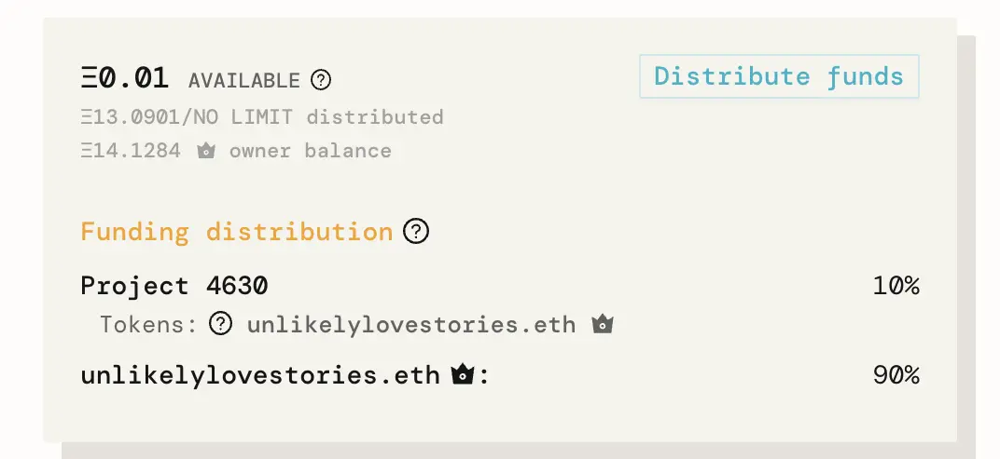
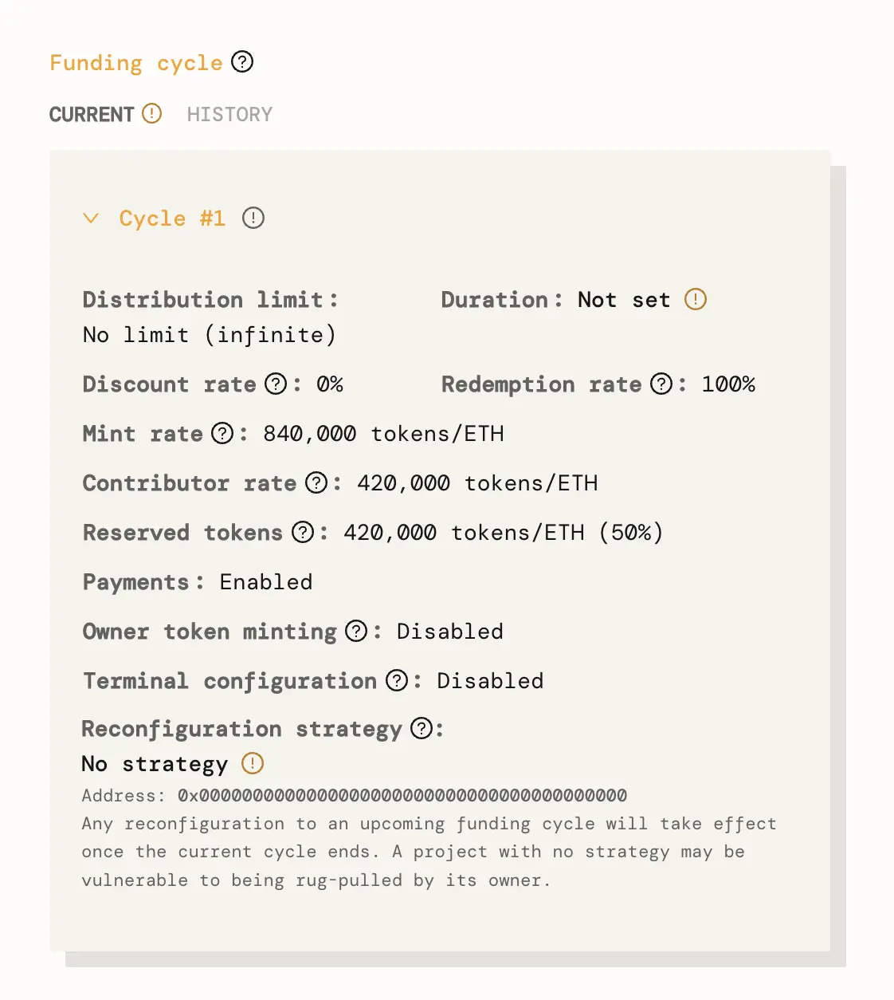
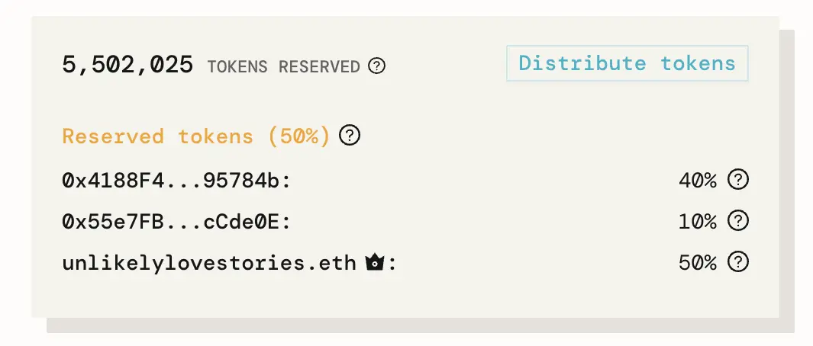

***Building a network of projects on Juicebox***

StudioDAO is a decentralized movie studio running on Juicebox. To learn more about how StudioDAO is disrupting the traditional film financing model, check out this [deep dive on the JB blog](https://docs.juicebox.money/blog/2022-09-07-studiodao/) as well as episode 9 of the Juicecast with founder [Kenny](https://twitter.com/kenbot) on [Spotify](https://open.spotify.com/episode/7ueh4wW79XFIkTnAxgtiV7?si=3824158b264f4867) and [Apple Podcasts.](https://podcasts.apple.com/us/podcast/ep-9-kenny-from-studiodao/id1623504302?i=1000576149672)

In this article, we’ll cover how StudioDAO has created a network to fund multiple film projects with a 10% fee going back to an umbrella project, [StudioDAO Backlot](https://rinkeby.juicebox.money/v2/p/4514). Unlike traditional businesses where money moves with little oversight, when you purchase an NFT to support one of StudioDAO’s projects on Juicebox you can see exactly where funds are being distributed.

Please note that all projects mentioned in this article are currently running on Rinkeby testnet before going live on mainnet and therefore configuration settings are not final.

### StudioDAO projects live on Rinkeby 🎥

- [StudioDAO Backlot](https://rinkeby.juicebox.money/v2/p/4514): registered LLC that provides film production services to StudioDAO and takes a 10% transaction fee on all StudioDAO project NFTs sold through Juicebox
- [Unlikely Love Stories](https://rinkeby.juicebox.money/v2/p/4515): StudioDAO’s first project, a dark comedy anthology by Rosa Tran and Derek Smith
- [Colossi Research Academy](https://rinkeby.juicebox.money/v2/p/4523): test project with art by Michael French
- [Dickson Greeting](https://rinkeby.juicebox.money/v2/p/4631): test project, experimental historical short film

StudioDAO sub-project map

### Case Study: Unlikely Love Stories ❣️

StudioDAO’s first film fundraise is [Unlikely Love Stories](https://rinkeby.juicebox.money/v2/p/4633), a dark comedy anthology by Rosa Tran and Derek Smith that explores finding unexpected love in the most unexpected places. In the screenshot below, you can see that ~ 13 ETH has gone into the treasury, and 10% of those funds will be distributed to “Project 4630” also known as [StudioDAO Backlot](https://rinkeby.juicebox.money/v2/p/4630), the Juicebox project that supports all StudioDAO films through production-related services. The other 90% is distributed to the filmmakers ([unlikelylovestories.eth](https://rinkeby.etherscan.io/address/0xb3c92c75621e513c3882f6a98a0121319c4e0664)) along with the Backlot tokens minted from the 10% payout.

Funding distribution for <a href="https://rinkeby.juicebox.money/v2/p/4633">Unlikely Love Stories on Rinkeby</a>

### Understanding the project’s configuration settings 🔎

Digging further into the project’s config, we can see that the following choices were made:

- With `automated funding cycles disabled`, funds can be withdrawn at any time. For the project creator this is a very flexible approach but it also presents risks for project contributors.
- Similarly, an `infinite distribution limit` was set meaning that the project can distribute freely from its treasury, as much or as little as it likes. Again, this is a very flexible strategy but also means that the entire treasury can be distributed without any limits.
- `Discount Rate is set to 0%` which means that token issuance will stay the same over time. In other words, there is no added incentive for early contributors.
- `Redemption Rate is set to 100%` which means that they can be redeemed against the overflow of the treasury at any time. In other words, there is no added value for redeeming earlier vs. later.
- `Mint Rate is 840,000 tokens per 1 ETH`, with half for project contributors (420,000) and half for addresses on the reserved token list (420,000) 🚬
- `Owner token minting is disabled`, so the project owners cannot mint tokens at any time. Only project contributions will mint new tokens.
- `No reconfiguration strategy was set`, meaning that a project can be reconfigured at any time without notifying contributors. Again, this is a very flexible approach for project creators but carries risk for project contributors.

Funding cycle configuration for <a href="https://rinkeby.juicebox.money/v2/p/4633">Unlikely Love Stories on Rinkeby</a>

### Reserved token allocation 🪙

We can also take a look at how the [Reserved Tokens](https://docs.juicebox.money/dev/learn/glossary/reserved-tokens) are split:

- 50% to filmmakers of the project
- 40% to StudioDAO Community wallet
- 10% to StudioDAO Backlot

This cross-pollination of tokens allows each member of the StudioDAO ecosystem to have a stake in one another, creating incentive alignment and building community in the process.

Reserved token allocation for <a href="https://rinkeby.juicebox.money/v2/p/4633">Unlikely Love Stories on Rinkeby</a>

As mentioned earlier, all projects discussed in this article are still on Rinkeby testnet and their configuration settings are not final. Once StudioDAO and NFT Rewards are live on mainnet, we’ll update this article with the final configuration details. Stay tuned!

***Coming soon to a mainnet near you.***

### Relevant links

🎙️ Listen to Kenny tell the story of StudioDAO on episode 9 of the Juicecast on [Spotify](https://open.spotify.com/episode/7ueh4wW79XFIkTnAxgtiV7?si=3824158b264f4867) and [Apple Podcasts](https://podcasts.apple.com/us/podcast/ep-9-kenny-from-studiodao/id1623504302?i=1000576149672)

🟢 Follow StudioDAO on Twitter: [@studioDao](https://twitter.com/studioDao)

💬 Join StudioDAO’s Discord: [https://discord.com/invite/YxPGn9pcdr](https://discord.com/invite/YxPGn9pcdr)

🐦 Follow Juicebox on Twitter: [@JuiceboxETH](https://twitter.com/juiceboxETH)

🚀 [Trending projects on Juicebox](https://juicebox.money/projects)

📚 [Project Creator Docs](https://docs.juicebox.money/user/)

📹 [YouTube Tutorials](https://www.youtube.com/c/JuiceboxDAO)
