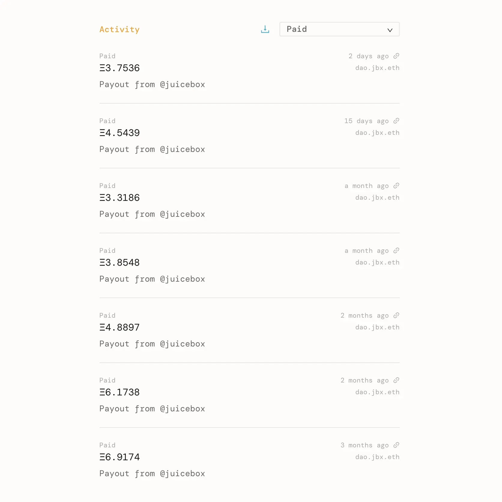
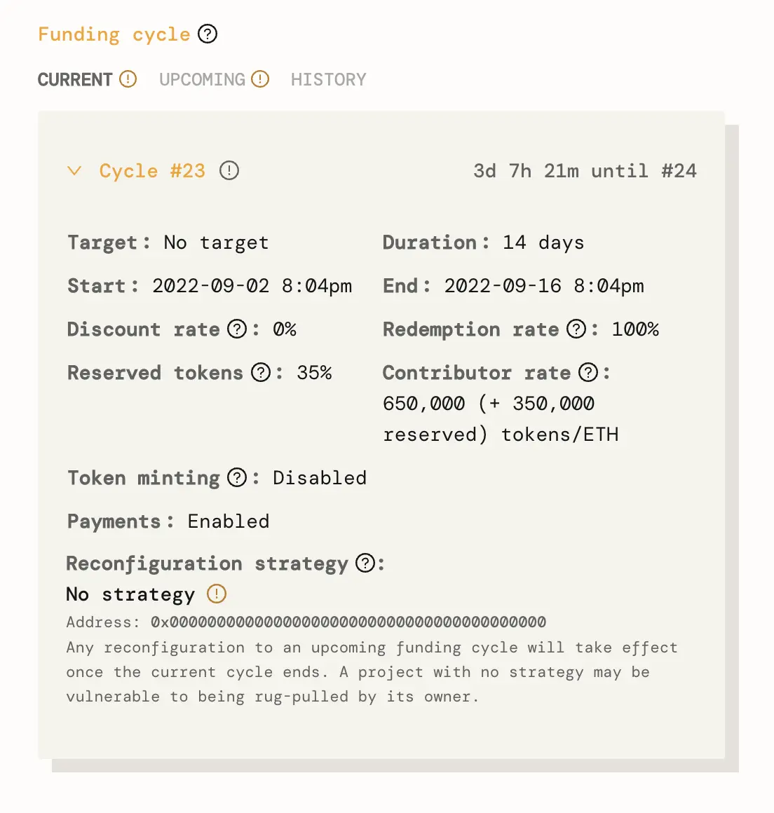
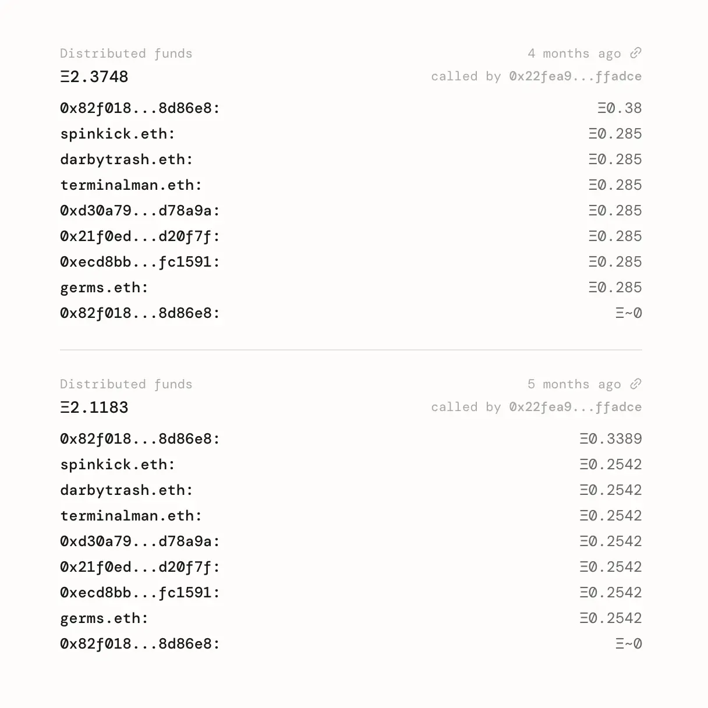
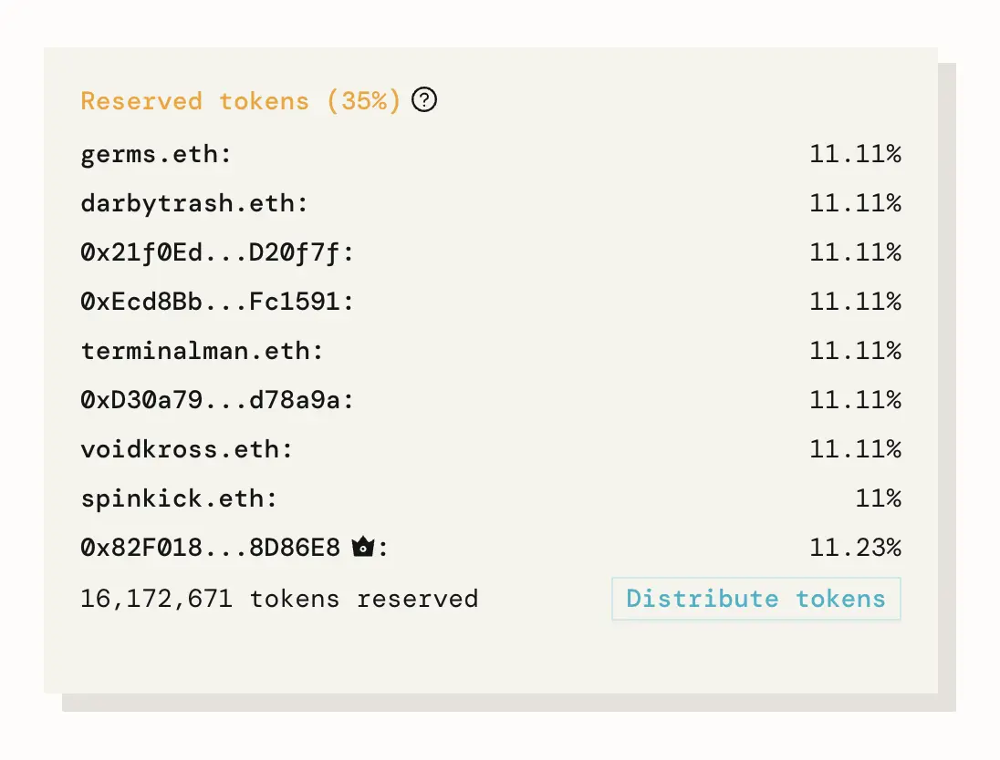
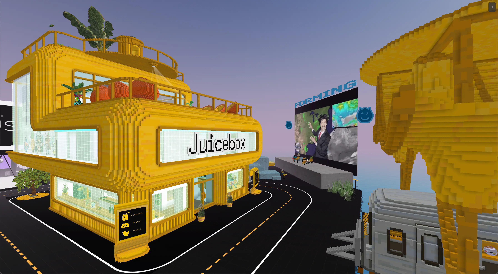

***Managing a metaverse architecture guild on Juicebox***

Lexicon Devils is a metaverse guild running on Juicebox. To learn more about how Lexicon Devils is building the metaverse and getting paid to do it, check out this [deep dive on the JB blog](https://docs.juicebox.money/blog/2022-07-14-lexicon-devils/) and listen to episode 8 of the Juicecast with [Wackozacco](https://twitter.com/wackozacco420) and [Peacenode](https://twitter.com/peace_node) on [Spotify](https://open.spotify.com/episode/3dVbEegY8abnQSbejulgiL?si=9f3a2106287d4a59) and [Apple Podcasts](https://podcasts.apple.com/ca/podcast/ep-8-peacenode-and-wackozacco-from-lexicon-devils/id1599885493?i=1000569582815).

<a href="http://juicebox.lexicondevils.xyz/">Juicebox Learning Center in Voxels</a>

In this article, we’ll cover how Lexicon Devils is managing their treasury on Juicebox by receiving payments for services rendered and then distributing funds to contributors for their work.

DeFIFA bar & lounge at the <a href="http://juicebox.lexicondevils.xyz/">Juicebox Transit Centre</a>, home for the upcoming self-governed game scheduled to take place during the 2022 FIFA World Cup

### Case Study: Lexicon Devils x Juicebox 🧃

Lexicon Devils has created buildings, concerts, and other metaverse experiences for a number of projects including a custom HQ for [Dreams Never Die](https://www.cryptovoxels.com/play?coords=5968W,1708N), a web3 music DAO, and a browser-based metaverse experience for NFT project [Slothtopia](https://slothtopia.io/). They also have an ongoing payout from JuiceboxDAO to design and build metaverse experiences for its [parcel on Pluto Island in Voxels](http://juicebox.lexicondevils.xyz/).

In the `Activity` panel of their Juicebox project, we can filter by `Paid` to see recent payments made to the project which consist of recurring payouts from the JuiceboxDAO v1 project:

Recent payments made to the <a href="https://juicebox.money/p/lexicondevils">Lexicon Devils Juicebox project</a>

### Understanding Lexicon Devils' project configuration 🔎

Jumping into the project’s config, we can see that the following choices were made:

- With `Duration set to 14 days` funds can be distributed every 14 days. This is a common approach for project creators that run a business or service and want to pay their contributors every two weeks.
- `Discount Rate is set to 0%` which means that token issuance will stay the same over time. In other words, there is no added incentive for early contributors.
- `Redemption Rate is set to 100%` which means that project tokens can be redeemed against the overflow of the treasury for the same amount at any time. In other words, there is no added incentive for redeeming later vs. earlier.
- `Contributor Rate is set to 650,000 tokens/ETH` and `Reserved Tokens is set to 35%`, meaning that contributors who pay 1 ETH to the project will receive 650,000 tokens and addresses on the Reserved Tokens list will receive 350,000 tokens.
- `Token minting is disabled`, meaning that the project owners cannot mint tokens at any time. Only project contributions will mint new tokens.
- `No reconfiguration strategy was set`, meaning that the project can be reconfigured at any time without notifying contributors. This is a very flexible approach for project creators but carries risk for project contributors.

Funding cycle configuration for the <a href="https://juicebox.money/p/lexicondevils">Lexicon Devils Juicebox project</a>

Looking at the history of `Distributed Funds` in the `Activity` panel, we can see funds being distributed to the builders of Lexicon Devils. Building in the open and managing their project on Juicebox allows anyone to see *which address(es)* are being paid for *how much* each time funds are distributed.

Two past examples of funds being distributed to Lexicon Devils builders

### Reserved token allocation 🪙

We can also take a look at how Lexicon Devils’ [`Reserved Tokens`](https://docs.juicebox.money/dev/learn/glossary/reserved-tokens) are split:

- ~ 11% to eight current contributors building Lexicon Devils
- ~ 11% to the Lexicon Devils [multisig](https://etherscan.io/address/0x82F018c331231f2A27b68DDbDDe61429338D86E8)

Using Reserved Tokens to reward active contributors helps create incentive alignment by giving builders more tokens and therefore more power to shape the future of the project through governance. Their success is the project’s success: builders contribute to the project, accumulate project tokens over time, and are invested in seeing it succeed long-term.

Reserved token allocation for <a href="https://juicebox.money/p/lexicondevils">Lexicon Devils on Juicebox</a>

In addition to managing their own project as metaverse architects on Juicebox, Lexicon Devils is also working on [FORMING](https://juicebox.money/v2/p/66), a hyperverse concert series that pays web3 musicians to perform at the [Juicebox parcel](http://juicebox.lexicondevils.xyz/). Stay tuned for another overview and configuration article that will dive into the [FORMING project on Juicebox](https://juicebox.money/v2/p/66).

<a href="http://juicebox.lexicondevils.xyz/">Juicebox Transit Centre and Learning Centre in Voxels</a>

### Relevant links

🎙️ Listen to [Wackozacco](https://twitter.com/wackozacco420) and [Peacenode](https://twitter.com/peace_node) share the story of Lexicon Devils on episode 8 of the Juicecast on [Spotify](https://open.spotify.com/episode/3dVbEegY8abnQSbejulgiL?si=9f3a2106287d4a59) and [Apple Podcasts](https://podcasts.apple.com/ca/podcast/ep-8-peacenode-and-wackozacco-from-lexicon-devils/id1599885493?i=1000569582815)

✍️ Learn more about Lexicon Devils in this [deep dive article on the JB blog](https://docs.juicebox.money/blog/2022-07-14-lexicon-devils/)

🏗 Follow Lexicon Devils on Twitter: [@devils_lexicon](https://twitter.com/devils_lexicon)

🧃 Visit the [Juicebox parcel in Voxels](http://juicebox.lexicondevils.xyz/)

🏢 Visit the [Lexicon Devils HQ in Voxels](https://www.cryptovoxels.com/play?coords=SW@6703W,48N)

🐦 Follow Juicebox on Twitter: [@JuiceboxETH](https://twitter.com/juiceboxETH)

🚀 [Trending projects on Juicebox](https://juicebox.money/projects)

📚 [Project Creator Docs](https://docs.juicebox.money/user/)

📹 [YouTube Tutorials](https://www.youtube.com/c/JuiceboxDAO)
