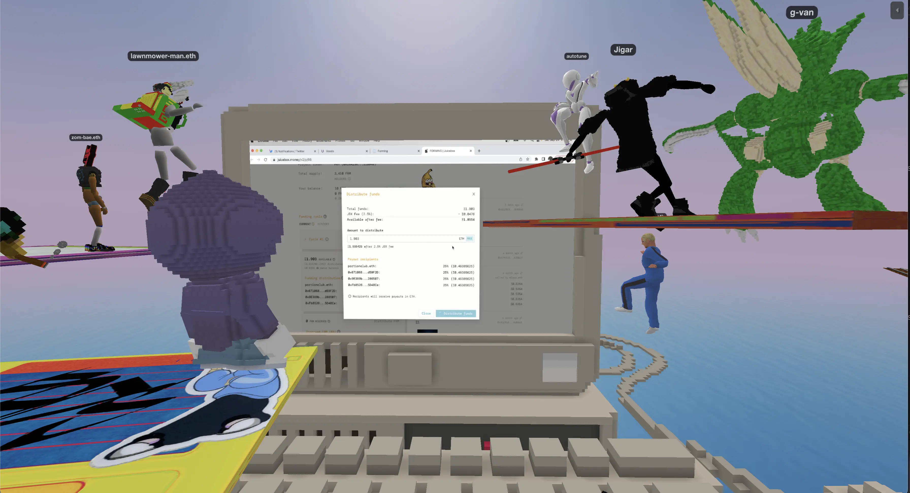

***How Lexicon Devils is running a metaverse concert series on Juicebox***

[FORMING](https://juicebox.money/v2/p/66) is a metaverse concert series hosted by [Lexicon Devils](https://twitter.com/devils_lexicon) for Juicebox. To learn more about how Lexicon Devils is building the metaverse and getting paid to do it, check out this [deep dive on the JB blog](https://docs.juicebox.money/blog/2022-07-14-lexicon-devils) as well as episode 8 of the Juicecast with [Wackozacco](https://twitter.com/wackozacco420) and [Peacenode](https://twitter.com/peace_node) on [Spotify](https://open.spotify.com/episode/3dVbEegY8abnQSbejulgiL?si=9f3a2106287d4a59) and [Apple Podcasts](https://podcasts.apple.com/ca/podcast/ep-8-peacenode-and-wackozacco-from-lexicon-devils/id1599885493?i=1000569582815). You can also check out [this configuration article](https://docs.juicebox.money/blog/2022-09-27-lexicon-devils-config) to learn how Lexicon Devils configured their [project on Juicebox](https://juicebox.money/p/lexicondevils) to receive payments for services rendered and distribute funds to contributors for their work.

Attendees repping sick wearables at FORMING vol. 1

As the pinnacle of their monthly Juicebox event series, Lexicon Devils is hosting [FORMING](http://forming.lexicondevils.xyz/), an experimental metaverse concert featuring performances by web3 musicians. The team created a second Juicebox project dedicated to crowdfunding with fans and community members to pay out participating artists in ETH. Each monthly event features a curated lineup of web3 musicians, with pre-recorded performances (including juicy skits from [DarbyTrash](https://twitter.com/darbytrash)) at a virtual party in the [Juicebox parcel](http://juicebox.lexicondevils.xyz/).

The stage for FORMING VOL. 1

In this article, we’ll cover how Lexicon Devils is fundraising to pay web3 musicians for their performances at FORMING and distributing funds to artists transparently on Juicebox.

 <s><a href="https://twitter.com/darbytrash">Darby</a></s> Jerry Springer revealing whether <a href="https://twitter.com/jokersgotaposse">JGAP</a> is the father of FLOPPY’s newborn, still from a skit screened at FORMING VOL. III

### Case Study: FORMING x FLOPPY 💾

On September 17th 2022, FORMING highlighted tracks made by beta testers of [FLOPPY](https://twitter.com/FloppyDigital/status/1473029187179065357), a FPS (First-Person Sampler) 3D environment that players can use to interact with their DAW (Decentralized Audio Workstation). Floppy is a free and easy-to-play DAW for everyone with a desktop browser, providing artist-curated sample packs for users to create music, listen to it, and sell it on their NFT marketplace. [JGAP](https://twitter.com/jokersgotaposse), the founder of Floppy, curated a selection of tracks made by the community of beta testers and collaborated with FORMING to spin up an event to showcase the results and pay the artists.

In the `Funding distribution` panel, we can see funds being distributed evenly (25% each) to all participants in FORMING vol. 3:

Recent Funding distribution for all artists performing at FORMING vol. 3

### Understanding FORMING’s project configuration 🔎

While Lexicon Devils have their own project to manage payouts for their contributors, the [FORMING project](https://juicebox.money/v2/p/66) is configured differently to reflect the needs of one-time fundraises for each monthly concert. Scoping out the project’s config, we can see that the following choices were made:

- `Distribution limit is set to No limit (infinite)` which means that there is no limit to the amount of funds that can be distributed from the project’s treasury. For FORMING, this gives organizers the flexibility to distribute the total amount raised for each event evenly between all of the artists performing.
- With `Duration: Not set`, the project owner can start a new funding cycle with a new configuration at any time, giving the project owner increased flexibility. However, this also presents risks to project contributors as funding cycles can be started at any time without warning.
- `Discount Rate is set to 0%` which means that token issuance will stay the same over time. In other words, there is no added incentive for early contributors.
- `Redemption Rate is set to 100%` which means that tokens can be redeemed against the overflow of the treasury at any time. In other words, there is no added value for redeeming earlier vs. later.
- `Mint Rate is 500 FRM tokens per 1 ETH` with zero (0) tokens reserved. This means that when someone contributes 1 ETH to the FORMING project, they get 100% of the tokens minted (500 FRM).
- `Owner token minting is disabled` which means that the project owner cannot mint tokens at any time. Only project contributors will mint new FRM tokens.
- `No reconfiguration strategy` was set, meaning that a project can be reconfigured at any time without notifying contributors. Again, this is a very flexible approach for project creators but carries risk for project contributors.

Funding cycle configuration for the <a href="https://juicebox.money/v2/p/66">FORMING project on Juicebox</a>

Looking at the history of `Distributed Funds` in the `Activity` panel on the right side, we can look through past months to see funds being distributed to the roster of artists that have performed at FORMING vol. 1, 2, and 3. By using Juicebox to manage their treasury in an open and transparent way, community members are able to see the payouts for each volume of FORMING which is not usually possible in a traditional event planning context.

History of funds distributed for FORMING vol. 1, 2, and 3

### Reserved token allocation 🪙

There is currently no `Reserved token` allocation, meaning that all tokens minted are given to fans who donate funds to support FORMING artists. Lexicon Devils have hinted that people who hold FORMING tokens will soon be eligible for special perks including NFT mixtapes, exclusive wearables, and token-gated channels in [Discord](https://discord.gg/Trjv9nA7c9).

FORMING vol. 3 with FLOPPY

In addition to hilarious skits performed by [Darby](https://twitter.com/darbytrash) and [JGAP](https://twitter.com/jokersgotaposse)—including mock Jeopardy and Jerry Springer episodes—the team also streams a screenshare of funds being distributed at the end of the event. By using Juicebox to manage FORMING, Lexicon Devils demonstrates the power of a transparent and programmable treasury to create trust while harnessing the power of collective action to fund artists.

Live view of funds being distributed to artists at the end of FORMING vol. 3

### Relevant links

🧑🏼‍🎤 Watch the full performance of [FORMING x FLOPPY on Youtube](https://www.youtube.com/watch?v=JHbpz-SE6Vw)

💸 Support the next artists performing on [FORMING on Juicebox](https://juicebox.money/v2/p/66)

💾 Follow FLOPPY on Twitter: [@FloppyDigital](https://twitter.com/FloppyDigital/status/1473029187179065357)

🎙️ Listen to [Wackozacco](https://twitter.com/wackozacco420) and [Peacenode](https://twitter.com/peace_node) share the story of Lexicon Devils on episode 8 of the Juicecast on [Spotify](https://open.spotify.com/episode/3dVbEegY8abnQSbejulgiL?si=9f3a2106287d4a59) and [Apple Podcasts](https://podcasts.apple.com/ca/podcast/ep-8-peacenode-and-wackozacco-from-lexicon-devils/id1599885493?i=1000569582815)

🏗 Follow Lexicon Devils on Twitter: [@Devils_Lexicon](https://twitter.com/devils_lexicon)

🧃 Visit the [Juicebox parcel in Voxels](http://juicebox.lexicondevils.xyz/)

🐦 Follow Juicebox on Twitter: [@JuiceboxETH](https://twitter.com/juiceboxETH)

🚀 [Trending projects on Juicebox](https://juicebox.money/projects)

📚 [Project Creator Docs](https://docs.juicebox.money/user/)

📹 [YouTube Tutorials](https://www.youtube.com/c/JuiceboxDAO)
