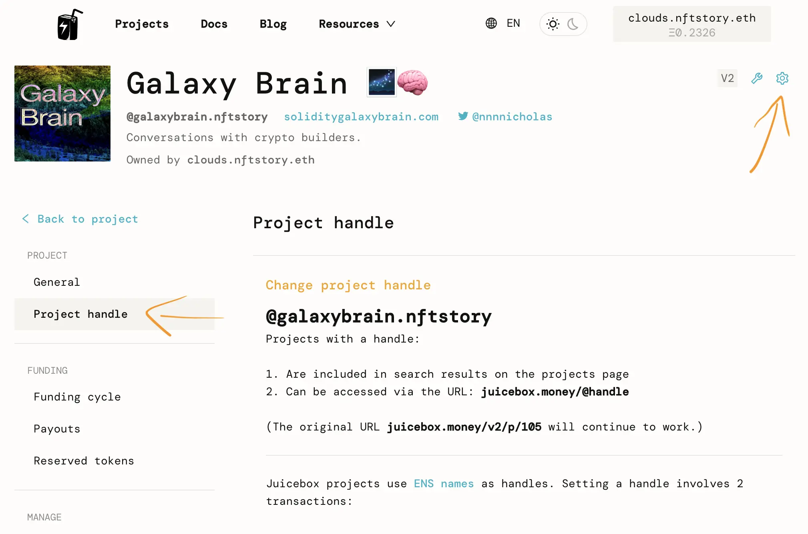
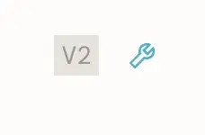
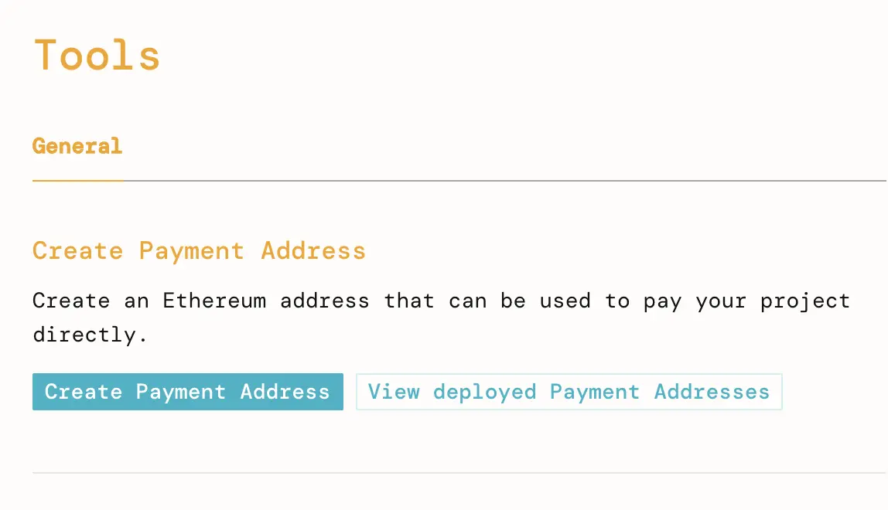
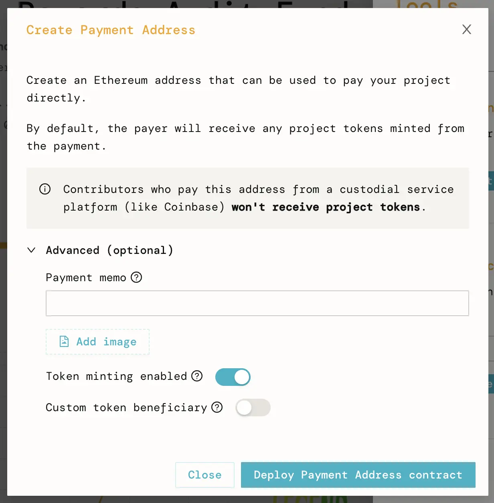
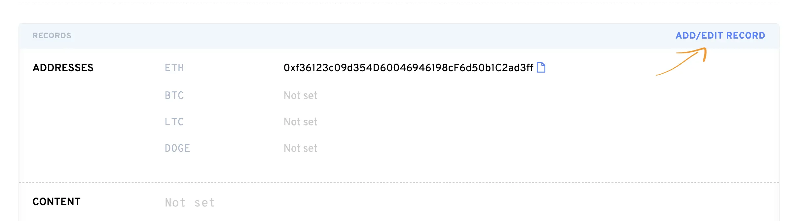
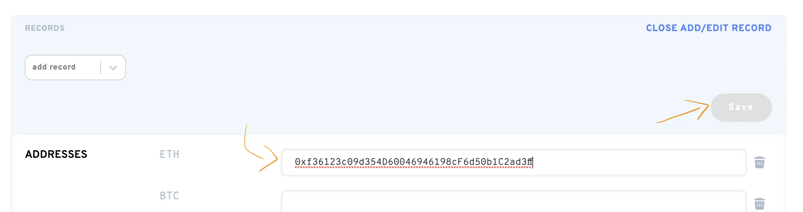

# Receive Juicebox donations at a .eth address

Sending ETH to an ENS address is one of the simplest ways for donors to interact with a Juicebox project. For example, sending ETH to `auditfund.eth` pays that ETH directly into the [Audit Fund Juicebox project](https://juicebox.money/@auditfund), and issues the corresponding tokens to the sender, all from within their wallet of choice!

In this tutorial, I'll show you how to configure an ENS address to forward ETH to a Juicebox project.

You can also watch the video walkthrough by JBDAO contributors [Matthew](https://twitter.com/0xmatthewb) and [Brileigh](https://twitter.com/0xbrileigh):

<iframe width="560" height="315" src="https://www.youtube.com/embed/k31kISgsoO0" title="YouTube video player" frameborder="0" allow="accelerometer; autoplay; clipboard-write; encrypted-media; gyroscope; picture-in-picture; web-share" allowfullscreen></iframe>
 

## Before you start
### Have a Juicebox Project
Before you can receive donations, you'll need a Juicebox Project. Learn how to [Make Your Juicebox Project](/user).

### Have an ENS Domain
You'll need to own or be the controller of an ENS address (such as yourname.eth) to follow the rest of this tutorial. Register an address at [ENS Domains](https://app.ens.domains).

### Optional: Set up your Juicebox Project Handle
It's not necessary to complete this tutorial, but it's also a good idea to set up your project handle. Project handles gives your project a vanity url like `juicebox.money/@auditfund`, rather than the default `juicebox.money/v2/p/256`, and will make your project appear in the site's search. They're free and only cost a little gas for the setup transactions.

To set up a project handle, go to the project's page on juicebox.money, connect wallet with the project owner's wallet, click the cog icon to access the Project Settings, then select `Project handle` in the menu and follow the instructions on that page.

## 1. Create a Payment Address
A payment address forwards ETH it receives to a given project. Anyone can create a payment address for a project.

On the project page, click the tools button.

Click `Create Payment Address` and follow the instructions on the page.

If you insert text or a link to an image (https or ipfs) in the payment memo, that memo will appear in the project's Activity Feed each time anyone sends ETH to the ENS address we'll configure in the next steps.

## 2. Configure the Payment Address in the ENS address's records
Go to https://app.ens.domains/name/YOURNAME.eth/details. You'll have to substitute `YOURNAME` for the .eth address you're trying to configure.

Click `Add/Edit Record`, paste the payment address you generated into the Addresses: ETH input. Click save and confirm the transaction in your wallet.

The ETH record is now set. ETH transactions sent to this ENS address will be directed to the payment address, which will in turn forward the ETH to the Juicebox project and issue the project's tokens to the address that sent the original ETH transaction, if the project payer was configured to do so.

## Conclusion
In this tutorial you've learned how to configure an ENS address to receive donations at a Juicebox project. Let potential supporters know that they can simply send ETH to yourname.eth to pay your project, and receive membership tokens, too.

Advanced Note: This approach works great for receiving ETH donations. To accept other tokens sent to the ENS address, your project will need to configure Payment Terminals for the tokens you would like to receive. If you're interested in this, say hello in the `#🚀｜project-creators` channel in the [Discord](https://discord.gg/juicebox).
