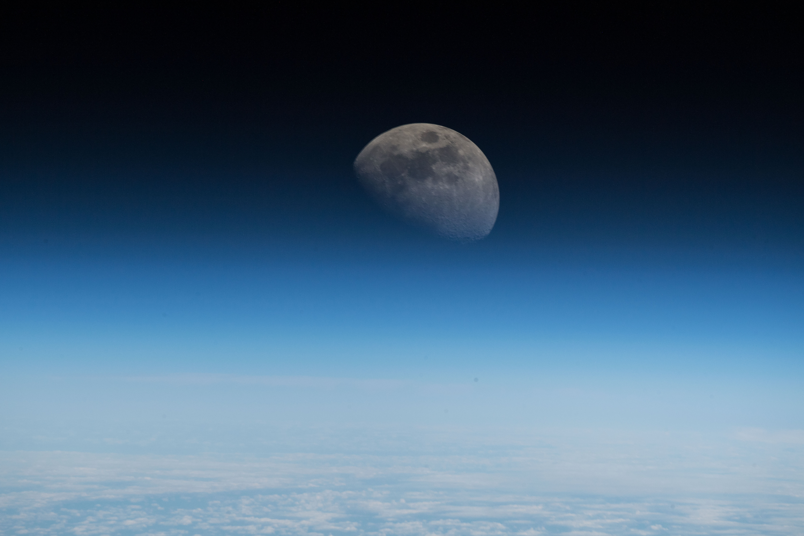

***How MoonDAO raised over $8 million (2600+ ETH) on Juicebox to send someone to space***

:::tip
To learn more about how MoonDAO was configured on Juicebox for its fundraiser, read this [companion article](https://docs.juicebox.money/blog/2022-10-18-moondao-config/).
:::

There are nearly eight billion people on Earth and [fewer than seven hundred](https://www.nytimes.com/2021/11/10/science/600-astronauts-space.html) of them have been to space. We all share a curiosity to better understand space but only the wealthy have the ability to actually experience it firsthand. What started as a space race between nation states is now a game being played out by corporations, excluding 99.9% of humanity from having a voice in how we explore and research outer space… that is, until [MoonDAO](https://moondao.com/).

> Our whole world is divided up into nations and historically they have competed over space, but we now have tools that enable people to easily collaborate across borders. It doesn’t matter where you’re from, as long as you have an internet connection you can join the [MoonDAO] Discord.
>
>— [Pablo Moncada-Larrotiz](https://twitter.com/LarrotizPablo)

“Why NASA should be decentralized,” a <a href="https://twitter.com/korigrogers/status/1475317861128151041">thread</a> by <a href="https://moondao.com/">MoonDAO</a> co-founder <a href="https://twitter.com/korigrogers">Kori Rogers</a>

### MoonDAO, a worldwide collective of space enthusiasts 🌐

[MoonDAO](https://moondao.com/) is a worldwide collective united by the mission of decentralizing access to space research and exploration. Set against the backdrop of a privatized space race controlled by a select few, MoonDAO is building a decentralized community of space enthusiasts working towards improved access to space exploration while continuing to push research forward. As the worldwide population grows while becoming increasingly atomized by borders, it is more crucial than ever to make space research transparent and accountable while remaining accessible to everyone regardless of their financial means or geographic location.

The Moon as seen from the ISS, shared by European Space Agency astronaut <a href="https://www.esa.int/Our_Activities/Human_Spaceflight/Astronauts/Alexander_Gerst">Alexander Gerst</a> (credit: NASA images)

### The beginning of MoonDAO from the ashes of ConstitutionDAO 📜

Despite the disappointment of ConstitutionDAO [losing the auction to buy an official copy of the U.S. Constitution](https://www.forbes.com/sites/abrambrown/2021/11/18/constitution-dao-crypto-ether-constitutional-sothebys-sale-auction/?sh=32e5a5c46ad4), community members were still buzzing in the aftermath as they considered the implausible events that had just unfolded and what might lay ahead for DAOs. Not long after, [Pablo Moncada-Larrotiz](https://twitter.com/LarrotizPablo), [Kori Rogers](https://twitter.com/korigrogers), and a few others spotted a lunar asteroid going up for auction and started discussing crowdfunding the acquisition of the next meme object to be governed as a DAO. From there, MoonDAO started as a joke: *let’s buy the Moon, one rock at a time.*

Their goals quickly solidified and became more serious when Pablo and Kori hopped on a call to discuss what their values were, what MoonDAO could become, and why space should be a frontier for all humans. They shared a common vision for MoonDAO: a bottom-up, horizontal approach to space research that would reflect the thoughts and desires of humanity as a whole.

<a href="https://twitter.com/bannyverse">Banny</a> on the Moon by <a href="https://twitter.com/Tam_Burtula">Burtula</a> from <a href="https://juicebox.money/p/wagmistudios">WAGMI Studios</a>

### Raising $8.1 million (2600+ ETH) on Juicebox 🧃

The first goal for MoonDAO was to launch their governance token, [$MOONEY](https://etherscan.io/token/0x20d4DB1946859E2Adb0e5ACC2eac58047aD41395). When they set up their [project on Juicebox](https://juicebox.money/p/moondao), there were no tokens set aside for founders or VCs. Project contributors received 500,000 $MOONEY per 1 ETH contributed with an additional 500,000 $MOONEY going to the community wallet which would later be governed by the DAO. “That was one thing that we wanted to emphasize in relation to our mission to decentralize space exploration,” says [Kori](https://twitter.com/korigrogers). “I think it was the meaningful thing to do.” As opposed to giving power to co-founders or investors, MoonDAO was committed to giving every member equal opportunity to help shape the future of space exploration.

On December 17th, 2021, the MoonDAO project was [created](https://etherscan.io/tx/0xdaf319a9954a8638b76dfdea9914088a8b967dfa4982bb304f63d6b8ca7c2269) and their next goal was to raise enough funds to buy tickets for a sub-orbital flight on [Blue Origin](https://www.blueorigin.com/). “Juicebox is a bootstrapped community building from the ground up,” says Pablo. “It’s a community of regular people trying to do something new and I knew that we wanted to work with them over any other platform for crowdfunding.” By the end of January 2022, MoonDAO had raised over 2,600 ETH (~ $8.1 million USD).

MoonDAO's <a href="https://opensea.io/collection/ticket-to-space-nft">Ticket to Space NFT</a>

### The first person sent to space by a DAO 🚀

The second phase of MoonDAO’s roadmap was to send someone to space. Literally. After their successful crowdfunding campaign they acquired two tickets for flights on [Blue Origin](https://www.blueorigin.com/). One ticket was reserved for a sponsor and the second was reserved for the winner of their [Ticket to Space](https://opensea.io/collection/ticket-to-space-nft) NFT raffle. For the latter, they launched a free-to-mint NFT and used [Chainlink VRF](https://chain.link/vrf) to conduct a publicly auditable randomized draw. Following their commitment to transparency and equal access, this drawing method allowed any member of the community to verify the results for themselves.

For the sponsor seat, [the MoonDAO community voted](https://snapshot.org/#/tomoondao.eth/proposal/0xdec77b14a0f7a6405d42a57661a0e9ee297b37d3d03e6d9387f0ad4d339b9840) and chose Coby Cotton, member of the YouTube trick-shot group [Dude Perfect](https://www.youtube.com/c/DudePerfect). Nominations were gathered from a Discord vote that included over five thousand members’ input. Together, Dude Perfect and MoonDAO achieved something that has never been done before: a DAO sending someone to space. On August 4th 2022, Blue Origin successfully completed its [sixth human spaceflight](https://www.blueorigin.com/news/ns-22-mission-updates/) (NS-22) and Coby Cotton, along with five other astronauts, [ascended to sub-orbital space](https://www.youtube.com/watch?v=zb9mCpEWsyE).

Stay tuned for more MoonDAO updates as their next goal is to go to the moon in 2030 🚀

Coby Cotton with <a href="https://moondao.com/">MoonDAO</a> members and the <a href="https://www.youtube.com/c/DudePerfect">Dude Perfect</a> team after Blue Origin Flight NS-22 on August 4th, 2022

### Relevant links 🔗

🎙️ Listen to [Kori](https://twitter.com/korigrogers) and [Pablo](https://twitter.com/LarrotizPablo) tell the story of MoonDAO on episode 7 of the Juicecast on [Spotify](https://open.spotify.com/episode/7iLdXSTNSrCGcI4kWxtK2B?si=7565cbc25b3f4d6f) and [Apple Podcasts](https://podcasts.apple.com/ca/podcast/ep-7-pablo-and-kori-from-moon-dao/id1623504302?i=1000564945862)

🌜 Follow MoonDAO on Twitter: [@OfficialMoonDAO](https://twitter.com/OfficialMoonDAO) 

💬 Join MoonDAO’s Discord: [https://discord.gg/5nAu7K9aES](https://discord.gg/5nAu7K9aES)

🐦 Follow Juicebox on Twitter: [@JuiceboxETH](https://twitter.com/juiceboxETH)

🚀 [Trending projects on Juicebox](https://juicebox.money/projects)

📚 [Project Creator Docs](https://docs.juicebox.money/user/)

📹 [YouTube Tutorials](https://www.youtube.com/c/JuiceboxDAO)
