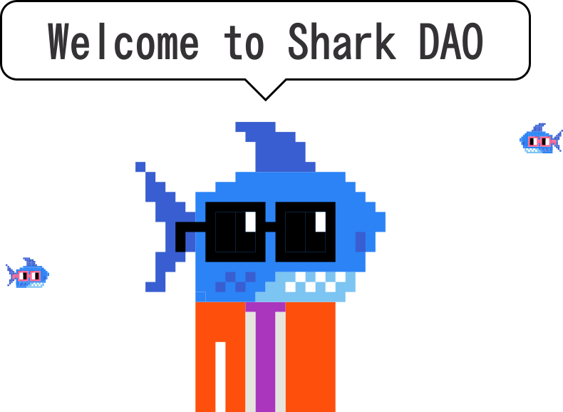

# SharkDAO: Building your wings on the way down

### Nouns and the urge to own one

Nouns, the wildly successful NFT project and ecosystem around it, sprung on the scene like a kangaroo with hemorrhoids and has been going strong ever since. The concept is simple: a generative NFT sale, where only one NFT is sold every 24 hours in an auction format. Even today, as we find ourselves in a bear market and NFT trading down 97% since this past January, Nouns are selling for an average of $110,000 with a total market cap of over $50,000,000. That means they’re quite an investment; but at such a high price point, who can afford one?

### Man plans, and God laughs

SharkDAO was spun up as a solution to this high bar of entry into the NounsDAO ecosystem. It was a community aimed at bringing together resources to purchase Nouns and keep them in a shared treasury. Early contributors decided to throw together a Juicebox treasury to run the project, and plenty of folks you see around nowadays in the discord played a role, like dropnerd, jango, joshua fisher, goldy, kenbot-studios and others.

This was early on in the history of Juicebox, and it was quite an exciting way to test out how the platform could adapt to such a unique use case. That being said, the process was anything but smooth. Throughout the journey, however, the relative ease and flexibility of the Juicebox protocol sprung in to save the day. Over a call with jango— Juicebox founder and main configuration technician behind SharkDAO— I got the full banana split on the tumultuously marvelous SharkDAO inception and execution.

### Duct tape, chewing gum and a whole lotta elbow grease

Looking at SharkDAO’s configs, I have an obvious question: “So these configs, jango, they’re kinda all over the place. What was the thinking there?” There was a short pause. “Oh man,” jango began, “we were making it up as we go along.” And such is the story of SharkDAO, an organization that succeeded not because of careful planning, but because of a community working together with a highly flexible protocol.

“We learned a lot from it,” jango continued, “and the start of it was very clean. That said the real story is about how we had to adapt and come to consensus about which levers to pull, which configs to change.”

### The beginning

Where most may think of SharkDAO as a basic investment club, the mission statement was really much more about community and participating in the Nouns ecosystem. The only way to do this, of course, was by amassing some number of Nouns and leveraging that to join the Nouns community.

It started simple enough, but it didn’t take long for the plot to thicken. “Around the time we were on Noun 12, we’d began having some discussions about this ecosystem we were creating and there were factions within the discord. They all had great points to make, but they weren’t in agreement.”

These questions didn’t get any easier as time went on. For instance, what should a new funding cycle look like? If they kept fundraising at the same token issuance rate as they had before, then they were effectively diluting the value of the Nouns they had amassed. At the same time, if they pulled back issuance significantly, was this unfairly punishing contributors new to SharkDAO?

“You know how humans work,” jango said (compliment accepted!), “You start talking about numbers and then our impulse is to protect investments, and these feelings come on quickly and undulate as you feel out the process of making this thing work. It’s not linear at all. But we can punctuate those feelings we had at the time by looking at the funding cycle decisions we made.”

### The almighty reserve rate

“We were using the reserve rate as a stand-in pause button,” jango told me with a laugh. It’s true— a cursory dive into SharkDAO config history will show you a reserve rate that’s more jittery than a cat in a room full of rocking chairs.

“There was a moment where we flipped reserve rate and we made a few big decisions that got us out of some holes,” jango recalled, “By using the reserve rate to manage issuance, we started getting around the problem that only one million project tokens existed. Then we also had a discount rate, which was maxxed out at 20%. So we used the reserve rate to taper outward issuance rather than making a ton of funding cycles at a 20% discount rate.”

### Reflections and next steps

The current gameplan is up in the air, but could include transitioning SharkDAO out of V1 into a world where it can contribute again and maybe even win some more Nouns auctions.

When I asked jango to reflect on his journey with SharkDAO, it’s telling that he went right back to the original missions statement and discussed the importance of community. “It was just wild. No one in charge, no head of command, everyone there doing the best they could with the tools that they had. It’s a huge testament to community and the people who showed up and had that attitude; there was no secret info, everything was happening out loud and transparently.”

In the messy world of web3, SharkDAO stands as a totem to how community and shared values trump all, and how the JB ecosystem and protocol is strong but loose enough to give you the tools you need. After that, it’s what you make of it.
