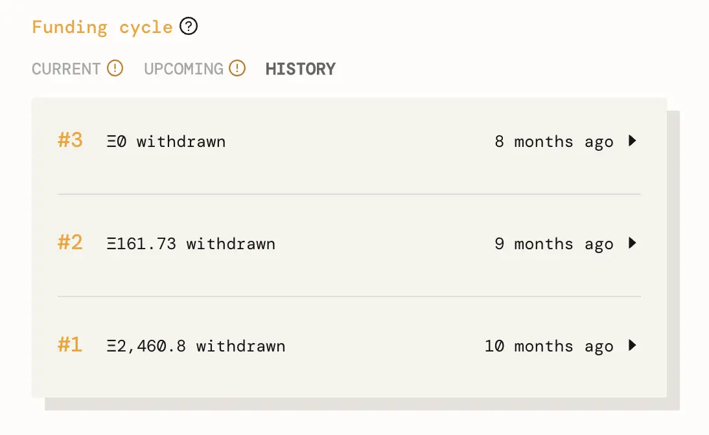
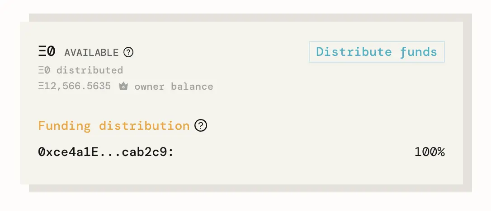
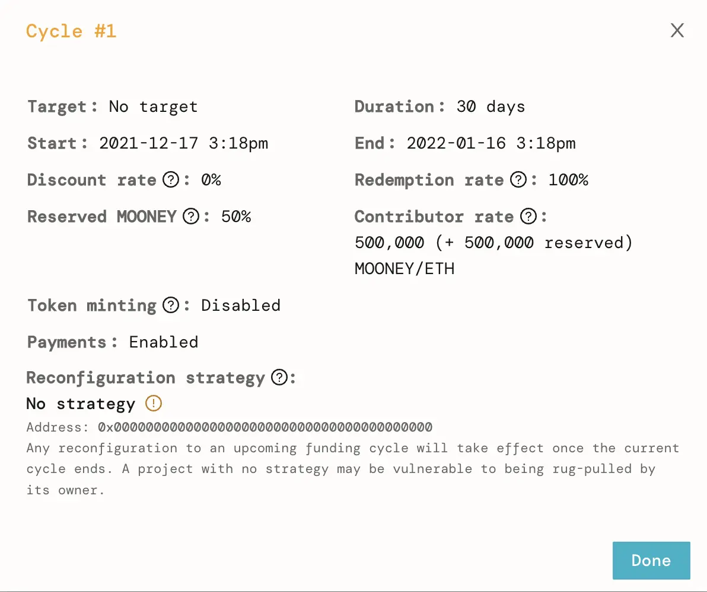
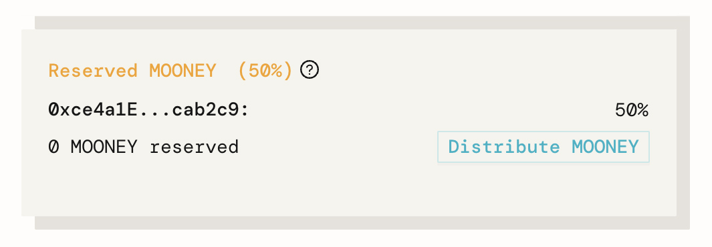

***Raising funds to decentralize space research and exploration***

[MoonDAO](https://twitter.com/OfficialMoonDAO) is a worldwide collective of people working together to decentralize access to space research and exploration. To learn more about how MoonDAO is uniting all earthlings to have a say in how the Moon and other planetery systems should be governed, check out this [deep dive on the JB blog](https://docs.juicebox.money/blog/2022-10-11-moondao/) as well as episode 7 of the Juicecast with co-founders Pablo and Kori on [Spotify](https://open.spotify.com/episode/7iLdXSTNSrCGcI4kWxtK2B?si=a76fca74c72a4cbc) and [Apple Podcasts](https://podcasts.apple.com/ca/podcast/ep-7-pablo-and-kori-from-moon-dao/id1623504302?i=1000564945862).

In this article, we’ll cover how MoonDAO used Juicebox to fundraise ~ $8.3 million (2600+ ETH) to buy two Blue Origin tickets.

Banner from MoonDAO introduction article on <a href="https://mirror.xyz/pmoncada.eth/uuufJem6v9X-fW3Bu4v1p_3qA5gPf96lZelHUM97BC8">Pablo’s Mirror</a>

### Case Study: MoonDAO sends someone to space 🌌

The second phase of MoonDAO’s roadmap was to send a person to space in 2022. To achieve that goal, they created a Juicebox project in December 2021 to start raising funds to bootstrap the community wallet governed by the DAO and buy tickets for two flights on [Blue Origin](https://www.blueorigin.com/).

Since achieving their goal, MoonDAO is no longer minting $MOONEY tokens and has stopped fundraising. This article will cover how the project was **initially configured** for their fundraise. On the `Funding Cycle` panel on the left, we can look in the `History` tab to see past funding cycle configurations. This article will break down the settings from `Funding cycle #1`.

Funding cycle history for <a href="https://juicebox.money/p/moondao">MoonDAO on Juicebox</a>

In the `Funding distribution` panel, we can see that 100% of funds withdrawn were distributed to the [MoonDAO Treasury (0xce…b2c9)](https://etherscan.io/address/0xce4a1e86a5c47cd677338f53da22a91d85cab2c9#tokentxns), a multi-sig [Safe (formerly Gnosis Safe)](https://gnosis-safe.io/) wallet.

Funding distribution for <a href="https://juicebox.money/p/moondao">MoonDAO on Juicebox</a>

### Understanding MoonDAO’s project configuration 🔎

Taking a closer look at the configuration settings for `Funding cycle #1`, we can see that the following settings were used for their fundraise:

- `Target is set to No target` which means that there is no predefined funding target (e.g. $1 million) and project contributors will not be able to redeem against the treasury when/if it surpasses that amount (”overflow”). Please note that `Target` is now [`Distribution Limit`](https://docs.juicebox.money/dev/learn/overview#distribution-limit) for v2/v3 projects on Juicebox.
- With `Duration set to 30 days`, the project owner can start a new funding cycle with new configuration settings every 30 days. This gives a sense of security to project contributors knowing that the project can only be reconfigured once every 30 days.
- `Discount Rate is set to 0%` which means that token issuance will stay the same after each funding cycle. In other words, there is no added incentive for early contributors.
- `Redemption Rate is set to 100%` which means that tokens can be redeemed against the overflow of the treasury for equal value at any time. In other words, there is no added incentive for redeeming later vs. earlier. Please note that since this project was set to `No Target`, the treasury will never be in overflow and contributors will not be able to redeem against the treasury.
- `Contributor rate is set to 500,000 + 500,000 reserved`, meaning that when someone contributes 1 ETH to the project, 1,000,000 $MOONEY tokens are minted: 500,000 for the project contributor and 500,000 for the address(es) on the Reserved Token Allocation list.
- `Reserved MOONEY is set to 50%,` which dictates the percentage of newly minted tokens set aside for the address(es) on the Reserved Token Allocation list.
- `Token minting is disabled` which means that the project owner cannot mint tokens at any time. Only project contributions will mint new $MOONEY tokens. This gives project contributors confidence that the token supply cannot be inflated by the project owners.
- `No reconfiguration strategy` was set, meaning that the project can be reconfigured and take effect immediately after the current cycle ends. This presents some risk to project contributors as the upcoming funding cycle parameters can be changed with very little notice. Since MoonDAO’s project has a `Duration set to 30 days`, any reconfiguration would take effect once the current cycle ends.

Funding cycle #1 configuration for <a href="https://juicebox.money/p/moondao">MoonDAO on Juicebox</a>

### Reserved token allocation 🪙

There is currently no `Reserved token` allocation since MoonDAO has stopped fundraising. If we look back at their configuration for `Funding cycle #1`, we can see that 50% of all tokens were reserved. In MoonDAO’s case, these tokens were set aside for a community wallet governed by the DAO for future use like rewarding contributors.

Reserved $MOONEY allocation from MoonDAO’s funding cycle #1 configuration

### Relevant links 🔗

🎙️ Listen to [Kori](https://twitter.com/korigrogers) and [Pablo](https://twitter.com/LarrotizPablo) tell the story of MoonDAO on episode 7 of the Juicecast on [Spotify](https://open.spotify.com/episode/7iLdXSTNSrCGcI4kWxtK2B?si=7565cbc25b3f4d6f) and [Apple Podcasts](https://podcasts.apple.com/ca/podcast/ep-7-pablo-and-kori-from-moon-dao/id1623504302?i=1000564945862)

🌜 Follow MoonDAO on Twitter: [@OfficialMoonDAO](https://twitter.com/OfficialMoonDAO) 

💬 Join MoonDAO’s Discord: [https://discord.gg/5nAu7K9aES](https://discord.gg/5nAu7K9aES)

🐦 Follow Juicebox on Twitter: [@JuiceboxETH](https://twitter.com/juiceboxETH)

🚀 [Trending projects on Juicebox](https://juicebox.money/projects)

📚 [Project Creator Docs](https://docs.juicebox.money/user/)

📹 [YouTube Tutorials](https://www.youtube.com/c/JuiceboxDAO)
