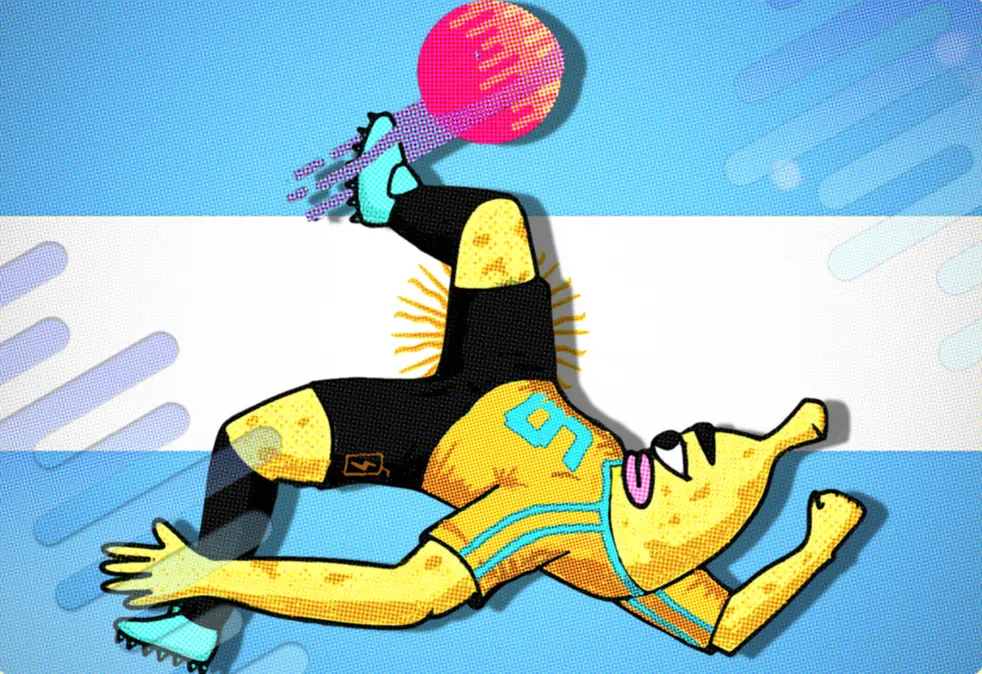

# The 2022 World Cup is decentralized and happening on Ethereum with an all-banana cast

### [Defifa.net](http://Defifa.net) upends how we think about NFT trading

The Juicebox protocol has its eyes set on the FIFA World Cup this year. A new project called Defifa is set to launch on November 5th, and will allow players to purchase NFT flags of any of the 32 World Cup teams set to play this year.

***(example of the Argentina flag NFT)***

Where it gets it exciting is when the World Cup starts. From the first kick-off, all NFTs become non redeemable. The treasury that has amassed all the ETH for the NFTs will become locked, as well. As each phase of the World Cup takes place, the NFTs claim on the treasury will change proportional to their finalist ranking. Midway through the World Cup, the NFTs will also become non-transferable, meaning holders will be locked into waiting for the outcome of the games. At the end of the competition, all participants must ratify a scorecard to attest to the accurate results of the World Cup, at which point the NFTs will be come unlocked and can make their claim on the treasury. So if you purchased an NFT of a team that ended up winning, redeeming that NFT at the end of the World Cup could give you back more than you paid for it. For a short video breakdown, check out this explainer on [twitter.](https://twitter.com/Defifa420/status/1582431327730761728)

### A protocol more flexible than an olympic gymnast

The entire [defifa.net](http://defifa.net) is run on the very same protocol that ran ConstitutionDAO last year, and that is currently home to a variety of projects including, including [MoonDAO](https://www.moondao.com/) and JuiceboxDAO. But for Defifa, there were some important tweaks.

The protocol has no idea who will win or lose in the world cup, and who will get knocked out. While one obvious solution is to appeal to an off-chain oracle, a much more interesting one was to have the NFT holders participate themselves. When a new game has happened, anybody can submit a scorecard which NFT holders must then vote on to ratify. Doing this allows the protocol to run more purely, but it also introduces some interesting dynamics.

### A game of chance or cooperation?

Anybody working on defifa will tell you that this is a grand experiment, the outcome of which can’t be predicted. In theory, the game should run smoothly— NFTs are minted, held, participants vote and at the end the NFTs can be redeemed against the treasury with their new (adjusted by the game’s outcomes) value. But what if that doesn’t happen?

What if some people refuse to vote, or vote in bad faith? Or what if so many people purchase the NFT of a favored team, that the claim on the treasury between all those holders is actually quite small? Statistically speaking, what is the expected value of purchasing a highly favored versus a long-shot team, and when does it make sense to trade your NFT and when doesn’t it? The beauty is that nobody knows, and those that play will all find out in real-time.

### Where to learn more?

Head over to [defifa.net](http://defifa.net) to learn some of the details of each game phase and to see the NFTs offered. To hear a short podcast episode with the defifa.net creator, jango, head [on over to spotify](https://open.spotify.com/episode/5J7K0eyBUJJcTDFz4XRcAU?si=58b0713366524a7e). And if you’d just like to hang out and say hi, come to the [Juicebox discord](https://discord.gg/B7abR2TR) and feel free to ask any questions there.
