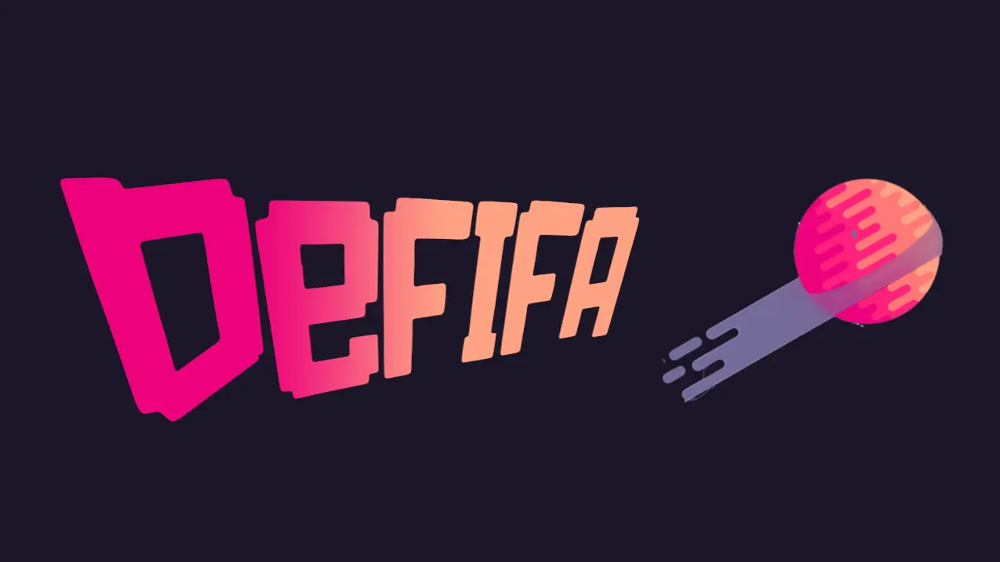
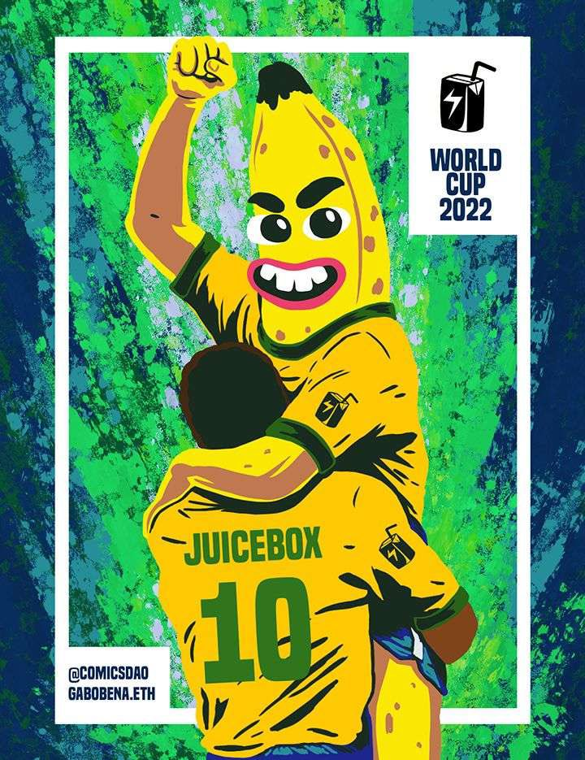

[Defifa](https://juicebox.money/v2/p/305) is an experimental pop-up NFT game that accompanies the 2022 FIFA World Cup. Minting started Nov 8th and will close before the first kickoff of the competition on November 21st. The game definitively ends on December 25th—7 days after the final whistle of the competition—at which point all treasury funds will be made available to those that wish to redeem their NFTs.

There are 3 novel ideas worth calling attention to that make Defifa possible:

### NFT Distribution

Over the past five months, engineering contributors at Juicebox DAO have been developing an NFT distribution mechanism that project owners can configure and attach to any of their funding cycles. With this NFT extension attached, inbound payments have the opportunity to mint a token from an ERC-721 contract if certain conditions are met. This 721 can contain any number of payment tiers, which can define their own visual and descriptive metadata, minimum contribution thresholds, max supply, a ratio of tokens to reserve for a pre-programmed beneficiary, voting weights, and other properties to ensure confidence for both the project owner and community.

Defifa uses this system to define 32 tiers corresponding to the 32 teams competing at the World Cup. All tiers are contained within the same NFT collection. Each tier has no max supply and requires a contribution of 0.022 ETH into the Defifa treasury. All contributions to this treasury qualify and must specify the desired teams from which to mint. Clients can specify if the payment’s value must be used in full towards mints — if the payment is not quantified in 0.022 ETH increments, it will revert.

:::info

See the full deploy script here: [https://github.com/jbx-protocol/juice-defifa/blob/main/contracts/scripts/Deploy.s.sol](https://github.com/jbx-protocol/juice-defifa/blob/main/contracts/scripts/Deploy.s.sol)

:::

### Project ownership

Project owners have the exclusive ability to configure a project’s future funding cycles. Most Juicebox projects created thus far have been owned by a person or a multisig. The Defifa project is instead owned by a contract that automates the queuing of four hard-coded funding cycles which define the game’s four phases. Funding cycles are sequential and each is bound by timestamps defined at the game’s instantiation.

The first funding cycle is the mint phase:

- Payments into the treasury are accepted and team NFTs are minted as described above.
- Redemptions are honored for a full refund of the mint price.
- Reserved tokens cannot be minted during this phase.

The second funding cycle starts at the exact time of the FIFA World Cup’s first kickoff:

- Payments are paused to prevent any future mints.
- Redemptions are paused to prevent access to the treasury’s funds.
- Reserved tokens can now be minted for each tier such that 1 of every 10 tokens belong to the Defifa Ballkids who developed the game and encourage fluid gameplay.

The third funding cycle starts at the kickoff time of the tournament’s quarterfinals:

- Transfers for all NFTs from all teams are locked and become temporarily soulbound.
- All other rules are the same from funding cycle #2.

The fourth funding cycle starts seven days after the final match is played:

- Transfers for all NFTs are unlocked.
- Payments remain paused to guarantee no new mints.
- Redemptions are reopened so that NFTs can be burned to reclaim an underlying share of the treasury. More on this in the Scorecards section below.
- This phase lasts forever.

Each phase must be queued before the current phase ends. This transaction can be sent by any player.

Artwork by <a href="https://twitter.com/soypulpob">gabobena.eth</a>

### Scorecards

The game is entirely self-refereed, meaning that it does not rely on on-chain oracles to convey real world outcomes. Instead, NFT holders are solely responsible for attesting to the correct scorecard that represents what happened in real life. A “correct” scorecard is determined only by social consensus.

This version of the game justifies correctness as follows:

- There are 100,000 total points to be distributed. 20,000 points are available to each of five rounds of the FIFA tournament, divided evenly between the winner of each game in the round.

- There are 48 group stage games total, 8 round-of-16 games, 4 quarterfinal, 2 semifinal, and 1 final. This means that each group stage game is worth 416 points, each round of 16 game worth 2,500, each quarter final worth 5,000, each semi final worth 10,000, leaving the final with the remaining 20,032. The correct scorecard should represent the amount of accumulated points by each team divided by the total available 100,000 points.

- Each team has 1 vote, divided evenly between all of its NFT holders. Scorecards can be submitted by anyone at any time and voting opens during the World Cup final. During phase 4, a scorecard can be ratified once 50% of all teams have agreed on the correct treasury distribution. Once ratified, each NFT has access to the treasury along the same distribution as the scorecard. Each individual NFT can be redeemed to reclaim a proportional share of the team’s value. This is the only way to access the game’s treasury.

- Funding cycle 4 lasts forever, meaning an NFT can be redeemed (burned) at any time for its underlying ETH. It can also be collected and traded forever.

[Defifa](https://juicebox.money/v2/p/305) is an experiment and will work as long as it has been configured correctly, however players should participate at their own risk. The code is open source and players are encouraged to fork the framework to run similar experiments for subsequent tournament-style competitions. Boa sorte!

Artwork by <a href="https://twitter.com/sagekellyn">Sage Kellyn</a>

