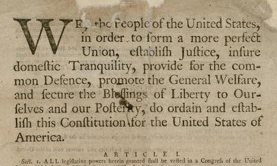
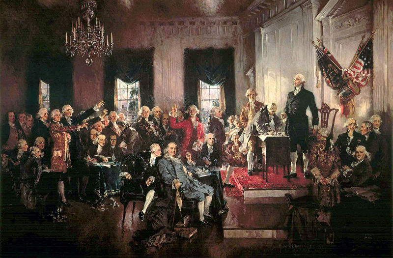
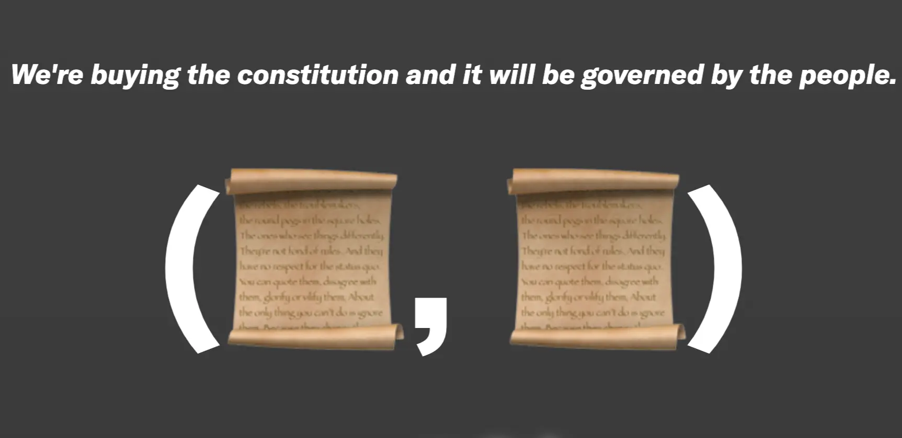
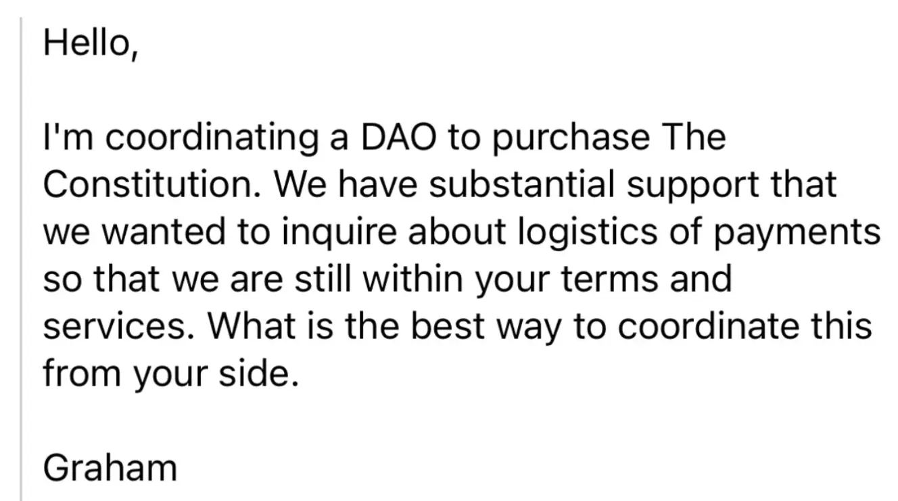
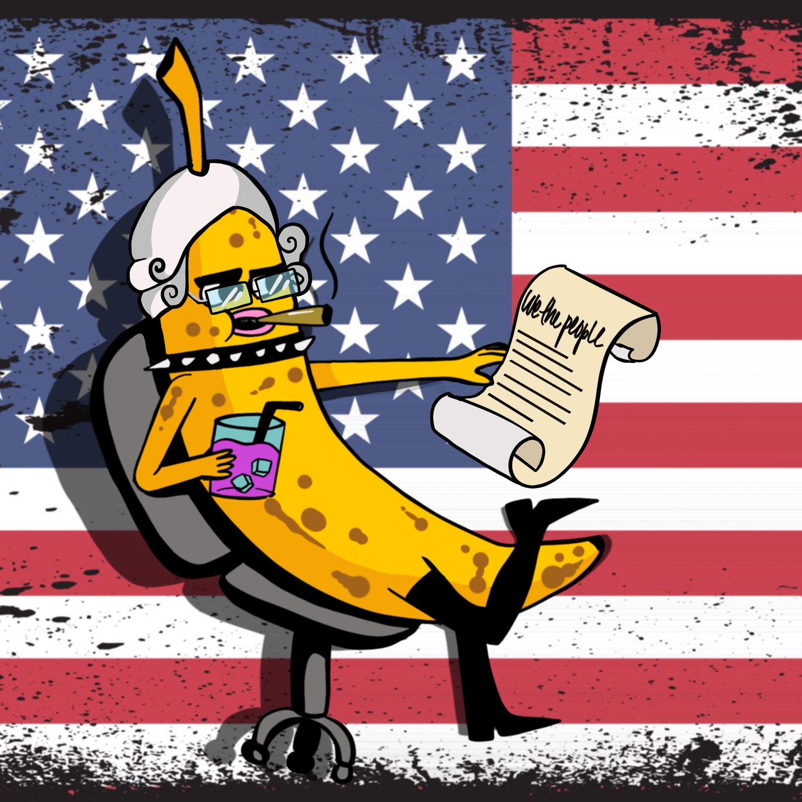
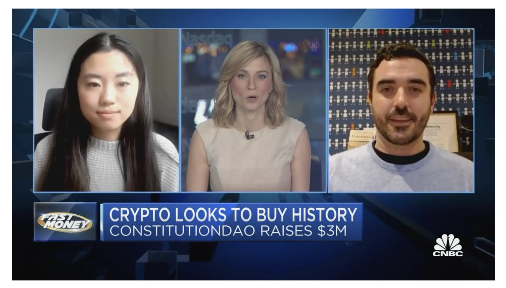
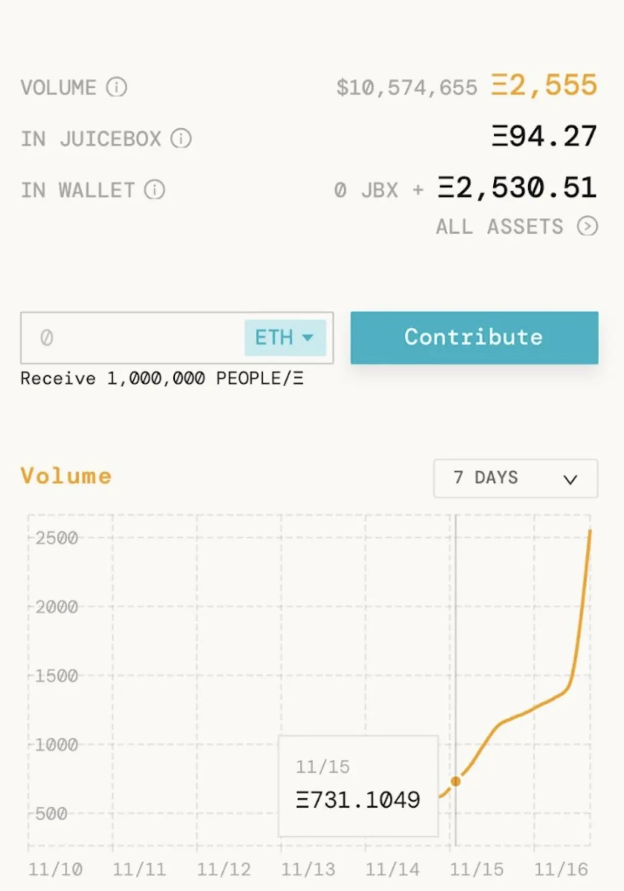
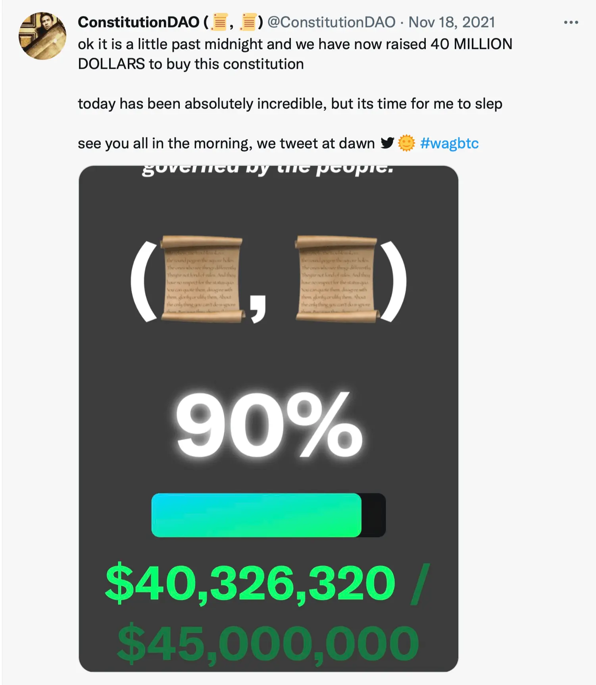
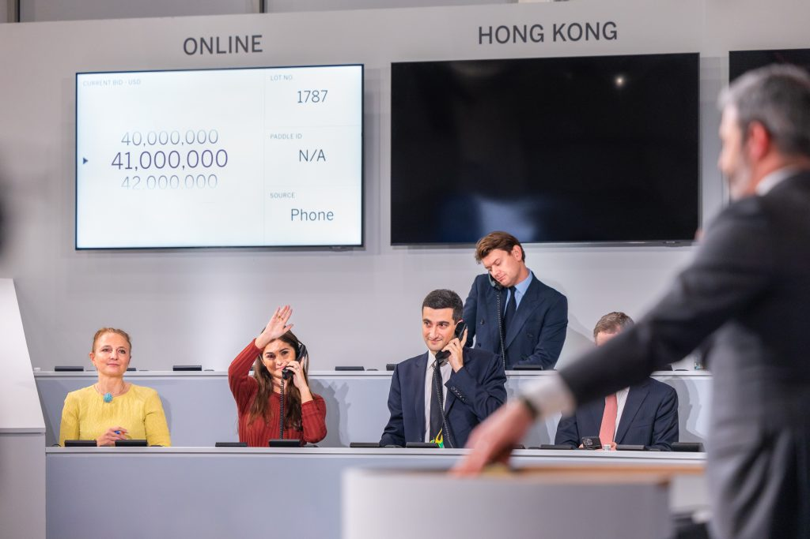
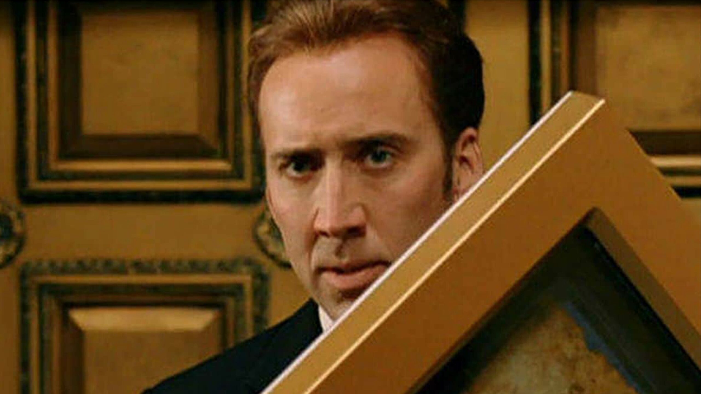

:::tip
To listen to this story in podcast format, tune in to The Juicecast ConstitutionDAO Retrospective Part 1 ([Apple Podcasts](https://podcasts.apple.com/us/podcast/ep-15-constitutiondao-retrospective-pt-1/id1623504302?i=1000586607104), [Spotify](https://open.spotify.com/episode/5Egxvl792OvtYLO6Cw3ADG)), Part 2 ([Apple Podcasts](https://podcasts.apple.com/us/podcast/ep-16-constitutiondao-retrospective-pt-2/id1623504302?i=1000588377648), [Spotify](https://open.spotify.com/episode/4CHE52PyXKInL4QvmdcYgh)), and Part 3 ([Apple Podcasts](https://podcasts.apple.com/us/podcast/ep-17-peopledao-and-the-constitutiondao2-campaign-to/id1623504302?i=1000589496263), [Spotify](https://open.spotify.com/episode/5GkAxq5JC3VIbUwfvAoaNf)).
:::

### A brief origin story of the Constitution of the United States 🇺🇸

detail from the Dunlap & Claypoole original printing of the U.S. Constitution, 1787

Before we get into ConstitutionDAO, let's start with the Constitution itself.

In a way, you could say that the Constitution wasn't even the *first* Constitution. Before the Constitution came the Articles of Confederation which was an agreement between the thirteen original states that was approved by the Second Continental Congress on November 15th, 1777 and later came into effect after being ratified by the states on March 1st, 1781. The Articles of Confederation were drafted to establish and preserve the independence and sovereignty of the states. Over time, though, delegates found that the limitations of the central government were in fact too limiting and revisions began to be discussed.

Fast forward to the Constitutional Convention which took place between May 25th and September 17th, 1787 in Philadelphia. Initially intended to revise the Articles of Confederation, the four month convention was in fact the birth place of an entirely new Frame of Government: what is now known as *the* Constitution of the United States, the longest continuing charter of government in the world.

Scene at the Signing of the Constitution of the United States, Oil on Canvas, Howard Chandler Christy (1940)

What does the Constitution say? Here's the tldr;

- Articles I-III outline the three branches of the federal government: the legislative (bicameral Congress), the executive (the President and his lackeys), and the judicial (the Supreme Court).
- Articles IV-VI outline the rights and responsibilities of state governments, how states relate to the federal government, and the process of constitutional amendments.

### The Constitution to ConstitutionDAO pipeline 📜

Even though the story of ConstitutionDAO isn't about any particular person, we have to start somewhere. Our story begins with [Graham Novak](https://twitter.com/gnovak_) on Thursday November 11th, 2021. It's 9:55am and Graham is sitting in an office in Atlanta, Georgia where he manages crypto investments at 28th Street Ventures. A friend in a non-crypto group chat shares the link to an upcoming auction of the U.S. Constitution at Sotheby's with an estimated price of 10-15 million dollars.

The bid estimate seemed shockingly low to Graham. At the same time, he was researching group purchases by digital communities and in particular a recent acquisition made by [FlamingoDAO](https://twitter.com/FLAMINGODAO). It also seemed odd to Graham that the Constitution was privately owned instead of being a public good: it was the longest continuing charter of government in the world and one of only thirteen remaining copies. Soon after, consensus was reached: let's buy the U.S. Constitution.

And from there it snowballed. Within the first day, [ConstitutionDAO](https://twitter.com/ConstitutionDAO) went from a group chat of friends to a Discord of over 2000 members with National Treasure memes spreading like wildfire. An initial email was sent to Sotheby's to start coordinating logistics.

First email sent to Sotheby's on behalf of the ConstitutionDAO campaign

Later that day there is a kick-off call around 8pm to start going over logistics and next steps. Some attendees were focused on the memes and having fun while others were deadly serious. [Alice Ma](https://twitter.com/alicemama15), engineer and co-founder of [Mad Realities](https://twitter.com/madrealities), was one of the attendees for that first kickoff call:

> On that first Friday night it was very obvious to us: why should this document be on sale to the highest bidder? Why is this not public property? That was the drive from the beginning. **This was a National Treasure-style heist** where we're heisting it from the next billionaire.
>
>— [Alice Ma](https://twitter.com/alicemama15)

ConstitutionDAO pfp of Nicolas Cage from National Treasure

As they wrapped up the call, the clock started ticking. They had less than a week until the Sotheby's auction in New York City on November 18th, 2021.

### ConstitutionDAO 🤝 Sotheby's

Because Sotheby's wouldn't allow a DAO to bid, ConstitutionDAO partnered with a non-profit called [Endaoment](https://twitter.com/endaomentdotorg). They would hold custody of the document and bid on behalf of ConstitutionDAO at Sotheby's. Once the DAO won the auction, they would allow DAO members to draft proposals and vote to decide where the document would be displayed.

:::info
When community members received $PEOPLE tokens for contributions made in ETH, these tokens represented governance votes over where the document would be displayed and how. Not ownership of the document itself.
:::

Nicolas Cage Banny by <a href="https://twitter.com/SageKellyn">Sage Kellyn</a>

### ConstitutionDAO 🤝 Juicebox

When it came time to raise money for the auction, ConstitutionDAO had three options: [Mirror](https://twitter.com/viamirror), [Syndicate](https://twitter.com/SyndicateDAO), and [Juicebox](https://juicebox.money/). While each platform had a history of raising funds and starting DAOs, there were still concerns about putting millions of dollars into unaudited smart contracts. In the end, the team chose Juicebox because the overflow mechanism would allow refunds in the event that ConstitutionDAO didn't win the [auction.](http://auction.It) It also seemed (somewhat) battle tested with [SharkDAO](https://twitter.com/sharkdao) previously raising several million dollars to buy the Shark Noun.

:::tip
If you want to learn more about SharkDAO, a sub-DAO of NounsDAO raising funds to buy Nouns, check out [this article](https://docs.juicebox.money/blog/2022-07-18-sharkdao).
:::

At 8:31pm on Sunday night (day 4), the [Juicebox project](https://juicebox.money/p/constitutiondao) launched on mainnet and the $PEOPLE token was deployed shortly after. Within ten minutes accepting contributions, ConstitutionDAO had already amassed $250,000 USD.

Artwork by <a href="https://twitter.com/SageKellyn">Sage Kellyn</a>

By Monday November 15th (day 5), the media narrative started to heat up. Core team members of ConstitutionDAO were being interviewed on CNBC, The New York Times, Bloomberg, and more. Everyone, including your neighbour, was starting to learn what the word DAO meant.

Core team members <a href="https://twitter.com/alicemama15">Alice Ma</a> and <a href="https://twitter.com/packyM">Packy McCormick</a> appear on <a href="https://www.cnbc.com/video/2021/11/15/in-crypto-we-trust-bidding-for-the-us-constitution-with-ethereum.html">CNBC news</a>

### Slowly and then all at once 📈

At a certain point, fundraising started to plateau. Money was coming in but the momentum wasn't enough for the campaign to pass Sotheby's proof-of-funds requirements by Thursday, the day of the auction. [Jon Hillis](https://twitter.com/JonathanHillis), core team member and co-founder of [Cabin](https://twitter.com/creatorcabins), had a plan:

> We needed a big whale to make a contribution that would restart the hype engine and get us to the fundraising goal. So I set out to find a whale and in the end it was actually an anonymous address that put in $1 million right as things started to look stagnant. We then started seeing a lot more larger amounts coming in as well as a tremendous number of small dollar donations which set up the next meme cycle.
>
>— [Jon Hillis](https://twitter.com/JonathanHillis)

Once the hype kicked in, money pouring into the Juicebox project was slow at first and then all at once.

ConstitutionDAO crossing $10 million dollars worth of ETH on Juicebox

[Metaversal](https://www.metaversal.gg/) also committed $1MM live on the Andreesen Horowitz show on Clubhouse. The ball was rolling again and over the next 24 hours the treasury miraculously grew to over $40MM dollars. The money coming into Juicebox on the 17th going into the 18th made up more than half of the entire amount raised by ConstitutionDAO. The meme had reached escape velocity.

### The last minute $46MM USD swap that saved the campaign 💵

Leading up to the auction, the price of ETH fell ~15% from $4800 to nearly $4000 USD. In response to this, Sotheby's informed the core team that they would no longer accept ETH as proof of funds as previously agreed upon. This meant that ConstitutionDAO needed to swap 11,500 ETH (~ $46MM) OTC with FTX and they needed to do it fast.

:::info
Reminder: this all took place in November 2021 before the collapse of FTX.
:::

The core team was (literally) sprinting to execute this transaction. They were calling family members and running around town to track down multisig signers in coffee shops they frequented or offices where they worked. The multi-sig was set up as a 9/13 meaning that nine signers were needed for this critical transaction to go through. It was set-up this way both for security and for the memes as the Constitution only became law once it was ratified by nine of the thirteen original states.

Not all of the multisig signers were core team members. Some were well known figures in web3 with a strong reputation and including them on the multisig was a way of building trust with the public. But beyond the challenge of public trust, there was also the challenge of coordinating 9/13 people to sign a transaction. For the OTC swap via FTX, ConstitutionDAO needed to execute a single transaction of 11,500 ETH to $46MM US dollars. On the afternoon of the 18th with only hours to spare before the auction, they managed to get the signers needed and were able to provide proof of funds to Sotheby's. The campaign was saved.

### ConstitutionDAO's final act: the auction at Sotheby's 👨🏻‍⚖️

Bidding escalated quickly and in the end, the winning bid was $41MM. ConstitutionDAO had raised $46MM, so they must have won... right? That's what most people thought, at least.

Over 11,500 ETH was raised by 17,000 contributors around the world, and in that final moment it all came down to... Brooke or David? Which bidder was representing ConstitutionDAO? While some core team members knew the answer, nobody in the broader community knew exactly what was happening.

Sotheby's had many requirements in order to bid on the Constitution. For one, the DAO needed to be able to care for the document. They couldn't just walk out of the auction with the Constitution in a plain manilla envelope, they needed to have funds set aside for proper care and maintenance of the document. And there was also the sales tax and other applicable fees which would be added onto the final hammer price. So even $41 million wasn't really $41 million, and the final sale price for the document ended up being $43,173,000 US dollars.

In the end, the winning bid went to hedge fund billionaire Ken Griffin, CEO of Citadel and founder of Citadel Securities. In the coming days, narratives emerged around a billionaire winning the auction instead of the 17,000 people who came together for the ConstitutionDAO campaign. It is worth noting that Ken has never collected historical documents prior to buying the Constitution. And given that he has publicly criticized crypto as “anti-American” and stated that Citadel would never invest in cryptocurrencies, his motivations for pursuing the auction may have been largely ideological.

Brooke Lampley representing Ken Griffin at the Sotheby's auction

### Takeaways from this epic saga

While ConstitutionDAO didn't win the auction, they raised over $40 million in less than seven days, onboarded thousands into crypto, and introduced the idea of a DAO to the public. And just as we had to start our story somewhere, we also need to end somewhere. So we'll come full circle to conclude with Graham:

> ConstitutionDAO is a democratic story. It's a story of the people, a story of the underdogs. At some point, there's going to be enough capital, interest, and coordination in web3 that when you've got a large aggregate of people who are attempting to buy, launch, or build something and they're going against a titan of the traditional world, they're going to overcome that. And it's going to be done with distributed technology, teams, and more effective coordination of people. I think [ConstitutionDAO] signifies where we're going with governance and blockchain.
>
>— [Graham Novak](https://twitter.com/gnovak_)

### ConstitutionDAO2 and second chances

Almost exactly a year later, Sotheby's has [announced](https://www.sothebys.com/en/articles/sothebys-to-auction-one-of-only-two-first-printings-of-the-u-s-constitution-remaining-in-private-hands) another copy of the U.S. constitution is going up for auction on December 13th, 2022. You can listen to episode 17 of the Juicecast to learn more about how ConstitutionDAO2 (UnumDAO) are trying to win the auction on [Spotify](https://open.spotify.com/episode/5GkAxq5JC3VIbUwfvAoaNf?si=48d354d7acad4a89) and [Apple Podcasts](https://podcasts.apple.com/ca/podcast/the-juicecast/id1623504302?i=1000589496263).

### Relevant links 🔗

🎙️ Check out the Juicecast ConstitutionDAO Retrospective Part 1 ([Apple Podcasts](https://podcasts.apple.com/us/podcast/ep-15-constitutiondao-retrospective-pt-1/id1623504302?i=1000586607104), [Spotify](https://open.spotify.com/episode/5Egxvl792OvtYLO6Cw3ADG)), Part 2 ([Apple Podcasts](https://podcasts.apple.com/us/podcast/ep-16-constitutiondao-retrospective-pt-2/id1623504302?i=1000588377648), [Spotify](https://open.spotify.com/episode/4CHE52PyXKInL4QvmdcYgh)), and Part 3 ([Apple Podcasts](https://podcasts.apple.com/us/podcast/ep-17-peopledao-and-the-constitutiondao2-campaign-to/id1623504302?i=1000589496263), [Spotify](https://open.spotify.com/episode/5GkAxq5JC3VIbUwfvAoaNf))

📜 Follow ConstitutionDAO on Twitter: [@ConstitutionDAO](https://twitter.com/ConstitutionDAO)

🧃 See ConstitutionDAO's project on Juicebox: [https://juicebox.money/p/constitutiondao](https://juicebox.money/p/constitutiondao)

🐦 Follow Juicebox on Twitter: [@JuiceboxETH](https://twitter.com/juiceboxETH)

🚀 [Trending projects on Juicebox](https://juicebox.money/projects)

📚 [Project Creator Docs](https://docs.juicebox.money/user/)

📹 [YouTube Tutorials](https://www.youtube.com/c/JuiceboxDAO)
