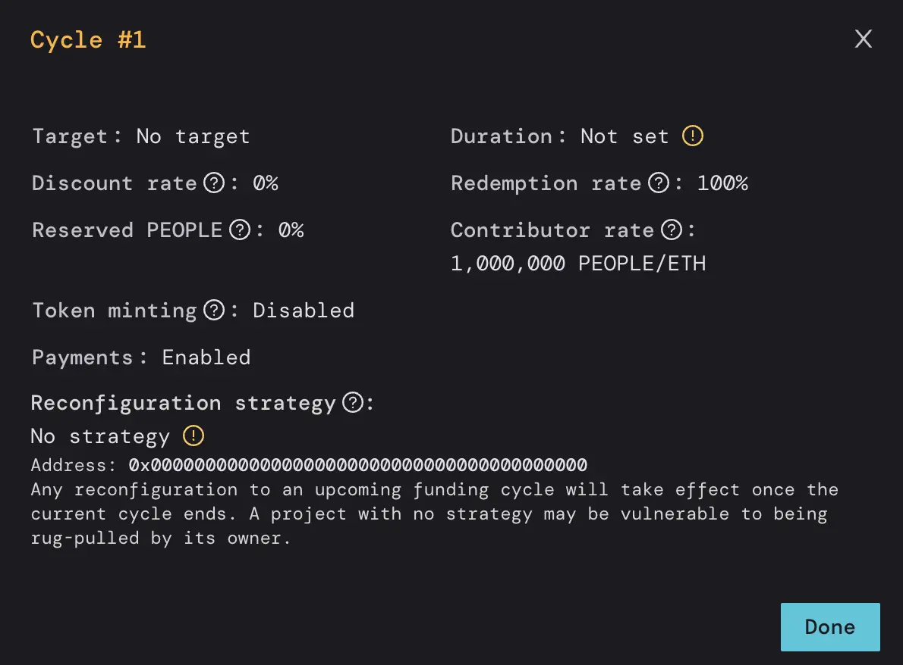
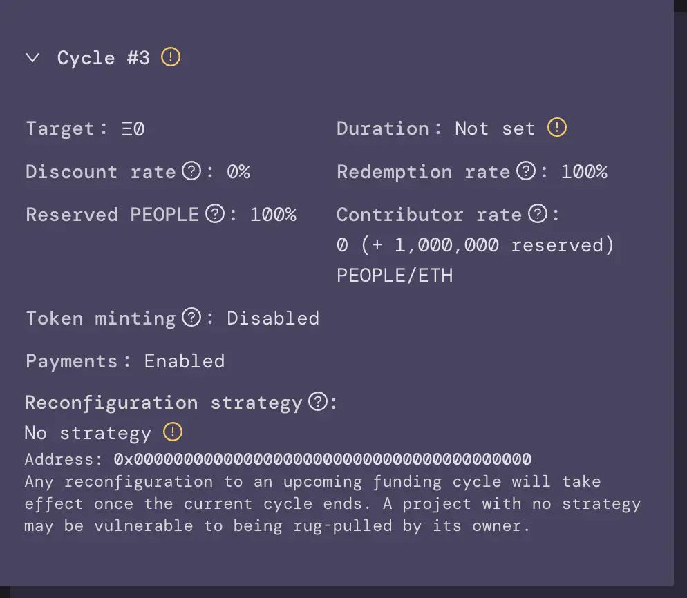

*How ConstitutionDAO raised over $40 million dollars in less than a week using Juicebox*

:::tip
ConstitutionDAO was a single purpose acquisition DAO that tried to buy a copy of the U.S. constitution at Sotheby’s on November 18th, 2021. To learn more about the ConstitutionDAO campaign and the surreal events surrounding the auction, tune in to The Juicecast ConstitutionDAO Retrospective Part 1 ([Apple Podcasts](https://podcasts.apple.com/us/podcast/ep-15-constitutiondao-retrospective-pt-1/id1623504302?i=1000586607104), [Spotify](https://open.spotify.com/episode/5Egxvl792OvtYLO6Cw3ADG)), Part 2 ([Apple Podcasts](https://podcasts.apple.com/us/podcast/ep-16-constitutiondao-retrospective-pt-2/id1623504302?i=1000588377648), [Spotify](https://open.spotify.com/episode/4CHE52PyXKInL4QvmdcYgh)), and Part 3 ([Apple Podcasts](https://podcasts.apple.com/us/podcast/ep-17-peopledao-and-the-constitutiondao2-campaign-to/id1623504302?i=1000589496263), [Spotify](https://open.spotify.com/episode/5GkAxq5JC3VIbUwfvAoaNf)). You can also read the ConstitutionDAO deep dive article on the [JB blog](https://docs.juicebox.money/blog/2022-12-13-constitutiondao/).
:::

In this article, we’ll cover how ConstitutionDAO used Juicebox to fundraise ~ $46 million (11,500+ ETH) in less than a week.

Nicolas Cage in National Treasure

The estimated value of the U.S. Constitution prior to the auction was $10-15 million dollars. In order to build trust with the crypto community and the wider public, the core team set up a 9/13 multisig with core team members and well-known figures in web3. They also set up a Juicebox project to fundraise transparently and out in the open with the community. And if they lost the bid, project contributors could get a refund using Juicebox’s overflow mechanism.

Spoiler alert: ConstitutionDAO did not win the auction. As a result, the core team enabled refunds and burned the keys to the project. In other words, the core team is no longer associated with or in control of the ConstitutionDAO project or the $PEOPLE token. On the `Funding Cycle` panel on the left, we can look in the `History` tab to see past funding cycle configurations. This article will break down the settings from `Funding cycle #1` to see how they **raised funds** and `Funding cycle #3` to see how they **winded down the project**.

### Understanding ConstitutionDAO’s fundraising project configuration 🔎

Taking a closer look at the configuration settings for `Cycle #1`, we can see that the following settings were used for their fundraise:

- `Target: No target` means that there is no predefined funding target (e.g. $15 million USD). This gave ConstitutionDAO the flexibility to raise as much as they could in order to try and win the auction. In other words, even if they raised $50 million USD, they could distribute the entire amount.

- Please note that `Target` is now [`Distribution Limit`](https://docs.juicebox.money/dev/learn/overview#distribution-limit) for v2/v3 projects on Juicebox, so in this example they set `Distribution Limit` to `Infinite`.

- `Duration: Not set` means that the project owner can start a new funding cycle with new configuration settings at any time without notice. This is a very flexible strategy but can seem risky to potential contributors because the project owner might change the project rules at any time. In ConstitutionDAO’s case, `Duration` could have potentially been set to `7 days` to match the deadline for the auction at Sotheby’s.

- `Redemption rate: 100%` means that when claiming overflow i.e. funds in excess of the funding target, project contributors will be able to redeem their $PEOPLE tokens for ETH in the treasury **at any time** at the same rate at which they initially contributed. In other words, there is no incentive for holding tokens longer and redeeming later: all tokens have equal value regardless of when they are redeemed.

- Please note that since `Target` is set to `No Target` (same as `Distribution Limit: Infinite`), funds in the treasury will never be considered as Overflow and will therefore not be redeemable.

- `Contributor rate: 1,000,000 PEOPLE/ETH` means that project contributors would receive 1,000,000 $PEOPLE tokens per 1 ETH. This rate is the default setting when creating a Juicebox project but can be set to any amount desired.

- `Discount rate: 0%` means that the amount of tokens issued per 1 ETH **will not** decrease over time by a certain percentage. In other words, there is no incentive for contributing in `Funding Cycle #1` vs. later funding cycles.

- `Reserved $PEOPLE` is set to `0%` so project contributors would receive 100% of the 1,000,000 $PEOPLE per ETH with none set aside for addresses on the Reserved List. The core team made this choice to ensure that everyone had equal access to $PEOPLE tokens with no special team allocation.

- `Payments: Enabled` simply means that the project is currently accepting payments.

- `Reconfiguration strategy: No Strategy` means that there is no delay required before submitting a new Funding Cycle reconfiguration. If this were set to `3-day delay`, the team would need to submit any changes 3 days before the next funding cycle begins. Delay periods give project contributors peace of mind by giving them advance notice of any changes being made to the project rules. Setting this to `No Strategy` has the same perceived risk as `Duration: Not set`.

ConstitutionDAO’s configuration for Funding Cycle #1

### How ConstitutionDAO changed its project configuration after winding down 🤝

After losing the auction at Sotheby’s, the core team reconfigured the project to indicate that they stopped fundraising and enabled refunds. We can see a few settings in `Funding Cycle #3` that reflect this:

- `Target` is set to `Ξ0`. Instead of setting `Target` to `No Target`, the team set a target of `Ξ0` meaning that since the target has been surpassed (obviously) **all funds in the treasury are considered Overflow**. $PEOPLE tokens could therefore be redeemed by project contributors for ETH in the treasury.

- `Redemption Rate` is set to `100%`, meaning that ETH in the treasury could be redeemed **at any time** at the same rate as when funds were initially contributed. In other words, there is no incentive to hold the tokens longer and to redeem later: the same redemption rate will apply.

- `Reserved PEOPLE is set to 100%`. This looks confusing at first but due to the limitations of v1, this setting was the best way to disable the “Pay” button on the [juicebox.money](http://juicebox.money) frontend in order to prevent any further project contributions. For v2/v3 projects, a project creator can simply reconfigure their project to `Payments: Disabled` instead.

- `Duration: Not set` and `Reconfiguration Strategy: No Strategy` typically present risks for project contributors since the project owner can start a new funding cycle with new configuration settings at any time without notice. In this case, the core team revoked ownership by [sending the project to a burn address](https://etherscan.io/tx/0x466d625525932a6725f61398a4da227c39ac909a77c5844d0bc8a222ee465311) which meant that they could no longer control the project in any way. Therefore, this risk is no longer a factor and the project configuration settings are impossible to change.

ConstitutionDAO’s configuration for Funding Cycle #3

### Relevant links 🔗

🎙️ Listen to The Juicecast ConstitutionDAO Retrospective Part 1 ([Apple Podcasts](https://podcasts.apple.com/us/podcast/ep-15-constitutiondao-retrospective-pt-1/id1623504302?i=1000586607104), [Spotify](https://open.spotify.com/episode/5Egxvl792OvtYLO6Cw3ADG)), Part 2 ([Apple Podcasts](https://podcasts.apple.com/us/podcast/ep-16-constitutiondao-retrospective-pt-2/id1623504302?i=1000588377648), [Spotify](https://open.spotify.com/episode/4CHE52PyXKInL4QvmdcYgh)), and Part 3 ([Apple Podcasts](https://podcasts.apple.com/us/podcast/ep-17-peopledao-and-the-constitutiondao2-campaign-to/id1623504302?i=1000589496263), [Spotify](https://open.spotify.com/episode/5GkAxq5JC3VIbUwfvAoaNf))

📙 Read the [full story of ConstitutionDAO on the JB blog](https://docs.juicebox.money/blog/2022-12-13-constitutiondao/)

🧃 See ConstitutionDAO’s project on Juicebox: [https://juicebox.money/p/constitutiondao](https://juicebox.money/p/constitutiondao)

🐦 Follow Juicebox on Twitter: [@JuiceboxETH](https://twitter.com/juiceboxETH)

🚀 [Trending projects on Juicebox](https://juicebox.money/projects)

📚 [Project Creator Docs](https://docs.juicebox.money/user/)

📹 [YouTube Tutorials](https://www.youtube.com/c/JuiceboxDAO)
