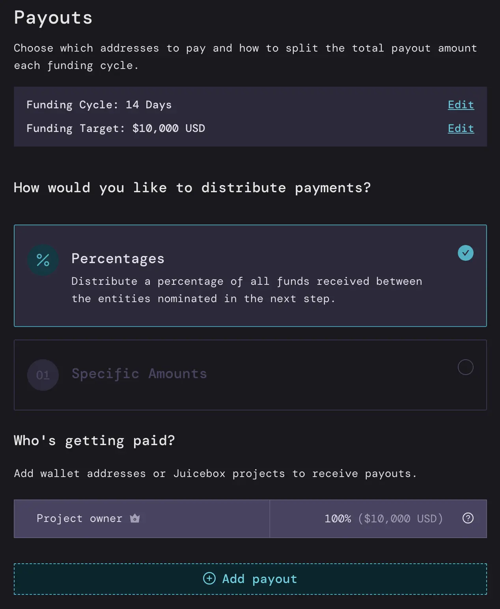

# How to sell NFTs on Juicebox in less than 10 minutes

Juicebox enables creators and communities to create and launch NFT projects with powerful yet simple tools tailored to your needs in an ongoing basis. In this tutorial we’ll guide you through how to configure a Juicebox project to sell NFTs in less than 10 minutes. Whether you’re a creator selling content, managing a DAO, NFT project or cryptocurrency crowdfund, you can sell NFTs easily on Juicebox with complete control and transparency.

You can follow along in this article or the Youtube video.

<iframe width="560" height="315" src="https://www.youtube.com/embed/pgpK3LofDSU" title="YouTube video player" frameborder="0" allow="accelerometer; autoplay; clipboard-write; encrypted-media; gyroscope; picture-in-picture" allowfullscreen></iframe>
 

**The example for this tutorial is an NFT project called Flamingo Sunday.** We’re using Juicebox to sell flamingo NFTs at 0.1, 1, and 10 ETH tiers and anyone who contributes at those amounts will receive the corresponding NFT.

So head to [juicebox.money](http://juicebox.money), connect your wallet, and click `Create a project`.

### Step 1: Project Details

Here you’ll provide general information about your Juicebox project including the name, description, a logo, and add social links. You can even customize the `Pay` button, for this example we could make it say “we love flamingos.” Once you’re done, click `Next`.

### Step 2: Funding Cycles

If we set this to 14 days then **all of our project settings will be locked for 14 days** and we can only distribute funds from the treasury **once** during that 14-day cycle. This helps build trust so contributors feel safe that they won’t get rugged.

**You can decide what’s best for your project** and if you need the flexibility to change at any time, you can choose `Manual Funding Cycles`. If you’re not sure, you can start with `Automated Funding Cycles`.

:::tip
Remember, you can always reconfigure your project later to reflect your needs for the project
:::

### Step 3: Funding Target

This is where you decide how much money from the project can be distributed per 14 days (the length of your funding cycle)

If we set a `Specific Funding Target` of 10,000 USD, we can distribute up to 10,000 USD worth of ETH per 14-day funding cycle. This is like a hard cap on the amount that can be distributed from the treasury so the project owner can’t take all the funds and disappear. Anything over 10,000 USD worth of ETH will be considered `Overflow` and can be redeemed by anyone who contributed to the project, almost like a refund.

:::tip
You can also set this in ETH instead of ETH denominated in USD.
:::

Another way to do this is an `Infinite Funding Target` which means you can distribute as much as you want from the treasury, but this can be perceived as risky to contributors to your project because you could take all the money and run. So for this example, we’ll go with a `Specific Funding Target` of 10,000 USD worth of ETH.

### Step 4: Payouts

Here you can decide where to distribute the ETH that we receive every 14 days. We can do this with `percentages` or `specific amounts`.

For example, with percentages, let’s say I am the artist that made Flamingo Sunday and I want to receive 100% of the funds that come in every 14 days.

If we were doing specific amounts, I could say that I want to receive 10,000 USD worth of ETH which is the total amount that can be distributed every 14 days to myself.

Both of these can be configured to add other people, for example if you had a team of four people (including yourself) working on the project, you could split the payouts 25% to each address by clicking `Add Payout` and adding their address and 25%.

But for this tutorial we’ll keep it simple and stick with 100% going to the project creator.

### Step 5: Project Token

Here you can decide how your project’s tokens will work. There’s a lot of things you can customize here but the `Default Token Settings` will work for most projects. You can always reconfigure this setting in the future, depending on the roadmap for your NFT project.

### Step 6: NFTs

Click `Add NFT` choose an image, and give it a name, a description, and the minimum ETH contribution in order for someone to buy the NFT. This is also where you can decide the supply. You can either have a limited supply—for example, only 10 can be minted—or an unlimited supply. You can also add an external link to point to a website of your choice.

You can repeat this process as many times as you like for each NFT you have. They can be priced and supplied all the same, or you can create tiers. Using tiered NFTs is a great way to create different incentives for people to support your Juicebox project at different price points.

Once you have all your NFTs added, you can create a collection name, description, and custom token symbol. For this project, we’ll call it “Flamingo”

There’s also an option to add a message that appears when contributors receive an NFT as well as a button with a link, this could be a project website, Twitter, Discord, etc.

### Step 7: Confirm all settings (rules)

The default is a `3-day delay`, which means that any changes to the project settings need to be submitted at least 3 days before the next funding cycle starts. You can think of this as a safety measure. In other words, the project can’t suddenly change all of their settings.

You can change this to be longer, shorter, or no delay, but we’ll stick with the 3-day default.

**Before deploying**, review your settings and make any changes needed. You can always go back and tweak things before you deploy. Check the `Terms of Service` box and you’re ready to go! Click `Deploy`, confirm the transaction in your wallet, and your project is live!

:::tip
You can go through this entire process on Goerli testnet before launching your project on mainnet. If you have any questions, please come by the [Support channel](https://discord.com/channels/775859454780244028/864240636277293106) in the Juicebox Discord.
:::

Note that the NFT images might take awhile to display properly. If someone wants to purchase an NFT at the 0.1 ETH tier, for example, they just click on the NFT, click the customized pay button, click `I understand` to acknowledge the safety warning, and then click `Pay`. You can even leave a little on-chain memo like “we love the flamingos”, an image, or Banny sticker with your contribution.

So we’ll refresh the page and now you can see the NFT that we just purchased in the Activity feed on the right.

 If you need help along the way, jump into the [Support channel](https://discord.com/channels/775859454780244028/864240636277293106) in the Juicebox Discord.

 🐦 Follow Juicebox on Twitter: [@JuiceboxETH](https://twitter.com/juiceboxETH)

🚀 [Trending projects on Juicebox](https://juicebox.money/projects)

📚 [Project Creator Docs](https://docs.juicebox.money/user/)

📹 [YouTube Tutorials](https://www.youtube.com/c/JuiceboxDAO)
