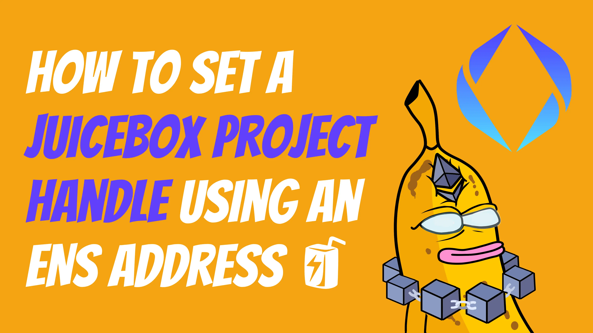
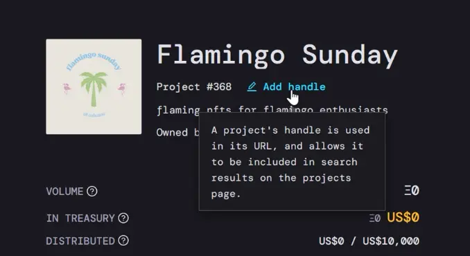
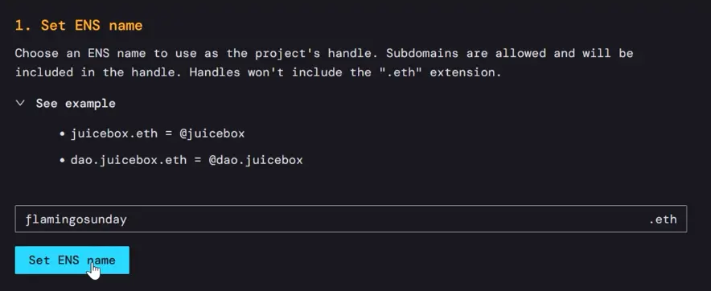
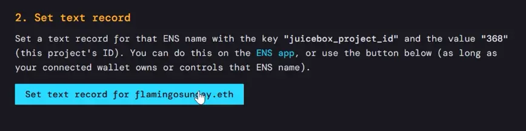
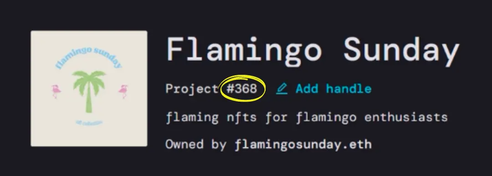
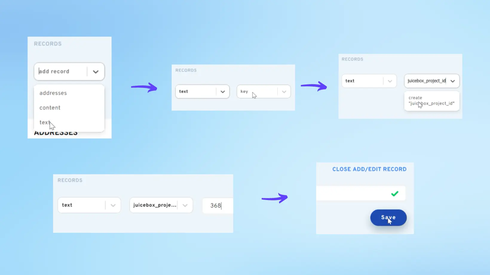
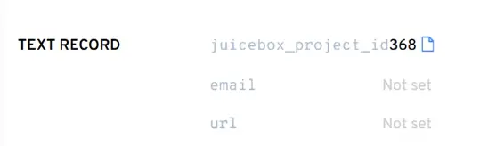

# How to set a Juicebox project handle using an ENS address

Setting a handle for your project on Juicebox is a great way to customize your page by linking your ENS to your project. Project handles on Juicebox make it easier for people to find your project and help set it apart with a vanity URL. This guide will show you how to set the handle directly from juicebox.money and manually using the ENS app in less than 5 minutes.

You can follow along in this article or the Youtube video.

<iframe width="560" height="315" src="https://www.youtube.com/embed/6YuVL7Yoxgw" title="YouTube video player" frameborder="0" allow="accelerometer; autoplay; clipboard-write; encrypted-media; gyroscope; picture-in-picture" allowfullscreen></iframe>
 

**Before you start,** you need to have:

- An ENS name that you own and control
- A Juicebox project that you are the owner of

### Step 1: Add Handle

Click right underneath the Project title where it says `Add handle`.

### Step 2: Set ENS name

Enter an ENS name that you own, and click `Set ENS name` This will prompt a transaction that you’ll have to confirm with your wallet.

### Step 3: Set text record

After the transaction is confirmed, you’ll see that it lists the ENS chosen as the project handle, **but you’re not done yet.** Next you need to set the text record for that ENS name, so click the button below that says `Set text record`. Then confirm the transaction with your wallet.

It might take a few minutes to update, but you can refresh your project page and see the project handle below the project title. The project URL with the project ID number will still work, but you can also use your new URL which is [juicebox.money](http://juicebox.money)/ @yourensname

And that’s it!

### You can also set this text record manually using the ENS app.

**Before you do that**, take note of your project number which you can always find under the project name or you can look at the URL for your project. In this example, **our project is #368**.

### (Using ENS) Step 1: Add / Edit Record

Go to [app.ens.domains](http://app.ens.domains), go to My Account on the left and choose the ENS address that you want to use. Then you’ll click `Add / Edit Record` on the right side

### (Using ENS) Step 2: Create juicebox_project_id

You’ll choose `text` in the drop-down menu on the left and in the next drop-down where it says `key` we’ll click and start typing `juicebox_project_id` and then click the message that appear below that says create `juicebox_project_id`. Then we’ll click the field to the right and enter our project number which is 368.

### (Using ENS) Step 3: Save and confirm

Press `Save` and then scroll down to the bottom of the page to click `Confirm`. This will prompt a transaction that you’ll need to confirm your wallet. Once confirmed, you’ll see that it’s been added to the list of text records for that ENS address.

Now you can go back to your project on Juicebox, refresh the page, and your handle is now set to your ENS name! Please note that your old URL with the project ID will still work but we can now use [juicebox.money](http://juicebox.money)/@flamingosunday.

And that's it!

 If you need help along the way, drop into the [Support channel](https://discord.com/channels/775859454780244028/864240636277293106) in the Juicebox Discord.

 🐦 Follow Juicebox on Twitter: [@JuiceboxETH](https://twitter.com/juiceboxETH)

🚀 [Trending projects on Juicebox](https://juicebox.money/projects)

📚 [Project Creator Docs](https://docs.juicebox.money/user/)

📹 [YouTube Tutorials](https://www.youtube.com/c/JuiceboxDAO)
