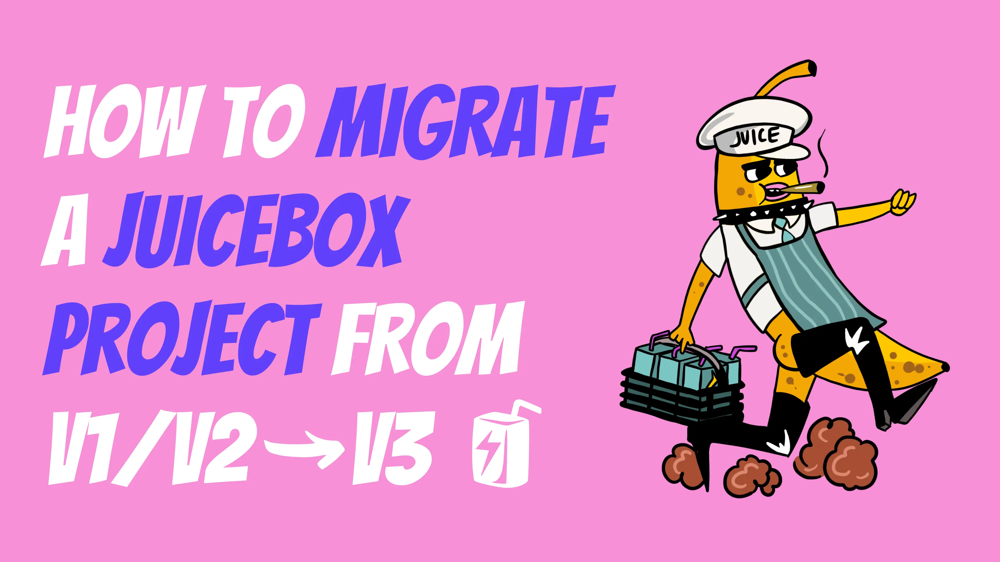

Since launching over a year ago, Juicebox has improved its features and security for programmable treasuries to its current and third version of contracts. The jump from V1 to V2 gave more control and flexibility around tokenomics, and now the V3 contracts include new NFT rewards functionality as well as small security patches following the audit report on V2.

All project owners can migrate their projects to V3 easily and quickly by essentially reconfiguring their project on V3. In this tutorial, we’ll show you how [STVG](https://twitter.com/0xSTVG), a Juicebox contributor and project owner of [Marin County Swim Association](https://juicebox.money/@mcsa) migrated his project from V2 to V3 in **less than 5 minutes.**

*To learn more about Marin County Swim Association, check out Juicecast episode 11 with STVG on [Youtube](https://www.youtube.com/watch?v=TUlu3ZOXBFQ), [Spotify](https://open.spotify.com/episode/2QuBZQ8MkCOSNAIpfjPgWt?si=7c03ec5acbab4788), and [Apple Podcasts](https://podcasts.apple.com/ca/podcast/the-juicecast/id1623504302?i=1000580808092).*

:::tip
Project owners can choose to reconfigure their V2 treasury to be paused and converge onto V3 protocol, or operate both treasuries at the same time. Not sure what strategy is best for you? Hop into the [Support Channel](https://www.notion.so/How-to-sell-NFTs-on-Juicebox-6db2f3d7b4e64c6f8c702bc4a73c1373) in the Juicebox Discord and a fellow Juicer will help you out.
:::

You can follow along in the video made by STVG or step-by-step in this article. Note that you must be the owner of the Juicebox project in order to migrate to V3.

<iframe width="560" height="315" src="https://www.youtube.com/embed/az6Xu8_UsH8" title="YouTube video player" frameborder="0" allow="accelerometer; autoplay; clipboard-write; encrypted-media; gyroscope; picture-in-picture; web-share" allowfullscreen></iframe>

### Step 1: Project Settings

 Go to your project page that you are the owner of and click on `Project Settings`.

### Step 2: Project Upgrade

Once you’re in project settings, scroll down to `Project upgrades` on the left side panel at the bottom. Next you’ll see what version you’re currently on and a button that says `Start upgrade`.

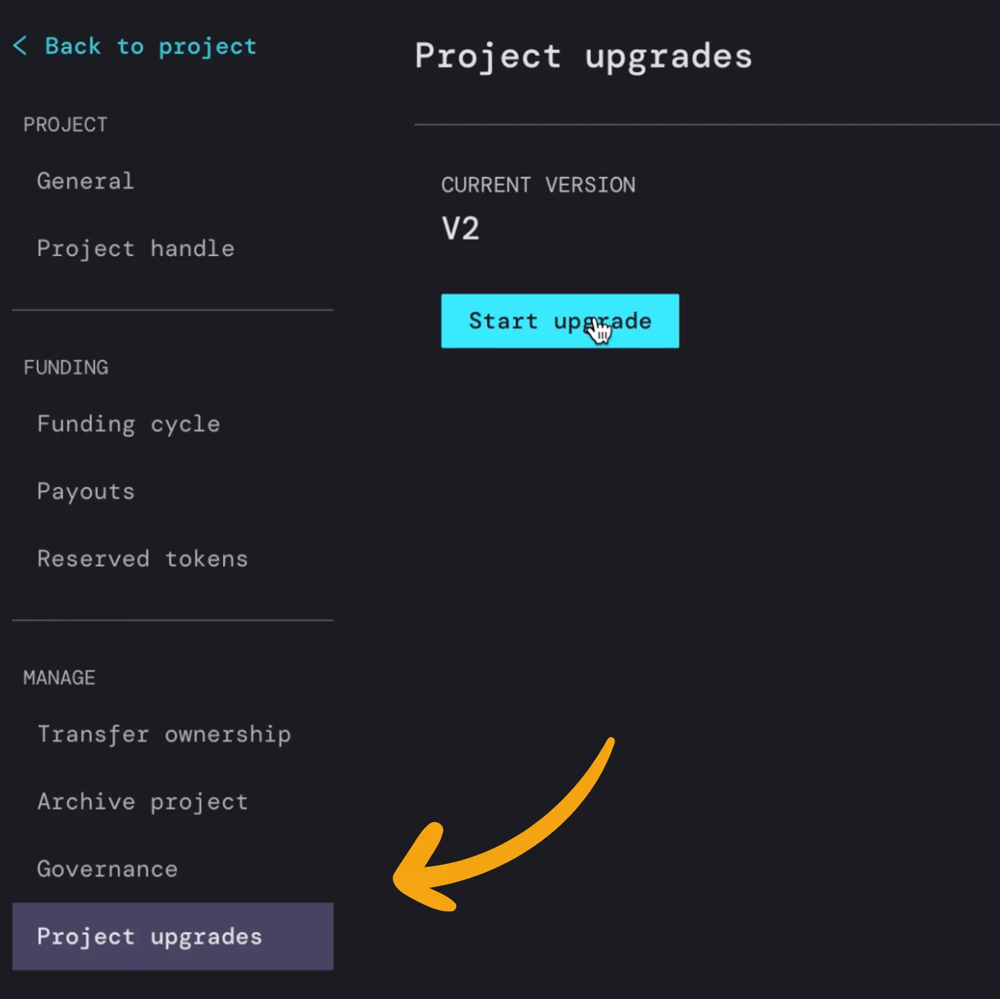

This is where you’ll begin to reconfigure your project settings to launch a V3 funding cycle.

The first thing to set is the`Start time`. You can set this to whatever time you want to relaunch your project on V3. If you want it to start immediately you can just leave it blank. Note that if you have a specific time you want, it will have to be set in a Unix timestamp, which you can easily determine by using this online unix converter [here](https://www.unixtimestamp.com/index.php).

In this example, STVG wanted to launch his V3 funding cycle on December 1st, 2022 at 1:00AM PST. You can enter whatever time you want your project to start here and simply copy and paste the timestamp into the `Start time` on the Juicebox project upgrade page.

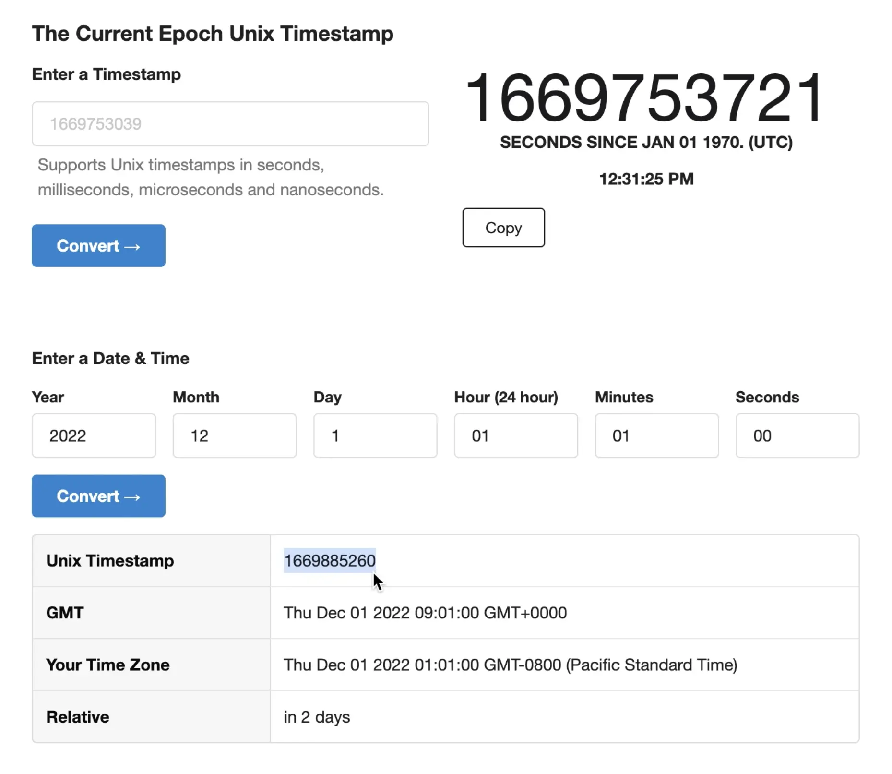

:::tip
Fun fact: Unix time is a date and time system widely used in computing that measures time by the number of seconds that have elapsed since 00:00:00 UTC on 1 January 1970.
:::

When you’re done setting a start time, click `Funding`.

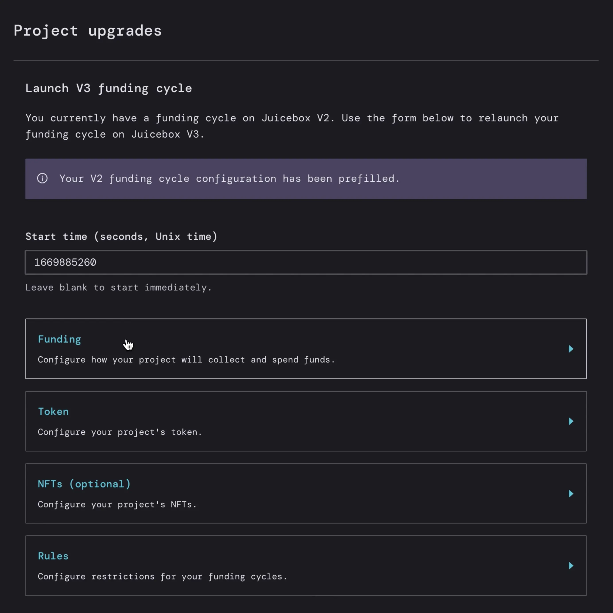

### Step 3: Funding

Here you can set your `Funding Cycles` (how long all the settings on your project are locked for) and `Payouts` (what address(s) the funds in the treasury can be sent to once per funding cycle).

This process is similar to the latest create project flow on Juicebox, where you can have `Automated Funding Cycles` or `Manual Funding Cycles`.  You can keep the same settings from your old contract if you don’t want to change things like the payout address(s) or funding cycles, or you can use this opportunity to update changes to reflect the needs of your project.

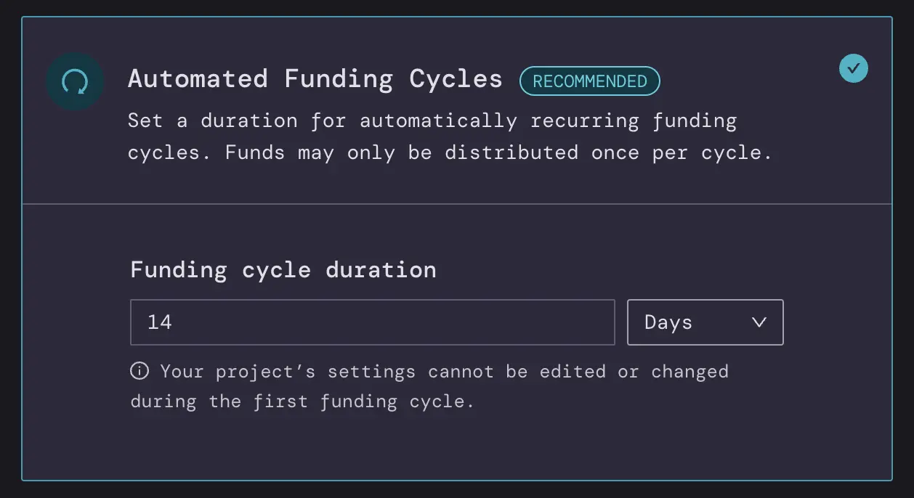

For `Payouts` you can decide if one address is receiving all the funds that get distributed or you could configure it to add other people, for example if you had a second person working on the project you split the payouts 50/50. You can do this either through `Percentages` of `Specific amounts` denominated in ETH or USD. When you’re done making any changes, click `Save funding configuration`, then click `Token`.

### Step 4: Token

This is where you can customize different settings for the tokenomics of your project including:

- `Mint Rate` (number of tokens per 1 ETH minted)
- `Reserved token allocation` (option to set aside a percentage of all tokens that get minted when people contribute ETH to the project)
- `Discount Rate` (option to decrease how many tokens are issued over each funding cycle to incentivize early contributors)
- `Redemption rate` (determine what proportion of treasury assets can be reclaimed by a token holder by redeeming their tokens, AKA incentivize contributors to hold their tokens longer to get a better rate if they decide to burn the tokens in exchange for ETH in the future)

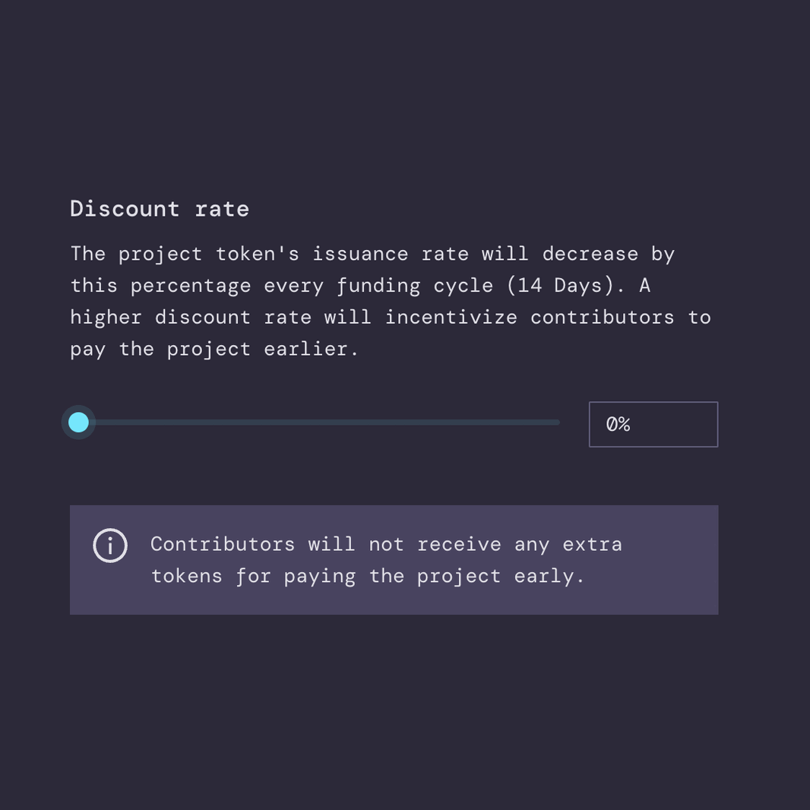

In this example, STVG left most of these settings untouched but added himself to the `Reserved Token Allocation`by clicking `Add Token Allocation`. then adding his ENS address in the field for the `Beneficiary address` and changing the `Percentage allocation` to `100%` and confirming by clicking `Add Token Allocation`.

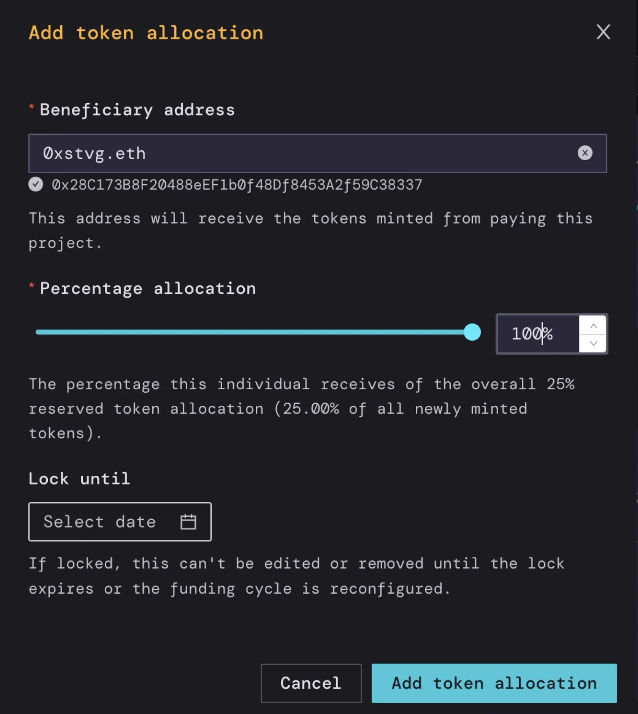

These token settings are turned off by default. If you’re not sure what to do, the `Default Token Settings` will work for most projects. You can always reconfigure these settings in the future, depending on the strategy of your Juicebox project. You can always hop into the Juicebox Discord if you need help! When you’re done, click `Save token configuration`.

### Step 5: NFTs (Optional)

Here you have the option to add NFTs to your Juicebox project so contributors can receive an NFT if they meet your minimum funding criteria. You can add as many NFTs as you want and determine the supply and price of each NFT. Next you’ll add a `Collection Name` and `Collection Symbol`, as well as an optional description of the NFTs.  If you’re not ready, you can always add NFTs later on. You can also check out [this tutorial](https://docs.juicebox.money/blog/2023-01-02-how-to-sell-nfts/) on how to use NFTs. When you’re done, click `Save NFTs`.

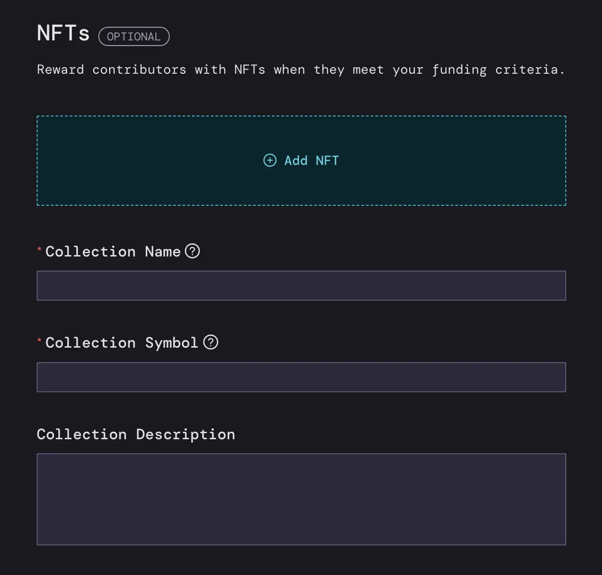

### Step 6: Rules

Last but not least, you'll need to set the rules for your project before deploying.

Make sure to set your `Reconfiguration Rules`, which essentially creates a safety measure of how soon you can reconfigure your Juicebox project settings before they take effect. You can choose the 3-day delay (default) 7-day delay, No delay, or a Custom Strategy.

You can also decide to `Pause Payments`, `Allow Token Minting`, and `Allow Terminal Reconfiguration`. When you’re all done, click `Save Rules`.

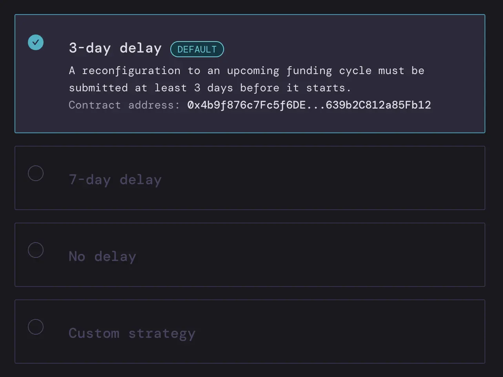

### Step 7: Review and Deploy

Last but not least, you can review a summary of all your new V3 settings before you deploy.

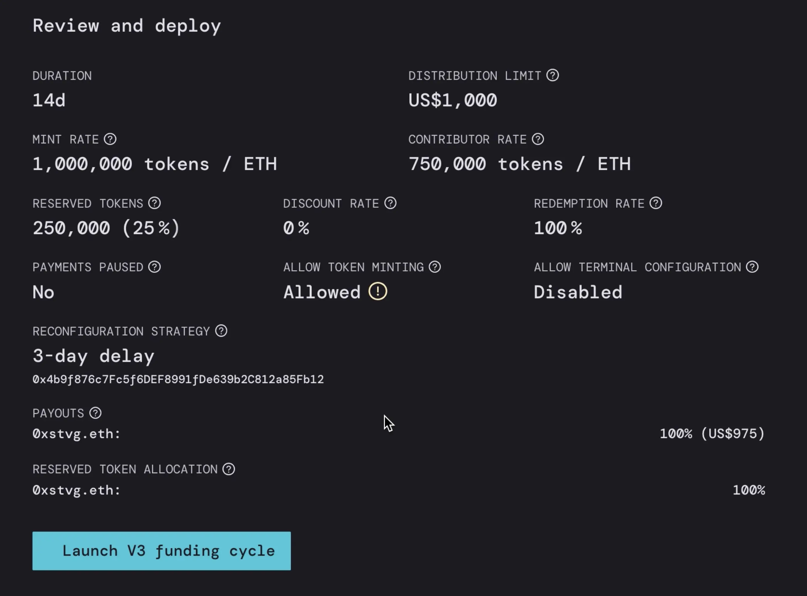

When you’re good to go, click `Launch V3 funding cycle`. This will prompt a transaction in your wallet which you’ll have to confirm and you’re done!

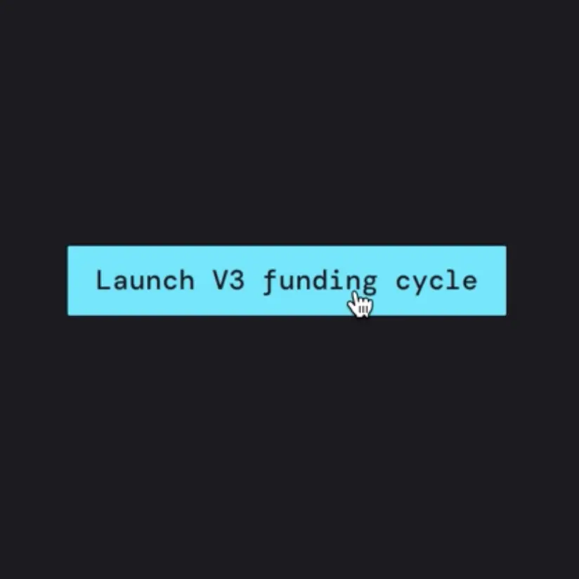

And that’s it! You’ve successfully migrated to V3.

If you need help along the way, jump into the [Support channel](https://discord.com/channels/775859454780244028/864240636277293106) in the Juicebox Discord.

🐦 Follow Juicebox on Twitter: [@JuiceboxETH](https://twitter.com/juiceboxETH)

🚀 [Trending projects on Juicebox](https://juicebox.money/projects)

📚 [Project Creator Docs](https://docs.juicebox.money/user/)

📹 [YouTube Tutorials](https://www.youtube.com/c/JuiceboxDAO)
