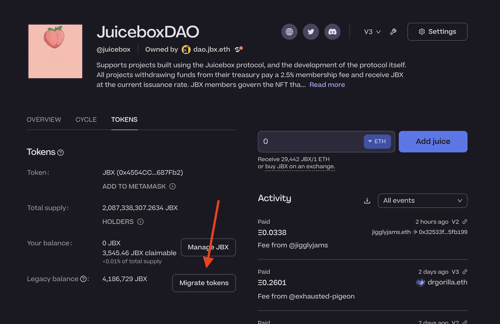
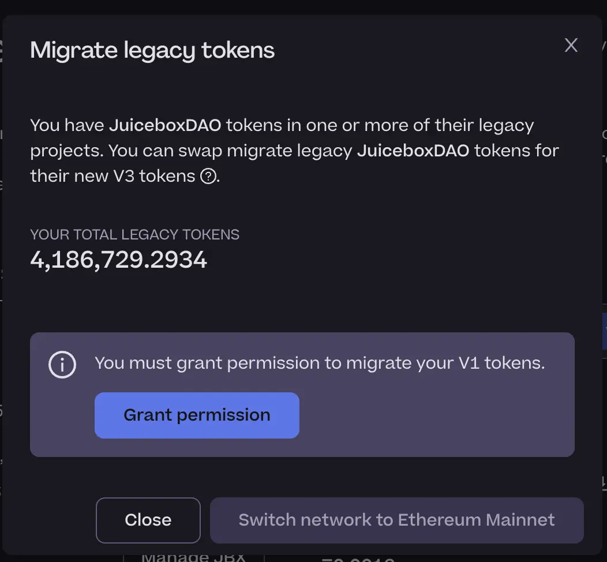
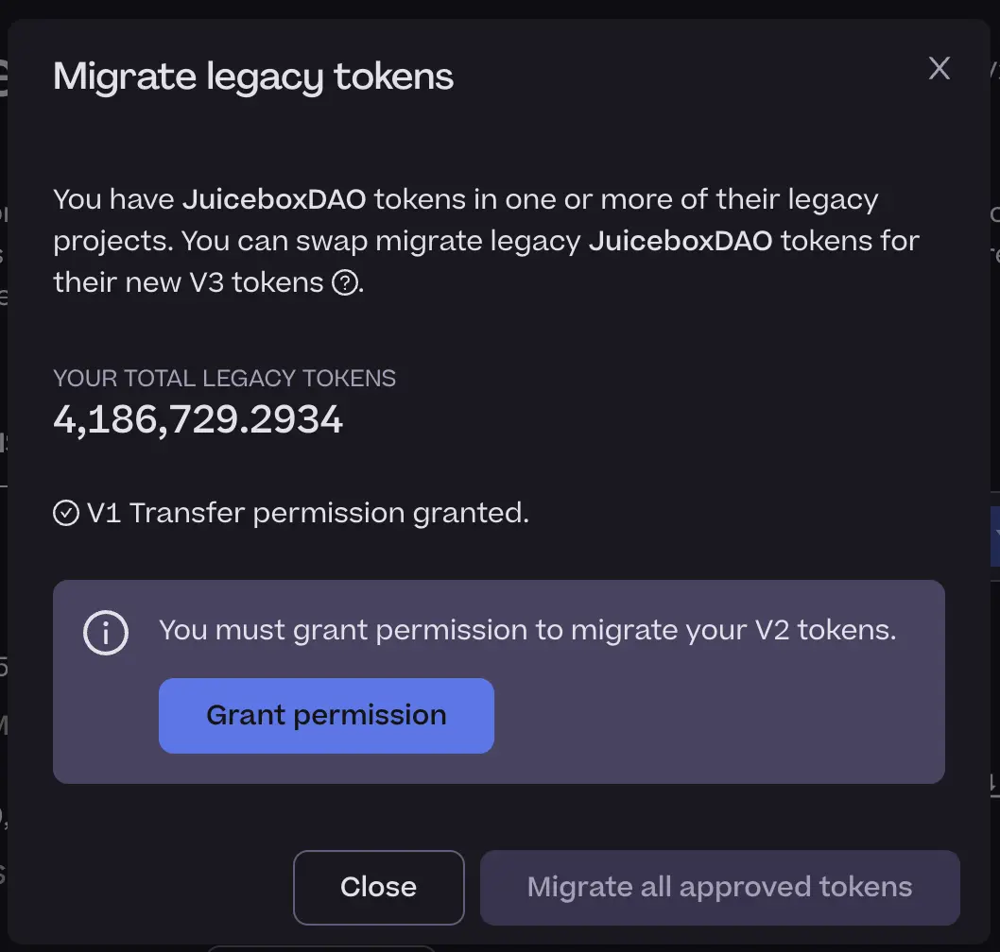
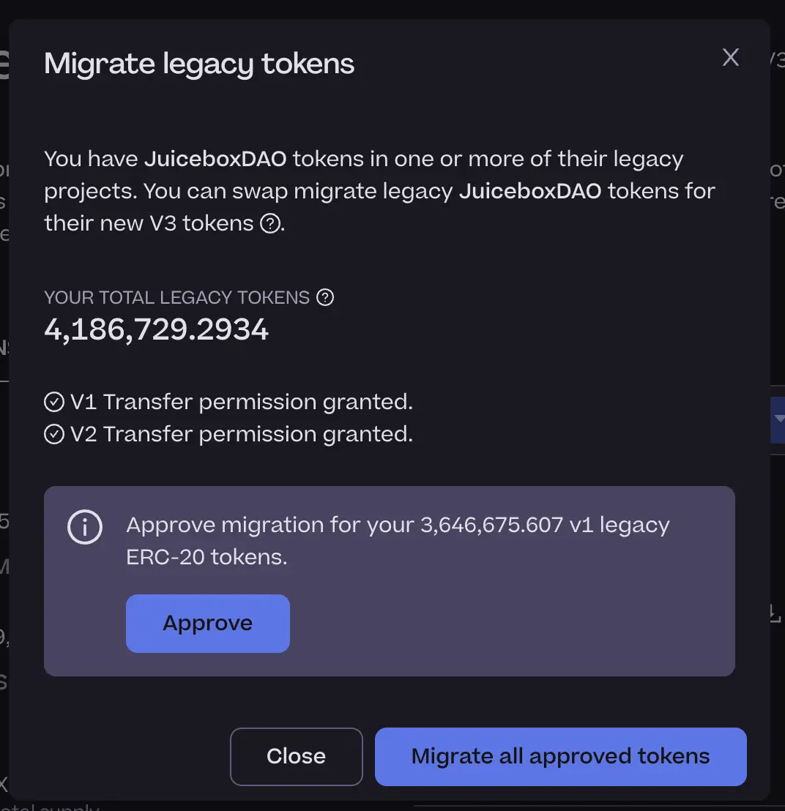
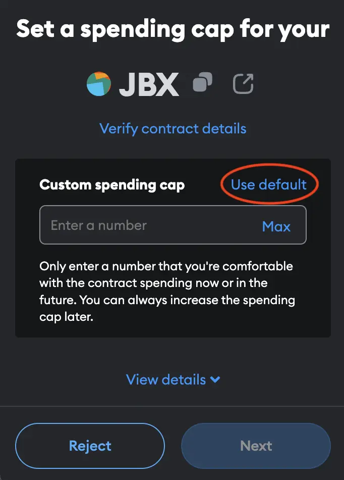
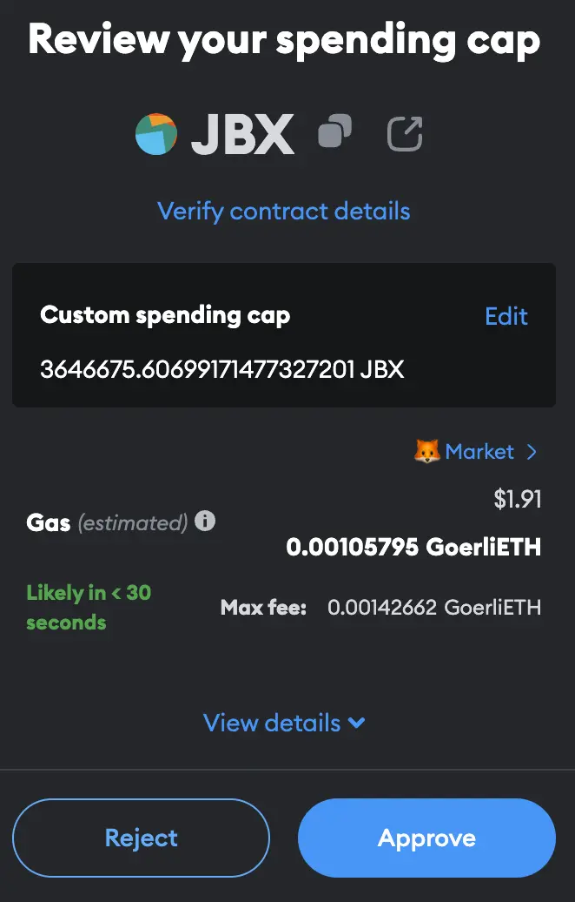
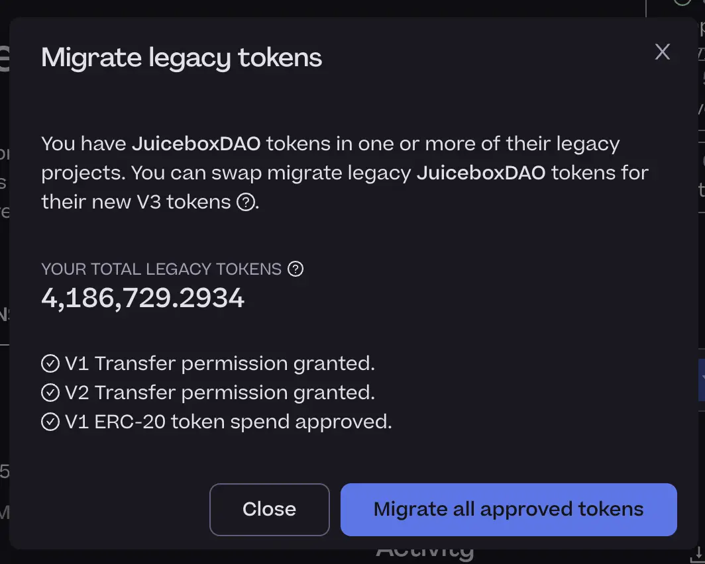

# JBX V3 migration guide

Got JBX? This guide is for you!

Juicebox V3.1 contracts are now live and the V3 JBX token has been deployed to mainnet. If you hold [V1 JBX](https://etherscan.io/token/0x3abf2a4f8452ccc2cf7b4c1e4663147600646f66) or have unclaimed tokens from the Juicebox V2 project, you can now migrate to the [V3 JBX token](https://etherscan.io/token/0x4554CC10898f92D45378b98D6D6c2dD54c687Fb2).

V1 JBX token address: [`0x3abf2a4f8452ccc2cf7b4c1e4663147600646f66`](https://etherscan.io/address/0x3abf2a4f8452ccc2cf7b4c1e4663147600646f66)

V3 JBX token address: [`0x4554CC10898f92D45378b98D6D6c2dD54c687Fb2`](https://etherscan.io/address/0x4554CC10898f92D45378b98D6D6c2dD54c687Fb2)

## Before you start

Here are a couple things to keep in mind before starting:

- The migration process will ask you to submit 3 or 4 transactions
- This process can take 15 minutes or longer
- You can migrate your tokens over time

The following guide assumes the following:

- you have V1 JBX and/or unclaimed Juicebox V2 tokens
- you use Metamask as your browser wallet

Your steps may vary depending on your situation. If you have questions, please visit the Support channel in [Juicebox Discord](https://discord.gg/juicebox).

## Step 1: Navigate to the JuiceboxDAO project

Connect your wallet and navigate to the JuiceboxDAO project: [https://juicebox.money/@juicebox](https://juicebox.money/@juicebox).

## Step 2: Tokens tab

Select the **Tokens** tab and refer to the **Legacy tokens** section. If you have JBX from JuiceboxDAO's V1 or V2 project, you should have legacy tokens. Click `Migrate tokens`.

## Step 3: Grant permission for V1 tokens

Click `Grant permission` for your V1 JBX and confirm the transaction in your browser wallet.

This transaction grants the V3 JBX contract permission to transfer your JBX on your behalf. If you have V1 JBX, this step is required for migration.

## Step 4: Grant permission for V2 tokens

Click `Grant permission` for your V2 JBX and confirm the transaction in your browser wallet.

This transaction grants the V3 JBX contract permission to transfer your Juicebox V2 tokens on your behalf. If you have Juicebox V2 tokens, this step is required for migration.

## Step 5: Approve migration and set spending cap

This transaction approves the V3 JBX contract to spend your V1 JBX on your behalf. If you have V1 JBX, this step is required for migration.

Click `Approve` and in Metamask select **Use Default**. This will approve the spend of your total claimed V1 JBX balance.

Click **Next** to proceed and then **Approve** to confirm the transaction.

## Step 6: Migrate all approved tokens

Click `Migrate all approved tokens` and confirm the transaction in your browser wallet.

This transaction migrates all approved V1 JBX and unclaimed Juicebox V2 tokens to JBX V3.

## Step 7: Success!

Refresh the page and revisit the **Tokens** tab. Be sure to verify the following:

- **Your balance**: should be greater than zero
- **Legacy balance**: should be zero

That's it! If you have questions, please visit the Support channel in [Juicebox Discord](https://discord.gg/juicebox).
