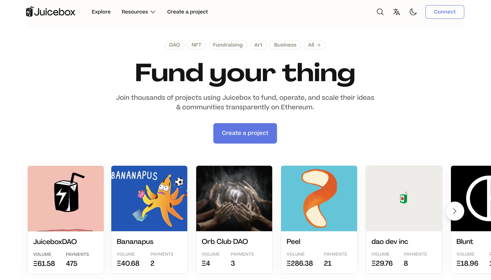
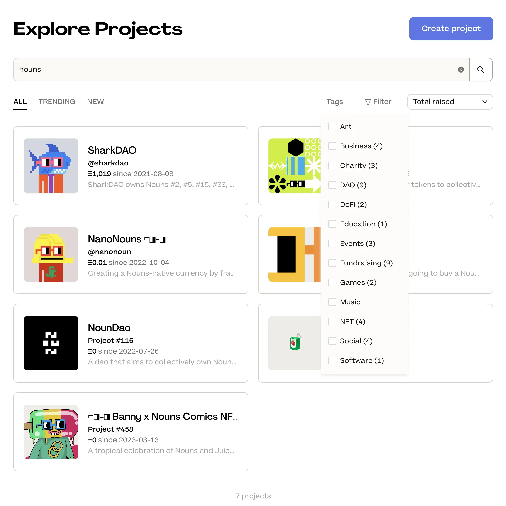
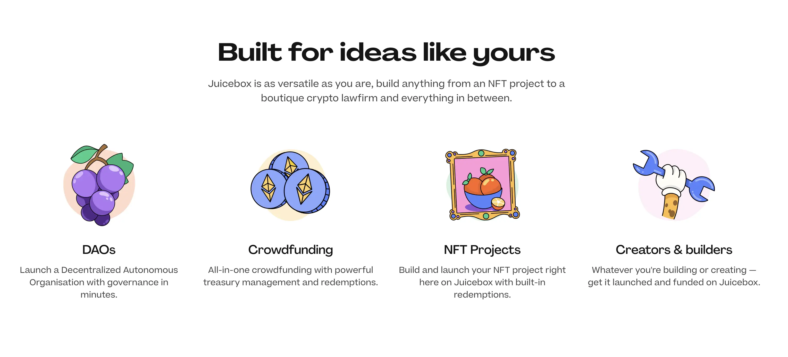
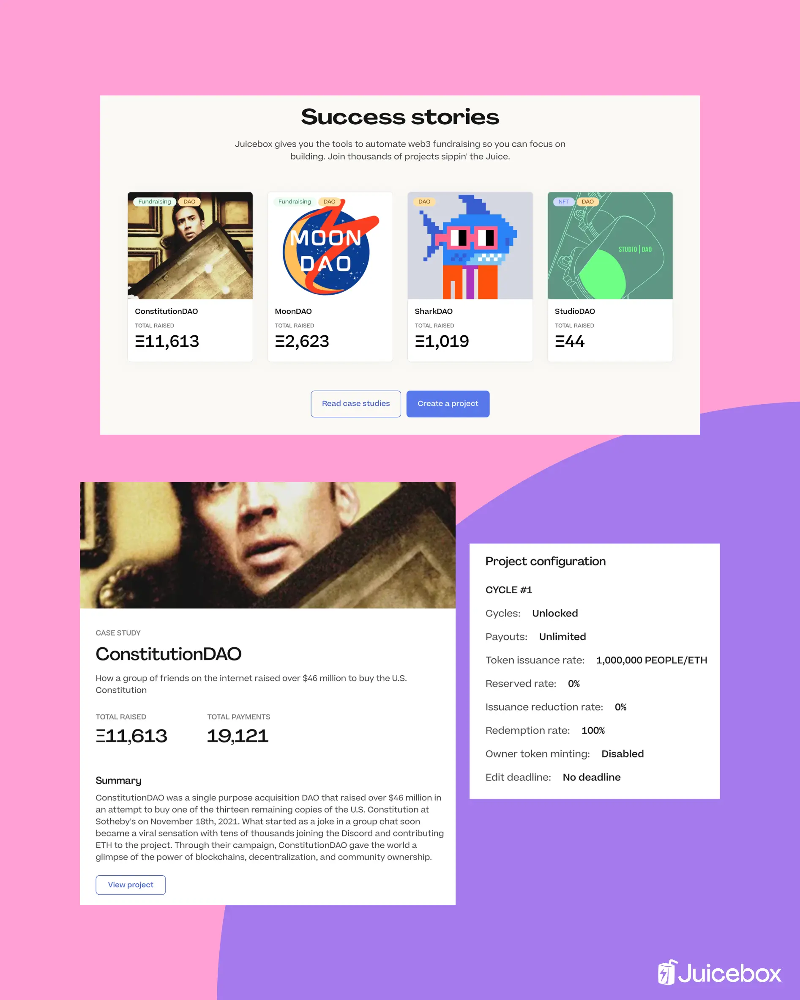
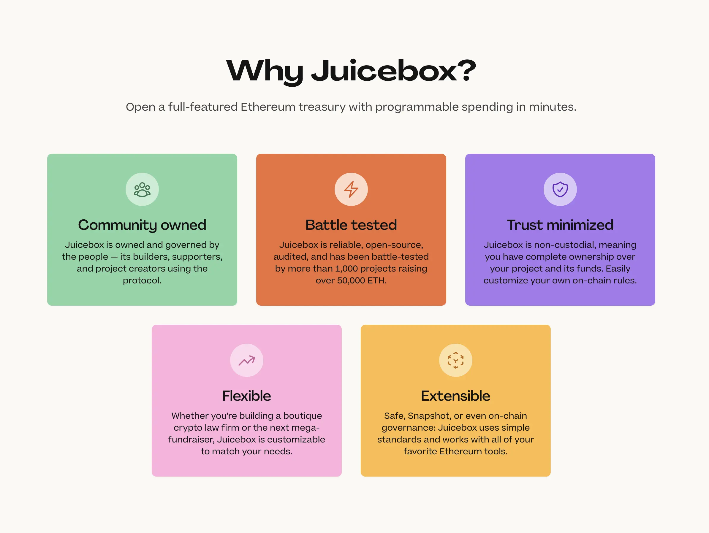
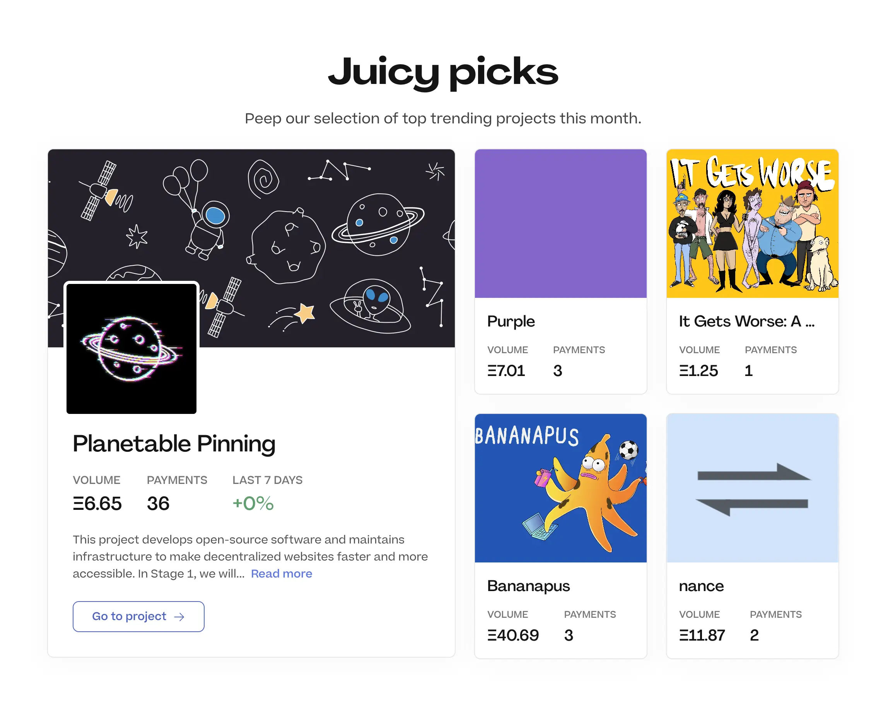
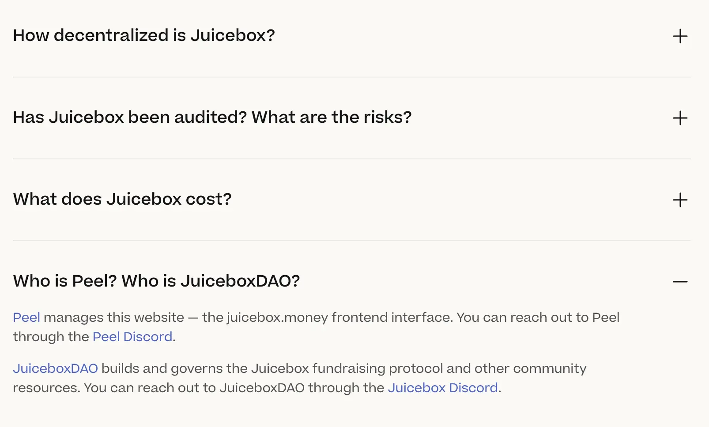
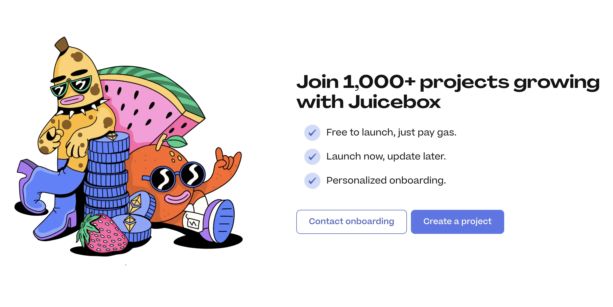
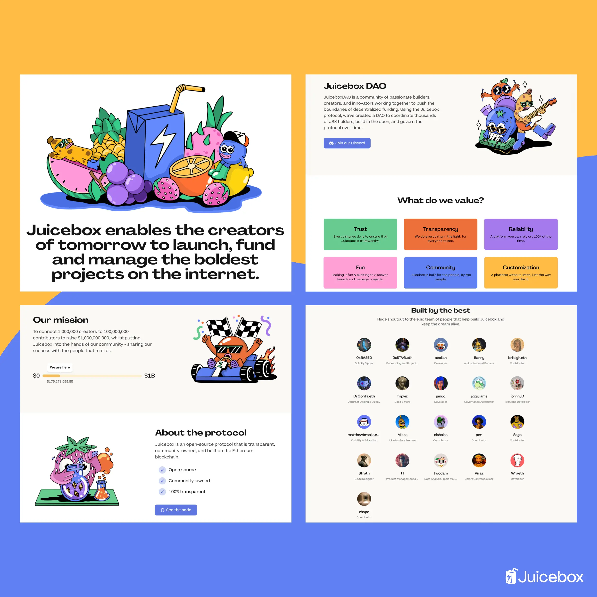
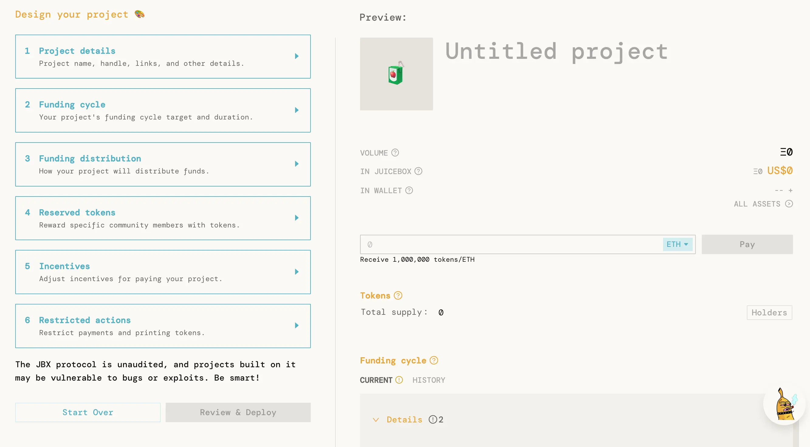

***New website just dropped for the Juicebox Protocol***

After countless workshops, discussions, and pull requests, the website for [juicebox.money](http://juicebox.money) is now live featuring the new homepage, About page, and Success Stories, as well as some exciting new features like improved search and project tags. The new website was made possible by [PeelDAO](https://juicebox.money/@peel), the front end team building and maintaining juicebox.money, and [WAGMI Studios](https://juicebox.money/@wagmi-studios), whose juicy artwork is featured throughout.

You can follow along in the video below or in this article.

<iframe width="560" height="315" src="https://www.youtube.com/embed/1IlGgVO07tg?start=1" title="YouTube video player" frameborder="0" allow="accelerometer; autoplay; clipboard-write; encrypted-media; gyroscope; picture-in-picture; web-share" allowfullscreen></iframe>

### The Homepage

Let’s get started with the homepage. At the top we’ve got a call-to-action: create a project and *Fund your thing*. And right below you can see a few trending projects built on Juicebox, so you can browse what creators are building and find some projects that align with your values and interests.

Hero: Fund your thing, trending projects

You’ll also notice some categories at the top like DAO, NFT, and Fundraising. Those are a new feature: **Project Tags**! So for example, if you click on DAO you’ll be able to find projects that have added that tag. You can also use tags to filter your searches. Keep in mind that this is a new feature and not too many projects have added tags yet. Give it a try next time you’re browsing projects.

### Explore Projects

Once you’re on the Explore page, you’ll also notice that search has been completely revamped so it’s now way easier to find specific projects or browse to find new ones. Looking for projects by [Krause House](https://juicebox.money/v2/p/436)? Try searching terms like “NBA”. If you’re feeling nounish you can search “nouns” and find projects in the Nouns ecosystem like [SharkDAO](https://juicebox.money/p/sharkdao).

Explore page

### Mental Models for Juicebox

So going back to the homepage, you’ll see a few examples of the different types of projects that you can build with Juicebox. Whether you’re starting a DAO, crowdfunding for a cause, launching an NFT project, or building something else, you can manage the funds transparently with your community.

Mental models for Juicebox

### Introducing Success Stories

If you’d like to know more about past projects that have been successful, we’ve created a new Success Stories section which tells the story behind projects like [ConstitutionDAO](https://juicebox.money/success-stories/constitutiondao), [MoonDAO](https://juicebox.money/success-stories/moondao), [SharkDAO](https://juicebox.money/success-stories/sharkdao), and [StudioDAO](https://juicebox.money/success-stories/studiodao). Each case study will tell you how the project got started, how they set-up their project on Juicebox, and how they found success.

Success Stories

### How, What, and Why you should Juicebox

Back to the homepage, next we have a quick summary of how Juicebox works, including setting up your project with rules to build trust, managing your treasury onchain, and building your community with token and NFT issuance. You can also find a link to the docs if you want to learn more. Next we have a section highlighting some of Juicebox’s core strengths. Juicebox is:

- Community owned
- Reliable and transparent
- Trust minimized
- Flexible
- Extensible

### What is Juicy Picks?

After that we have the Juicy Picks section, which is a new section of curated projects on Juicebox that really stand out from the crowd. These projects will rotate on a monthly basis and will be chosen by the Juicebox community. Below this section you’ll find a number of categories you choose to find a project that’s right for you.

Juicy Picks for May 2023

### New FAQ

If you still have some questions, make sure to check out the FAQ section near the bottom of the homepage.

### How to get in touch

Last but not least, you’ll see a button at the bottom to contact onboarding. So if you’d like more personalized assistance while setting up your project, reach out via the contact form or join the [Discord](https://www.notion.so/Discord-Announcement-Website-updates-f7472301395645c38ac7bdbb7b6df30f).

Shoutout to [Sage Kellyn](https://twitter.com/SageKellyn) from [WAGMI Studios](https://juicebox.money/@wagmi-studios) for the amazing art and illustrations throughout the website. Juicebox really wouldn’t be the same without it.

New hero illustration for juicebox.money by Sage Kellyn

Banny, along with a fruity assortment of new characters have been reimagined to embrace Juicebox’s new brand identity. Paired with a slick sans serif Agrandir, a font that “celebrates the beauty of being imperfect,” the Juicebox brand update keeps the protocol fresh while acknowledging its punk origins.

### New About Page

Under Resources in the top navigation bar you’ll find a new About page for Juicebox. Here you can read about our mission statement, goals, learn about about the protocol and Juicebox DAO, the contributors at Juicebox, as well as our values.

Sections of the new About page on juicebox.money

The Juicebox protocol has grown a lot since its launch in July 2021. From contract versioning and audits to feature developments like tiered NFTs, to metaverse concerts at the Juice Lounge, countless members of Juicebox DAO have shaped what it is today through its active governance. Juicebox doesn’t drink from the kool-aid, it leverages the power of collective action through its community to help passionate creators and builders successfully launch and scale projects, openly on the Ethereum blockchain.

Screenshot of old version of juicebox.money

What are you waiting for, anon? Come explore the world of community-owned DAOs, fundraisers, non-profits, and other projects running on Juicebox today.

🐦 Follow Juicebox on Twitter: [@JuiceboxETH](https://twitter.com/juiceboxETH)

💬 [Join the Juicebox Discord](https://www.notion.so/Discord-Announcement-Website-updates-f7472301395645c38ac7bdbb7b6df30f)

🚀 [Trending projects on Juicebox](https://juicebox.money/projects)

📚 [Project Creator Docs](https://docs.juicebox.money/user/)

📹 [YouTube Tutorials](https://www.youtube.com/c/JuiceboxDAO)
