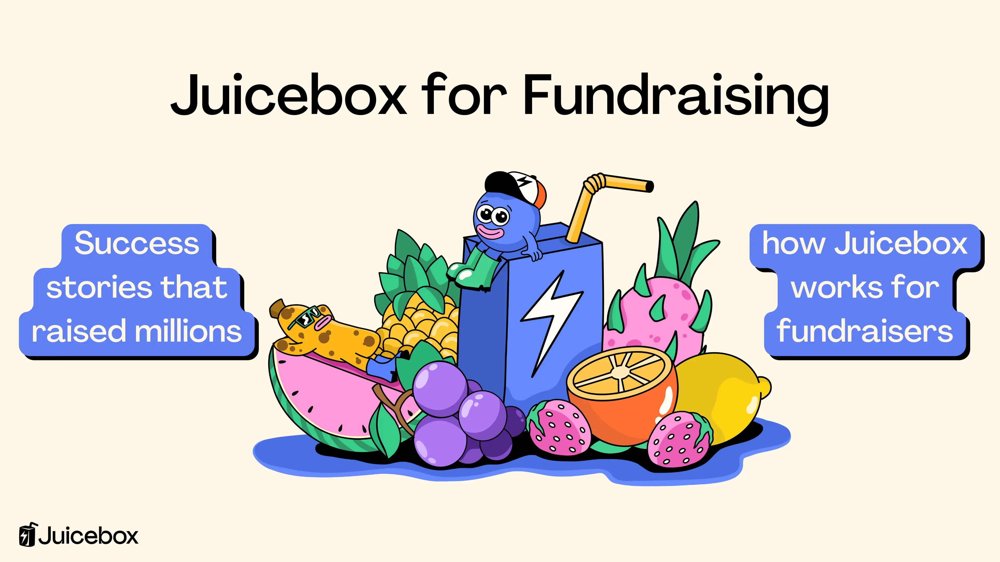
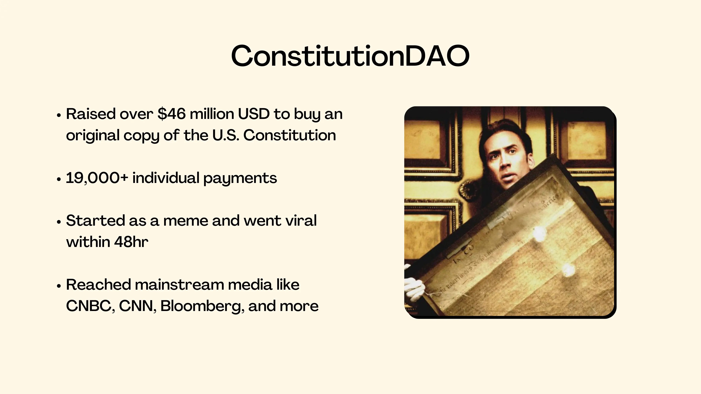
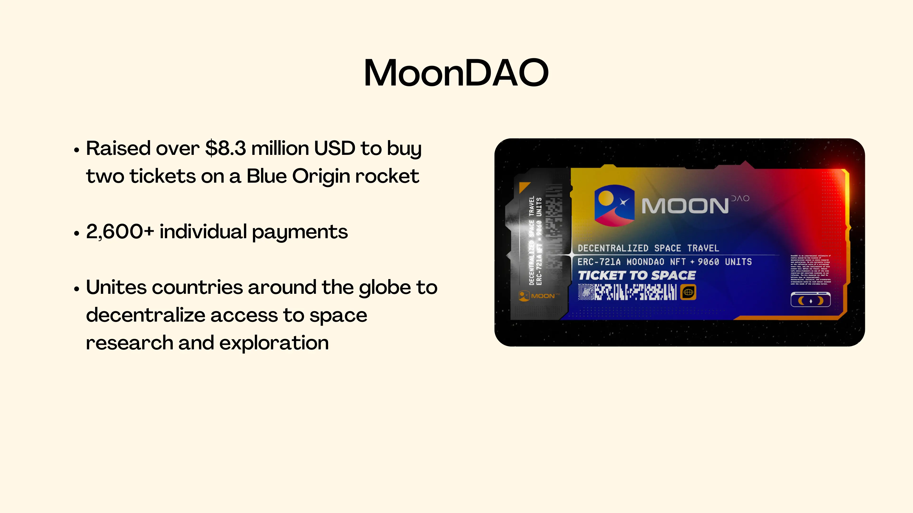
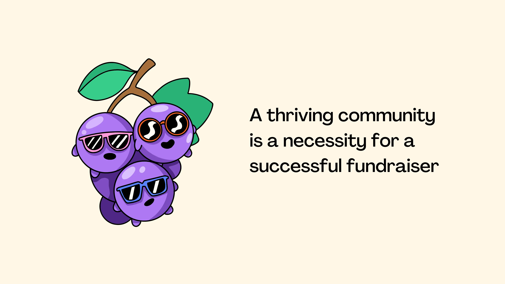
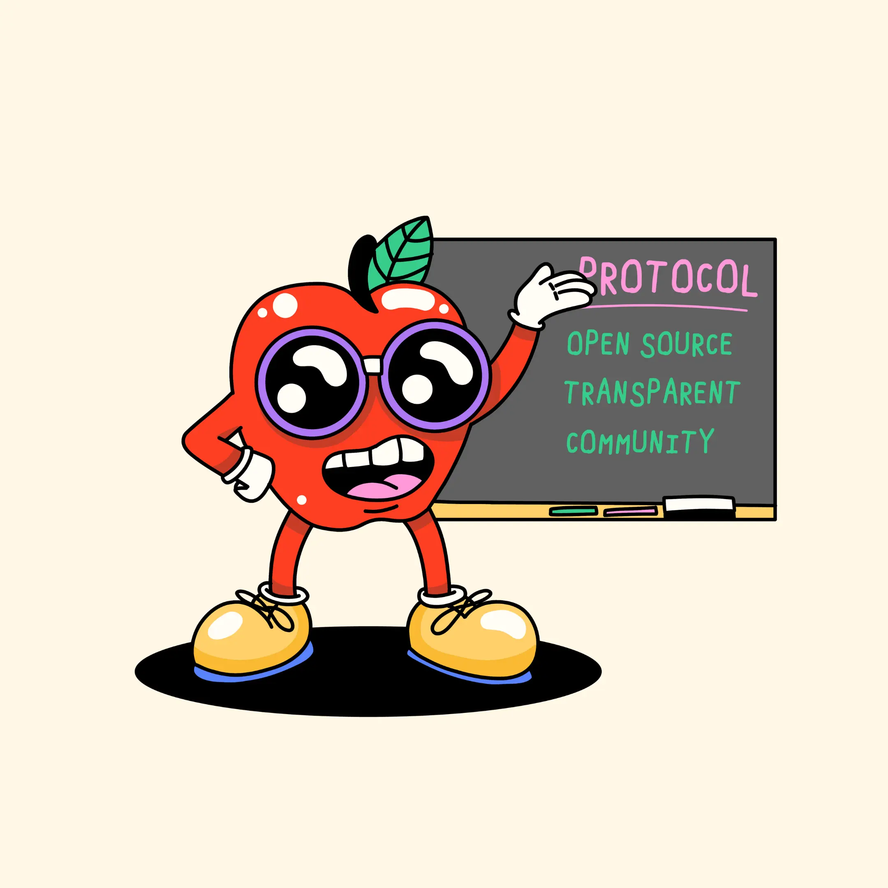

# Juicebox for Fundraising: crypto crowdfunding campaigns that raised millions & how Juicebox works

Since the launch of the Juicebox Protocol, crypto crowdfunding has emerged as a transformative force, redefining the traditional fundraising paradigm.

With its ability to connect projects directly with a global network of anons and bypass the limitations of traditional financial systems, crypto crowdfunding has a huge potential for the next generation of projects seeking new models of funding. Over the last couple years, this has been arguably the most popular way to use Juicebox. This article will dive into success stories of past projects on the protocol that launched successful crowdfunding campaigns on Juicebox.

You can follow along in this article, or a video by Matthew on the JBDAO YouTube:

<iframe width="560" height="315" src="https://www.youtube.com/embed/LvmWu895s6g" title="YouTube video player" frameborder="0" allow="accelerometer; autoplay; clipboard-write; encrypted-media; gyroscope; picture-in-picture; web-share" allowfullscreen></iframe>

### Example 1: ConstitutionDAO

In November 2021, ConstitutionDAO raised over $46 million in ETH to purchase an original copy of the U.S. Constitution on auction at Sotheby’s. The whole project started out as a meme on Twitter when the auction was announced with friends joking, “what if we put our money together and bought the Constitution???” A week later, the campaign managed to raise 11,600 ETH with over 19 thousand individual payments.

### Example 2: MoonDAO

In late 2021, MoonDAO rallied a community of space enthusiasts and raised $8.3 million to send a DAO member to space on a Blue Origin rocket. Their ambitious long-term roadmap goals include building a settlement on the Moon by 2030. Raising over 2600 ETH with 2600 individual payments, their unique mission demonstrates that setting ambitious and even outlandish goals can pay off when they resonate with your audience.

### Tips

In both of these examples, it all started with a meme-worthy idea that went viral. There’s definitely something to learn here: a thriving community is a necessity for a successful fundraiser. ConstitutionDAO leveraged Nicholas Cage from National Treasure as a meme and managed to get thousands to join their Discord within 48 hours. But in most cases, you’ll need to have an audience established before starting your campaign.

### How Juicebox works for fundraising

So, how does Juicebox work for fundraising? You can create a project on [juicebox.money](http://juicebox.money), put rules in place to build trust with potential supporters, and set-up payouts so that your community knows where funds will go. You can also issue fungible tokens or NFTs which can be used for governance, token-gated perks, or refunds if you need. You can also use NFTs to create pledge rewards if people meet a minimum funding criteria.

### A crowdfunding campaign on Juicebox might look something like this:

- supporters put ETH into your project and receive tokens in return
- ETH in the project can be paid out and put toward the goal of the campaign
- if the campaign goal isn’t met, refunds can be enabled via redemptions so supporters can burn tokens for ETH remaining in the project

### Conclusion

Crowdfunding on Juicebox means crowdfunding transparently and out in the open, so supporters can see where funds will go and what guardrails are in place to prevent scams. Rules like Payout limits and Cycles are hard-coded into smart contracts, so you don’t need to trust the project creator because it’s onchain. There are still risks though, so please do your own research before contributing to a project.

### Resources

If you have any questions about using Juicebox, come join the discord at [discord.gg/juicebox](http://discord.gg/juicebox) or book an onboarding session at [juicebox.money/contact](http://juicebox.money/contact).

🐦 Follow Juicebox on Twitter: [@JuiceboxETH](https://twitter.com/juiceboxETH)

🚀 [Trending projects on Juicebox](https://juicebox.money/projects)

📚 [Project Creator Docs](https://docs.juicebox.money/user/)

📹 [YouTube Tutorials](https://www.youtube.com/c/JuiceboxDAO)
