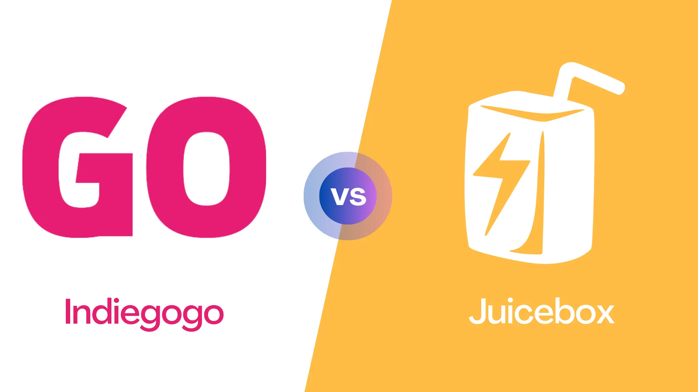
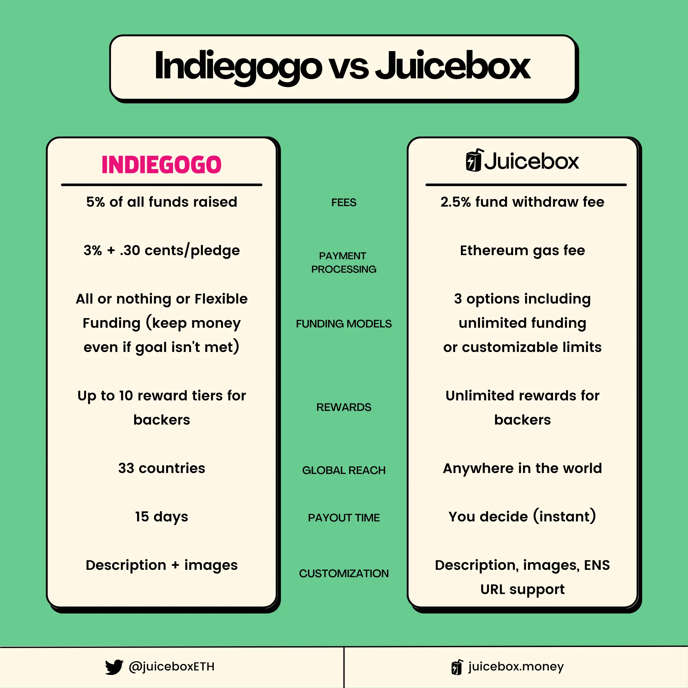
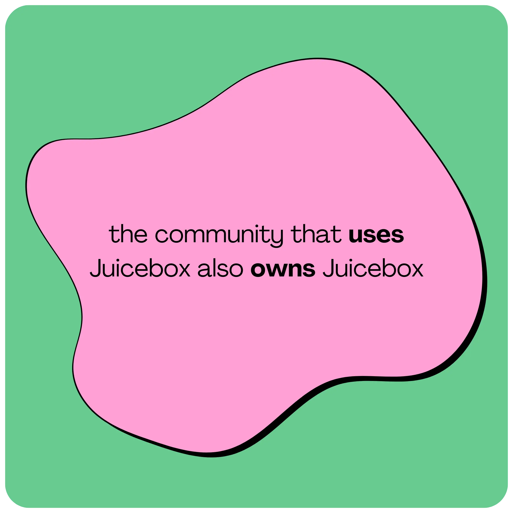
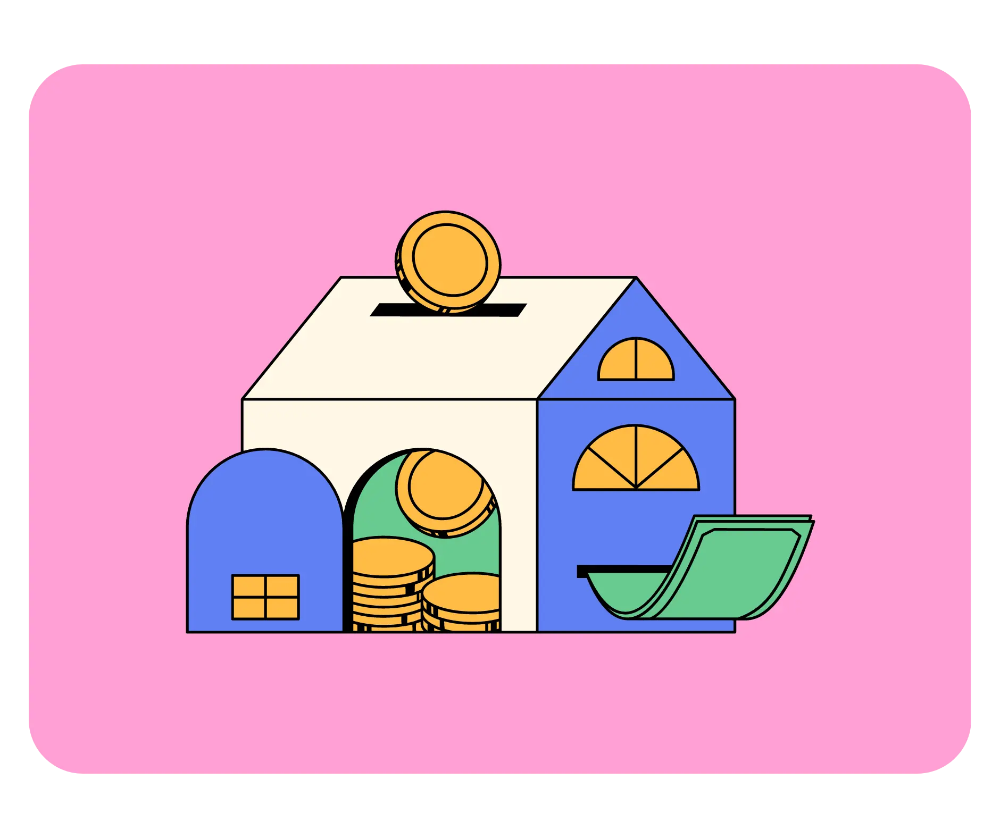
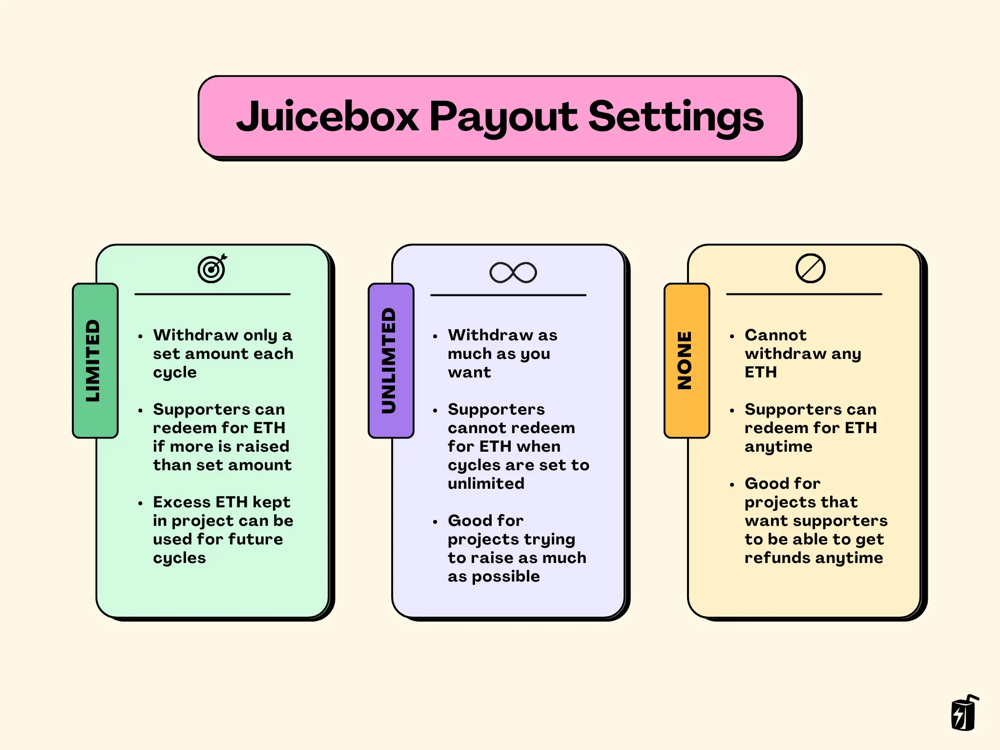
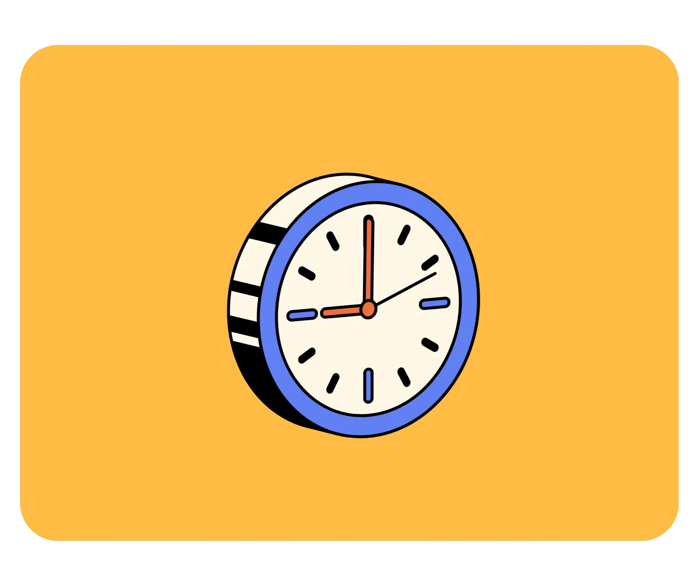
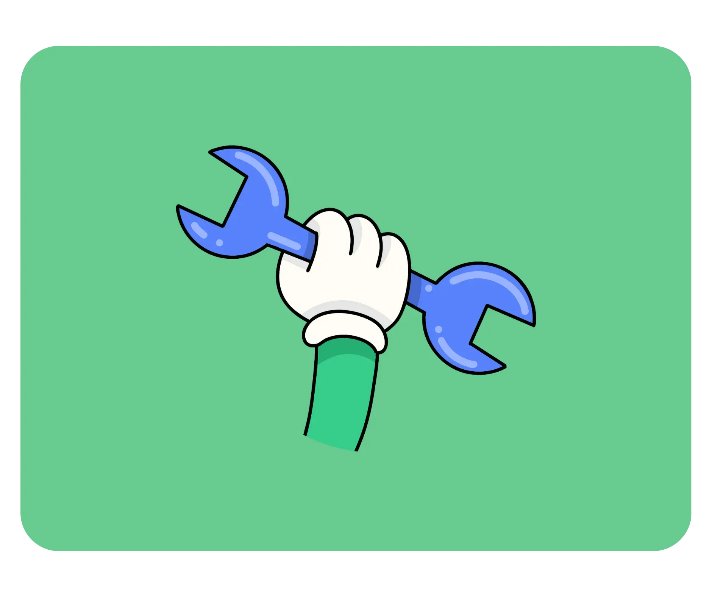

When it comes to crowdfunding, new tools to fundraise pop up every year. Indiegogo is one of the more recognized tools for creators and entrepreneurs, but did you know that Juicebox is one of the leading crypto crowdfunding tools, raising over 50,000 ETH in volume?

In this article, we’ll cover the main differences between crypto crowdfunding on Juicebox and Indiegogo as a traditional fundrasing platform. We’re going to look at the advantages and disadvantages in terms of fees, funding models, rewards, global reach, payout time, and customization. And even though we’re comparing Juicebox to Indiegogo, it’s not one or the other: the best option for most campaigns is to *also* launch on Juicebox so that you can accept payments in ETH.

You can follow along in this blog post, or check out this video on the [JBDAO YouTube](https://www.youtube.com/@JuiceboxDAO) which covers the differences between [Kickstarter vs Indiegogo vs Juicbeox](https://www.youtube.com/watch?v=XDhaGvKFDNQ).

<iframe width="560" height="315" src="https://www.youtube.com/embed/XDhaGvKFDNQ" title="YouTube video player" frameborder="0" allow="accelerometer; autoplay; clipboard-write; encrypted-media; gyroscope; picture-in-picture; web-share" allowfullscreen></iframe>

:::tip
Looking to compare Juicebox to GoFundMe? You can read [this article](https://docs.juicebox.money/blog/gofundme-vs-juicebox/) on the Juicebox blog to learn the differences.
:::

### Platform Fees

So, let’s start with platform fees. It’s free to start a campaign but Indiegogo charges a platform fee of 5% of all funds raised. And if you launch a campaign using Indiegogo’s InDemand program after launching your project elsewhere, like Kickstarter, they also charge an 8% fee of all funds raised.

Juicebox works differently and charges a 2.5% fee anytime funds are withdrawn from a project. And although creating a project on [juicebox.money](http://juicebox.money) is free, you should keep in mind that Juicebox runs on Ethereum mainnet so there are transaction fees that could cost $100 or more when launching a project. This will change down the road as Juicebox is made available on Layer-2 chains like Arbitrum and Polygon.

Because Juicebox is community-owned, you’ll receive $JBX tokens in return for any fees paid which will allow you to get involved with JuiceboxDAO governance and help make decisions about Juicebox’s future. In other words, the community that *uses* Juicebox also *owns* Juicebox… which is something that traditional crowdfunding platforms lack.

### Payment Processing Fees

Now on top of the platform fees, Indiegogo also charges **processing fees** for each payment that comes in. For Indiegogo, processing fees are 3% plus .30 cents per pledge. Keep in mind that these rates will vary from 3-5% depending on your country.

Again, Juicebox works a bit differently and doesn’t charge any processing fees for incoming payments. That said, since it is built on Ethereum, supporters will need to pay a transaction fee (also known as “gas”) when paying your project which could cost $20 or more depending on network congestion. To be clear, this is an Ethereum network fee and does not benefit Juicebox in any way.

### Funding Models

Next, let’s talk about funding models.

Indiegogo offers 2 options for campaigns; “all or nothing” and “flexible funding.” In all or nothing, a project sets a specific fundraising target and if it reaches that goal it gets to keep all of the money… however, if it doesn’t, then all of the money gets returned to backers. “Flexible funding” is the second option, which lets the project owner keep all the funds raised even if they don’t meet their goal.

With Juicebox, project settings are locked for a period of time that you decide: this is called a `Cycle`. This could be 3 days, 14 days, 1 month, whatever you set it to be. If you want your fundraiser to last 8 weeks, you could set your cycle to 8 weeks and decide on Payouts which are like your fundraising goal. Juicebox lets you set Payouts in three ways:

**Option 1: Limited**

The first option is Limited which lets you withdraw only a set amount each cycle. This gives a 100% guarantee to backers that you can’t withdraw more than that fixed limit. So if you set-up a Limited Payout of 2 ETH and you end up raising 3 ETH, you can only withdraw 2 ETH for that cycle. The remaining 1 ETH could be redeemed by backers by burning their tokens for ETH, but if nobody redeems then the surplus ETH will stay in the project and can be used for future cycles. You can think of Limited Payouts as an anti-scam mechanism for backers because the project owner can’t just disappear with all of the funds: you know how much they can withdraw each Cycle. Limited Payouts are a great option for campaigns that want to grow with their backers: you can set new goals as you reach new milestones, while giving your supporters full transparency along the way.

**Option 2: Unlimited**

The second option is Unlimited, which lets you withdraw as much ETH as you raise with no fixed limit. With Payouts set to Unlimited, backers cannot get money back during that cycle. This can be changed by setting Payouts to None in a future cycle which gives backers the option to get refunds by redeeming their tokens. Unlimited Payouts are a great option for fundraisers that don’t have a set goal and want to raise as much money as possible, but this can also present some risk to potential supporters.

**Option 3: None**

The last option is “None” which means that none of your project's ETH can be withdrawn in that cycle. All ETH will stay in your project which gives backers the freedom to redeem their tokens for ETH and get their money back at any time. This can be changed in a future cycle if you want to withdraw the funds. Setting Payouts to None is useful for campaigns that want to give backers the option to get a refund whenever they want.

Overview of Payout Settings on Juicebox

Unlike Indiegogo, projects on Juicebox can adapt over time so you can change your Payout limits and Cycles as the needs of the project evolve. For example, maybe your first cycle is 60 days long with a limit of 50 ETH for your initial fundraise to cover manufacturing costs, whereas your second cycle is 120 days long with a limit of 20 ETH to go towards marketing. Instead of being locked into a fixed campaign length of 60 days or less, you can fundraise long-term on Juicebox and edit your project settings over time. You can also put your project on Pause and stop accepting payments, if you need.

### Rewards

Moving on, the next category we’ll look at is Rewards, so if backers meet a certain funding criteria they can receive perks. Crowdfunding campaigns that use rewards often have a higher success rate than those without because they create incentives for a variety of backers to support your project at different price points.

Indiegogo’s rewards allow backers to contribute multiple times (up to $50,000 in a single transaction) to a project to receive multiple rewards. Projects on Indiegogo can only list up to 10 reward tiers.

On Juicebox, you can offer as many reward tiers as you’d like using NFTs. These NFT rewards can be listed at any price and can be represented by an image, GIF, or video. You can choose to set a limited or unlimited supply for each tier, so for example, you can make higher tiers more exclusive with only 10 available vs. more accessible lower tiers with up to 100 available. Supporters can contribute as many times as they’d like, with no contribution limit, and can receive multiple rewards if they choose.

Juicebox also offers advanced tokenomics features which allow you set aside tokens for members of your team and create incentives for backers to support your project early and stay engaged long-term. If you’d like to learn more about tokenomics for Juicebox projects, check out [Part 1](https://www.youtube.com/watch?v=edPZOxTLaYA) and [Part 2](https://www.youtube.com/watch?v=wFl0E9pqZfk) of our tokenomics tutorial.

### Global Reach

The next category we’ll talk about is global reach. Indiegogo used to support 225 countries when they first launched but have since cut down to 33 countries.

On Juicebox, it doesn’t matter where you’re from, you can launch a project from anywhere in the world and backers from around the globe can support your project. Anyone can launch a campaign on Juicebox, whether they’re an individual, a non-profit, a company, a DAO, or any other organization.

As long as you have an internet connection, you can use [juicebox.money](http://juicebox.money).

### Payout time

The next category we’ll look at is payout time.

On Indiegogo, once you reach your crowdfunding target, you have to wait *15 days* before you can receive the funds from Indiegogo.

On Juicebox, you can send payouts from your project anytime during the cycle, within the limits that you set when creating your project. For example, if your project has 14-day cycles and Limited Payouts of 10 ETH, then you can withdraw funds at any point in that 14-day cycle up to the limit of 10 ETH. You could do this all in one transaction or several smaller transactions along the way. And if you have Unlimited Payouts set instead, you can withdraw at any time during the cycle with no limit.

### **Customization**

The last category that we’ll cover is customization.

Indiegogo lets you choose your project title, add a description, images, and videos from YouTube or Vimeo.

On Juicebox you can set a display picture, banner image, add a description, and customize your project URL with an ENS handle. Adding images and videos to your project description isn’t supported on [juicebox.money](http://juicebox.money) but the frontend team at Peel is releasing a brand new project page within the next month. Stay tuned for a fresh new design and new features like the ability to add images, text with markdown formatting, and post updates as your project develops.

### Conclusion - what makes Juicebox unique

What makes Juicebox stand out from traditional crowdfunding platforms is its flexibility when it comes to how you want to run your campaign. You can launch your project and get support from anywhere in the world, set new goals for your campaign as it grows, use tokens to build community & offer perks and incentives for supporters, and stand out in a marketplace that’s not oversaturated. Best of all, this all happens transparently and out in the open with clear rules in place: you can see how much money can be withdrawn, where funds go, who else has backed the project, and if project settings are changed for future cycles.

I think Indiegogo and Juicebox both have their pros and cons, so my advice is that you should combine traditional crowdfunding platforms like Indiegogo with crypto crowdfunding on Juicebox. This lets you get the best of both worlds while bringing your project to a new audience by accepting payments in ETH. And since you don’t have a 60-day deadline like on Indiegogo, funds kept in your Juicebox project may actually appreciate in value if the price of ETH increases. That said, always keep in mind that ETH is a volatile asset so please do your own research about the risks of cryptocurrencies.

### Resources

If you have any questions about using Juicebox, come join the [Discord](http://discord.gg/juicebox) or book an onboarding session at [juicebox.money/contact](http://juicebox.money/contact).

🐦 Follow Juicebox on Twitter: [@JuiceboxETH](https://twitter.com/juiceboxETH)

🚀 [Trending projects on Juicebox](https://juicebox.money/projects)

📚 [Project Creator Docs](https://docs.juicebox.money/user/)

📹 [YouTube Tutorials](https://www.youtube.com/c/JuiceboxDAO)

🎙️ [The Juicecast](https://ethereum.org/en/developers/docs/gas/)
