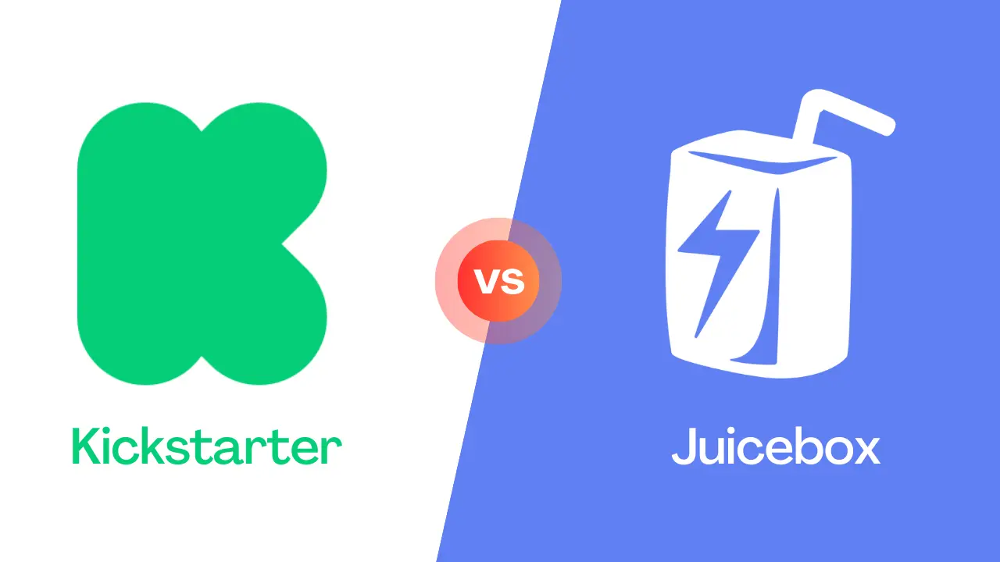

When it comes to launching a campaign, the choices for crowdfunding are abundant. Kickstarter is one of the most recognized traditional crowdfunding platforms, while Juicebox has recently emerged as a pivotal force when it comes to crypto fundraising. In this article, we’ll look at the advantages and disadvantages of both tools in terms of fees, funding models, rewards, global reach, payout time, and customization.

You can follow along in this blog post, or this video on the [JBDAO YouTube](https://www.youtube.com/@JuiceboxDAO) which covers the differences between [Kickstarter vs Indiegogo vs Juicbeox](https://www.youtube.com/watch?v=XDhaGvKFDNQ).

<iframe width="560" height="315" src="https://www.youtube.com/embed/XDhaGvKFDNQ" title="YouTube video player" frameborder="0" allow="accelerometer; autoplay; clipboard-write; encrypted-media; gyroscope; picture-in-picture; web-share" allowfullscreen></iframe>

:::tip
Looking to compare Juicebox to GoFundMe? You can read [this article](https://docs.juicebox.money/blog/gofundme-vs-juicebox/) on the Juicebox blog to learn the differences.
:::

### Platform Fees

When launching a campaign on Kickstarter, there’s no initial fee, but they do charge 5% of all funds raised. Juicebox on the other hand, charges a mere 2.5% fee whenever funds are withdrawn from a project. Keep in mind that while creating a project on [juicebox.money](http://juicebox.money) is free, since Juicebox runs on Ethereum mainnet, there are transaction fees that could cost $100 or more when launching a project. This will change down the road as Juicebox is made available on Layer-2 chains like Arbitrum and Polygon.

It’s worth noting that because Juicebox is [community-owned](https://juicebox.money/about), any fees paid will earn you $JBX tokens. These tokens grant you the power to actively participate in [JuiceboxDAO governance](https://www.jbdao.org/), shaping the future of Juicebox. In other words, the community that *uses* Juicebox also *owns* Juicebox… which is pretty cool.

### Payment Processing Fees

Now on top of the platform fees, Kickstarter also charges **processing fees** for each payment that comes in. For US-based projects, the fee stands at 3% plus $0.20 per pledge, which may vary from 3-5% depending on your country.

In contrast, Juicebox does not take a cut of any payments that are made to your project, but because the protocol is built on Ethereum, supporters will be responsible for paying a transaction fee, also known as [gas](https://ethereum.org/en/developers/docs/gas/), when contributing to your project. These gas fees could amount to $20 or more, depending on network congestion. It's important to note that these Ethereum network fees do not benefit Juicebox in any way but are associated with the network itself.

### Funding Models

Moving onto funding models, Kickstarter is infamous for its “all or nothing” approach where a project sets a specific fundraising target and if it reaches that goal it gets to keep all of the money… however, if it doesn’t, then all of the money gets returned to backers.

With Juicebox, you have the power to lock project settings for a timeframe of your choosing, known as a `cycle`. Whether it's 3 days, 14 days, or even a month, you have the freedom to decide how long all of your settings stay in place for while choosing between three different funding models:

**1. Limited Payouts**

This option allows you to withdraw only a predetermined amount each cycle. It provides backers with a 100% guarantee that you cannot withdraw more than the fixed limit. Imagine setting up a Limited Payout of 2 ETH and raising 3 ETH during a cycle. In this scenario, you can withdraw only 2 ETH, while the remaining 1 ETH can be redeemed by backers by burning their tokens for ETH. If unclaimed, the surplus ETH stays within the project, and can be used towards future cycles. Limited Payouts serve as an anti-scam mechanism, offering transparency and trust to your backers. It's an ideal choice for campaigns that thrive on growing alongside their supporters, with the flexibility to set new goals as milestones are achieved.

**2. Unlimited Payouts**

With this option, you can withdraw as much ETH as you raise, without any fixed limits during the cycle. Backers, however, cannot claim refunds during that particular cycle. Refunds can be enabled by switching payouts to "None" in a future cycle giving backers the option to redeem their tokens for refunds. Unlimited Payouts are perfect for fundraisers seeking to maximize their funding potential, although it's essential to consider potential risks associated with this approach.

**3. None**

In this scenario, none of the project's ETH can be withdrawn by the project owner during that cycle. All ETH remains within the project, allowing backers the freedom to redeem their tokens for ETH and obtain refunds at any time. In future cycles, you have the flexibility to change the Payouts setting as per your requirements. Setting Payouts to None is particularly useful for campaigns that prioritize giving backers the option to request refunds whenever they desire.

Overview of Payout Settings on Juicebox

Unlike Kickstarter's rigid campaign duration, Juicebox enables projects to adapt over time. You can modify Payout limits and Cycles as your project evolves. For example: your first cycle could be 60-days long with a limit of 50 ETH for your initial fundraise to cover manufacturing costs, followed by a 120-day cycle with a limit of 20 ETH dedicated to marketing efforts. On Juicebox, you're not constrained by fixed campaign lengths, allowing you to fundraise on your terms. Moreover, you have the freedom to pause your project and stop accepting payments if needed.

### **Rewards**

Moving on, the next category we’ll look at is Rewards, so if backers meet a certain funding criteria they can receive perks. Crowdfunding campaigns that use rewards often have a higher success rate than those without because they create incentives for a variety of backers to support your project at different price points.

On Kickstarter you can offer as many pledge reward tiers as you want, but backers can only choose *one* reward per project. It’s also worth noting that all US-based projects have a limit of $10,000 in place for pledges, so you can’t offer rewards at higher price points than that and you can’t raise more than $10,000 from a single supporter.

On Juicebox, you can offer as many reward tiers as you’d like using NFTs. These NFT rewards can be listed at any price and can be represented by an image, GIF, or video. You can choose to set a limited or unlimited supply for each tier, so for example you can make higher tiers more exclusive with only 10 available vs. more accessible lower tiers with up to 100 available. Supporters can contribute as many times as they’d like, with no contribution limit, and can receive multiple rewards if they choose.

Juicebox also offers advanced tokenomics features, enabling the allocation of tokens to team members and offering incentives to early supporters, fostering long-term engagement. For an in-depth understanding of Juicebox project tokenomics, be sure to explore the comprehensive tutorial provided in [Part 1](https://www.youtube.com/watch?v=edPZOxTLaYA) and [Part 2](https://www.youtube.com/watch?v=wFl0E9pqZfk).

### Global Reach

The next category we’ll talk about is global reach. While Kickstarter is limited to 25 countries, primarily in North America and Europe, Juicebox is fully permissionless, you can launch a project from anywhere worldwide, attracting backers from across the globe. Whether you're an individual, a non-profit organization, a company, or a decentralized autonomous organization (DAO), Juicebox welcomes everyone with open arms.

*As long as you have an internet connection, you can use [juicebox.money](http://juicebox.money).*

### Payout time

Time is of the essence when it comes to accessing your funds, so that your campaign can scale successfully. Kickstarter imposes a 14-day waiting period after reaching your funding goal before releasing the funds to you. Juicebox, on the other hand, offers you complete control over payout timing. You can send payouts from your project at any point during the cycle you set, as long as they fall within the pre-defined limit. For example, if you had a project with a 14-day cycles and Limited Payouts of 10 ETH, you could make a single withdrawal or multiple smaller transactions anytime, up to the total limit of 10 ETH. If you opt for Unlimited Payouts, there are no limits to when you can withdraw funds during the cycle.

### Customization

Lastly, let's explore customization options for your campaign.

Kickstarter allows you to select your project title, add descriptions, and include images or videos of your product. Similarly, Juicebox provides a range of options to personalize your project. You can set a display picture, a banner image, and craft a description that captures the essence of your initiative. Additionally, you can customize your project URL with an Ethereum Name Service (ENS) handle, adding a unique touch to your campaign. While adding images and videos to the project description is currently unavailable on **[juicebox.money](http://juicebox.money/)**, the Peel frontend team has an exciting update in store. Stay tuned for a brand new project page design, featuring new features like image integration, text with markdown formatting, and the ability to post updates as your project progresses within the next month.

### Conclusion - What Makes Juicebox Different

To summarize, Juicebox sets itself apart from traditional crowdfunding platforms through its unparalleled flexibility in campaign execution. It enables you to launch your project and receive support from anywhere globally. As your campaign evolves, you can set new goals and adjust your Payouts while maintaining a healthy and transparent relationship with your backers. By utilizing tokens, Juicebox empowers you to build a thriving community, offer perks and incentives, and stand out in a less saturated marketplace.

Moreover, accepting payments in ETH on Juicebox provides exposure to a new audience and the potential for increased value if the price of ETH rises. However, it's important to note that ETH is a volatile asset, and it's crucial to conduct thorough research and understand the associated risks of cryptocurrencies.

If you’re not sure which way to go for your next campaign, you should consider launching your campaign on both Kickstarter and Juicebox. By launching your project on Kickstarter and supplementing it with crypto crowdfunding on Juicebox, you can leverage the benefits of both worlds. This approach allows you to tap into a wider audience while accepting payments in ETH. With Juicebox, you also enjoy the added advantage of an extended campaign duration, potentially benefiting from any appreciation in the value of ETH, however, please do your own research about risks of cryptocurrencies.

### Resources

If you have any questions about using Juicebox, come join the discord at [discord.gg/juicebox](http://discord.gg/juicebox) or book an onboarding session at [juicebox.money/contact](http://juicebox.money/contact).

🐦 Follow Juicebox on Twitter: [@JuiceboxETH](https://twitter.com/juiceboxETH)

🚀 [Trending projects on Juicebox](https://juicebox.money/projects)

📚 [Project Creator Docs](https://docs.juicebox.money/user/)

📹 [YouTube Tutorials](https://www.youtube.com/c/JuiceboxDAO)

🎙️ [The Juicecast](https://ethereum.org/en/developers/docs/gas/)
