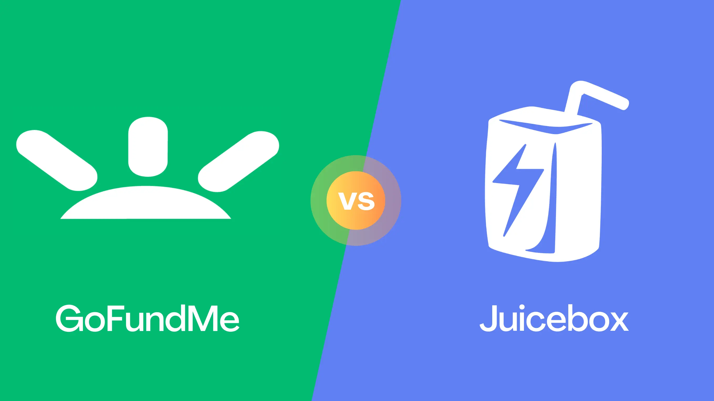
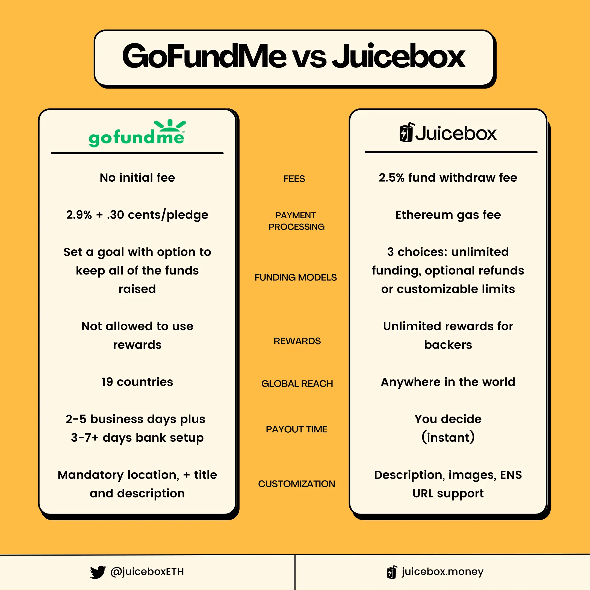
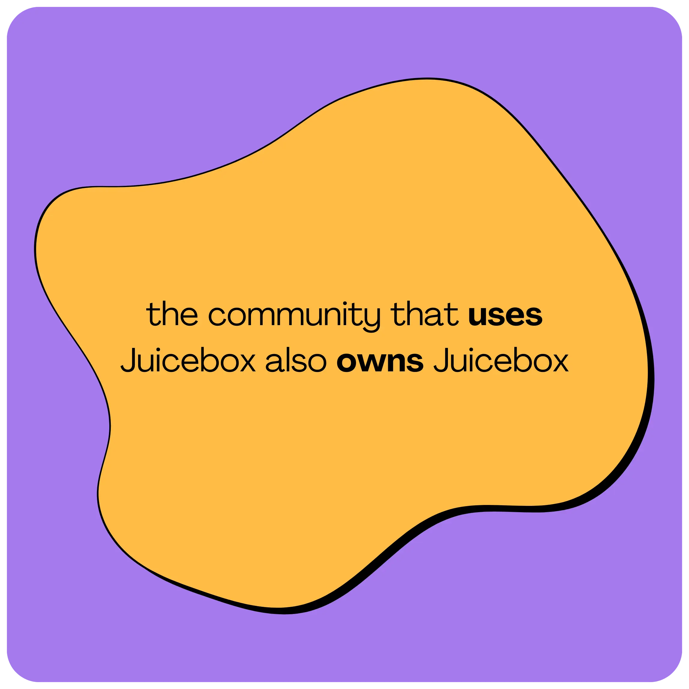
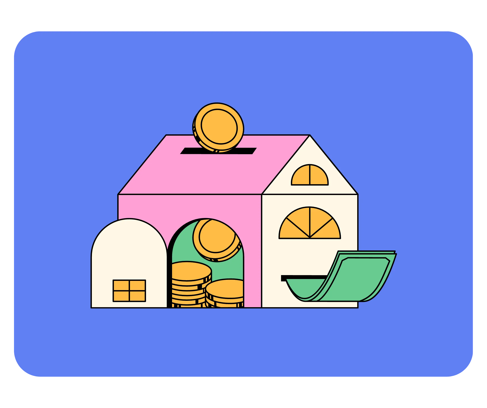
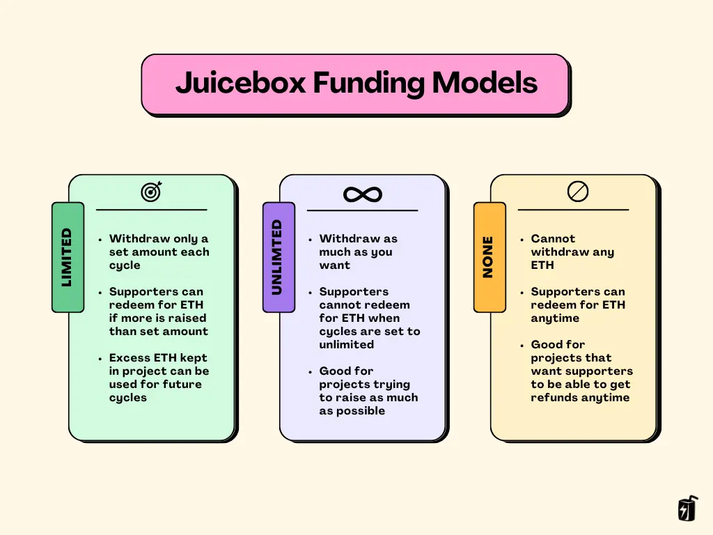
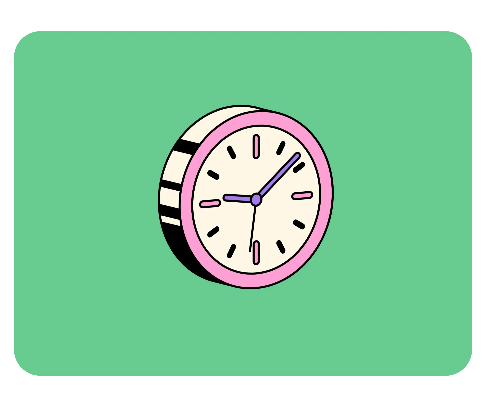
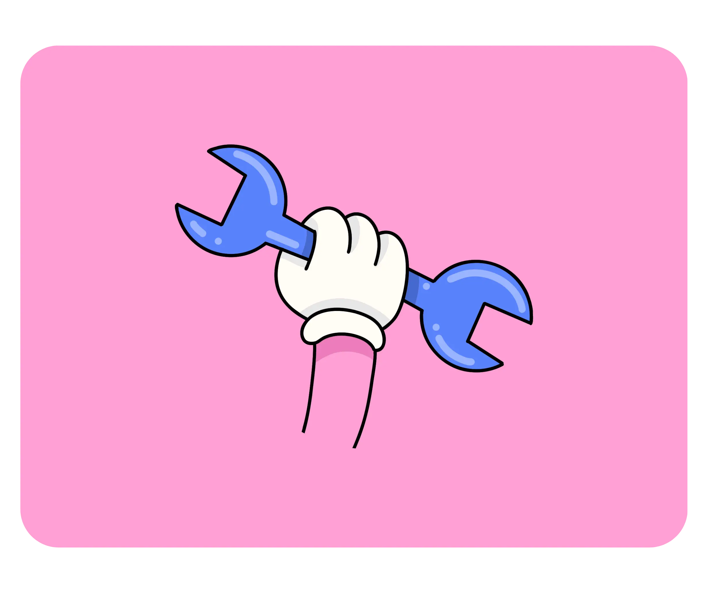

Fundraising plays a crucial role for non-profit organizations and charities, serving as a lifeline for their operations and initiatives. The money gained from crowdfunds helps these organizations to fulfill their mission, support their beneficiaries, and create a positive impact in the community. In today's digital age, leveraging online platforms and digital tools has become increasingly vital, as it allows non-profits and charities to extend their reach to a broader audience and engage supporters globally in order to amplify their impact towards their cause.

GoFundMe is one of the most recognized platforms for non-profits, charities, and other causes, while Juicebox has emerged as a new crowdfunding tool dominating the crypto space. In this article we’ll cover the differences between GoFundMe and Juicebox in terms of fees, funding model, rewards, global scale, payout time and customization.

:::tip
Looking to compare Juicebox to other crowdfunding platforms like Kickstarter or Indiegogo? You can watch [this video](https://www.youtube.com/watch?v=XDhaGvKFDNQ) on the JBDAO YouTube covering both, or read the individual [Kickstarter comparison article](https://docs.juicebox.money/blog/kickstarter-vs-juicebox/) or [Indiegogo comparison article](https://docs.juicebox.money/blog/indiegogo-vs-juicebox/) on the Juicebox blog.
:::

### Platform Fees

Fundraisers on GoFundMe have no initial charge, but ask donors for an optional tip for using the platform. Campagins on Juicebox are free to launch, but charge a withdrawal fee of 2.5% whenever funds are distributed from a project. It’s worth noting that while creating a project on [juicebox.money](http://juicebox.money) is free, there are transaction fees from Ethereum that could cost $100 or more when launching a project. This will change down the road as Juicebox is expands to Layer-2 chains like Arbitrum and Polygon.

On the flipside, because Juicebox is [community-owned](https://juicebox.money/about), any fees paid will earn you $JBX tokens. These tokens grant you the power to actively participate in [JuiceboxDAO governance](https://www.jbdao.org/), shaping the future of Juicebox. In other words, the community that *uses* Juicebox also *owns* Juicebox!

### Payment Processing Fees

Although launching a campaign is free on GoFundMe, all payments have a transaction fee of 2.9% + $0.30 per pledge. In contrast, Juicebox does not take a cut of any payments that are made to your project, but again, because the protocol is built on Ethereum, supporters will be responsible for paying a [gas](https://ethereum.org/en/developers/docs/gas/) fee when contributing to your project. These gas fees could amount to $20 or more, depending on network congestion. It's important to note that these Ethereum network fees do not benefit Juicebox in any way but are associated with the network itself.

### Funding Models

All campaigns on GoFundMe allow project creators to set a goal and keep the funds the raise regardless if they meet their goal or not. Both GoFundMe and Juicebox offer indefinite campaign lengths, but Juicebox offers three different models for how you can manage funds, with the flexibility to pause payments, or offer refunds if needed.

With Juicebox, you have the power to lock project settings for a timeframe of your choosing, known as a `cycle`. Whether it's 3 days, 2 weeks, or even a month, you have the freedom to decide how long all of your settings stay in place for while choosing between three different funding models:

**1. Limited Payouts**

This option allows you to withdraw only a predetermined amount each cycle. It provides backers with a 100% guarantee that you cannot withdraw more than the fixed limit. Imagine setting up a Limited Payout of 2 ETH and raising 3 ETH during a cycle. In this scenario, you can withdraw only 2 ETH, while the remaining 1 ETH can be redeemed by backers by burning their tokens for ETH. If unclaimed, the surplus ETH stays within the project, and can be used towards future cycles. Limited Payouts serve as an anti-scam mechanism, offering transparency and trust to your backers. It's an ideal choice for campaigns that thrive on growing alongside their supporters, with the flexibility to set new goals as milestones are achieved.

**2. Unlimited Payouts**

With this option, you can withdraw as much ETH as you raise, without any fixed limits during the cycle. Backers, however, cannot claim refunds during that particular cycle. Refunds can be enabled by switching payouts to "None" in a future Cycle giving backers the option to redeem their tokens for refunds. Unlimited Payouts are perfect for fundraisers seeking to maximize their funding potential, although it's essential to consider potential risks associated with this approach.

**3. None**

In this scenario, none of the project's ETH can be withdrawn by the project owner during that cycle. All ETH remains within the project, allowing backers the freedom to redeem their tokens for ETH and obtain refunds at any time. In future Cycles, you have the flexibility to change the Payouts setting as per your requirements. Setting Payouts to None is particularly useful for campaigns that prioritize giving backers the option to request refunds whenever they desire.

### Rewards

Moving on, the next category we’ll look at is Rewards, so if backers meet a certain funding criteria they can receive perks. Crowdfunding campaigns that use rewards often have a higher success rate than those without because they create incentives for a variety of backers to support your project at different price points.

GoFundMe does not allow any use of rewards for donors on its platform.

On Juicebox, you can offer as many reward tiers as you’d like using NFTs. These NFT rewards can be listed at any price and can be represented by an image, GIF, or video. You can choose to set a limited or unlimited supply for each tier, so for example you can make higher tiers more exclusive with only 10 available vs. more accessible lower tiers with up to 100 available. Supporters can contribute as many times as they’d like, with no contribution limit, and can receive multiple rewards if they choose.

Juicebox also offers advanced tokenomics features, enabling the allocation of tokens to team members and offering incentives to early supporters, fostering long-term engagement. For an in-depth understanding of Juicebox project tokenomics, be sure to explore the comprehensive tutorial provided in [Part 1](https://www.youtube.com/watch?v=edPZOxTLaYA) and [Part 2](https://www.youtube.com/watch?v=wFl0E9pqZfk).

### Global Reach

The next category we’ll talk about is global reach. While GoFundMe is limited to just 19 countries, primarily in North America and Europe, Juicebox is fully permissionless, you can launch a project from anywhere worldwide, attracting backers from across the globe. Whether you're an individual, a non-profit organization, a company, or a decentralized autonomous organization (DAO), Juicebox welcomes everyone with open arms.

*As long as you have an internet connection, you can use [juicebox.money](http://juicebox.money).*

### Payout time

Payout time is a critical part of campaigns for charities, especially those seeking funds for medical expenses. GoFundMe withdrawals take on average 2-5 business days for the funds to safely be deposited into the bank account on file. It’s worth noting that you must first connect the bank account of choice before being able to receive funds which could take 3-7 business days or longer to complete.

Juicebox, on the other hand, offers you complete control over payout timing. You can send payouts from your project at any point during the cycle you set, as long as they fall within the pre-defined limit. For example, if you had a project with a 14-day cycles and Limited Payouts of 10 ETH, you could make a single withdrawal or multiple smaller transactions anytime, up to the total limit of 10 ETH. If you opt for Unlimited Payouts, there are no limits to when you can withdraw funds during the Cycle.

### Customization

Lastly, let's explore customization options for your campaign.

Campaigns on GoFundMe mandate the location of the bank, a project title up to 35 characters, and offer a custom description and cover image to personalize your project.

Juicebox provides a range of options to personalize your project. You can set a display picture, a banner image, and craft a description that captures the essence of your initiative. Additionally, you can customize your project URL with an Ethereum Name Service (ENS) handle, adding a unique touch to your campaign.

Project pages on Juicebox are going to get even juicier because the Peel frontend team has an exciting update in store. Stay tuned for a brand new project page design, featuring new features like image integration, text with markdown formatting, and the ability to post updates as your project progresses within the next month.

### Conclusion - What Makes Juicebox Different

Juicebox sets itself apart from GoFundMe for its full flexibility, giving project creators full control over how funs can be raised, when they can be dispersed as well as having an unlimited global reach and optional incentives for donors using rewards. Moreover, accepting payments in ETH on Juicebox provides exposure to a new audience and the potential for increased value if the price of ETH rises. However, it's important to note that ETH is a volatile asset, and it's crucial to conduct thorough research and understand the associated risks of cryptocurrencies.

If you’re not sure which way to go for your next campaign, you should consider launching your campaign on Juicebox in addition to GoFundMe. By launching your project on GoFundMe and supplementing it with crypto crowdfunding on Juicebox, you can leverage the benefits of both worlds. Need help setting up your campaign or have a question? Book a [one-on-one onboarding call](https://www.notion.so/Juicebox-62b4218e081f43f491758426d9150d60?pvs=21) today.

### Resources

If you have any questions about using Juicebox, come join the discord at [discord.gg/juicebox](http://discord.gg/juicebox) or book an onboarding session at [juicebox.money/contact](http://juicebox.money/contact).

🐦 Follow Juicebox on Twitter: [@JuiceboxETH](https://twitter.com/juiceboxETH)

🚀 [Trending projects on Juicebox](https://juicebox.money/projects)

📚 [Project Creator Docs](https://docs.juicebox.money/user/)

📹 [YouTube Tutorials](https://www.youtube.com/c/JuiceboxDAO)

🎙️ [The Juicecast](https://ethereum.org/en/developers/docs/gas/)
