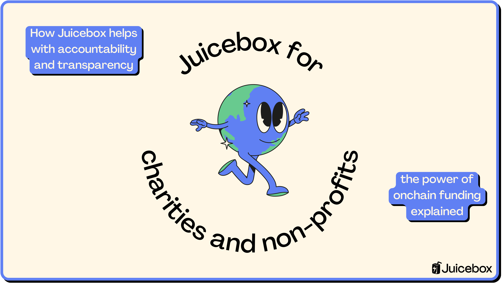
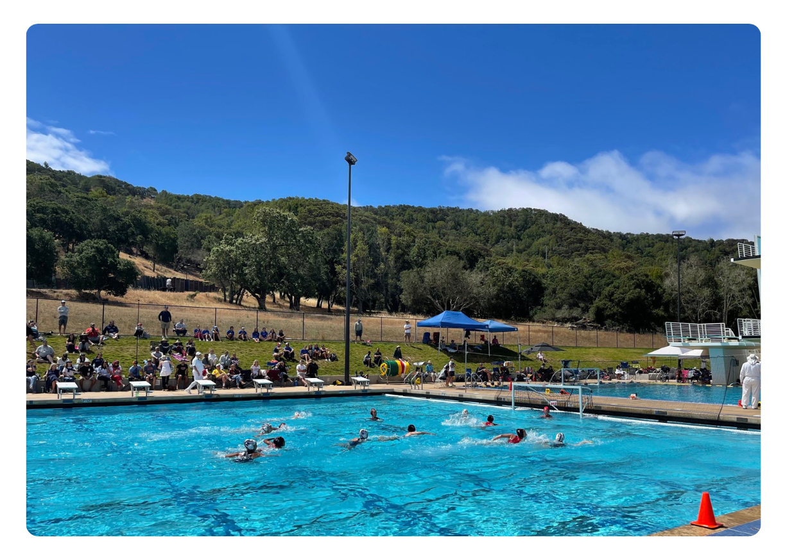
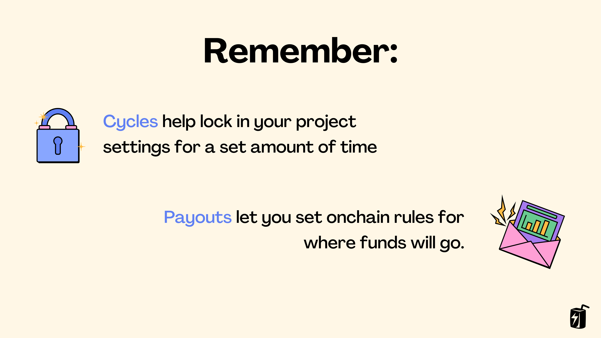
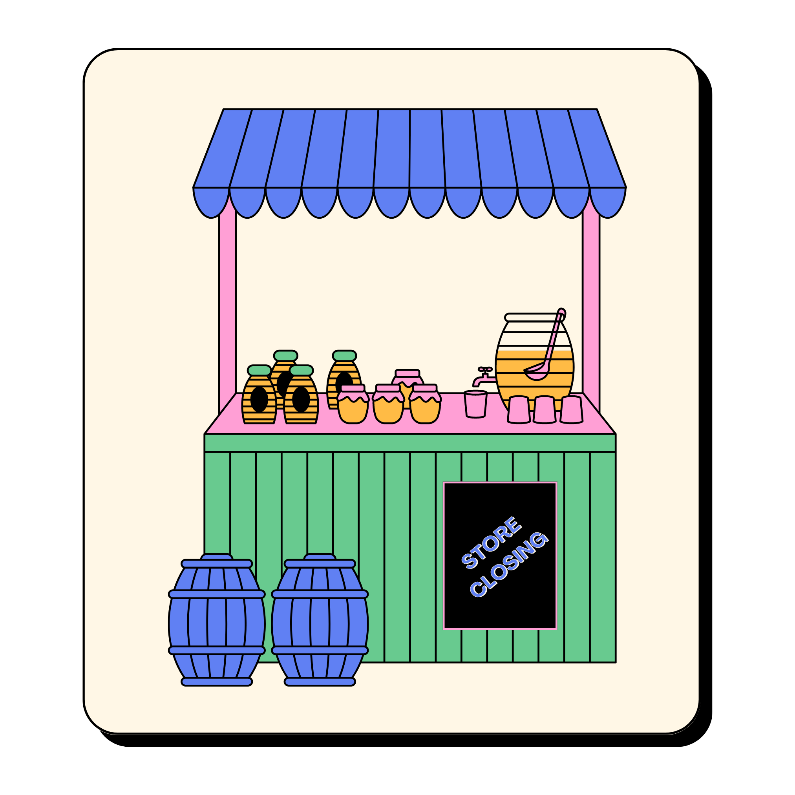

One of the core values of any charity or non-profit is accountability and transparency: non-profits are public organizations and should always remain accountable to their donors so that funds are used as promised. This lines up perfectly with the open and transparent ethos of Juicebox, so let’s dive into a couple examples of non-profits and fundraisers running on Juicebox.

You can follow along in this article, or a video by Matthew on the JBDAO YouTube:
<iframe width="560" height="315" src="https://www.youtube.com/embed/FfXhLQ_rtEU" title="YouTube video player" frameborder="0" allow="accelerometer; autoplay; clipboard-write; encrypted-media; gyroscope; picture-in-picture; web-share" allowfullscreen></iframe>

### Example 1: MCSA

Marin County Swim Association is a 501(c) non-profit that was established to help bring more water polo opportunities to Marin County. Historically, Marin residents have had to travel outside of the county to participate in high level competitions and workshops. The MCSA helps break down these accessibility barriers by hosting tournaments for Marin residents and by bidding on USA Water Polo Pacific Zone events.

Photograph of MCSA tournament

In addition to raising funds IRL, MCSA founder Steve launched a Juicebox project to accept donations in ETH. On the MCSA project page on [juicebox.money](https://juicebox.money), you can see past contributions, how much has been raised so far, and where funds will go when withdrawn. Steve also offers tax receipts for US-based contributions upon request.

:::tip
To learn more about how the MCSA got started, listen to episode 11 of [The Juicecast: Steve from Marin County Swim Association](https://podcasters.spotify.com/pod/show/thejuicecast/episodes/Ep--11---Steve-from-Marin-County-Swim-Association-e1oet1l/a-a8n8de1).
:::

### Example 2: Fighting Childhood Cancer

Del Piero is a founding member of [SharkDAO](https://juicebox.money/success-stories/sharkdao), a subDAO of NounsDAO that raised over 1000 ETH on Juicebox to acquire Nouns NFTs. In January 2022, Del Piero launched a [campaign](https://juicebox.money/success-stories/sharkdao) for his three year old son's cancer treatment and thank to the Nouns community he was able to raise over 21 ETH, worth over $60,000 at the time of the fundraiser.

Photograph of Dek Piero's son in the hospital wearing a Nouns hoodie

Recently, Del Piero launched another campaign after his son started resisting the previous treatments and has since raised an additional 12 ETH. Just like the MCSA, on his project page you can see recent contributions, how much has been raised so far, and where funds will go when withdrawn.

### How Juicebox works for charities and non-profits

So, how does Juicebox work for charities and non-profits? You can create a project for free on [juicebox.money](https://juicebox.money), share your story with your community, and start raising funds for your cause. Your project can be set-up with rules and limits in place that help build trust with supporters and prevent scams:

- First, you decide on Cycles—which can be five days, two weeks, a month, anything you like—and all of your project settings will be locked for that period of time. Of course you can change your project settings for future Cycles, and supporters will also be able to see this on your project page.
- Second, you can set-up Payouts which set onchain rules for where funds will go and how much can be withdrawn. Usually this is a specific fundraising target, which sets a limit for how much can be withdrawn in total per Cycle.

For example, let’s say you want to raise 5 ETH in 4 weeks. You can set your Cycle to 4 weeks long and set a limited Payout of 5 ETH, so within that 4-week period you’ll only be able to withdrawn 5 ETH from the project. Any extra can be redeemed by token holders or carried over to future Cycles.

In addition to Cycles and Payouts, Juicebox also offers redemptions which are a mechanism to offer refunds to supporters.

- When supporters pay your project, they receive tokens. Depending on whether you deploy an ERC-20 token or not, these will either be in their wallet or internally accounted for by the Juicebox contracts.
- If you want to offer refunds, you can set your project’s Payouts to None which will then allow supporters to burn their tokens and receive ETH in return.

For example, let’s say you’re fundraising to save a local business from going under and you weren’t able to raise enough in time. Rather than supporters wondering what will happen to their contributions, you can set Payouts to None for the next cycle and as soon as it begins, they’ll be able to redeem their tokens for the amount of ETH they contributed.

Another cool thing about fundraising on Juicebox is that you can issue NFTs as rewards for contributions. These NFTs could simply be artwork as a thank-you or they could also be used to unlock special perks like membership to a private Discord server, they could be redeemable for exclusive merch, or used for voting in onchain governance.

### Conclusion

Launching a project on Juicebox for your charity or non-profit allows you to fundraise for your cause out in the open. By managing funds onchain you can build trust with your community by showing supporters where funds will go after they contribute. The transparency and accountability of onchain treasuries is a perfect fit for non-profit organizations and can help you gain donors for your cause.

### Resources

If you have any questions about using Juicebox, come join the [discord](https://discord.gg/juicebox) or book an onboarding session at [juicebox.money/contact](https://juicebox.money/contact).

🐦 Follow Juicebox on Twitter: [@JuiceboxETH](https://twitter.com/juiceboxETH)

🚀 [Trending projects on Juicebox](https://juicebox.money/projects)

📚 [Project Creator Docs](https://docs.juicebox.money/user/)

📹 [YouTube Tutorials](https://www.youtube.com/c/JuiceboxDAO)
