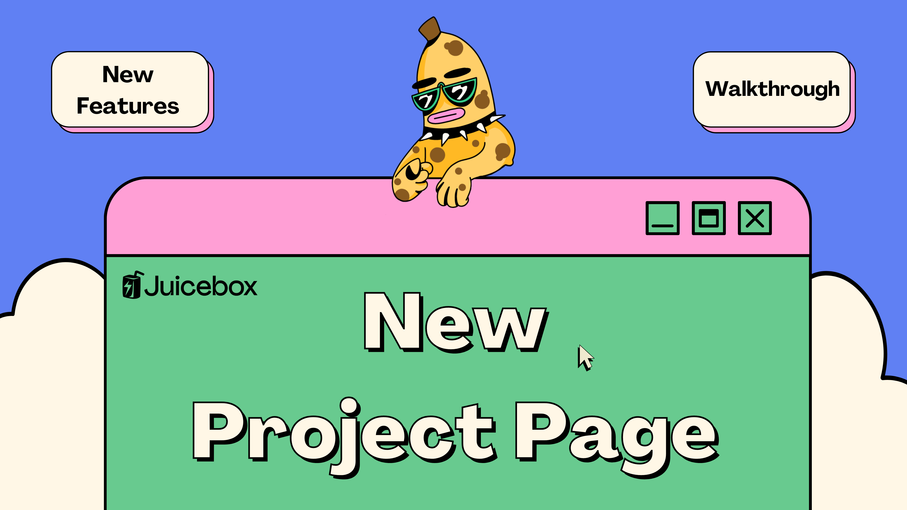
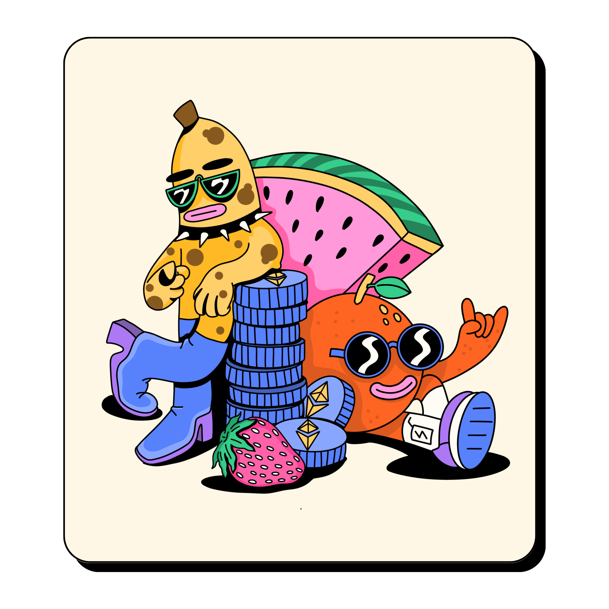
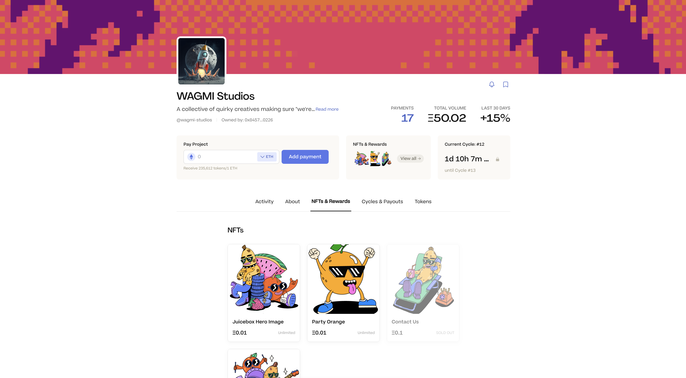
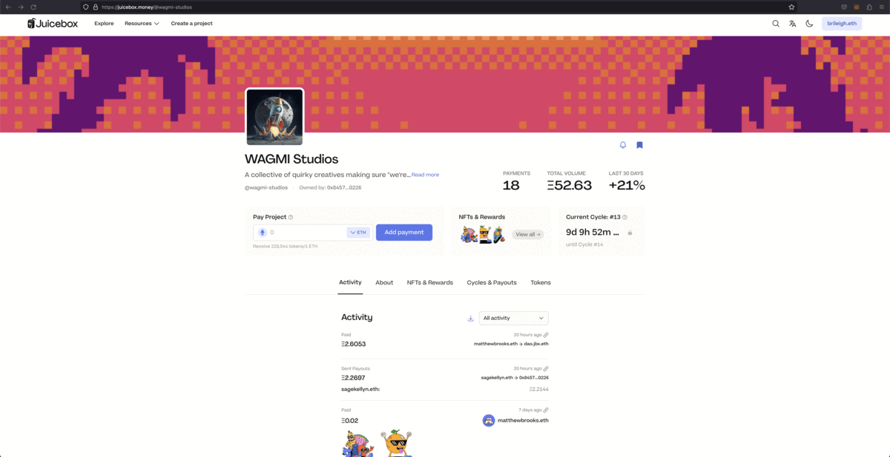
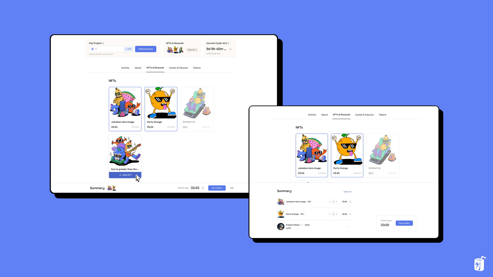
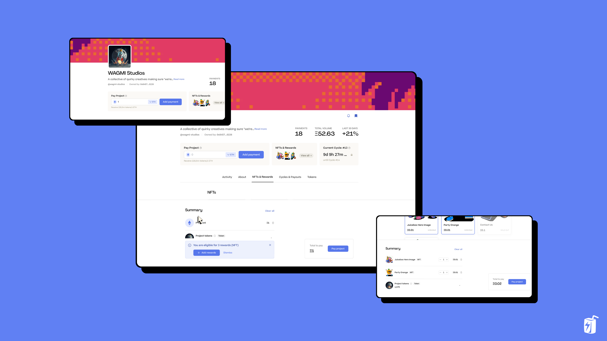
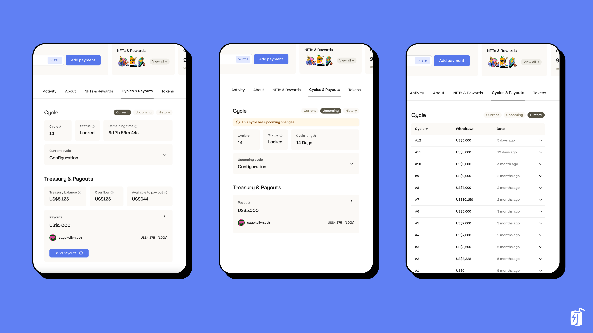
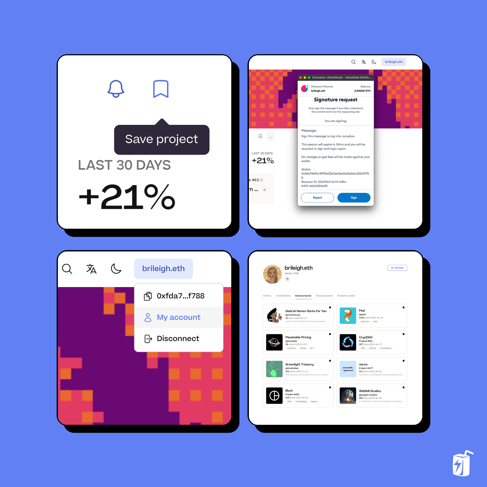

Project pages on Juicebox have been revamped including a new layout, new checkout experience, and bookmark feature. These updates were made possible thanks to PeelDAO, the front-end team managing [juicebox.money](https://juicebox.money), user interviews, and feedback from JuiceboxDAO. You can follow along in this article, or this walkthrough video by Brileigh on the [JBDAO YouTube](https://www.youtube.com/@JuiceboxDAO/videos):

<iframe width="560" height="315" src="https://www.youtube.com/embed/LUVi49oAcRQ" title="YouTube video player" frameborder="0" allow="accelerometer; autoplay; clipboard-write; encrypted-media; gyroscope; picture-in-picture; web-share" allowfullscreen></iframe>

For this example, we’re going to look at WAGMI Studios: the creative studio behind all of the juicy art on [juicebox.money](https://juicebox.money).

Artwork by <a href="https://twitter.com/SageKellyn">Sage Kellyn</a> from <a href="https://juicebox.money/@wagmi-studios">WAGMI Studios</a>

We’ve simplified the layout and added a new section with key project stats that give you a sense of a project’s activity. You can see how many payments have been made, total volume in ETH, and a trending percentage for the last 30 days.

We’ve added tabs to help navigate different aspects of a Juicebox project like Activity, About, NFTs, Cycles & Payouts, and Tokens. You can also click on the Cycle block to get to the Cycles tab, or click on NFTs to get to the NFTs tab.

One of the biggest changes that you’ll notice is the new cart experience when paying a project: you can add things to your cart and review a summary before submitting your transaction. As you add or remove NFTs, the summary will keep track of what is in your cart. If you click anywhere on the summary bar you can get a more detailed view with both the NFTs added to your cart and the project tokens you’ll receive.

You can also pay a project without choosing any NFTs using the pay bar at the top. For example, if you pay 1 ETH to Wagmi Studios and click on Summary at the bottom of the page, you’ll get a message saying “You are eligible for 3 rewards,” which are the NFTs. You can click “add rewards” to include them, or if you change your mind, simply click on the trash icon to remove them. This gives you the option to opt-in or opt-out of receiving NFTs when contributing to a project.

You’ll also notice a new block in the top-right with a live countdown of the project’s current Cycle. Click and it’ll bring you to the Cycles & Payouts tab where you can see current, upcoming, and past Cycles as well as any Payouts that have been configured.

If you’re browsing a project and want to come back to it later, you can bookmark it to save it to your Saved Projects in My Account. To do this you’ll need to have your wallet connected, click the Bookmark button on a project page, and sign with your browser wallet. You can then hover over your wallet in the top-right, click My Account, and then go to the Saved Projects tab.

That’s all for the project page for now. Keep an eye out for more new features like Project Taglines, editing descriptions with markdown and the ability to post updates about your project. Drop into the [Discord](https://discord.gg/juicebox) to let us know what you think about the new Project Page. Please report any issues in ⁠the [Bugs channel](https://discord.com/channels/775859454780244028/866040669712678942) or request a feature [here](https://juicebox.canny.io/feature-requests).

🐦 Follow Juicebox on Twitter: [@juicebox_money](https://twitter.com/juicebox_money)

💬 [Join the Juicebox Discord](https://discord.gg/juicebox)

🚀 [Trending projects on Juicebox](https://juicebox.money/projects)

📚 [Project Creator Docs](https://docs.juicebox.money/user/)

📹 [YouTube Tutorials](https://www.youtube.com/c/JuiceboxDAO)
