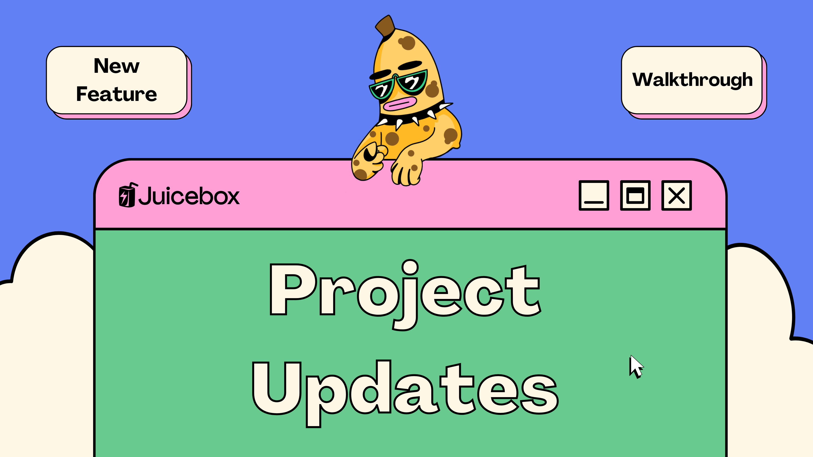
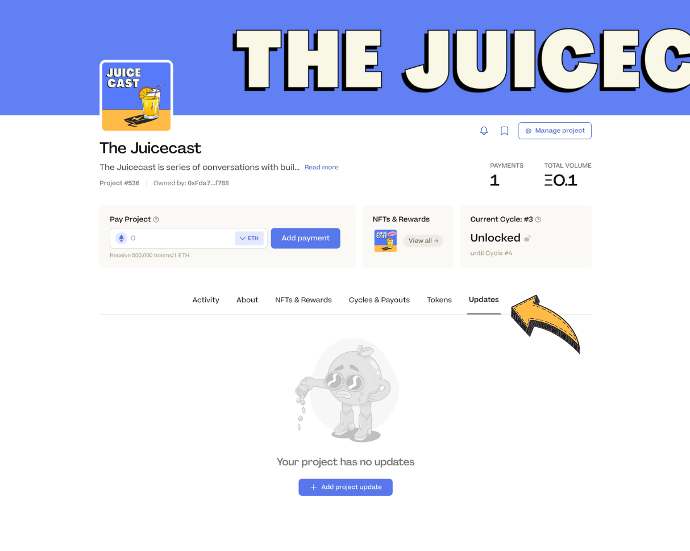
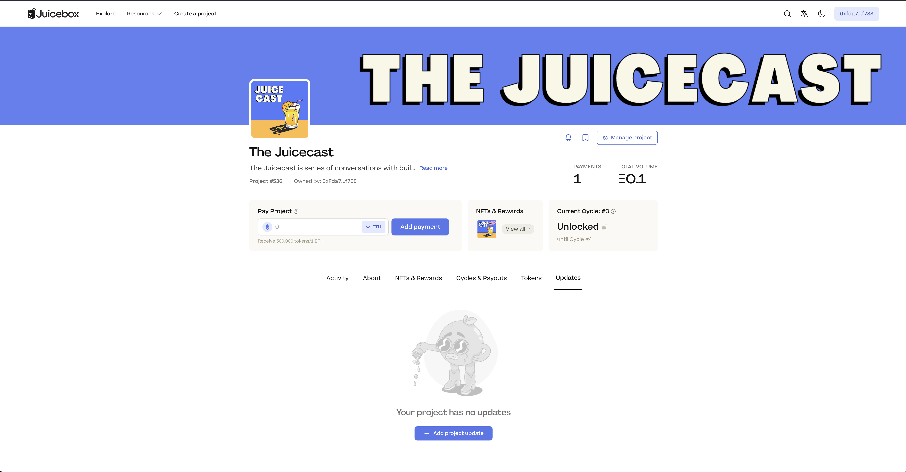
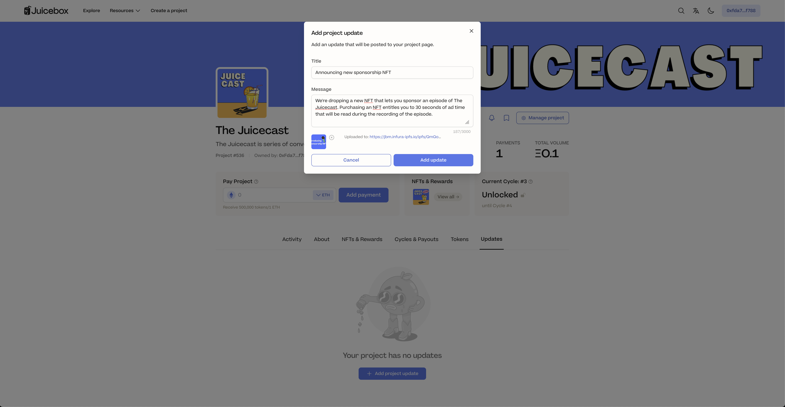
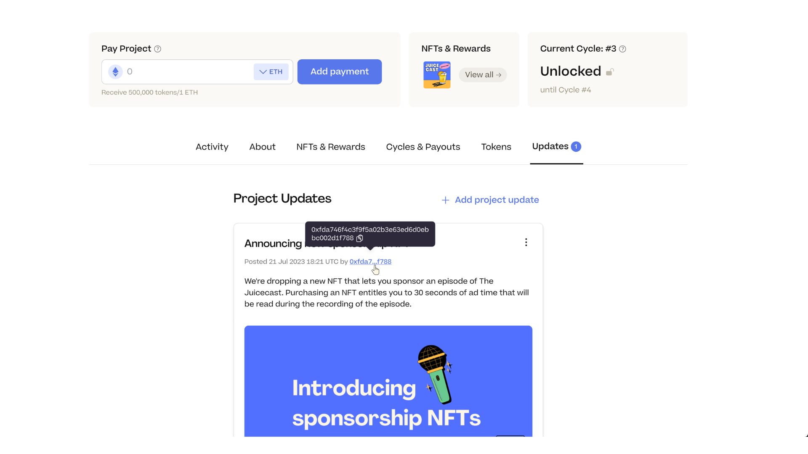

Project Pages on [juicebox.money](http://juicebox.money) now have a dedicated Updates tab to keep your community informed on the latest news. This can be used for announcements, new milestones, events, partnerships, or any new developments that relate to your project.

You can learn more about these updates in this article, or this walkthrough by Brileigh on JBDAO YouTube:

<iframe width="560" height="315" src="[https://www.youtube.com/embed/y8ZIlrzcfrM](https://www.youtube.com/embed/y8ZIlrzcfrM)" title="YouTube video player" frameborder="0" allow="accelerometer; autoplay; clipboard-write; encrypted-media; gyroscope; picture-in-picture; web-share" allowfullscreen></iframe>

For this example, we’ll be using The Juicecast project on Goerli. If you aren’t already familiar, [The Juicecast](https://podcasters.spotify.com/pod/show/thejuicecast) is a series of conversations with builders and creators in the Juicebox ecosystem and beyond. In this example, We’ll post an update informing the community about our new NFT collection that lets supporters sponsor an episode.

### Step 1: Connect Wallet & click on the new Updates Tab

The first thing we’ll do is connect our wallet. On your project page, you’ll notice a new tab that says `Updates`.

### Step 2: Add project update

In this section you’ll see a button that says `Add project update`, click it and it will prompt a signature request. This is so that the update can be verified by your wallet. No charges or gas fees will be made against your wallet.

:::tip
You **can’t edit an update** once it has been posted but **you can delete it** and post a new one if you make a mistake.
:::

In the pop-up window you can add a title and message for your update. Make sure that your message provides enough context and clearly conveys what you want to communicate to your community. You also have the option to add an image that’s relevant to your update. Keep in mind that this will be cropped to a horizontal rectangle ratio of 288px x 566px.

### Step 3: Post Update

When you’re done, click `Add update` to post your update.

And that’s it, all done! The page should refresh automatically or you can refresh it yourself, and you’ll notice a number next to the Updates tab that keeps track of how many updates have been posted. The update will also include the date it was posted as well as the wallet that signed the message.

### Reasons to use Project Updates and tips

Keeping your community in the loop is one of the best ways to ensure your projects' success. The more your community hears from you about what you’re working on, the stronger the trust will build and increase the likeliness of getting more funding from both new and old supporters.

Here are a couple tips for posting updates for your project:

- Don't make vague statements that could mislead your community. Posting updates is all about building trust with your supporters: don’t overpromise and make sure that your message is crystal clear.
- The more active your project, the better. Being consistent means finding a balance so that your community isn’t spammed with updates or on the other hand left wondering if the project is still active months later.

Keep your eyes peel-ed for more features like markdown formatting and images in project descriptions as well as the ability to subscribe to project updates via email.

### Relevant links

🐦 Follow Juicebox on Twitter: [@juicebox_money](https://twitter.com/juicebox_money)

📬 Subscribe to [Juice News](https://subscribepage.io/juicenews), our weekly newsletter

💬 [Join the Juicebox Discord](https://discord.gg/juicebox)

🚀 [Trending projects on Juicebox](https://juicebox.money/projects)

📚 [Project Creator Docs](https://docs.juicebox.money/user/)

📹 [YouTube Tutorials](https://www.youtube.com/c/JuiceboxDAO)

🎙️ Listen to an episode of [The Juicecast](https://podcasters.spotify.com/pod/show/thejuicecast)
