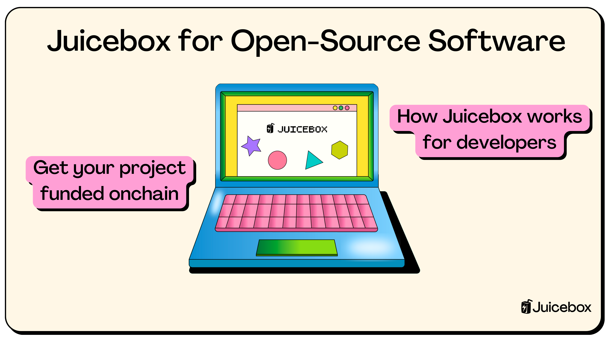
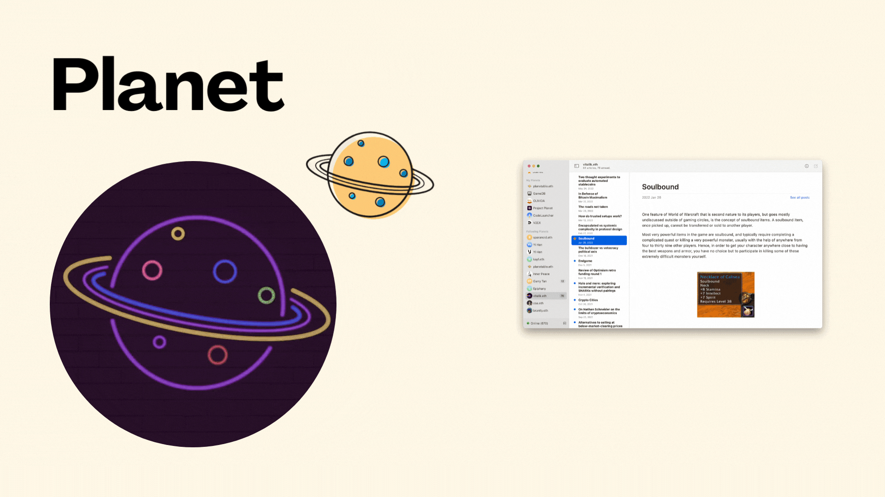
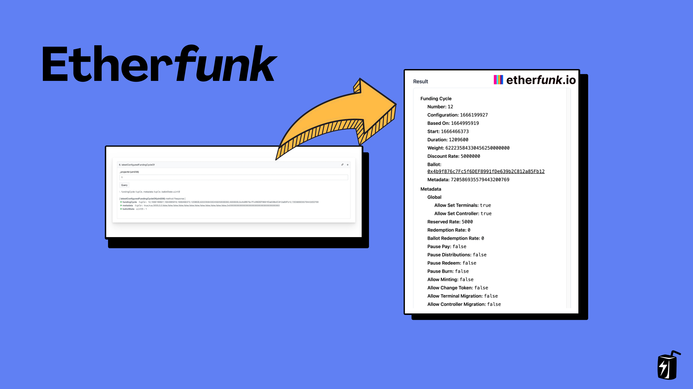
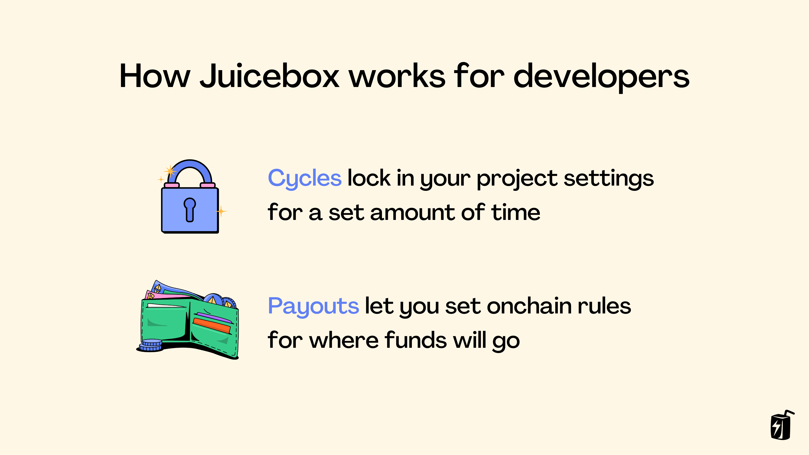
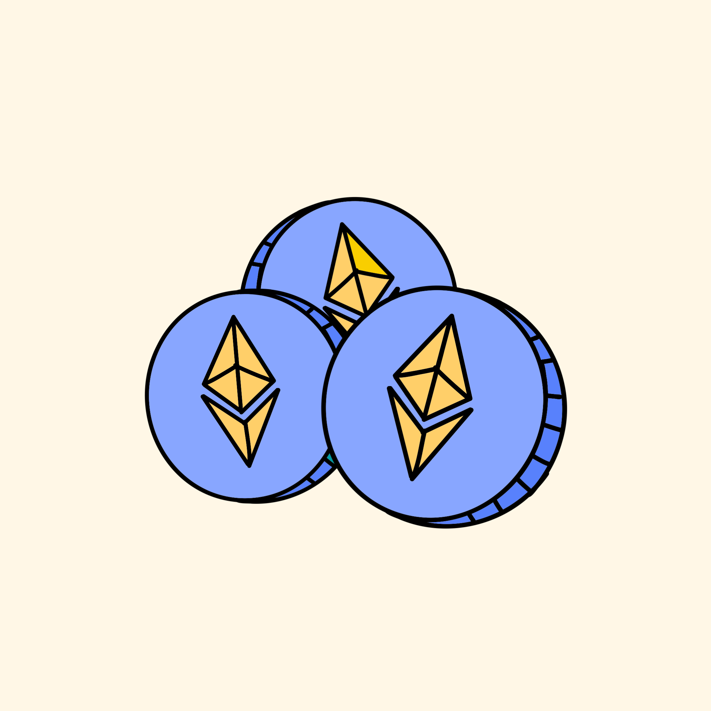

Open source software plays a crucial part in the digital economy, in the same way that highways and communication systems play a role in our cities. With the emergence of blockchain, developers can now turn to funding their software onchain, as it allows builders to raise funds permissionlessly, transparently and make use of tokens. In this article we’re going to focus on how you can use Juicebox to fund your open-source software project.

You can follow along in this article, or a video by Matthew on the JBDAO YouTube:

<iframe width="560" height="315" src="https://www.youtube.com/embed/U_TWyTHp304" title="YouTube video player" frameborder="0" allow="accelerometer; autoplay; clipboard-write; encrypted-media; gyroscope; picture-in-picture; web-share" allowfullscreen></iframe>

### What is Juicebox?

Juicebox is an open-source protocol that is permissionless, community-owned, and built on the Ethereum blockchain. Juicebox is built ***by hackers, for hackers***, making it a great launchpad for developers to take their projects to the next level. Let’s dive into some examples of projects using Juicebox to fund open-source software.

### Example 1: Planet

[Planet](https://juicebox.money/@pinnable) is an open-source tool built by [Xin](https://twitter.com/Livid), aka Livid, who previously built [V2EX.com](http://V2EX.com) which is a popular community for developers in China. Planet lets you build decentralized websites using IPFS and ENS, so instead of hosting your website on a centralized server, Planet uses IPFS for peer-to-peer content distribution and lets you use an ENS address that you own or control as the URL. Planet has raised nearly 7 ETH on Juicebox, worth over 12.5 thousand dollars at the time of recording.

:::tip
To learn more about how the Planet got started, listen to episode 25 of [The Juicecast: Building decentralized websites using IPFS and ENS with Xin (Livid) from Planet](https://podcasters.spotify.com/pod/show/thejuicecast/episodes/Ep--25---Building-decentralized-websites-using-IPFS-and-ENS-with-Xin-aka-Livid-from-Planet-e24uj1j/a-a9u17uu)
:::

### Example 2: Etherfunk

[Etherfunk](https://juicebox.money/@etherfunkio) is a tool that lets you interact with any contract on the Ethereum blockchain. Simply enter a contract address and Etherfunk makes it easy to interact with its read and write functions. You can also generate links with pre-filled values to easily share contract interactions in a predefined way.

View on the same contract on Etherscan (left) and Etherfunk (right)

Etherfunk was developed by [Aeolian](https://twitter.com/aeolianeth), one of the frontend devs at PeelDAO who manages the  [juicebox.money](http://juicebox.money) frontend. In order to make Etherfunk sustainable, he launched a project on Juicebox, stated upfront how much it costs each month to keep running, and managed to secure funding for an entire year in less than a month.

### How Juicebox works for open source software

So, how does Juicebox work for open-source software?

Launching a project on Juicebox lets you build a treasury out in the open, raise funds from your community or via grants, and issue ERC20 tokens or NFTs as benefits to supporters.

In addition to introducing your project and the story behind what you’re building, consider stating your fundraising goal and costs upfront in your project description. You can also use Juicebox’s onchain rules to set limits for how much can be withdrawn from the project so that supporters feel safer knowing that you can’t rug and take all the ETH.

- First, you decide on Cycles—which can be 3 days, 2 weeks, a month, anything you like—and all of your project settings will be locked for that period of time. You can always change your project settings, but these changes will only take effect in the next upcoming Cycle and supporters will be able to see this upcoming change on your project’s activity feed.
- Second, you can set-up Payouts which set onchain rules for where funds will go and how much can be withdrawn.

For example, let’s say your goal is to raise $1000 per month to maintain your project. You could set-up a Limited Payout of $1000 to your personal address and anything raised above that limit will roll into the next Cycle. Supporters can rest easy knowing that you can’t suddenly take all of the money from the project and disappear.

### Juicebox tokenomics for developers

In addition to Cycles and Payouts, Juicebox also offers advanced tokenomics features that allow you to issue tokens and NFTs, offer refunds, and more.

- When supporters pay your project, they receive tokens. Depending on whether you deploy an ERC-20 token or not, these will either be in their wallet or internally accounted for by the Juicebox contracts which is the default to save on gas fees.
- ERC-20 tokens are often used for governance. This could be something simple like letting token holders vote on upcoming features, or maybe you want your project to be community-owned and governed as a DAO with token holders voting on how to use treasury funds.

Project tokens can also be used to offer refunds. For example, let’s say you raised 2 ETH to start developing a new idea but for some unforeseen reason you can no longer commit to the project. You can Edit your upcoming Cycle to set Payouts to **None**, and this will let token holders redeem their tokens for the ETH that they contributed.

Artwork by [Sage Kellyn](https://twitter.com/SageKellyn)

In addition to ERC-20 tokens, you can also issue NFTs for payments made to your project with different tiers so that contributors can support you at different price points. For example, you could offer a $5 “buy me a coffee” tier with cute artwork or your project’s logo, as well as higher priced tiers that unlock premium features or access to a token-gated Discord server. NFT rewards can be anything from cool artwork as a “thank you” to membership or other perks: it’s up to you.

Example of Buy Me A Coffee NFT

### Conclusion

Launching your open-source software project on Juicebox lets you raise funds permissionlessly from around the world and build a community around what you’re building. And even if your product isn’t related to crypto, you can always start a Juicebox project alongside another platform like Buy Me A Coffee and help spread the word to members of the Ethereum community.

### Resources

If you have any questions about using Juicebox, come join the [Discord](https://discord.gg/juicebox) or book an onboarding session at [juicebox.money/contact](https://juicebox.money/contact).

🐦 Follow Juicebox on Twitter: [@Juicebox_Money](https://twitter.com/Juicebox_Money)

🚀 [Trending projects on Juicebox](https://juicebox.money/projects)

📚 [Project Creator Docs](https://docs.juicebox.money/user/)

📹 [YouTube Tutorials](https://www.youtube.com/c/JuiceboxDAO)
