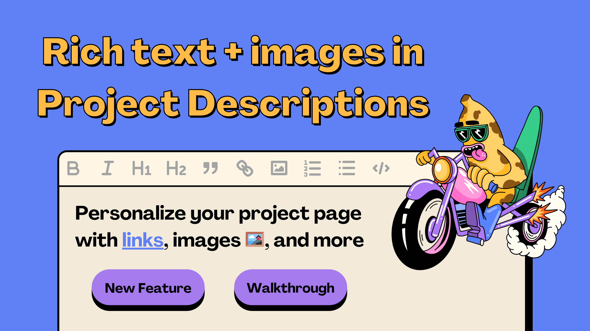

Project creators can now use rich text formatting in their project descriptions. This means that you can add style and organize your description using basic formatting like **bold** and *italics*, headings, links, adding images, and more.

You can learn more about these updates in this article, or this walkthrough by Brileigh on JBDAO YouTube:

<iframe width="560" height="315" src="https://www.youtube.com/embed/KX5H2IN6_qs" title="YouTube video player" frameborder="0" allow="accelerometer; autoplay; clipboard-write; encrypted-media; gyroscope; picture-in-picture; web-share" allowfullscreen></iframe>

### Step One: Connect Wallet and Manage Project

So, first things first, make sure your wallet is connected and head over to the project that you control on [juicebox.money](http://juicebox.money). We’re gonna use The Juicecast on Goerli as an example. From here we’re gonna click on `Manage project` in the top right.

### Step 2: Basic Details

Next, we’ll go to `Basic Details` under General. Here you’ll see two new fields under your project name. You can add a tagline, where you can add a brief one-sentence summary of your project. And below that, we have the project description where we can add a more detailed summary of what this project is about, why you should contribute, and add some links and images for context.

### Step 3: Introduce yourself

You can start from scratch in the editor or copy and paste some text you already have. Start with an introduction either about who you are or what the project is about. This where you can tell your story to connect with your audience. Here are some tips to consider:

- Use headings like H1 or H2 to help organize the structure of your summary. This is especially helpful for long project descriptions so that potential backers can easily skim through your text to find what they want to know about you and your project.
- When referencing subjects in your summary, it’s a good idea to hyperlink text so that people can know more about something if they’re interested. This is also a great way to build trust if you want people to know more than what your wallet says about you or the project.

### Step 4: Add images to break up text

Adding visuals to your project description is really important because it helps break up text, especially if you have a long description. To add the image, click on the image icon and upload the photo. Examples of images you could include are:

- Photographs (if you have hosted IRL events or have a product you want to showcase)
- Infographics (to explain complex aspects of your project)
- Brand materials (logos, typefaces, anything you want to show off that you think will resonate with people)

Examples of different images you can add to your project

### Step 5: Tell people your “Why”

Once you’ve explained what your project is about and how it works, consider adding reasons why people should contribute to your project. Whether you’re on Juicebox or another platform, it’s important to think about why someone would want to contribute to your project, what they might receive in return. You can add more images if this helps contextualize what you’re seeking funds for and why.

### Step 6: How can people find you and get involved?

Good contact information helps **build trust** and makes you more **accessible**. Adding links for contract information or how to get involved in a Discord is great way to make your project more inviting to potential supporters. You want to make it easy for people to find you if they want to.

### Step 7: Save project details

Once you’re finished editing your project description, scroll down to the bottom and click `Save Project Details`. This will prompt a transaction that you’ll need to confirm in your wallet. This could take a minute to save and update on [juicebox.money](http://juicebox.money). Once it’s done, you can click on the X in the top right and it will bring you back to your project page. Simply refresh your project page, click on the About tab and you’ll see you’re new fully stylized project description! And that’s it!

### Conclusion

If you have any questions or need help along the way, jump into the Support channel in [Juicebox Discord](http://discord.gg/juicebox) If you want some one-on-one help setting up your project, reach out at [juicebox.money/contact](https://juicebox.money/contact). And if you want to stay on top of the latest news, features, and trending projects in the Juicebox ecosystem, make sure to subscribe to our weekly newsletter [Juice News](https://subscribepage.io/juicenews).

### Relevant links

🐦 Follow Juicebox on Twitter: [@juicebox_money](https://twitter.com/juicebox_money)

📬 Subscribe to [Juice News](https://subscribepage.io/juicenews), our weekly newsletter

💬 [Join the Juicebox Discord](https://discord.gg/juicebox)

🚀 [Trending projects on Juicebox](https://juicebox.money/projects)

📚 [Project Creator Docs](https://docs.juicebox.money/user/)

📹 [YouTube Tutorials](https://www.youtube.com/c/JuiceboxDAO)

🎙️ Listen to an episode of [The Juicecast](https://podcasters.spotify.com/pod/show/thejuicecast)
