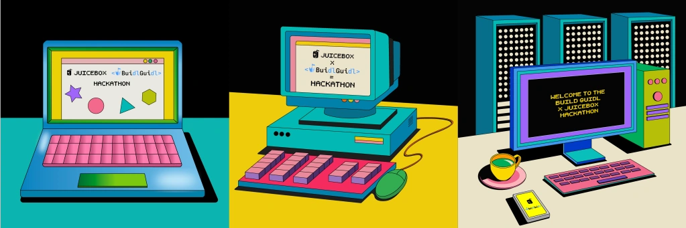

# Delegate Hackathon

:::info Update
Hackathon voting is live until 12:00 EDT on July 21st: **vote on [Snapshot](https://snapshot.org/#/filipv.eth/proposal/0x4a979baa4bce5ea5e0a289f6a6f83b6a4b60f32816283e689019e707f74149a3)**. Voting power has been given to BuidlGuidl project supporters, Buidl Guidl/JuiceboxDAO members, and [last hackathon's](/hackathon/) voters. Vote for your favorite submissions to give them ETH. To ask questions or see updates, visit the [`#🏰｜delegate-hackathon`](https://discord.com/invite/juicebox) channel.
:::

Build a [Juicebox Delegate](/docs/dev/v3/learn/glossary/delegate.md) (and/or [data source](/docs/dev/v3/learn/glossary/data-source.md)) for the [Buidl Guidl Juicebox project](https://juicebox.money/@buidlguidl) or somebody else to use. Open to teams and individuals.

The Summer 2023 Hackathon collection.

- Starts at 18:00 EDT on June 28th and ends at 12:00 EDT on July 18th.
- Over $16k in rewards.
- Anyone can pay the [@buidlguidl Juicebox project](https://juicebox.money/@buidlguidl) to receive hackathon NFTs – half of the funds in the project will be distributed according to hackathon NFT voting once submissions are closed – the remainder will be used for Buidl Guidl streams and future events.
- Send a message in the `#🏰｜delegate-hackathon` channel of the [JuiceboxDAO Discord](https://discord.gg/juicebox) if you're looking for teammates or have questions.
- Use the [`juice-delegate-template`](https://github.com/mejango/juice-delegate-template) repository to get going.
- Submit your project by sharing its name, a brief description, a repo URL, your team's Juicebox project (to receive payouts), and a demo URL in the `#🏰｜delegate-hackathon` channel of the [JuiceboxDAO Discord](https://discord.gg/juicebox).
- Facilitated with love by [Buidl Guidl](https://buidlguidl.com/) and [JuiceboxDAO](/dao/).

## Timeline

**18:00 EDT, June 28th:** the hackathon begins with a [Twitter Spaces](https://twitter.com/i/spaces/1BdGYyYqwdEGX) featuring JuiceboxDAO + Buidl Guidl members.

**12:00 EDT, July 18th:** submissions close, and voting opens. All contestants can join the showcase call in the [JuiceboxDAO Discord](https://discord.gg/juicebox) and demo their project to voters.

**12:00 EDT, July 21st:** voting closes. Rewards are distributed according to the proportion of votes received by each submission.

:::info Update
The Hackathon is being extended to 12:00 EDT on **July 18th**, and we're accepting more types of projects:

- [Ballots](/docs/dev/v3/build/treasury-extensions/ballot.md) are smart contracts which can approve or deny attempts to reconfigure a Juicebox project's funding cycle.
- [Split allocators](/docs/dev/v3/build/treasury-extensions/split-allocator.md) can automate the routing of funds and reserved tokens to and from Juicebox projects.

We're looking for creative and useful extensions to the core Juicebox protocol: data sources, delegates, integrations with other Ethereum protocols, one of the extension types mentioned above, or something else.

If you're interested but haven't started a project yet, now is a great time – if you need help getting started, ask us in the `#🏰｜delegate-hackathon` channel in the [JuiceboxDAO Discord](https://discord.gg/juicebox).

Cool interfaces are also highly encouraged: [Scaffold-ETH 2](https://github.com/scaffold-eth/scaffold-eth-2) is an open-source toolkit which makes it easier for developers to create and deploy smart contracts and build user interfaces that interact with those smart contracts – feel free to make an interface for your extension or somebody else's, or even for an existing part of the protocol which isn't exposed in other frontends (like the [operator](/docs/dev/v3/build/namespace.md#operator-permissions) permission system).
:::

## What's a Delegate?

By default, payments to (and redemptions from) Juicebox projects are handled by the project's [payment terminal](/docs/dev/v3/learn/glossary/payment-terminal.md) – a contract which manages token inflows/outflows and accounting for one or more projects.

A [*delegate contract*](/docs/dev/v3/learn/glossary/delegate.md) allows you to extend the default payment/redemption behavior by defining custom post-pay/post-redeem hooks. Delegates (and other customized information) can be passed to the payment terminal's pay/redeem functions by a [*data source*](/docs/dev/v3/learn/glossary/data-source.md).

- Payment terminal functionality is implemented [across several contracts and interfaces](/docs/dev/v3/learn/architecture/terminals.md).
- Juicebox projects can use multiple payment terminals.
- Project payments and redemptions happen via the [`pay(...)`](/docs/dev/v3/api/contracts/or-payment-terminals/or-abstract/jbpayoutredemptionpaymentterminal3_1.md#pay) and [`redeemTokensOf(...)`](/docs/dev/v3/api/contracts/or-payment-terminals/or-abstract/jbpayoutredemptionpaymentterminal3_1.md#redeemtokensof) functions, which invoke the [`IJBPayDelegate.didPay(...)`](/docs/dev/v3/api/interfaces/ijbpaydelegate.md) and [`IJBRedemptionDelegate.didRedeem(...)`](/docs/dev/v3/api/interfaces/ijbredemptiondelegate.md) functions after the default pay/redeem logic has been executed in the terminal contract.
- The active pay/redemption delegates are defined by a project's [data source](/docs/dev/v3/learn/glossary/data-source.md).

## Criteria

Make an interesting and useful project – criteria is subjective and up to voters!

Our wishlist:

- A data source which functions as a whitelist, allowing the project owner to upload new merkle roots over time.
- A data source aggregator – a contract which allows a project to use more than one data source.
- A [Variable Rate GDA](https://www.paradigm.xyz/2022/08/vrgda) data source.
- An NFT collection floor sweeper delegate.
- A [nouns.wtf](https://nouns.wtf/) bidder delegate.

For more inspiration, take a look at JuiceboxDAO's [contract work backlog](https://github.com/orgs/jbx-protocol/projects/5/views/2) or existing delegates: [`juice-721-delegate`](/docs/dev/v3/extensions/juice-721-delegate/README.md) and [`juice-buyback`](https://github.com/jbx-protocol/juice-buyback).

Extensions to [other parts of the Juicebox protocol](/docs/dev/v3/build/treasury-extensions/README.md), unique frontends, and other ideas are all fair game – no hard rules.

## Rules

All projects must be open source and use an [open source license](https://opensource.org/licenses).

## Resources

- Use the [`juice-delegate-template`](https://github.com/mejango/juice-delegate-template) repository to set up your dev environment. If you're not building a delegate, the more generic [`juice-contract-template`](https://github.com/jbx-protocol/juice-contract-template) may be useful.
- Watch the [delegate contract demo](https://youtu.be/GKI_fbxkg44) on YouTube.
- Read through the [glossary](/docs/dev/v3/learn/glossary/README.md) to refresh on or become acquainted with Juicebox terminology.
- If looking for tips to start out, take a look at our guides on [building a data source](/docs/dev/v3/build/treasury-extensions/data-source.md), [building a pay delegate](/docs/dev/v3/build/treasury-extensions/pay-delegate.md), and [building a redemption delegate](/docs/dev/v3/build/treasury-extensions/redemption-delegate.md).
- To learn more about payment terminals, read our [payment terminal architecture](/docs/dev/v3/learn/architecture/terminals.md) doc.
- To see a sophisticated delegate implementation, read through our documentation for [`juice-721-delegate`](/docs/dev/v3/extensions/juice-721-delegate/README.md) (which is the most popular delegate thus far).

If the resources above don't answer your questions, send a message in the `#🏰｜delegate-hackathon` channel of the [JuiceboxDAO Discord](https://discord.gg/juicebox).
