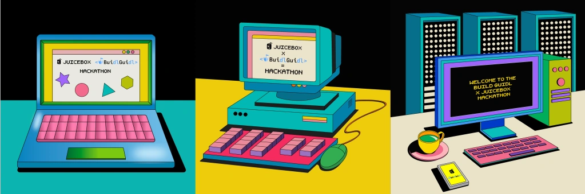

# Delegate Hackathon

Build a [Juicebox Delegate](/dev/learn/glossary/delegate/) (and/or [data source](/dev/learn/glossary/data-source/)) for the [Buidl Guidl Juicebox project](https://juicebox.money/@buidlguidl) or somebody else to use. Open to teams and individuals.

The Summer 2023 Hackathon collection.

- Starts at 12:00 EDT on June 28th and ends at 12:00 EDT on July 11th.
- Over $16k in rewards.
- Anyone can pay the [@buidlguidl Juicebox project](https://juicebox.money/@buidlguidl) to receive hackathon NFTs – half of the funds in the project will be distributed according to hackathon NFT voting once submissions are closed – the remainder will be used for Buidl Guidl streams and future events.
- Send a message in the `#🏰｜delegate-hackathon` channel of the [JuiceboxDAO Discord](https://discord.gg/juicebox) if you're looking for teammates or have questions.
- Use the [`juice-contract-template`](https://github.com/jbx-protocol/juice-contract-template) repository to get going.
- Submit your project by sharing its name, a brief description, a repo URL, your team's Juicebox project (to receive payouts), and a demo URL in the `#🏰｜delegate-hackathon` channel of the [JuiceboxDAO Discord](https://discord.gg/juicebox).
- Facilitated with love by [Buidl Guidl](https://buidlguidl.com/) and [JuiceboxDAO](/dao/).

## Timeline

**12:00 EDT, June 28th:** the hackathon begins with a Twitter Spaces featuring JuiceboxDAO + Buidl Guidl members.

**12:00 EDT, July 11th:** submissions close, and voting opens. All contestants can join the showcase call in the [JuiceboxDAO Discord](https://discord.gg/juicebox) and demo their project to voters.

**12:00 EDT, July 14th:** voting closes. Rewards are distributed according to the proportion of votes received by each submission.

## What's a Delegate?

By default, payments to (and redemptions from) Juicebox projects are handled by the project's [payment terminal](/dev/learn/glossary/payment-terminal/) – a contract which manages token inflows/outflows and accounting for one or more projects.

A [*delegate contract*](/dev/learn/glossary/delegate/) allows you to extend the default payment/redemption behavior by defining custom post-pay/post-redeem hooks. Delegates (and other customized information) can be passed to the payment terminal's pay/redeem functions by a [*data source*](/dev/learn/glossary/data-source/).

- Payment terminal functionality is implemented [across several contracts and interfaces](/dev/learn/architecture/terminals/).
- Juicebox projects can use multiple payment terminals.
- Project payments and redemptions happen via the [`pay(...)`](/dev/api/contracts/or-payment-terminals/or-abstract/jbpayoutredemptionpaymentterminal3_1/#pay) and [`redeemTokensOf(...)`](/dev/api/contracts/or-payment-terminals/or-abstract/jbpayoutredemptionpaymentterminal3_1/#redeemtokensof) functions, which invoke the [`IJBPayDelegate.didPay(...)`](/dev/api/interfaces/ijbpaydelegate/) and [`IJBRedemptionDelegate.didRedeem(...)`](/dev/api/interfaces/ijbredemptiondelegate/) functions after the default pay/redeem logic has been executed in the terminal contract.
- The active pay/redemption delegates are defined by a project's [data source](/dev/learn/glossary/data-source/).

## Criteria

Make an interesting and useful project – criteria is subjective and up to voters!

Our wishlist:

- A data source which functions as a whitelist, allowing the project owner to upload new merkle roots over time.
- A data source aggregator – a contract which allows a project to use more than one data source.
- A [Variable Rate GDA](https://www.paradigm.xyz/2022/08/vrgda) data source.
- An NFT collection floor sweeper delegate.
- A [nouns.wtf](https://nouns.wtf/) bidder delegate.

For more inspiration, take a look at JuiceboxDAO's [contract work backlog](https://github.com/orgs/jbx-protocol/projects/5/views/2) or existing delegates: [`juice-721-delegate`](/dev/extensions/juice-721-delegate/) and [`juice-buyback`](https://github.com/jbx-protocol/juice-buyback).

Extensions to [other parts of the Juicebox protocol](/dev/build/treasury-extensions/), unique frontends, and other ideas are all fair game – no hard rules.

## Rules

All projects must be open source and use an [open source license](https://opensource.org/licenses).

## Resources

- Use the [`juice-contract-template`](https://github.com/jbx-protocol/juice-contract-template) repository to set up your dev environment.
- Read through the [glossary](/dev/learn/glossary/) to refresh on or become acquainted with Juicebox terminology.
- If looking for tips to start out, take a look at our guides on [building a data source](/dev/build/treasury-extensions/data-source/), [building a pay delegate](/dev/build/treasury-extensions/pay-delegate/), and [building a redemption delegate](/dev/build/treasury-extensions/redemption-delegate/).
- To learn more about payment terminals, read our [payment terminal architecture](/dev/learn/architecture/terminals/) doc.
- To see a sophisticated delegate implementation, read through our documentation for [`juice-721-delegate`](/dev/extensions/juice-721-delegate/) (which is the most popular delegate thus far).

If the resources above don't answer your questions, send a message in the `#🏰｜delegate-hackathon` channel of the [JuiceboxDAO Discord](https://discord.gg/juicebox).
