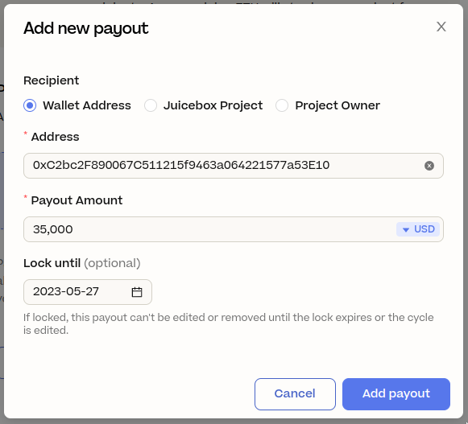

:::info About
Code4rena allows projects to run community-driven contests for smart contract audits – Code4rena contests have several advantages over traditional audits and bug bounty programs, and are particularly well suited for DeFi and other Ethereum projects. To learn more, read their [documentation](https://docs.code4rena.com/)

Juicebox is an Ethereum funding protocol which can help you fund, operate, and scale your project on-chain – if you're not already familiar with how the protocol works, read [this document](/user/).
:::

## Overview

Code4rena is a great option for projects looking to audit their smart contracts, but it can be difficult to put together funds for bounties. Using Juicebox, you can *crowdfund* an audit instead:

1. Set up a Code4rena contest and figure out your budget.
2. Deploy a Juicebox project and begin accepting ETH from your supporters. You can pre-program your Juicebox project's rules so that no funds can be taken out while the fundraiser takes place. Later on, you can update your project such that it can pay for the audit.
2. In exchange for supporting your project with ETH, your community will receive your project's tokens (or NFTs).
3. If you fail to meet your budget, you can allow your token holders to cash out their tokens for a full refund. If you *exceed* your budget, token holders will be able to redeem for a proportional share of the surplus.

Regardless of whether or not your budget is met, you'll have an on-chain record of support which you can use for airdrops, whitelist access, governance, or other rewards in the future. And if you continue to use Juicebox, you can continue to evolve your project over time to manage tokenomics, payouts, and funds.

Another benefit to this process is trustlessness. With a properly configured Juicebox project, supporters can be sure of your next steps at all times, meaning that even an anonymous community member could help fund and run an audit.

## Steps

### 1. Create your audit

First, apply for an audit on [Code4rena.com](https://code4rena.com/). Open the home page, click on "Get your project audited", and fill out the form to submit a request. A Code4rena contributor will reach out with further information and help you to put together a reasonable budget and timeline for your project.

### 2. Start your project

Once you have a budget, visit [juicebox.money](https://juicebox.money/) to create your project – start by clicking "Create a project" on the home page.

A form will appear asking for your project's details. Your description should clearly explain that the project is raising funds for your audit and answer common questions. Be sure to add links to the contest and your Discord server under "project links".

### 3. Cycles

The next page will ask you how you want to set up your cycles.

With unlocked cycles, you can edit your project's rules at any time.

With locked cycles, you can lock your project's rules for a period of time (like 3 minutes, 2 years, or 14 days), helping you build trust with your supporters.

If you try to edit your rules in the middle of a locked cycle, the edits get queued for the next cycle. In other words: instead of going into effect immediately, they go into effect when your next cycle starts. If your don't queue a new cycle, Juicebox copies your current rules over.

For now, choose a **locked cycle** with a duration which will last until the time when Code4rena will need funds from you – for example, if Code4rena were to say they needed funds a week from the time you launch your project, you would use a 7 day locked cycle. This shows your community that you won't change your project's rules until then.

If you don't want to launch your project immediately, you can schedule a future date using "Schedule launch". Your first cycle will start at that time. Once you're ready, move on to the next tab.

### 4. Payouts

Since you want to keep all funds in the project for now, you can select **None** and move on to the next tab.

### 5. Tokens

For this style of project, the **Basic Token Rules** work well – if you would like to customize your tokenomics now or later on, visit the [Project Setup Guide](/user/project/#token).

If you would like to use NFTs instead of tokens, read the note below. Otherwise, you can move on to the **Deadline** tab.

Using NFTs

If you would prefer to use NFTs with custom artwork instead of tokens, you should select "Custom Token Rules" and set the total issuance rate to 0, turning off token minting completely.

Then, move on to the NFT tab and add your NFT tiers by clicking "Add NFT". To learn about how you can customize your projects NFTs, see the [Project Setup Guide](/user/project/#nfts).

### 6. Deadline

Edits must be made before this deadline. This gives token holders time to verify the edits before they take effect, and assures them that you can't edit the cycle at the last second.

For example: with a 3-day edit deadline, edits must be made at least 3 days before a cycle starts. Otherwise, those edits won't take effect until the cycle *after* the next one.

For a fast-paced fundraiser, a 1-day deadline strikes a good balance, giving the community enough time to verify updates while giving the project owner sufficient flexibility. Having no deadline is not recommended, as it would allow a project creator to change the next cycle right before it went into effect, potentially rugging the community.

The other rules below can be left on their default options.

### 7. Deploy

When you move to the next tab, you'll see a summary of the rules you've set up so far. Verify each tab, and once you've read and accepted the terms of service and the risks, click "Deploy project to Ethereum".

### 8. Next Steps

From here, you'll be taken to your project page and given the option to set the project's handle, deploy an ERC-20, or take several other actions. Don't worry about these for now – you can do them later.

Once you announce your project and share it with your community, you can share any plans you may have to reward supporters in the future.

You'll want to queue your next cycle *before* your edit deadline – if you chose the 1-day deadline, this would be at least 24 hours before the next cycle began.

Setting up your next cycle

To update your project's cycle, visit your project's page on [juicebox.money](https://juicebox.money) and connect the wallet which you used to deploy the project.

**If you haven't met your budget goal,** no changes are needed. Announce this to your community, and they will be able to cash out their tokens for a full refund (less gas fees) at any time.

**If you've met your budget goal,** open the "Settings" menu in the upper-right hand corner of the screen and navigate to the "Cycle" tab on the left-hand side of the settings page.

Click on "Funding" to set up your new payouts – since you'll only be paying for the Code4rena audit (for now), select **Amounts**.

Next, click "Add payout" below – you'll want to send the payout to the Code4rena treasury ([`0xC2bc2F890067C511215f9463a064221577a53E10`](https://etherscan.io/address/0xC2bc2F890067C511215f9463a064221577a53E10) as of 2023-05-20).

Enter your audit's budget as the payout amount. Make sure it's denominated in USD, and that it is locked for at least several days into the following cycle.

A payout with a budget of 35,000 USD

Click "Add payout", and then click "Save funding configuration" below. Afterwards, scroll down, click "Deploy cycle", and approve the transaction with your wallet.

If you have any other questions or need help planning your next steps, join the [JuiceboxDAO Discord](https://discord.gg/juicebox) and tag `filipvv` in a message.
