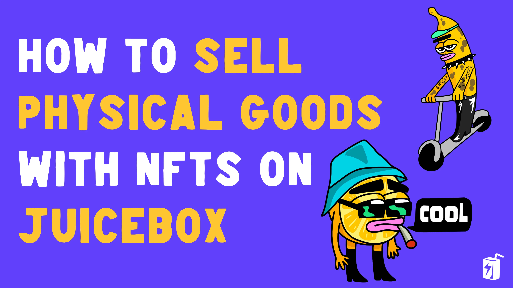
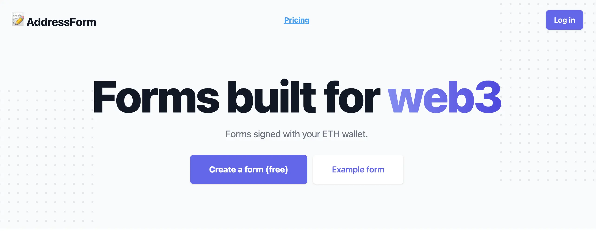
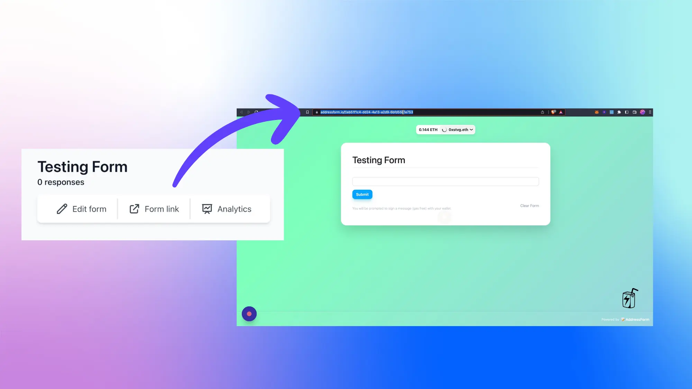
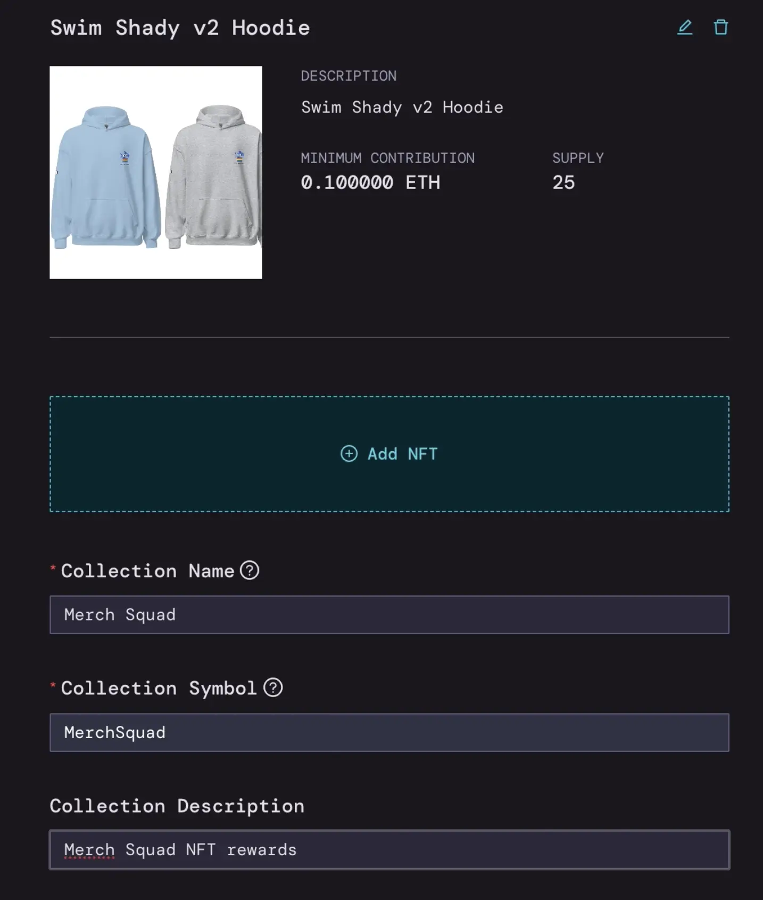
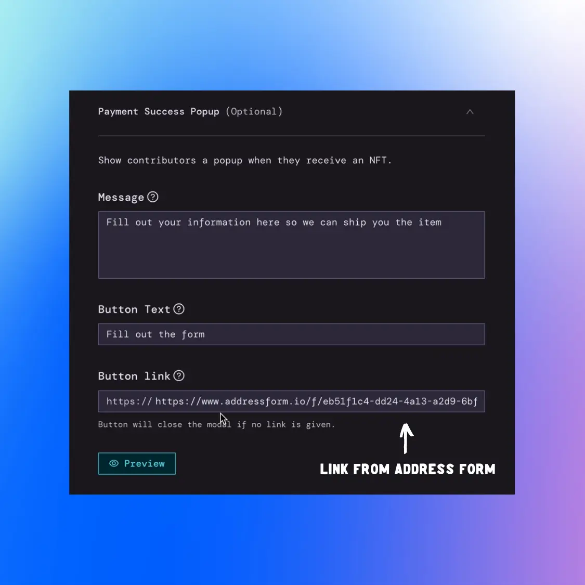
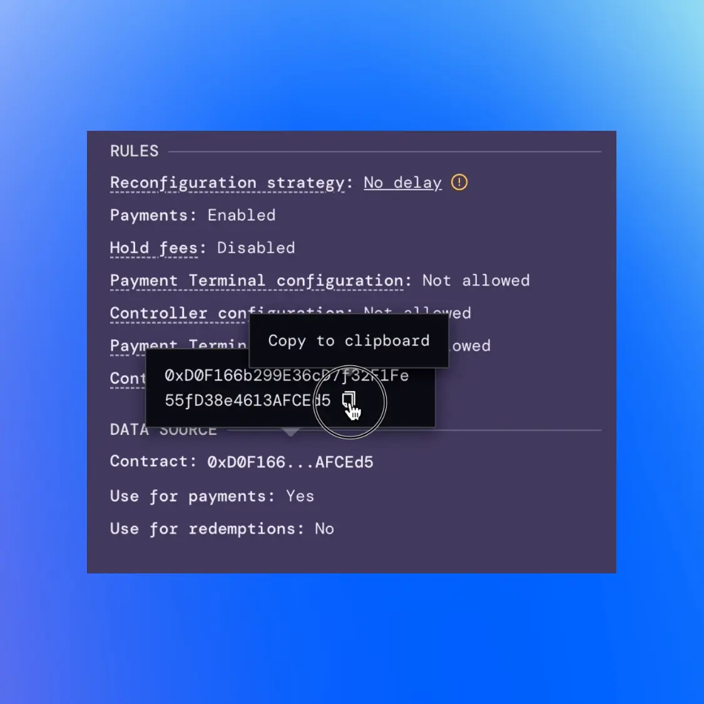
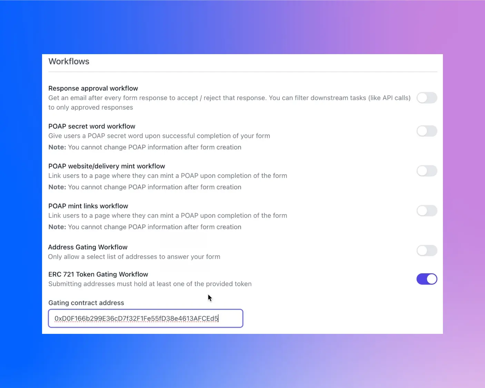
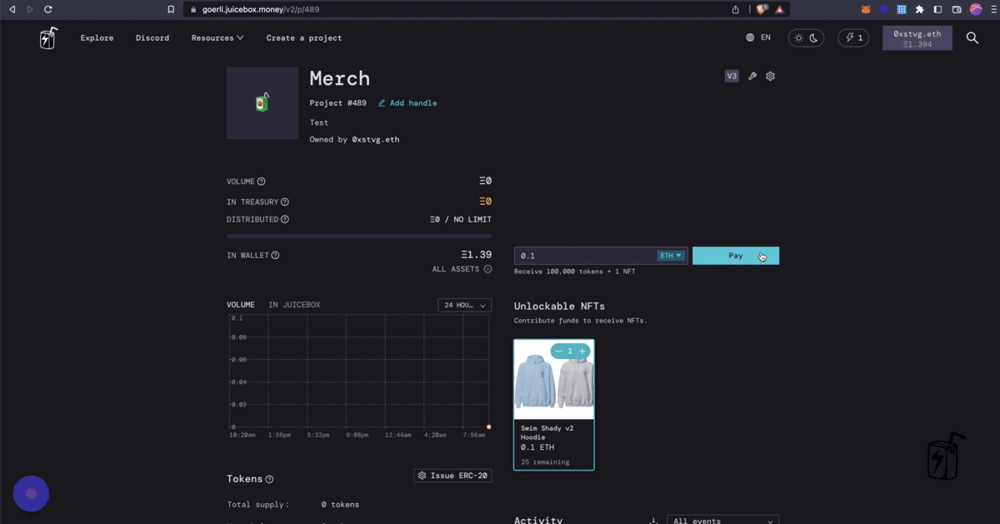

Selling physical goods as NFTs on Juicebox is a powerful way for creators to expand their revenue streams and offer unique experiences to supporters of their project. Whether you're selling merch, physical artworks, or other IRL goods, you can create NFTs on Juicebox to token gate an [AddressForm](https://addressform.io/) with the shipping details needed to ship the items to supporters of your project.

In this tutorial, JuiceboxDAO contributor [STVG](https://twitter.com/0xSTVG) pairs an NFT from a Juicebox project with a physical item in 5 simple steps and no coding required.

You can follow along in the video tutorial on JuiceboxDAO YouTube or the step-by-step guide in this article.

<iframe width="560" height="315" src="https://www.youtube.com/embed/KGIvewBKuCk" title="YouTube video player" frameborder="0" allow="accelerometer; autoplay; clipboard-write; encrypted-media; gyroscope; picture-in-picture; web-share" allowfullscreen></iframe>

### Step 1: Create a Form Using AddressForm

*Address Form is a web3 form builder built by [pbrianandj](https://twitter.com/pbrianandj), a software engineer at [NounsDAO](https://twitter.com/nounsdao). You can create token gated forms, distribute POAPs, sign with wallet addresses, and more.*

Go to [addressform.io](http://addressform.io) and create a form. You can edit the form details later to include all of the information needed from buyers but first you'll need to grab the form's URL to connect it to your Juicebox NFT.

### Step 2: Add NFTs on Juicebox

From here you can start to create or edit your Juicebox project and add your NFTs (Name, Description, Collection Name, and Token Symbol). For this example, STVG is selling merch of Swim Shady, the nickname for one of [SharkDAO](https://sharks.wtf/)'s iconic [Nouns](https://nouns.wtf/).

### Step 3: Add AddressForm URL to Juicebox Payment Success Popup

Next, click on the dropdown for `Payment Success Popup`. This is where you can direct supporters to your AddressForm once they have purchased an NFT. In the `Message` field, you can specify what type of information they'll provide via the AddressForm. For `Button link`, you can copy the link from your AddressForm and paste it into this field. **This step is critical** so make sure to double check everything before you deploy your project.

### Step 4: Deploy Project and Copy Contract Address

Now you can deploy your Juicebox project and copy the `Contract Address` which can be found on your Project Page under `Funding Cycle > Cycle x > Data Source` at the bottom. You can hover over the address and click to copy it to your clipboard.

### Step 5: Token Gate the AddressForm using the Contract Address

Go back to AddressForm and edit the form to include whatever information you need (e.g. shipping address, phone number, email) to send the item to whoever purchases the NFT. Save your changes.

Under `Workflows` you'll see a toggle at the bottom for `ERC 721 Token Gating Workflow`. Turn this on and paste in the contract address that you copied from your Juicebox project. Save the changes and voila!

:::info
By token gating the form with the contract address, only people that hold NFTs from your Juicebox project will be able to access the form.
:::

Now when a supporter purchases an NFT from your Juicebox project, they'll be prompted to fill out your AddressForm so that you can send the item to their address.

If you need help along the way, jump into the Support channel in [Juicebox Discord](https://discord.gg/juicebox).

📰 [Subscribe to the Juicebox newsletter](https://subscribepage.io/juicenews)

🚀 [Browse trending projects on Juicebox](https://juicebox.money/projects)

📹 [YouTube Tutorials](https://www.youtube.com/c/JuiceboxDAO)

🐦 [Juicebox on Twitter](https://twitter.com/juiceboxETH)
