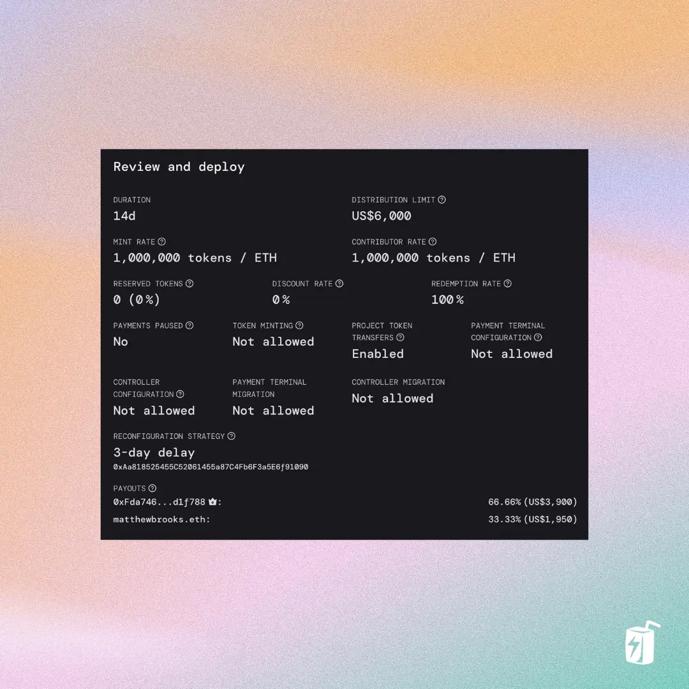

# How to Reconfigure Your Juicebox Project

Once you’ve created a Juicebox project—whether you’re a content creator, a DAO, a non-profit, or another type of project—you might want to change how your project is configured. Maybe you need to add or remove payouts, adjust your tokenomics, or add NFTs. All of these things and more can be done by reconfiguring your project.

Follow this step-by-step guide or check out this YouTube video:

<iframe width="560" height="315" src="https://www.youtube.com/embed/--6EGozgEZo" title="YouTube video player" frameborder="0" allow="accelerometer; autoplay; clipboard-write; encrypted-media; gyroscope; picture-in-picture; web-share" allowfullscreen></iframe>

## Before you start

Before you get started, you'll need to have:

- A Juicebox project for which you are the owner

Head over to [juicebox.money](http://juicebox.money) and connect your wallet. You can hover over your wallet address in the top right corner and click “My Projects” to find your project.

For this tutorial, I made a quick project on Goerli called [The Bone Zone](https://goerli.juicebox.money/v2/p/443), which is a community and educational resource for dog lovers. We have some tiered NFTs that have utilities such as dog-safe treat recipes, breed-specific playtime activities for dogs, and a few limited 1-on-1 virtual dog coaching sessions.

## Getting started

On your project page scroll down to `Funding cycle` and you’ll see a button that says `Reconfigure upcoming`.

Click that and you’ll be brought to the `Reconfigure Funding Cycle` page that lets you review and change many of your project settings. Keep in mind that any changes made won’t take place until the next Funding Cycle. So, depending on how long your funding cycle is (ours is set to 14 days), your changes may not take effect for a number of days. Another thing to keep in mind is the `Reconfiguration Rules` that you have set, specifically the Delay Period which by default is 3 days. A 3-day delay means that reconfiguring an upcoming funding cycle **must** be done at least **3 days** before it starts.

At the top of the `Reconfigure Funding Cycle` page, you’ll see a countdown that lets you know exactly how much time is left to submit your changes for the next funding cycle. So for this project we have about 6 days and 22 hours left to submit.

For this example, I’m going to add a payout for my project.

## Step 1: Reconfigure Funding

I’ll click `Funding` which will show my current `Funding cycle duration` and `Payouts`. Right now we have a 14-day funding cycle and a `Distribution Limit` of $5,000 USD, so that’s the max that can be withdrawn from the project treasury per 14-day funding cycle.

At the moment, any funds distributed will go to the project owner, which is me, so I’ll click `Add payout recipient` and I’ll add my partner Matthew.

In this example, Matthew is joining the team as a developer for this project and I want to add a payout so that he can get paid trustlessly and transparently from the project’s treasury. I’ll add a payout of $2500 USD to matthewbrooks.eth.

This will be added to our `Distribution Limit` for a total of $7,500 USD. If we don’t reach that target, no worries, he will receive 33% of all funds withdrawn and the project owner (me) will receive the other 66%.

Another way to set-up our payouts is with `Percentages`. If we choose this option, Matthew will receive 33% of all funds distributed and the project owner (me) will receive the other 66%. **The difference between this and Amounts** is that our `Distribution Limit` is now `Infinite`, so we can distribute as much as we want from the project treasury. This is a flexible strategy but can be seen as a risk to supporters of the project.

If I **switch back** to `Amounts`, I’ll be prompted to set a **new** `Distribution Limit`. I’ll set this limit to $6,000 USD, which will be the max that can be withdrawn per 14-day funding cycle. If we withdraw the maximum of $6,000 USD, $2000 will go to Matthew and $4000 to me as the project owner, minus the 2.5% Juicebox membership fee.

:::info
Juicebox does not currently support stablecoins like USDC or DAI, so all USD values are **ETH denominated in USD.**
:::

Once I’m done, I’ll click `Save funding configuration` at the bottom.

## Step 2: Reconfigure Tokens

The next section is `Token`. Here we can change the `Mint rate` which is the number of tokens minted per ETH contributed. We can also set our `Reserved Rate` which is the % of tokens set aside for addresses on the reserved list, `Discount rate` which decreases token issuance by a certain percentage each funding cycle, and `Redemption rate` which determines how much overflow each token can be redeemed for. Stay tuned for our deep dive tutorial on how to set-up your project’s tokenomics.

## Step 3: Reconfigure Rules

In the next section you can adjust the `Rules` for your project. For example, maybe you need to `Pause payments` or enable `Redeemable NFTs` so contributors can burn their NFTs for a portion of the project’s overflow. If you scroll down, you can also change the `Delay Period` for your project. This is 3-day by default but can also be set longer or shorter. Projects set to `No delay` present risks for supporters: for example, a reconfiguration could be submitted at 11:59pm before the next funding cycle starts at midnight. The delay period helps mitigate this risk.

## Step 4: Reconfigure NFTs

Last but not least, you can configure your project’s NFTs. You can edit existing NFTs by clicking on them, remove them with the trash icon, or add new NFTs. If you’ve made changes to this section, you’ll need to click `Deploy NFTs` and confirm the transaction in your browser wallet. If you need, you can also edit the collection name and description, click `Save collection details` when finished, and confirm the transaction in your browser wallet.

## Step 5: On-chain memo and start time

Before submitting our reconfiguration, we can add an on-chain `Memo` to let supporters know why changes were made or just to leave a note. I’ll add a memo that says “Welcoming Matthew to the team!” and I’ll attach a Banny sticker with hearts.

We can also specify a `Start time` as a UNIX timestamp, but we’ll leave this blank so that our reconfiguration will take effect as soon as possible.

## Step 6: Review and Deploy

Once you’re done, you’ll see a summary of your project settings below. So now our `Distribution Limit` is set to $6,000 and we can see the two payouts: one to Matthew and the other to the project owner. Please note that these USD amounts take into account the JBX membership fee. Once you’ve reviewed everything, you can click `Deploy funding cycle configuration` and confirm the transaction in your browser wallet.

And that’s it! You’ve successfully reconfigured your project.

Once we refresh our project page, we can see that we successfully reconfigured our project’s funding cycle. You can also click on `Upcoming` under `Funding Cycle` to see the details of our newly configured cycle: when it starts and ends, etc.

If you have any questions or need help along the way, drop into the Support channel in [Juicebox Discord](https://discord.gg/juicebox).
