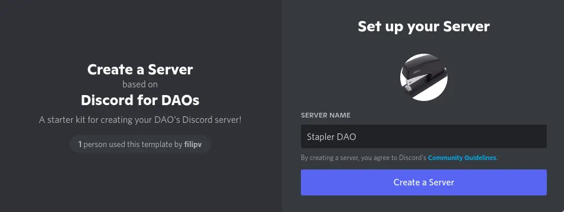
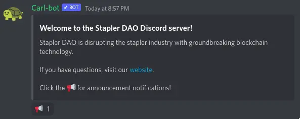
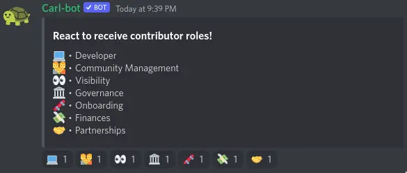
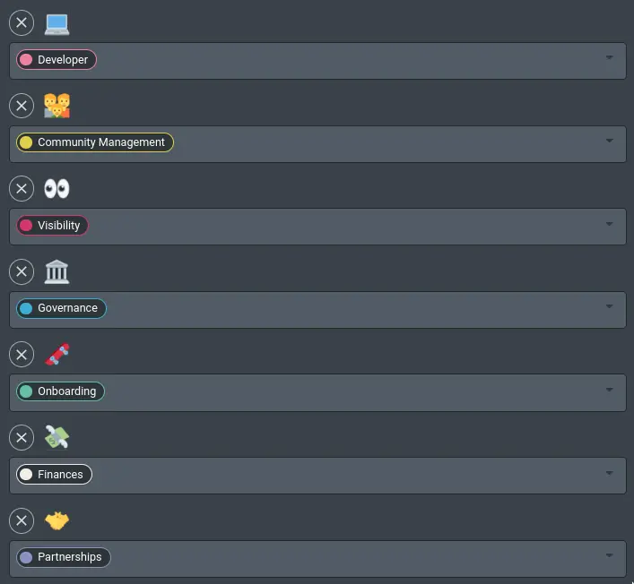
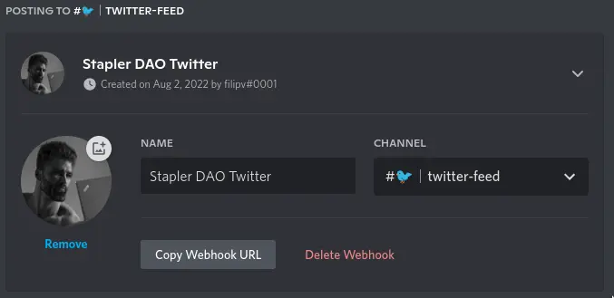
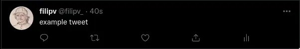
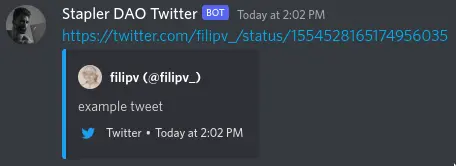

# Discord Server Templates

Discord is among the most popular social platforms in crypto. It allows users to create free, invite-only servers for their communities. Discord servers support messaging across multiple channels, voice/video calls, and the configuration of complex permission structures. Discord also supports bots and other automations through its API.

## Get Discord

If you don't already have an account, create one at [discord.gg](https://discord.gg). You can access Discord via a web browser or through its native apps on Windows, macOS, Android, iOS, or Linux. If you are a complete beginner, take a look at Discord's [beginner's guide](https://support.discord.com/hc/en-us/articles/360045138571-Beginner-s-Guide-to-Discord).

## 1. Templates

:::info
Need a different template? Ask in the [Juicebox Discord](https://discord.gg/juicebox).
:::

First, pick a template to automatically configure channels, roles, permissions, and server settings.

|Template|Description|
|-|-|
|[Discord For DAOs](https://discord.new/qsCbV9HGreJU)|This server works best for crypto-native communities and projects building in the open.|
|[Discord For NFT Projects](https://discord.new/qYBEFhjzTpA5)|This server works best for NFT projects using Juicebox to manage revenues.|



<p class="subtitle">Name your server and upload a logo.</p>


You will be brought to your new Discord server! Acquaint yourself with the preconfigured channels and roles.

### 1.1 Note on Permissions

Discord permissions are *cumulative*—users gain permissions from all of their roles, with positive permissions overriding negative ones. Channel permissions and category permissions behave differently; they override the permissions of users and roles within specific channels. All of the templates come with sensible defaults: non-admin users will not be able to send messages or create discussion threads within information/announcement channels.

To test a role's permissions, click on your server's name (at the top of your channels list), and navigate to your `Server Settings`. Navigate to the `Roles` page, and click on the role you would like to test. Within the `Display` tab, scroll to the bottom and select `View Server as Role →`. This will let you test what actions the role can take and what channels it can see.

## 2. Server Settings

Click on your server's name (at the top of your channels list), and navigate to your `Server Settings`. Our templates come with sensible defaults, but you may desire to reconfigure the following options:

|Setting|Sidebar Menu|Description|
|-|-|-|
|**Show Boost progress bar**|Overview|When enabled, a server boost progress bar will display in your channel list. Server boosts allow for further customization.|
|**Upload Emoji**|Emoji|Add custom emojis that anyone can use in your server.|
|**Upload Sticker**|Stickers|Add custom stickers that anyone can use in your server.|
|**Verification level**|Safety Setup|The criteria users must meet before they can send messages.|
|**Enable 2FA Requirement**|Safety Setup|Require members with moderation powers to have two-factor authentication enabled. This setting is recommended.|

## 3. React Roles and Embeds

*React roles* allow server members to easily self-assign roles by reacting to a message. The Discord bot [carl.gg](https://carl.gg) allows server owners to set up react roles, write custom embeds, and configure automod features if desired. To add carl.gg to your server:

1. Visit [carl.gg](https://carl.gg), sign in with your Discord account, and click `Manage` on the home page.
2. Select your server in this menu. You will be redirected to a Discord authentication page. Click `Continue`, then scroll down and click `Authorize`. You may need to fill out a captcha.
3. You will be redirected back to [carl.gg](https://carl.gg). Click `SKIP` to open your dashboard.

### 3.1 Your "README"

1. Open your server's [carl.gg dashboard](https://carl.gg/dashboard/).
2. Open the `Reaction roles` page in the sidebar. Click `Create new reaction role`.
3. In the Mode category, select `Post embed` and select your `#✨｜read-me` channel. Then click `Show embed builder`.

Type a brief server intro using the `Title` and the `Description` fields. This message will be the first thing users see when they join your Discord server. You can format this message with [markdown](https://www.markdownguide.org/cheat-sheet/).

**The title:**
```text
Welcome to the Stapler DAO Discord server!
```

**With the description:**
```text
Stapler DAO is disrupting the stapler industry with groundbreaking blockchain technology.

If you have questions, visit our [website](http://info.cern.ch/).

Click the 📢 for announcement notifications!
```

**Will be formatted like so:**


Once your message is written, click `Add emoji`, select the loudspeaker emoji, and select the announcements role. Users that click the loudspeaker will now be notified when you tag the `@announcements` role. Click `Create` to publish your message.

### 3.2 Contributor Roles

1. Open your server's [carl.gg dashboard](https://carl.gg/dashboard/).
2. Open the `Reaction roles` page in the sidebar. Click `Create new reaction role`.
3. In the Mode category, select `Post embed` and select your `#✨｜read-me` channel. Then click `Show embed builder`.
Fill out the `Title` and `Description` fields with a brief description of your contributor roles.

**The title:**
```text
React to receive contributor roles!
```

**With the description:**
```text
💻・Developer
👪・Community Management
👀・Visibility
🏛️・Governance
🛹・Onboarding
💸・Finances
🤝・Partnerships
```

**Will be formatted like so:**



Once your message is written, click `Add emoji` to add reaction emojis and their corresponding roles. These should be added one at a time, with each emoji corresponding to one role:



Click `Create` to publish your message.

### 3.3 Links Embed

A links embed will guide your community to DAO's resources and websites. To create one:
1. Open your server's [carl.gg dashboard](https://carl.gg/dashboard/). Open the `Embeds` page in the sidebar.
2. Fill out the `Title` field—*Stapler DAO Links*, for example.
3. Add your links to the `Description` field, formatted in [markdown](https://www.markdownguide.org/cheat-sheet/). An input of `[Juicebox Docs](https://docs.juicebox.money)` will be formatted to: [Juicebox Docs](https://docs.juicebox.money). If you have many links, you may want to separate them with bolded category titles. An input of `**Example Text**` will be formatted to: **Example Text**.
4. Select your `#🔗｜links` channel in the `Destination` field. Click `Post` to publish your links embed.

## 4. Twitter Feed

[IFTTT](https://ifttt.com/) allows you to create simple automations for popular web services. IFTTT's free plan will allow you to create a live Twitter feed in your Discord server:

1. Open your server's settings and open the `Integrations` page.
2. Click `Create Webhook`. Assign a screen name and profile picture here. Assign this integration to the `#🐦｜twitter-feed` channel.



<p class="subtitle">An example webhook configuration</p>

3. In a new tab, open [IFTTT](https://ifttt.com). If you do not already have an account, [create one at ifttt.com/join](https://ifttt.com/join).
4. Sign in to IFTTT and navigate to [ifttt.com/create](https://ifttt.com/create).
5. Click `Add` next to *If This* and select the `Twitter` service. Select the `New tweet by you` trigger.
6. Add your Twitter account and select it. If desired, you can include retweets and @replies. Click `Create trigger`.
7. Click `Add` next to *Then That* and select the `Webhooks` service. Select the `Make a web request` action.
8. Open your webhook in your server's settings, and click `Copy Webhook URL`. Paste this URL in IFTTT's `URL` field.
9. Select `POST` as your Method. Select `application/json` as your Content Type. Paste this into the Body field:
```json
{ "content":"{{LinkToTweet}}" }
```
10. Click `Create action`, `Continue`, and `Finish`.

**The Tweet:**



**Will be rendered like so:**



## 5. Next Steps

You are done! Optionally:
- To enable features like discovery, server metrics, and a welcome screen, navigate to the `Enable Community` page in your server settings and click `Get Started`.
- Add new categories and channels for different languages.
- Add new reaction roles with [carl.gg](https://carl.gg).
