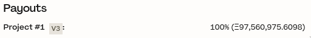

# v1 Payouts Post Mortem

```md
Author: filipv
Date: 2023-05-06
Severity: Medium
Status: Resolved
```

In [JBP-372](https://www.jbdao.org/p/372), I proposed to move all ETH remaining in [JuiceboxDAO v1](https://juicebox.money/p/juicebox) to the v3 [JuiceboxDAO](https://juicebox.money/@juicebox) project.

[JBP-372](https://www.jbdao.org/p/372) was approved on 2023-04-29 at 00:00 UTC. On 2023-04-29 at 20:20 UTC, I queued a [`TerminalV1.configure(...)`](/docs/v4/deprecated/v1/api/terminalv1.md#configure) transaction on JuiceboxDAO multisig [nonce 231](https://app.safe.global/transactions/tx?safe=eth:0xAF28bcB48C40dBC86f52D459A6562F658fc94B1e&id=multisig_0xAF28bcB48C40dBC86f52D459A6562F658fc94B1e_0xaea2f53b25d9ef824f1d8fff9e850da45852a3ef222237448a8e1362ef3b8a37) using the [juicebox.money](https://juicebox.money) Gnosis Safe App.

Before this transaction, [JuiceboxDAO v1](https://juicebox.money/p/juicebox) had the following `_payoutMods`:

```js
[
  [
    false,
    10000,
    0,
    0xAF28bcB48C40dBC86f52D459A6562F658fc94B1e,
    0x1eb759829b1a3d55193472142f18df3091BcAc4B,
    1
  ]
]
```

The v1 `PayoutMod` data structure is as follows:

```sol
struct PayoutMod {
    bool preferUnstaked;
    uint16 percent;
    uint48 lockedUntil;
    address payable beneficiary;
    IModAllocator allocator;
    uint56 projectId;
}
```

Because this `PayoutMod` was already in place, all that was required to implement [JBP-372](https://www.jbdao.org/p/372) was to raise the `FundingCycleProperties.target` (the total amount which can be paid out from the project). Accordingly, I queued the transaction by navigating to the v1 JuiceboxDAO project, clicking on "Edit Upcoming Cycle", and then clicking on "Cycle" and updating the "Funding Target" to 100,000,000 ETH.

The upcoming cycle preview looked like so:



The `v3` icon indicates that the payout is allocated to the project's v3 payment terminal, as was desired. This was inaccurate – due to a bug which has not yet been identified and mitigated, [changing a v1 project's funding target on juicebox.money sets the allocator field on its `_payoutMods` to the zero address](https://discord.com/channels/775859454780244028/866040669712678942/1104607423823614003). The v3 icon was displayed erroneously – the cause for this has also not yet been identified. Therefore, instead of queuing with correctly unchanged `_payoutMods`, the `_payoutMods` were modified like so:

```js
[
  [
    false,
    10000,
    0,
    0xAF28bcB48C40dBC86f52D459A6562F658fc94B1e,
    0x0000000000000000000000000000000000000000,
    1
  ]
]
```

In other words, the payout remained the same but with the allocator removed. I failed to identify this discrepancy when [queuing or simulating the transaction](https://discord.com/channels/775859454780244028/991382812718551060/1102004295479595019). Multisig signers similarly failed to identify this discrepancy when reviewing the transaction: the transaction received the 9 requisite signatures and was executed on 2023-05-03 at 17:31 UTC.

The cycle went into effect on 2023-05-06 at 19:19 UTC. While the incorrect `_payoutMods` were active, an exploiter could have called the public [`TerminalV1.Tap(...)`](/docs/v4/deprecated/v1/api/terminalv1.md#tap) transaction, causing the v1 JuiceboxDAO project to pay its balance to itself, keeping ETH balances the same but cumulatively issuing ~26,021,536 v1 JBX to the multisig and v1 reserved recipients in the process. Because the ETH would have remained in the v1 JuiceboxDAO project, an exploiter could have executed this transaction multiple times until they reached the funding target of 100,000,000 ETH.[^1]

At 22:46 UTC on 2023-05-06, jango directly messaged me via Discord:

> https://juicebox.money/p/juicebox
>
> is the payout set from v1 to itself here? or to the v3 treasury?
>
> it says there will be tokens generated
>
> hmm
>
> if this is the case, we need to get multisig to edit the payouts asap

After confirming the issue, jango suggested calling [`ModStore.setPayoutMods(...)`](/docs/v4/deprecated/v1/api/modstore.md#setpayoutmods) to change the payout and disabling the "Send payouts" button on [juicebox.money](https://juicebox.money) until this was done.

At 22:54 UTC, I created a Discord group message with jango, aeolian, johnnyd, and peri and explained the situation.

At 23:02 UTC I hid the "Send payouts" button from the v1 JuiceboxDAO project page in commit [24b52a3](https://github.com/jbx-protocol/juice-interface/commit/24b52a32382d3246e824028fe662d05a0522e411).

At 23:09 UTC, I created a private channel in the JuiceboxDAO Discord server and shared the following message:

> @Multisig URGENT:
>
> The most recent `configure` transaction to the v1 project had incorrectly programmed `_payoutMods`, meaning the payouts would be sent into treasury itself rather than going to the `V1Allocator` as intended.
>
> We have disabled the `Send payouts` button in the frontend, and @jango#0420 is queuing a transaction to fix this by updating the payout within the current target
>
> @Multisig get access to your wallets as soon as possible and stay on standby for a quick sign + execution.

At 23:12 UTC, I began notifying multisig members of the situation via Discord and Telegram messages, directing them to the private channel.

At 23:14 UTC, jango queued the [`ModStore.setPayoutMods(...)`](/docs/v4/deprecated/v1/api/modstore.md#setpayoutmods) transaction to add the [`V1Allocator`](https://etherscan.io/address/0x1eb759829b1a3d55193472142f18df3091BcAc4B) to the `_payoutMods` on [nonce 234](https://app.safe.global/transactions/tx?safe=eth:0xAF28bcB48C40dBC86f52D459A6562F658fc94B1e&id=multisig_0xAF28bcB48C40dBC86f52D459A6562F658fc94B1e_0xa4061f82799c89de266baaa16e92eaf484bfba5c35bbfa175e38383faf38441e) and shared information to help signers verify the transaction in the newly created channel.

At 23:43, 0XBA5ED confirmed the issue via simulation.

Multisig signers verified and signed [transaction 234](https://app.safe.global/transactions/tx?safe=eth:0xAF28bcB48C40dBC86f52D459A6562F658fc94B1e&id=multisig_0xAF28bcB48C40dBC86f52D459A6562F658fc94B1e_0xa4061f82799c89de266baaa16e92eaf484bfba5c35bbfa175e38383faf38441e), which was executed by Dr. Gorilla on 2023-05-07 at 01:01 UTC.

The "Send payouts" button was restored in commit [610e65e](https://github.com/jbx-protocol/juice-interface/commit/610e65ea4899f4269a6bfdc03ca839e47d0de4ae).

The contents of the private channel are available [here](https://docs.juicebox.money/fix-v1-project.html).

To prevent a similar situation from taking place in the future:

1. I have created [v1 API Documentation](/docs/v4/deprecated/v1/api/README.md). The existing v1 documentation was disorganized and difficult to use, making it difficult for signers to accurately verify transactions.
2. The multisig should create a better simulation/fork testing process for transactions. Simulating an attempt to send the payouts after the cycle had been updated would have caught this issue.
3. The issues in [juicebox.money](https://juicebox.money) should be identified and fixed.
4. We should continue to work towards winding down the DAO's v1 and v2 projects, which I [proposed this cycle](https://snapshot.org/#/jbdao.eth/proposal/0x622de9370ec22833962b5630680f93dd9e1b8380af9a42d747a166337a7ab229). The DAO's best tooling is built for the most recent protocol contracts, and multisig signers are most familiar with their transactions.

[^1]: The v1 project had a reserved rate of 50%, of which each individual recipient is given 2.8% (1.4% of total issuance). In a theoretical worst-case scenario, one or more malicious reserved rate recipients could have called the [`TerminalV1.Tap(...)`](/docs/v4/deprecated/v1/api/terminalv1.md#tap) function 111,460 times, at which point the project would have paid 100,000,000 ETH into itself and issued 2,900,360,429,290 JBX. Calling [`TerminalV1.Tap(...)`](/docs/v4/deprecated/v1/api/terminalv1.md#tap) with the needed input data uses 210,851 gas. At block [17205270](https://etherscan.io/block/17205270) the base fee per gas was 107.086095215 Gwei. At this cost, assuming no further optimizations, it would cost an attacker ~0.023 ETH per `Tap`, for which each reserved rate recipient would receive ~364,301.5 JBX. It would cost ~2,516.68 ETH to execute the theoretical maximum number of `Tap`s. Given that the v1 project had no ETH available for redemption, and that the v3 project has redemptions disabled, this would not lead to a loss of funds, but would still pose a risk to [JuiceboxDAO governance](https://docs.juicebox.money/dao/process/README.md). Each reserved rate recipient's JBX balance would tend towards 1.4% of the total JBX supply, but given that the multisig's JBX is not used for voting, other JBX holders would be rapidly diluted and each of the 25 v1 reserved rate recipients would constitute one twenty-fifth, or 4% of the total vote. Given the current Snapshot approval threshold of 66%, at least 17 of the recipients would need to conspire to guarantee overtaking JuiceboxDAO governance, which would cost them massive amounts of ETH in the process. Given how unlikely this scenario would be, griefing was the most pressing risk.
