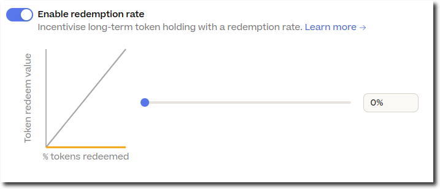
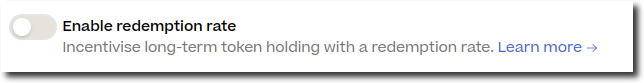
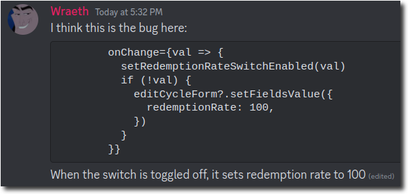

```
Author: filipv
Date: 2023-10-26
Severity: High
Status: Resolved
```

On 26th October 2023, a client-side error in the Cycle configuration tab of the [Artizen](https://juicebox.money/@artizenfund) project on juicebox.money led to an incorrectly queued cycle: although the project owner (Rene, or nene❤.eth) intended for his project to have a 0% redemption rate, the cycle was queued with a redemption rate of 100% and a ballot redemption rate of 0%.

Rene deployed his project 13 days ago (on 2023-10-13) to receive funds from [JBP-443 - Artizen x Juicebox matchfund](https://snapshot.org/#/jbdao.eth/proposal/0xf51ac8f75966c2daa1dcda3291536a3695de5ae374457d633e7ac0d14cd123a2). The Artizen project was deployed with funding cycle duration of 0 (unlocked cycle). Today (October 26th), Rene and I got on a call to update the cycle for the upcoming Artizen season.

The project was initially deployed with redemptions disabled (a 0% redemption rate). Rene intended for redemptions to be disabled during this cycle, and when reviewing the token settings, saw the following UI:



Wanting to ensure that redemptions were impossible, he disabled the "Enable redemption rate" option like so:



He then made several other changes and deployed the changes through the frontend. His cycle was queued with the following [`JBFundingCycleMetadata`](/docs/v4/deprecated/v3/api/data-structures/jbfundingcyclemetadata.md):

```json
{
    JBGlobalFundingCycleMetadata: {
        allowSetTerminals: true,
        allowSetController: true,
        pauseTransfers: false,
    },
    reservedRate: "5000",
    redemptionRate: "10000",
    ballotRedemptionRate: "0",
    pausePay: false,
    pauseDistributions: false,
    pauseRedeem: false,
    pauseBurn: false,
    allowMinting: false,
    allowTerminalMigration: true,
    allowControllerMigration: true,
    holdFees: false,
    preferClaimedTokenOverride: false,
    useTotalOverflowForRedemptions: false,
    useDataSourceForPay: false,
    useDataSourceForRedeem: false,
    dataSource: "0x0000000000000000000000000000000000000000",
    metadata: "0"
}
```

In other words, his redemption rate was set to 100%, and his ballot redemption rate was set to 0%. I did not notice this during the call, but spotted it while double-checking the project's configuration afterwards. I then got on a call with Jango, Wraeth, and Matthew to discuss.

Wraeth then found the bug and began addressing it shortly afterwards:



Jango suggested the following remedial course of action:

1. Archive the old project (hiding it on juicebox.money), and queue a cycle to return its current balance to JuiceboxDAO.
2. Deploy a new, correctly configured project. Enable token minting at first to account for outstanding balances, and then lock the cycle with the right settings.
3. Transfer the project to Rene.
4. Update the `artizenfund.eth` ENS record to point to the new project.

Jango also offered to use his own funds to cover the 6.02 ETH currently in the project until it can be returned to JuiceboxDAO. After a brief call with Rene, I was able to confirm this course of action.

### Mitigation

We'll address the current situation and minimize the likelihood of similar events in the future with the following steps:

1. I'll handle the deployment and management of a new project, and work with Rene to update his ENS appropriately. Next cycle, I'll submit a proposal to reimburse Jango for his ETH and myself for the gas fees incurred during this process.
2. Wraeth suggested using something other than [antd](https://ant.design/README.md), which is the framework currently in use by the form.
3. Along with addressing this bug, we'll be looking at other options within project settings to ensure they follow expected behavior.
4. johnnyD is adding an indicator which clearly shows the default value to users when settings toggles are disabled.
5. johnnyD is moving reserved list updates below other changes in the "Review & confirm" tab to make it easier to catch changes like this.

### Status

1. Wraeth and johnnyD have put together a pull request to address the issues [here](https://github.com/jbx-protocol/juice-interface/pull/4107), which has been merged.
2. I deployed the new project [here](https://juicebox.money/v2/p/587), and a new ERC-20 token at [`0x585ED1b5648173187F2a3308134bD3941e19e9a3`](https://etherscan.io/token/0x585ED1b5648173187F2a3308134bD3941e19e9a3).
3. I manually minted 1 token to nene❤.eth and kaxline.eth, and informed kaxline of the situation via Discord.
4. I set the project's handle to `@artizenfund`.
5. On a call with Rene, I confirmed and queued a new cycle for the new Artizen project with owner minting disabled, the new reserved list, a 101 day locked cycle, a 3 day edit deadline, and a 10% discount rate.
6. Rene updated the reverse ENS record of artizenfund.eth to point to the new project.
7. Rene transferred the old project to me (filipv.eth) and I queued a new cycle to pay all funds out to the JuiceboxDAO multisig, updated the metadata, and transferred the project to the JuiceboxDAO multisig.
8. I paid the new project 3.02 ETH, burned 2 tokens, and sent the remaining 300 to the JuiceboxDAO multisig.
9. I transferred the project to Rene's wallet (nene❤.eth), and reimbursed him for gas fees he had incurred throughout this process.
10. Jango paid the project 3 ETH with the JuiceboxDAO multisig as a beneficiary.
11. I created a [proposal](https://www.jbdao.org/s/juicebox/449) to reimburse me and Jango.
