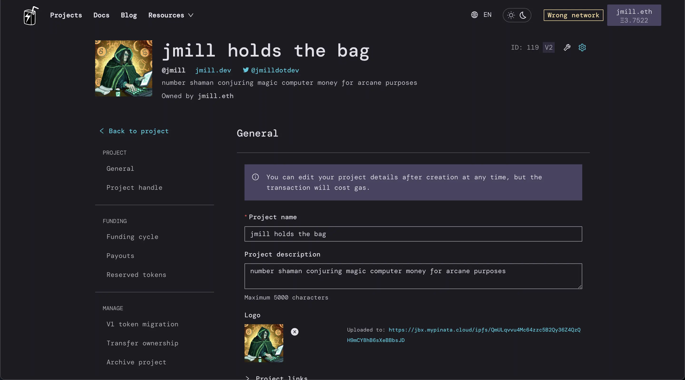
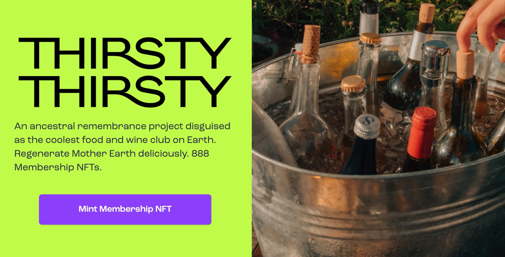
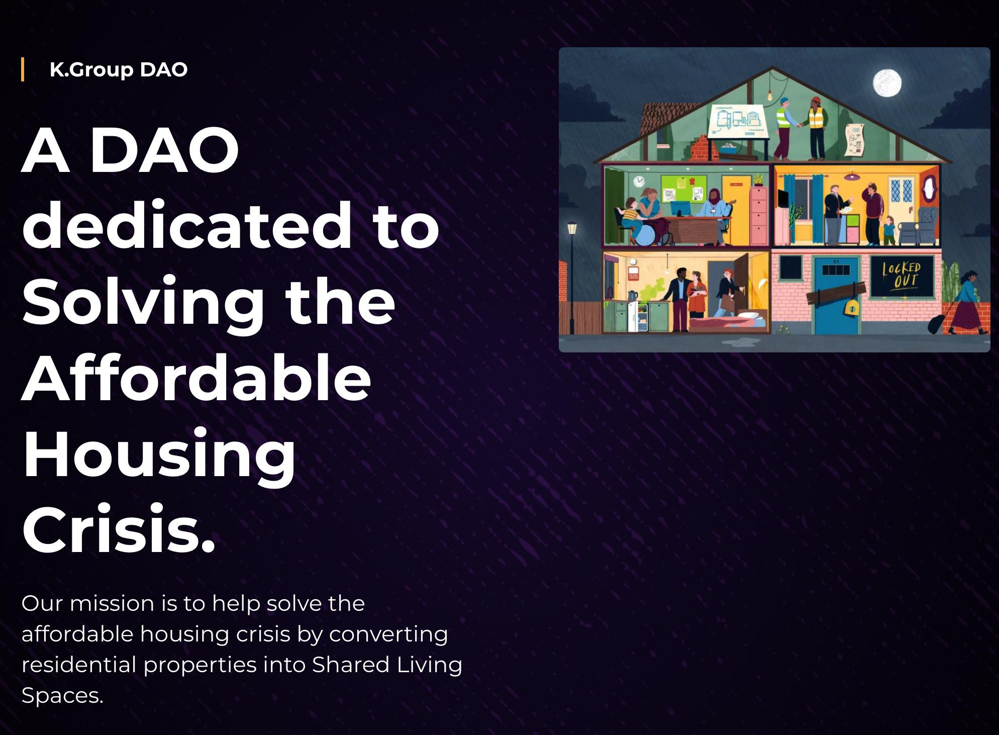
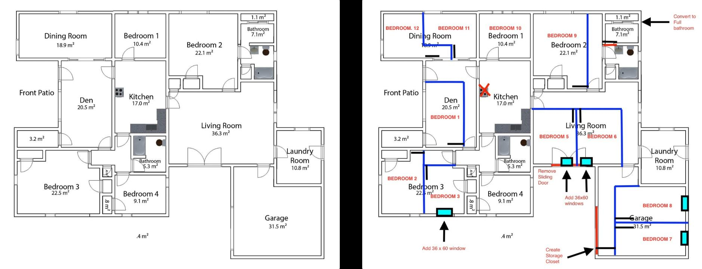
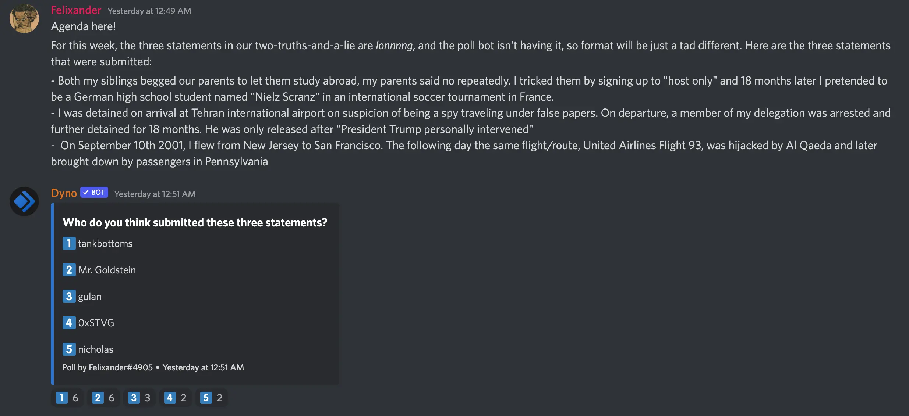
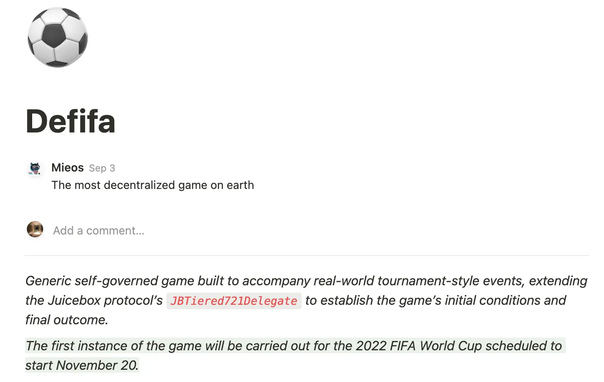

Art by [Sage Kellyn](https://twitter.com/SageKellyn)

# 版本控制（versioning） Jango

这个版本控制项目是协议其他功能的一个先决条件，目前已经基本完成。

上次 Code4rena 审计比赛后，我们对协议做了一些更新，以保证协议的安全性和长期稳定性。Jango 决定牵头主动进行这项工作，而不是等到问题出现时再来进行补救。这些更新其中大部分并不会影响 V2 的大部分功能，而且更新工作也到了收尾阶段。

下一步准备安排 Code4rena 再来对更新的的代码库进行一次审计。Jango 希望能尽快协调一次跟进审核，专门审计根据上次比赛的审计报告进行修改的内容，这次审计有望继续由上次主要参与的程序员继续负责。

Juicebox 的项目合约这一次没有包含在更新的内容中，这个新的版本也不强制要求项目重新部署使用，因为这些修正的问题绝大多数项目都不太可能会碰上。但审计完成并经 DAO 批准部署之后，新创建项目将全部使用这个新的版本。

前端团队上周在 Juicebox.money 上部署了一个全新的增强功能的设置页面供项目们使用，这个新的设置页面将有助项目在跨版本管理金库的时候增加他们的信心。

我们在 Discord 的讨论里面常常把这个合约的升级称为 V3, 但请勿将它理解为类似 V2 相对 V1 这样的重大版本，只是目前尚未对这个项目的叫法达到共识。

Nicholas 最近一直在与 Code4rena 的 @trebien 进行商讨我们与他们进行长期合作的可行性，如果成功实现，我们将可以享受优惠的费率和更具灵活性的审计比赛安排。

Nicholas 目前提交了一项关于未来半年到一年提高 Code4rena 比赛经费预算的提案，提案如果获得通过，我们将可以针对类似 NFT 奖励或者其他小的协议升级开展一些小型有针对性的审计比赛。

提案草案在[这里](https://juicebox.notion.site/Allocate-500k-to-Long-Term-Code4Rena-Auditing-Budget-9a37e3e7ec3c4a309c997284efe060fc), Discord 的相关讨论在[这里](https://discord.com/channels/775859454780244028/1012540289774268416)

NFT 奖励项目可能也将同时推出，除非社区坚持也应该通过 Code4rena 先审计一下。这一项目比较灵活，开发者可以随时推出新的功能或者更新，而项目在新的筹款周期就可以用上升级版本。

### Immunefi bug 赏金

filipv 问及是否有在 Immunefi 上安排审计及测试的时间安排， Jango 的意见是他其实不太认同 Immunefi 属于审计及测试用途，更多的是通过设置赏金，鼓励发现漏洞的黑客选择不恶意利用，而是向我们报告的一种机制。但觉得当前这个似乎并不是太有必要，但 Juicebox 作为一个提供基础服务的运行模式，日后随着协议发展及我们日常工作的减少，倒是可以把这个作为一种保险机制来使用。

Nichlas 解释说我们上次通过的关于设置 10 万美金 Immunefi 赏金的提案，其实并没有实施到，因为各种原因并没有在提案的限制时间内执行，所以过期失效了。他同时提出，日后我们如果再要发起提案设置 bug 赏金计划，不妨可以考虑下 Immunefi 的同类型平台，因为目前包含资金保管、审核报告或者支付赏金的工作都是由我们自己来做，但 Immunefi 还要收取 10% 的中间费用。他还指出，近期即使实在要执行 bug 赏金计划，也应该等到跟进审计及更新部署完成之后，因为届时我们可能要把这期间找到的 bug 都先排除出去。

## 与 Thirsty Thirsty 合作在 Devon Bogota 期间组织活动 @bruxa

Thirsty Thirsty 是一个创建自 2014 年的一个社区，2021 年 11 月开始涉足 Web3。这一个由美食红酒爱好者、专家及环境保护者组织的一个社区，主要聚焦于文化恢复及古代农业技术复现等他们认为属于减缓地球气候危机关键因素的各个方面。

就在上一周，jango 和社区创建人 bruxa 以及 JuiceboxDAO 组织活动负责人 Zom_Bae 开会，讨论 JuiceboxDAO 应如何与在创办活动及组织聚会方向早有建树的项目展开合作，以及如何从筹款的角度来实际在 Devcon Bogota 期间展开合作。

Devcon Bogota 的 Devcon Week (10 月 7 - 16 日)期间，jango 和 bruxa 计划在 Thirsty Thirsty 的原住民日（10 月 10 日）举办一个主要面向开发者的活动，活动以开放论坛的形式，类似之前 JuiceboxDAO 在 NFT NYC 那样，让大家可以聚到一起来交换种想法。同时也可以让 Juicebox 上的运行项目利用这个空间来为自己的社区创造一个交流的机会，JuiceboxDAO 将与 Thirsty Thirsty 一道为活动的提供食物及饮品等。

### Thirsty Thirsty NFT 会员资格

Thirsty Thirsty 是一个美国的 501(c)(3) 非营利组织，因此是可以接受虚拟货币捐赠的。

目前 Thirsty Thirsty 已有自己的会员 NFT 铸造，能过这个 NFT 一方面通过美食及红酒吸引不同的人种来体验自然的魅力，另一方面也需要教育及助力社区的个人，因为有些社区成员其实一直是被排除在传统金融范畴之外的。

他们对 Web3 的工具能如何解决他们社区的问题及为社区创造资产非常感兴趣。同时他们亦非常希望能通过利用 Juicebox 的筹款机制来进行一些限量空投活动，与他们计划组织的活动捆绑一起。

## K.Group DAO @Jermaine.A

[K.Group DAO](https://kgroupdao.finance/) 是一个经济型住房的 DAO，他们在解决美国的住房短缺及经济型住房危机有自己独到的解决方案。

### 代收入人群住房的解决方案

下图的房子是一个实例，房子位于德克萨期州的休斯敦。他们买入一间 4 房单位并把它发行成了一个拥有 12 个房间的房子。目前所有房间都已经有住客入住。

在他们主页的最下方，亦可以观看这个房子的实景 3D 图。

他们目前的解决方案的具体情况为：
- 房租从 650 美元（小房）到 800 美元 （大房）
- 所有房间带装修
- 免费入网，免费自助洗衣及其他所有必须的功能
- 无须任何押金及保证金
- 租约以月为单位，租客可以视自己需要随时搬走

@Jermaine 也表示这个模式可以适用于全球，因为这种发行是具备普适性的。

### DAO 的目标

他们之所以要创建 DAO 是因为他们认为在解决经济型住房问题上，DAO 的形式更具体优势。

至于 DAO 的项目代币 $KDAO, 他们将尽可能简单地严格按治理代币来对待。类似购买房屋或者变卖资产都要按治理流程来用治理代币来投票决定。

他们是一个怀俄明州 （Wyoming) 注册的 LLC 有限责任公司，因此可以买卖真实资产及设立银行帐户等。

DAO 的治理将不限于不动产本身，还将涉及以下许多方面：
- 购买房屋
- 房屋翻新
- 市场推广（包括本地教会、社区中心及线上住房平台的推广）
- 机构管理
- 日常维护

他们希望建成一个覆盖全球所有设立这种形式的经济型住房的地区，以供人们使用。

他们的终极目标是两年内解决 1 万移民家庭的居住问题，同时争取首个成为美国国土安全部的政府承包商的 DAO 组织，来帮助解决人民的居住问题。

## 猜谜时间

正确答案是 gulan

## Defifa 项目 jango

2022 年世界杯将于今年 11 月在卡塔尔举行，作为新冠疫情后的其中一个重大国际赛事，jango 认为这将会是一个极佳的 meme 的爆发点。为此他提出了这个自治游戏的机制，利用 Juicebox 即将推出的 NFT 奖励功能及 NFT 投票系统来实现这个游戏的运行。（如果对些项目感兴趣，这见[原文](https://www.notion.so/juicebox/Defifa-8644f449958e4d9bb632cb5a46708fb6)及[译文](https://www.notion.so/juicebox/Defifa-c79acfa16e4e49fe9bd70ad216c8a474), 如有兴趣参与这个项目的讨论，可以到这个 [Discord 话题组](https://discord.com/channels/775859454780244028/1012501341626699896)

暂时要理解这个项目其实不是太容易，除非你真正了解 NFT 奖励系统的运行机制及怎样可以用于支持这个项目。我们社区目前对这个 NFT 奖励的了解仍然停留表面，即项目方可以在项目页面设置 3 个 NFT 分级及当捐款超过项目方设定的门槛后相应铸造 NFT 到付款地址这一个功能。这其实只是本合约的一个很基本的功能。

这个合约还可以实现更多功能。

### 以赢家通吃游戏模式为范例

我们假设世界杯开幕前的两个礼拜，有人创建一个项目并部署项目金库，这个项目不存在所谓的“项目方”。创建人可以事前设定好规则，让这个游戏自行演进并在某个日期终止。最开始的时候，项目金库余额为 0，没有任何代币铸造。

项目将会有 32 个 NFT 分级，分别代表世界杯的 32 支参赛队伍。NFT 将公开铸造，任何人都可以铸造任何分级任意数量的 NFT。

两周之后，世界杯开幕，铸造将会关闭。现在游戏玩家们都持有各自的 NFT，这个 NFT 跟普通的没什么两样，也都可以随意转让。

举个盒子，有 100 个巴西队 NFT 和 10 个日本队 NFT 铸造了出来，铸造数量大体能够体现所有人对哪个国家夺冠的倾向如何。这时我们 NFT 代币和金库资产都已经就位。

世界杯结束之后，假设是日本赢得了冠军，将会有一个自治的流程可以向合约发起一个得分记录，让所有的 NFT 持有人按自己认为正确的结果来对这个得分记录进行验证，验证机制应该能保证结果是真实的。例如说，有人发起日本冠军的得分记录，有人发起西班牙冠军的得分记录，这时所有参与的玩家都有责任来验证出正确的结果。

严格来说，所有最终的得分记录都将是游戏总资金的一个重新分配。最开始开放铸造的两周时间里，所有人都可以销毁自己的 NFT 来退钱，赎回比率是 100%，所有 NFT 的价值跟铸造时是一样的。但到了最后，所有的得分记录都是这个赎回比率的重新分配。基本上可以创建一个赎回委托来决定，此时所有的金库资金都应该转向支持日本队的 NFT，不再支持其他国家。金库资金不需要真的转账给赢取游戏的人，相反地，只需要把这些资金重新配置成支持冠军 NFT 即可。虽然此时赎回一个日本 NFT 就可以获得金库 10% 的资金，但经验告诉我们，这很可能只是这些冠军 NFT 的地板价格。

### 更为复杂的具体赛事模式

我们还可以把这个机制扩展至覆盖世界杯赛内的具体某些比赛。

例如说，如果你的队伍小组成功出线，这个国家的 NFT 将获得分享金库 5% 资金的资格。又或者你选的国家进入前三，那么季军获得金库 15% 份额，亚军 20%，冠军 40%，等等。

所有最终的得分记录都将是每个 NFT 支撑价值的重新分配，每个持有 NFT 的人都可以进行链上投票来验证这些得分记录的真伪。同时应该设置好投票的权重以免很容易就被人钻空子。打个比方，如果铸造出来的 NFT 51% 是西班牙队的，如果按一个 NFT 一票来验证的话，西班牙队可以提出来自己是冠军并投票验证这个结果为真。我们必须按每个分级各自的总供应量来摊平投票权重，或者采用类似的机制。

实际上，我们开发的这个 NFT 奖励合约是治理合约的一种版本，这个版本允许每个 NFT 分级拥有独立的投票用途，你可以创建承认每个分级特定投票权重的投票方式，不用整个系统都认一个 NFT 地一刀切。所以比赛队伍的 NFT 都在同一个合约内，但他们往往在验证时有不同的投票权重，按不同的得分记录最终状态，可能会由不同的赎回比率来作价值支撑。

### 其他想法

可以预告拨出 10% 的金库资金来让参与投票验证的 NFT 来分享，让大家有动力来参与操作。

jango 觉得可以先用比较简单的形式来试下水，如果行得通，就可以扩大应用场景，这个机制可以用于不同的体育赛事。

这是一个他思考了一段时间的想法，是即将推出的 NFT 奖励功能的一个扩展应用场景。

当然还有一些博弈理论需要认证，他希望能创造一个机制来鼓励诚实的验证流程。大家都知道链下的真实结果，白纸黑字一样确凿，但万一真有人耍赖呢？是不是每个人都希望正确地把链下结果报告到链上呢？

**Sayid**: 关于验证这个问题，可不可跳过这个环节，直接自己开发一个 API, 又或者沿用现有的 API 获取比赛的结果呢？

**jango**: 当然你也可以借用预言机来验证比赛的结果，但我想这不是这个项目的真正目标。把这个作为一个可通用化的 Juicebox 项目，我们可以创造一个机制让博弈理论自行发挥作用，鼓励参与者们正确地报告结果，将是一件非常有趣的事情。那样的话，所有人都可以为某个赛事部署一个金库，金库自行充盈和分解，都按照一种自我限制的方式来进行。

在这里，jango 也希望邀请大家就其他世界杯相关的问题，提出自己的想法，我们一起进行头脑风暴。他觉得这是一个值得深耕的事情，同时也希望其他 Web3 项目能够加入进来。他认为这个不是针对其他协议获得 Juicebox 竞争优势的事情，而是一个通过体育凝聚人心普天同庆的事情。

