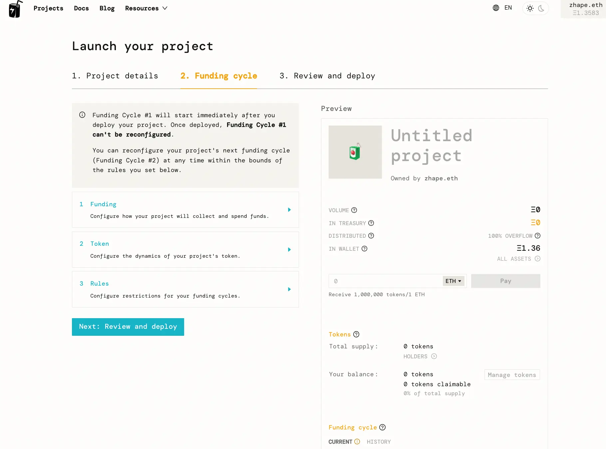
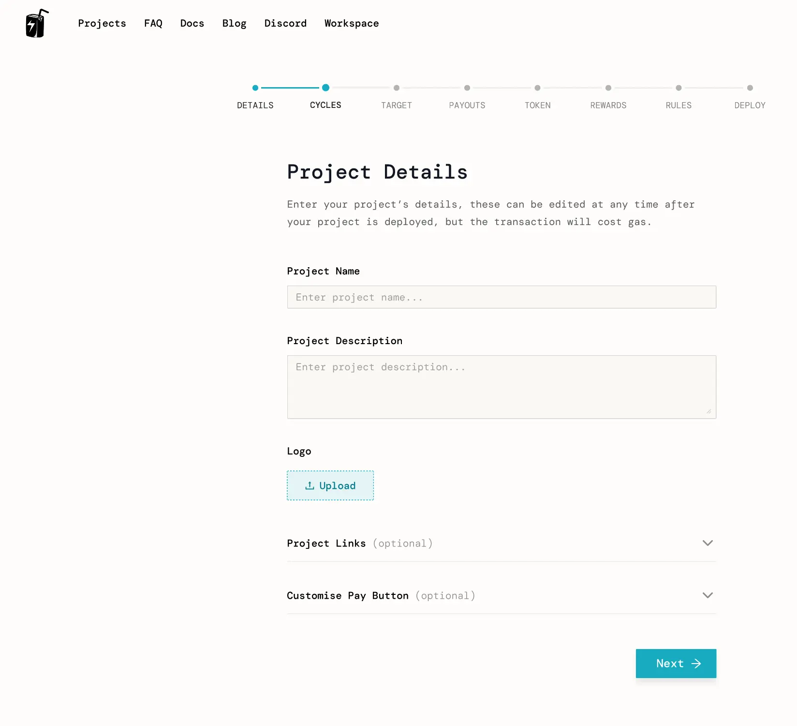
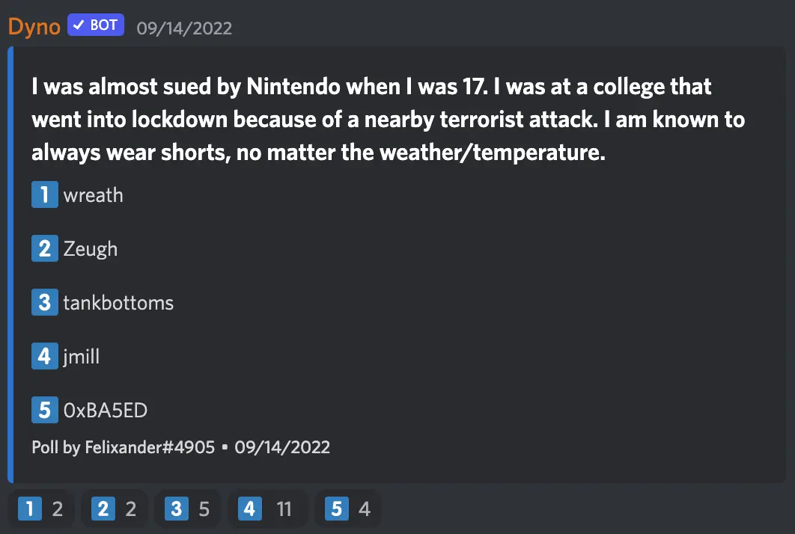

Art by [Sage Kellyn](https://twitter.com/SageKellyn)

## 版本控制 (versioning) jango

合约开发组目前已经完成这个版本控制项目，创建了一个 Juicebox 合约的 V3 代码库， 把所有合约内容合并进去，然后交给 Code4rena 的审计程序员来进行一次跟进审计（mitigation review)，审计内容为针对上次 Code4rena 审计比赛中发现问题的合约升级。

这次跟进审计预计需时一周，jango 鼓励团队保持关注并对外部审计员给予必要的支持。

接下来的一项主要工作是与 Peel 一起最后敲定我们应该采用怎么样的 UX 来让新的项目使用 V3 合约。

目前在 V2 协议运行的项目可以选择部署新的 V3 筹款周期，同时丢弃原有的 V2 版本筹款周期。我们将为这个操作流程提供操作指引。但这个做法会需要社区进行一个代币置换，并不是非常理想。如果项目们不想麻烦，我们会部署一个新的 ETH 支付终端和 JB 控制器让他们把旧的终端及控制器都迁移过来。

那些想留在 V2 协议的项目，我们尊重他们的选择，最多也就是合约开发组可能需要追加一些工作罢了。

非常感谢 Dr.Gorilla 和 0xBA5ED 过去几周在这个工作上做出的贡献，这里特别要特别致谢 0xBA5ED 上周对我们的取整错误提出了很好的解决方案。

## juicebox.money 次世代 UI： Strath

前端团队通过调查发现，项目创建流程是我们用户的一大痛点，并导致我们网站的高跳转率。经过许多用户测试及行为分析，他们决定采取措施简化创建流程，改善用户的创建体验。

*Strath 在会上展示改进的 UI 设计界面*

用户反馈得最多的是目前创建项目三个步骤中的第二步`筹款周期`，有很多层的参数要配置。

前端团队希望把这个流程分解开来并进行简化，消除协议参数的认知障碍，让创建者可以每个页面只需要做一项决策。

这是改进的 UI 目前的样子：

如果大家有兴趣对这个工作提出自己的看法，欢迎去到相关的[ Figma 页面](https://www.figma.com/file/EN7CZTekcSo3sHyaGt6cC0/JBX---Project-Creation-Flow---High-Fidelity---Sep-2022-(WIP)?node-id=0%3A1)。

这个工作目前尚未完全完成，还有一些小的元素需要改进。他们会做一些用户测试，因些下来可能还会有一些迭代工作要做。

工作还包括设计一些创建模板，让人们可以直接用模板创建项目，而不是要自己一个一个参数地进行配置。

提问：你们有没有什么计划或者产品原型可以允许用户自行启动定制化的例如 ERC-20 标准代币的支付终端？

**Aeolian**: 要创建原型不难，重要的是前端要怎么处理项目的页面，还需要概念化项目拥有多支付终端时前端页面应该怎么设置。这可能是下一个大的设计工作的范畴。

**jango**: 我甚至怀疑是不是应该在 Juicebox.money 网站上开展多支付终端的试验，其实有很多办法来做实现这个的。我觉得这个试验工作更适宜在 juicebox.money 的分叉和专门服务这些用例的地方开展，怎么整合多支付终端这个事挺有意思的。

虽然多终端会有点复杂，但也会提供一些特定的细节构造。从协议的层面看，我们可以让这个工作逻辑自洽，但从 UX 的角度来看，还需要做些工作来确定优先程度。

## 猜谜时间

答案是 0xBA5ED

## MTOTM AMA 问答环节 epowell101 及 michaelmaher

### 背景及概念

**Epowell101**:
MTOTM 这个概念源自我们与一些早期的 DAO 及其创始人的讨论，某种程度上，大家都有早期流动性更加多元化的需求，而不是等到更后期才通过 OTC 交易，而且往往需要谈判数个月时间才能实现。

如果一大群早期阶段的 DAO 一起，往一个共享的流动池（目前是 Juicebox) 注入自己的代币并收回反映各自份额的一个聚合“元 DAO” 的代币，会怎么样？这样一来，你的 DAO 既获得某种程度的流动性多元化，也可以成为一个"元治理”体系的一分子，让对你们感兴趣的其他 DAO 或者个人参与你们的治理，发出不同的声音。

我们都知道，目前有很多的 DAO 启动平台，也有许许多多的用例，但我觉得我们应该聚焦按某个预言机价格比例来共同向某个池子注入这个初始概念。MTOTM （发音：M图腾）就是源自这个想法，全称为 Many To One To Many Swap（多对一对多兑换平台）。

**jango**:
在这里，我讲一下这个项目的背景。通过这个项目，我们收取不同项目的代币，并相应分发同一个代币回去，这个机制是符合我们和开发者们正在建设的基础设施的。创建一个项目并开发出自己的应用这个做法非常酷，但从初始概念这个角度来看，大家都觉得用我们都熟悉的 `pay` 函数来分发代币的做法可能也很好。

**nicholas**:
按我的理解，这是不是有点像 DAO 之间进行代币互换的一个 Swap, 同时接收许多不同项目代币并相应分发类似一个“指数基金”代币回去，实现一些有趣的设想并互相促进。是这样吗？

**epowell101**:
对的，就是这样。

### 机制解释

*michaelmaher 在会议的文本频道分享了一个 GIF 动图*

**michaelmaher**：
这个项目最关键的一条是要得到广泛的应用，如果我们用的都是 ERC-20 标准代币终端来实现这个流程（大部分 DAO 的代币都是 ERC-20 标准），我们要安排好使用这些支付终端来帮助 DAO 支付代币进来，生成一个价格指数，再生成这个指数的代币分发回去。

要实现这个目标，就涉及到使用不同的价格数据的问题。如果一个 DAO 把他们的代币投入进来，但可能由于还没上交易平台（DEX）所以还没有价格，我们也可以给它设定一个专门的价格数据。

我们也可以利用现有的 Juicebox 项目架构，创建一个普通项目来接收 ETH 并通过不同的分配数据再把这些 ETH 分配到不同的地址。

投资者们可以通过支付 ETH 获得指数代币，各个 DAO 也可以把他们的项目代币支付进来。所有的代币互换都通过共同的机制来进行，这就是 MTOTM 的意义所在。

与此同时，我们还不希望初期的投资者的份额被稀释掉。他们早期投入 ETH 并获得相应数量的指数代币，我们希望这个指数代币的份额在其他 DAO 投入进来的同时能够保持稳定。

我们希望能开发一些专门用于这个目的的支付终端出来。如果有多个项目加入，就要启动多个支付终端。这样做当然是不符合 gas 效率的原则的，所以我们同时也计划开发一些多代币支付终端来接收各种不同的代币，来实现这个流程。

最后一点就是如何分配资金的问题。ETH 资金将会通过现有的大部分 Juicebox 项目使用的机制，以融资的形式分配给各个参与进来的 DAO。

### 社区支持

**jango**:
你们构思出来这些接口的工作机制以及如何利用我们现有的金库网络来实现这个设想，这很值得称赞。

我想我们社区里最为熟知协议并参与它的开发的成员还没有完全关注到这个项目，这段时间主要是你们来构想这些工作机制并经常提出一些非常好的问题，非常感谢。希望下面几个月等完成了之前承诺的包括版本控制、NFT 奖励等工作内容之后，我们可以更多地支持这个项目并把它的最简可行产品（MVP，Most Viable Product)打造出来，我们就可以看到这个动图的内容的实际实现。

**michaelmaher**：
大家如果对这个项目感兴趣，可以到[我们的 GitHub](https://github.com/The-Funding-Cooperative-DAO/MTOTM) 代码库看一下。同时也欢迎加入我们的 [Discord](https://discord.gg/u5zRFdHz) 来发表你的看法。

**jango**:
最近有一个拨款支持这项试验探索的提案，但在社区温度测试阶段因为不够票数没能获得支持。有很多这方面的研究工作是在底层发生，所以很多人没有注意到，我们正设法让我们的生态系统里的开发者们得到更多的关注，他们为生态的发展一直在不懈努力。

这个项目跟很多的一样，可能近期都未必能发展成一个成熟的项目。让我兴奋的是，大家都一直在试图理解该如何实施，以及如何扩大能够实现的范围。我想这样努力值得我们去支持，而最好的支持方式就是帮助回答一些问题，帮助构建产品原型，达到产品最终实现。这些工作耗费时间和精力，也很难优先来处理，我们今后应该多关注扶持这些工作的拨款提案。

### 进一步讨论

**nichola**:
我来梳理一下看是不是能够正确地理解这个项目。这个项目的内在动力有两个方面：
1. 允许 DAO 之间进行代币互换，一个 DAO 可以把他们的代币支付给另一个 DAO 并相应获得其代币。
2. 实现指标基金的创建，并通过允许所有 DAO 向指数基金投入项目代币获得 ETH 的方式来实现融资。
这个总结合理吗？

**epowell101**:
所有 DAO 和投资者投入资金获取的都是同一个代币，就是这个聚合“元 DAO”（指数基金）铸造的代币，而 DAO 还会获得池子里的 ETH。

**jango**:

我觉得值得留意的是，我们目前有一个 ETH 支付终端及一个能用 ERC-20 支付终端。ETH 支付终端在 juicebox.money 上部署使用，另一个 ERC-20 终端，假设是一个 DAI 终端，工作的原理是一样的。

你可以决定一个发行比率，当终端收到 DAI 时就会按这个比率分发项目代币。如果项目同时拥有 ETH 支付终端和 DAI 支付终端的时候，代币的发行比率只能与其中一个资产挂钩。例如说，付 1 ETH 会获得 100 万代币，代相当于 1 ETH 的 DAI 同样会获得 100 万代币。然后我们可以想像一个项目代币版本的 ERC—20 支付终端，外部项目代币支付进来就会相应发行这个项目的代币出去。

关键是这个价格的数据。终端收到某些资产的时候，项目代币应按什么样的价格铸造出去呢？这个铸造比率与其他的支付终端又是怎么样的相关关系呢？我们该怎样编写多代币支付终端来实现通用化，让每个希望使用这个终端的项目都不用单独启动一个支付终端呢？我们不会说 SHARK、 PEOPLE 或 JBX 都来启动一个 DAI 支付终端，可以创建一个通用化版本。这也是个有趣的问题。

**nicholas**:
打个比方说，你有一个能接收 SHARK、 PEEL、 CANU 或 WAGMI 的多代币终端，并创建了一个 Juicebox 生态的指数基金，这个指数基金的代币相对不同的其他项目代币的价格不应该是静态的，而应该视各个项目代币价值不同有不同的价格变量，对吗？

**michaelmaher**：
要视各个项目代币的价值不一，体现不同价格。但有些非常早期的项目，他们的价格可能需要进行讨论来确定，所以这些早期项目的价格可能是一样的。用 Juicebox 设立的价格合约，有很多不同的价格确定办法。

**nicholas**:
这么说的话，这个项目发展路线图的第一步就是建立一个多代币支付终端来实现我们谈到的这些想法吧？

**jango**:
我觉得多代币终端是为了把手动创建的很多运行成本自动化。我认为第一步应该是每个项目代币创建一个支付终端来手动创建指数，并把价格数据等信息内嵌进去，从而形成预期和进行各种测试。然后下一步才是把这些运行成本自动化。

**michaelmaher**：
是的，我们一直在努力开发多代币终端，不过这个工作还在进展中，多代币终端更多是关于未来机制的一个设想。

**epowell101**:
我们已经在测试网上创建使用单一代币终端的版本模型，由于我们只是想初步达到 MVP (最简可行产品)，应该会比较简单。但是还有一些 UX 方面的工作要做。

**Kmac**:
这个项目不就是建立在代币集合（token set)之上的一个指数吗？

**michaelmaher**:
没错，这就是 [Tokensets](https://www.tokensets.com/) 的运作模式，我们这个项目要做跟他们不一样，因为他们对于一个代币集合有特定的要求。其中一个要求就是参与的项目代币必须已经在上架 DEX 平台或者有其他形式的流动池，因此形成指数的代币其实都是一些比较成熟的代币。早期项目是很难达到这些要求的。同时他们的代币集合是没有真实的治理属性的，你得到的只是指数代币本身，但治理方面用处不大。我们的项目关注的是能够帮助更多项目的一个细分领域。

**jango**:
最后，我想强调的是这个项目是一个试验性的工作，有很多未知因素，很多问题没有得到解答。我们一起探索、假设和讨论。这个工作是否能够持续多久，我们谁也不清楚，但我觉得这样的试验是值得的。我认为肯定会出现一批这个概念或者衍生于这个概念的应用。
