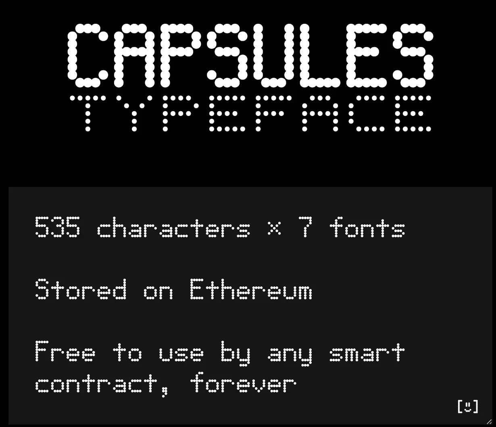
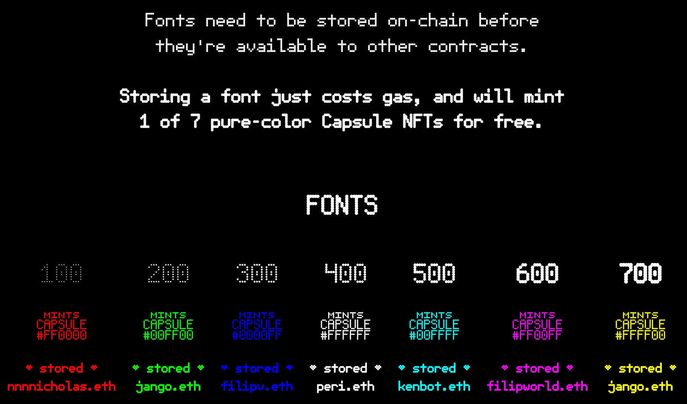
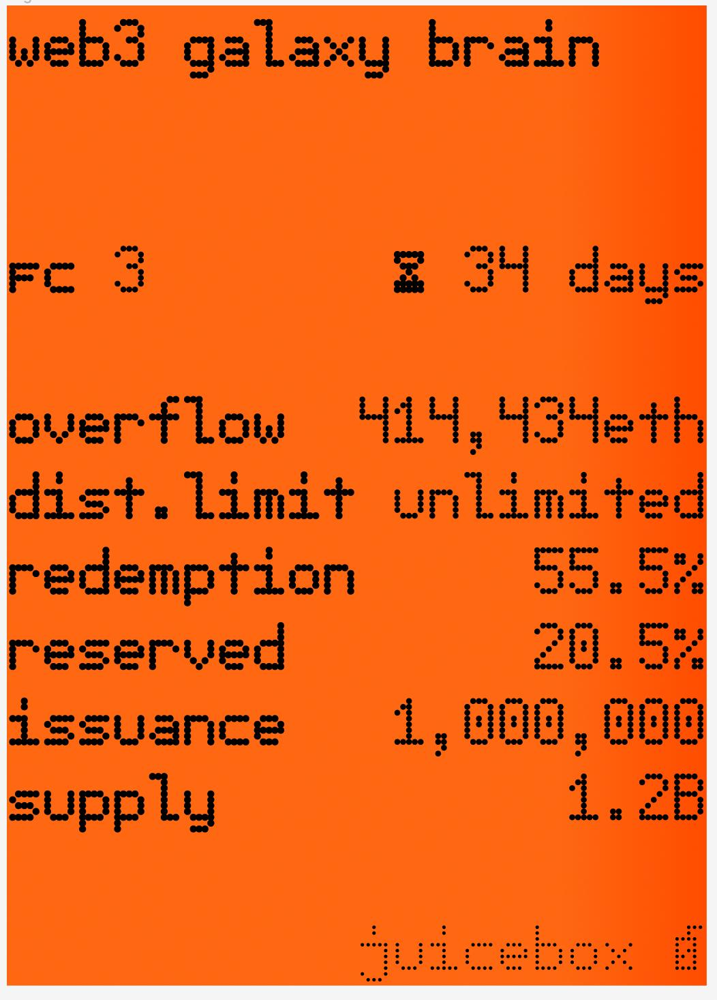
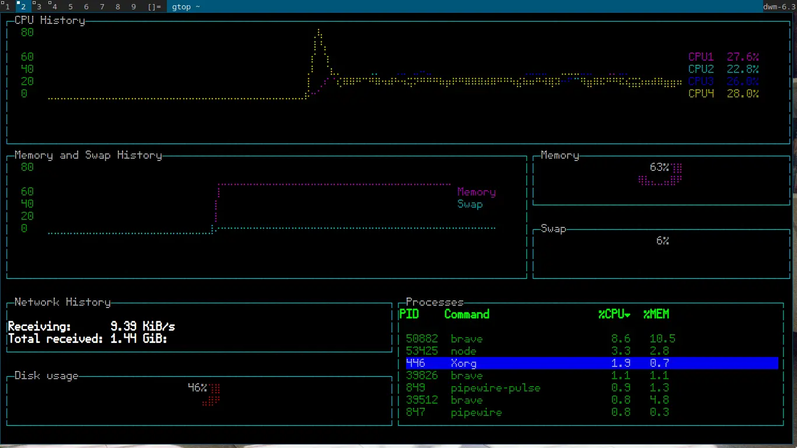
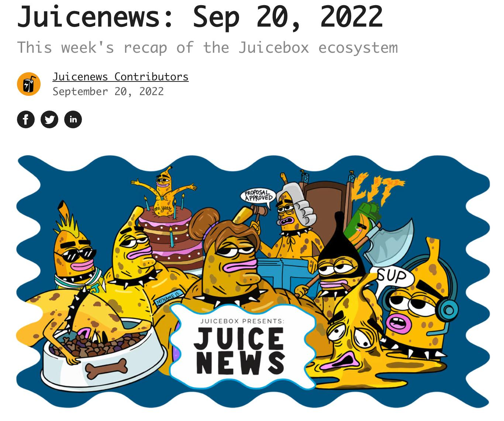
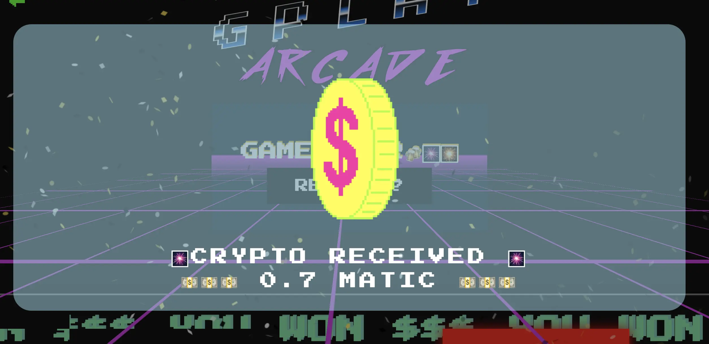
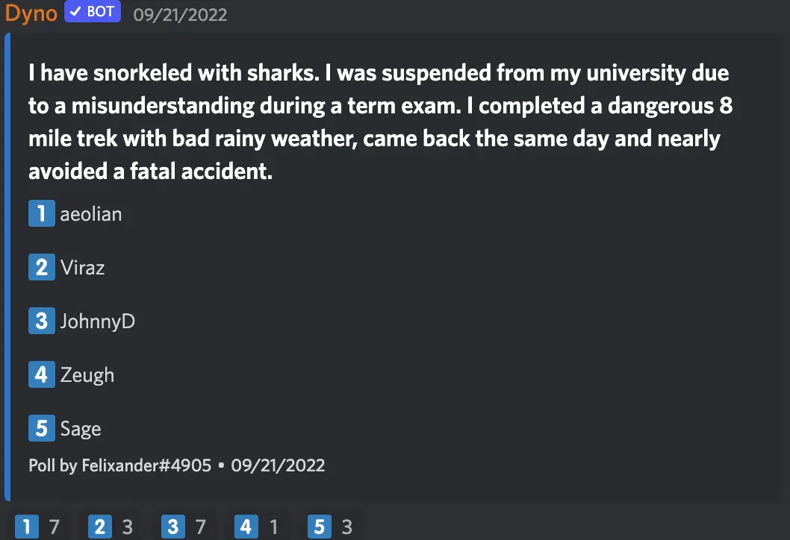

图片制作：[Sage Kellyn](https://twitter.com/SageKellyn)

## Capsules 项目 by peri

[Capsules](https://cpsls.app/)是 peri 自己搞的一个链上字体项目。

这个项目是要尝试引入一个链上存储字体(typeface)的标准。现在有很多项目在链上渲染的 SVG 中使用到各种文本，但是如果他们想要在 SVG 里用到定制的字体的话，就要先想办法在链上存储这些字型（font)。链上存储字体既昂贵又复杂，目前也没有一个通用的标准。这个项目的目标就是要引入一个新的字体合约接口来实现字体链上存储的标准化，同时让价格更加亲民。

启动这一项目的同时，peri 还推出了一些 NFT 来作为字体的 Proof of Concept 的试验。他试图通过这个试验来教育用户怎样利用这个字体合约来加载字形并在链上渲染到 SVG 中。总共有 7957 个 Capsules NFT，每一个都有不同的颜色，每种颜色只能 mint 一次。用户在 mint 的时候可以编辑 NFT 的文本内容，这些内容将使用 Capsule 的字体来进行渲染。

大家可以从[这里](https://cpsls.app/#/typeface)免费下载这个字体，同时还可以得到字体的不同的字型。

这个字体合约允许用户来定义不同的字体，用户部署这个合约之后并不需要自己来存储相关的数据，只要数据符合合约定义的规格，谁都可以帮忙进行链上的存储。

目前这个项目有 7 个纯色 NFT，让大家通过 mint NFT 来帮助存储 下图中 100 - 700 的 7 种字型。我们社区里很多早期就从 peri 的推特获悉这个项目，并在项目启动的第一时间就把这 7 个 NFT mint 光了。这也是一个链上基建发展的去中心化的一种努力吧。

peri 的推特在[这里](https://twitter.com/peripheralist), 有兴趣的可以关注一下他。

nicholas 使用这个 Capsules 字体渲染了某个 Juicebox 的活跃数据来做了一个原型化产品：

而 filipv 则是下载了 Capsules 的字型并设置成自己电脑系统的字型。

## 版本控制（versioning)工作汇报 by jango

V3 合约已经在本期周会前的当天重新部署完成了。

上周我们又举办了一个针对这个升级的 V3 合约的 Code4rena 审计比赛，审计完成之后没有发现大的问题，于是开发团队就重新部署了除`JBProjects` 和 `JBOperatorStotre`外的所有协议合约。由于这两个合约不需要重新部署，所以拥有项目 NFT 的那些项目仍然可以保持原有的项目 id，并可以选择是否要部署一个基于 V3 合约的新筹款周期和新项目代币来与他们现有的 V2 项目同步（并弃用 V2 项目）。而新创建项目则一律将会使用 V3 合约。

V3 合约其实是针对上个月我们举办的一次 Code4rena 审计比赛中发现的几个 bug 对 V2 合约做的一个升级。发现的这些 bug 大多属于边缘安全，严重度也并不是太高，但由于考虑到用户希望在最好的合约版本上创建项目，而且团队希望通过升级合约，同时在 Juicebox 生态还不是非常活跃的时候做一些合约版本控制的工作，所以就有了这个 V3 合约的升级。合约和前端的开发团队都利用这次升级的机会，创造了一些版本升级的标准，这样的话，如果日后协议万一出现问题涉及大的版本升级的话，Juicebox 的项目们可以很方便地进行协议版本的迁移。

nicholas 问及，目前运行在 V2 协议的项目需要感到担心吗？jango 的回答是不需要，而且我们就这个 V3 升级以及相关的这个跟进审计也跟大部分项目进行了沟通，项目方及社区都对情况有所了解。而且因为之前审计出来的 bug 都只是边缘案例，即使不进行迁移，V2 协议应该也是没有太大问题的。

nicholas 同时问到如果部署新的 V3 周期及新的代币的话，新旧代币的转换有没有时间表？ 对此，jango 的回答是，转换的机制可以沿用现有的收 ETH 分发项目代币的做法，项目可以接受旧的项目代币并按 1：1 的比例分发新的项目代币来做迁移工作。实际的转换目前还没有准确的时间安排，目前已经有很多的原型化产品，但是涉及到 V3 合约的重新部署，还要看看怎么有效地协调从 V1 到 V3，以及 V2 到 V3 的迁移工作。

jango 同时提及 V3 合约可以扩展实现许多功能。其中一个就是可以设置支付委托来在捐款进入项目金库之前分流一部分资金到指定地址，这是一个全新的功能，正在 NFT 奖励功能上面构建。可以通过运行定制的委托合约，在项目接收捐款的时候，把其中部分资金直接转到项目方指定的其他项目/地址。

## 能见度工作汇报 by brileigh 和 mattewbrooks

最新一期的 Juicebox 通讯可以在[这里](https://newsletter.juicebox.money/)找到。

他们计划推出一系列的配置介绍的文章，深入剖析现有项目配置的方案及采取相关方案的原因，以便新的项目创建人可以更好地理解 Juicebox 的配置机制以及给自己的创建做一定的参考。他们写的第一篇配置介绍的文章是关于 StudioDAO 的，可以在[这里](https://docs.juicebox.money/blog/2022-09-20-studiodao-config/)阅读。

Juicecast播客方面，他们最近采访了 0xSTVG，了解了他创建的 [Marin Swim County Association](https://juicebox.money/@mcsa)项目，节目将于本周晚些时候发布。

同时还视频采访了 JokeDAO 的创始人 [David Phelps](https://twitter.com/divine_economy), 视频内容计划稍后上付到 Youtube 频道。

接下来，他们还有以下的工作安排：
- 采访 [Defiant](https://www.youtube.com/c/TheDefiant) 的 Robin，讨论关于创作者经济的看法。
- 对[ConstitutionDAO](https://juicebox.money/p/constitutiondao) 的进一步深入剖析。

他们计划通过采访 Juicebox 上面比较知名的项目如 ConstitutionDAO 和 MoonDAO 等，并配套深入的长篇文章剖析，再加上相关项目配置文章，让新的项目创建人能够更好地借鉴参考。

## Interface 应用 by sunnndayyy

[Interface](https://www.interface.social/)是一款用于关注其他人钱包地址的手机应用，功能有点类似 Etherscan, 在 UI 上面做了很多的改进。

sunnndayyy 此次代表 Interface 参加会议，主要是介绍他们社区已经转型成一个类似 Labs 和 DAO 的混合体的组织架构，以及他们计划举办一系列的推特 Space 来探讨去中心化组织协调工作面临的各种挑战等相关的话题。

他们打算邀请 JuiceboxDAO 的核心成员参加他们第一期的推特 Space, 参与讨论如何在项目生命周期的早期阶段来提高社区治理的参与度。

## G-Play 工作汇报 by Sayid

 G-Play 是一个 [Juicebox 的项目](https://juicebox.money/v2/p/153), 专注于开发一个 Polygon 上面的街机对战平台，用户可以在平台上抵押 $Matic 来一起进行一些经典游戏的对战。

 Sayid 介绍了一些平台新增的小功能，如用户数据的统计列表等。

 他还和 Mieos 在会上演示游戏对战。
 

## 猜谜时间 by Felixander

这是每期周会的保留节目，某位成员讲的两句真话和一句假话，让大家猜一下是哪一个成员。

本期的答案是 Viraz

## Forming 第三期活动 by darbytrash

Forming 是 Lexicon Devils 搞的一个项目，不定期与一些项目合作做一些展示和表演，并将项目收入的款项用于支持艺术家的创作。这次活动是联合 [FLOPPY](https://twitter.com/FloppyDigital) 搞的 FLOPPY x FORMING，活动上将有 3 场音乐表演及关于 FLOPPY 的简单介绍，在 VOXELS 上的 [Juicebox HQ](https://docs.juicebox.money/blog/juicebox.lexicondevils.xyz)举办。以下是活动场地的搭建情况：

