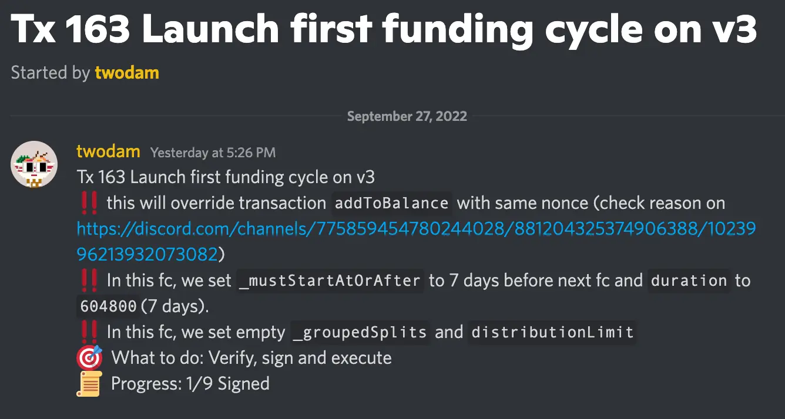
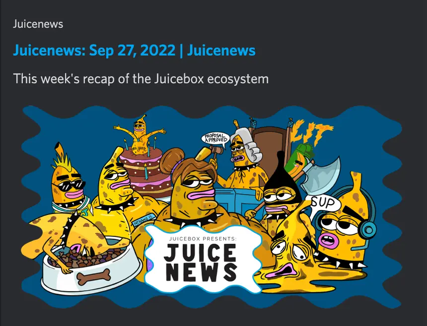
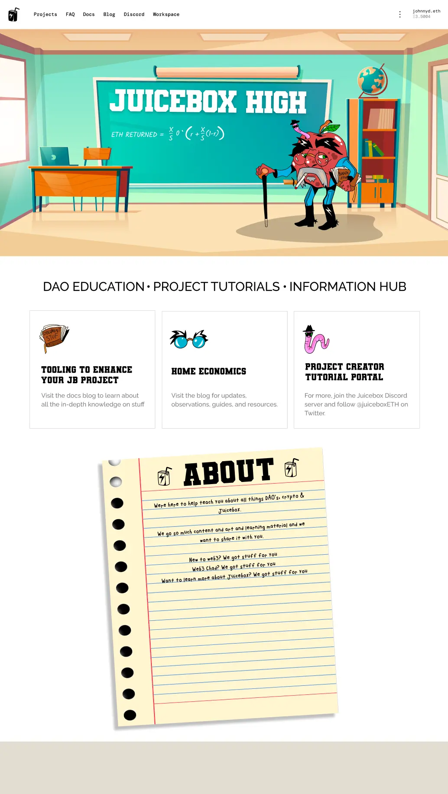
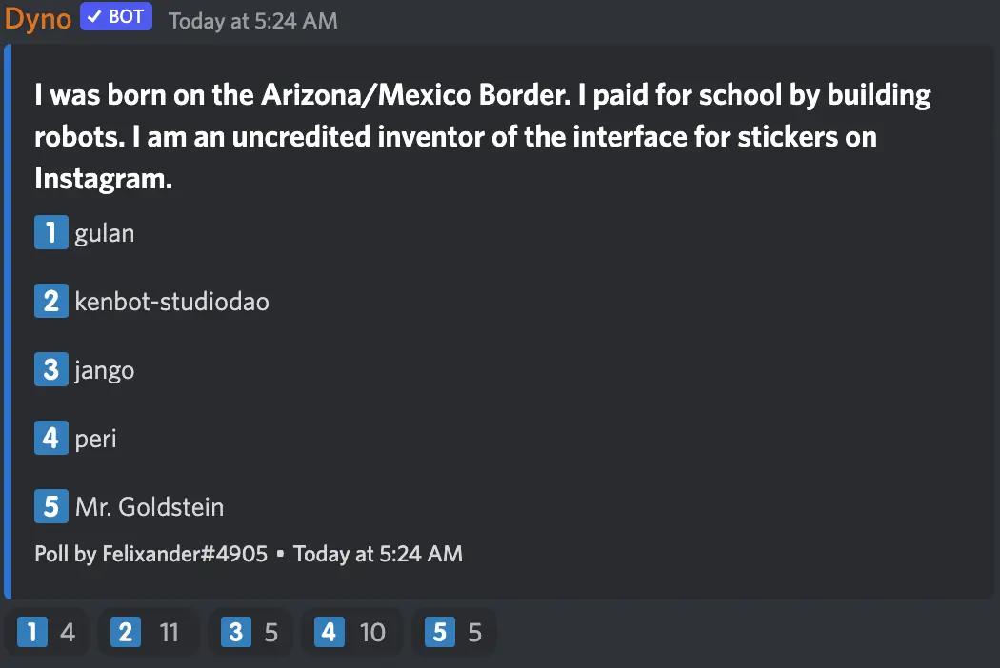

Art by [Sage Kellyn](https://twitter.com/SageKellyn)

## 开发工作汇报 by jango

### V3 合约汇报

V3 合约已于上周部署完毕。目前需要创建 JuiceboxDAO 的 V3 版本筹款周期，这是一个需要多签授权的交易。我们需要把 V3 筹款周期与 V1 及 V2 周期进行时间上的同步。这个交易已经发起，多签在周六前签名授权就可以执行。这个 V3 第一个筹款周期历时 7 天，到期后重新配置就可以与 V1、V2 的 14 天筹款周期同步。

V3 筹款周期目前没有任何支出及赎回的安排，仅作为接收 V3 项目费用用途。

接下来就是前端支持用户版本控制的工作，同时 peri 也在做 subgraph 的相关工作。

V3 的前端代码库已经就绪，等 subgraph 索引的工作完成之后，把两者进行合并就可以完成 V3 前端的部署。部署完成之后，前端的工作就会集中在项目的协议升级版本路径上。

Jango 上周的工作主要是重新校准 NFT 奖励合约，目前仅需要针对数据源的调用方式来对 API 进行轻微的调整。

同时他最近也在着手在 NFT 奖励合约的基础上开发 Defifa 项目，并利用这个合约来对一些即将合并到基础合约的概念进行压力测试。同时他还提到，NFT 奖励也可以像项目代币一样用于赎回项目金库溢出，在这个基础上添加一些追踪代币 ID 和销毁数量的属性，就可以用于 Defifa 项目的第一阶段的应用。

正因为 NFT 奖励合约刚刚推出，用来开发 Defifa 这个新产品可以测试合约 API 的完整度以及其他概念的延展性。即使出现任何问题，因为 NFT 奖励合约只是附加在筹款周期之上的，要进行迭代也比核心协议相对容易。

目前计划针对 NFT 奖励合约再举办一次 [Code4rena](https://code4rena.com/)的审计比赛，并对审计的形式进行新的探讨及试验（见以下内容）。

### Code4rena 审计比赛的新做法

nicholas 介绍，最近 Code4rena 的相关负责人跟我们接触，表示他们有兴趣为一些以太坊上的应用或协议（至少是跟他们有合作关系的协议）创建一些 Juicebox 项目来让实现对这些协议审计更广泛的支持，因为他们发现有一些 DAO 或者组织对他们使用的其他应用或者协议存在审计的需求。

因为目前还未落实这个模式可以怎么实现，刚好 JuiceboxDAO 有审计 NFT 奖励合约的想法，jango 提出我们可以先行创建一个项目试验一下模式的可行性，同时让 Code4rena 借鉴并思考合适他们的模式。

jango 和 nicholas 的思路是，创建一个专门为 NFT 奖励合约的 Code4rena 审计活动而设的项目，早期对这项审计有兴趣的人都可以捐款支持这个项目。之后他俩会发起一个提案，请求 DAO 支持这个审计的费用支出。如果提案获得通过，DAO 决定全额支付审计费用的话，早期的捐款人可以通过赎回项目代币来获得退款。项目会把审计费用设定为资金的分配上限，把赎回比率设定为 100%，那么超出部分的溢出全部可供早期支持者赎回。

jango 指出，现在有许许多多的开源代码是没有具体的人或者组织在真正意义上来负责管理或承担责任的，虽然 Juicebox 协议目前或多或少是由 JuiceboxDAO 来主要承担管理代码库的责任，但外面还有很多项目或者协议是采取更开放的管理模式的。创建一个项目，让众多依赖某些开源代码的个人或者组织能够发起针对这些开源代码的审计工作，会是一个非常好的模式。如果有大的组织也决定通过这个项目来支持审计的话，当然会更好，因为早期的支持者都有机会通过赎回来获得一定部分甚至全额的退款。

nicholas 认为如果能够展开与 Code4rena 的合作，对大家都会是有利的：
- Juicebox 上会有更多新的项目创建；
- Code4rena 也可以解决审计比赛费用支付和分配的问题

## 社区能见度工作汇报 by brileigh 及 matthewbrooks

Juicenews (Juicebox 通讯)新的一期发布在[这里](https://juicenews.beehiiv.com/p/juicenews-sep-27)。

新的一期 [Juicecast 播客节目](https://anchor.fm/thejuicecast/episodes/Ep--11---Steve-from-Marin-County-Swim-Association-e1oet1l)，采访嘉宾是 JuiceboxDAO 的其中一个贡献者 [0xSTVG](https://twitter.com/0xSTVG), 介绍他创建的 [Marin County Swim Association](https://juicebox.money/@mcsa) 项目（一个非盈利性的地方性游泳协会）以及他参与 DAO 工作的经历和心得。

新一期介绍 [Lexicon Devils](https://juicebox.money/p/lexicondevils)项目的配置文章，接下来还会发布介绍 Lexicon Devils 创建的 [FORMING](https://juicebox.money/v2/p/66) 项目的配置文章，着重介绍现有的项目是如何配置自己的筹款参数的，希望能给想要创建类似项目的人一些参考和借鉴。

他们还有一个计划，在 ConstitutionDAO 一周年即将到来之际，做一期播客节目，对 ConstitutionDAO 以及事件的起末做一次深度的探索。会上他们邀请大家帮忙介绍 ConstitutionDAO 的相关人员或在整个事件中有重大影响的人，他们希望采访各个方面的人，以便从不同的角度来认识和了解 ConstitutionDAO。0xSTVG 提出，因为当时中文社区的参与也产生了非常重大的影响，应该尝试接触一些中文社区的 KOL，从中文社区的视觉来补全 ConstitutionDAO 的理解。

（如果有兴趣参与这个采访或者提出自己的看法，可以在 Discord 联系 zhape#0046 或者直接联系matthewbrooks.eth#1111，谢谢）

## JB high 工作汇报 Felixander

JB high 是一个计划把社区内创作的一些协议的教学内容、博客及可用工具介绍等整合成一个 Juicebox.money 的用户教育中枢，方便创建项目的人快速查阅并提升对协议的理解。

他也打算采用问答的方式，撰写一系列介绍 Juicebox 项目配置情况的文章，并整合到 JB high 里去作为教学内容的一部分。

## 猜谜环节

每期周会的保留节目，某位成员讲的两句真话和一句假话，让大家猜一下是哪一个成员。

本期周会的正确答案是......来自 StudioDAO 的 kenbot。
