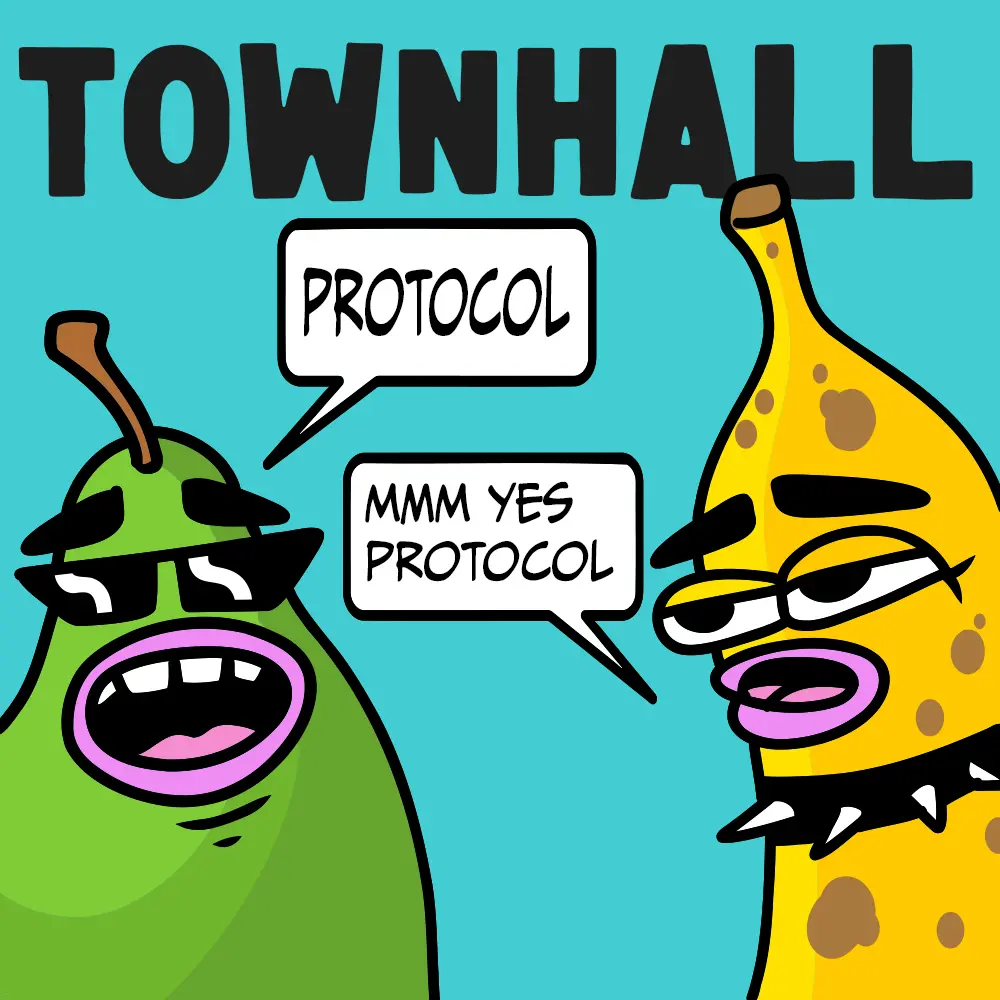

配图作者 [Sage Kellyn](https://twitter.com/SageKellyn)

## NFT 奖励合约策略  Jango

团队最近决定要再举办一次 Code4rena 比赛来对 NFT 奖励合约进行审计。

如果提案申请审计费用的话，提案通过也要走两周多的流程才能安排付款，因此 Nicholas 和 Jango 商量之后，创建了一个专门用于审计的 [NFT 奖励审计基金](https://juicebox.money/@auditfund) 项目，让支持审计这个合约的人先捐款，希望能尽快启动审计流程。

- 之前的两次审计比赛都是由 Jango 先行垫款，显然不是长久之计。这个项目也许能作为一种新的模式；
- 这是我们针对 Code4rena 审计进行的第一个试验，如果成功的话，Code4rena 可以借鉴我们的经验创建他们的项目；
- 如果我们能早点付款，理论上来讲审计比赛最早可以 10 月 7 日开始，但项目的筹款未必跟得上。

但考虑到以下几个因素，可能太着急开始审计未必是个好事：

- Devcon Bogotá 马上就要开始，很多有意向参加审计比赛的开发员可能都会参加这个活动，活动期间可能审计工作的效果会受影响；
- 目前审计比赛的费用约 7 万美元，提案批准需要的时间跟 Devon 活动的时间大致重合，所以利用这个期间对合约继续进行调整和测试可能会是一个更好的选择。

因此把审计活动的开始时间押后至 Devcon 之后，也就是 10 月中旬左右，似乎是一个更谨慎的方案。Jango 倾向于采用这个方案，因为上个月升级 V3 合约各项工作一直很紧凑，加上前端团队最近在 Subgraph 整合和版本升级方面还有大量的工作要做，稍微放慢一点节奏，让大家更好好完善工作，对方方面面都更有信心，这样会更好。

NFT 奖励合约目前体量相对稍大，这个是设计理念导致的，因为我们不希望分散成很多个特定功能的小合约。合约有一些功能可供项目方在部署合约的时候选择是否开启，方便项目方的同时也带来了体量的增大。将来如果对某些想法有特定的要求，也可以添加类似风格的合约来把不需要的功能取消掉。不过在早期阶段，我们会部署这个高度可定制化和功能丰富的 NFT 奖励合约版本，跟 Juicebox 协议的做法是一样的。

前端的 V3 合约版本控制也将接近完成，完成之后我们就会进行前端的 V3 部署并把新项目创建都转到 V3 合约。运行一段时间之后，再把 NFT 奖励合约加入到项目创建流程中去。

## NFT 奖励合约审计基金  Nicholas 及 Jango

[NFT 奖励审计基金](https://juicebox.money/@auditfund) 是 Nicholas 创建的一个项目，专门用于筹款举办 NFT 奖励合约的 Code4rena 审计比赛。在得到 DAO 的支持之前，人们可以先行捐款支持这个比赛。

目前 Nicholas 已经发起一个[提案](https://juicetool.xyz/nance/juicebox/proposal/6bb92c83571245949ecf1e495793e66b), 请求 JuiceboxDAO 资助这次审计活动。如果提案得到批准，审计资金会转到项目的金库用于向 Code4rena 支付费用。

如果 JuiceboxDAO 同意支付审计费用，早期向这个项目捐款的人就可以通过赎回项目代币获得全额退款。这个提案能够达到两个效果：
- 支付 NFT 奖励合约的审计费用；
- 推进与 Code4rena 合作的可行性。

但即便提案获得通过，最快要转出资金也要等到 JuiceboxDAO 的第 33 个筹款周期开始，也就是 10 月 23 日之后。Jango 觉得如果能在 10 月 17 日左右启动审计会更为理想，要实现这个时间计划，我们需要：

- 在提案通过之前，鼓励大家继续向审计项目捐款
- 跟 Code4rena 商量，考虑我们前两次审计比赛的先例，看他们能不能同意在提案动议和批核之前就开始审计，然后审计完成之后资金才能到位。

Code4rena 的人早前跟我们联系，表示他们有意向在 Juicebox 协议创建针对某些智能合约或者协议的项目，让任何人都可以参与众筹来开展这些代码的审计。Nicholas 和 Jango 希望目前这个审计基金项目能探索出一种合适的模式，推进 JuiceboxDAO 与 Code4rena 的整合合作关系。

## JBX 策略  Jango

过去的几个月，我们的团队一直在致力开发一套版本控制的系统，以便日后万一某个版本的合约出现问题的时候，可以尽快编写新版本合约并同时在前端同步更新，以便能够让项目迁移到新版本合约上去。

经过目前这个过渡阶段之后，我们会争取把流程和资金都汇总到 V3 合约上面。

目前资金零散地分布在多签钱包和各个协议版本的金库里，造成 JBX 赎回价值的失真。虽然因为 V1 和 V2 金库分别要收取项目费用，长期还会存在部分资金分散的问题，但最终 JBX 代币会在 V3 合约上面重新找到某种程度的赎回价值。从 JBX 的角度来看，我们的目标是要把精力主要集中在 V3 的金库上面，让前端做一些版本清理工作，以便我们接下来能够专注在 V3 合约上进行开发，不用过多考虑 V1 和 V2 的兼容性问题。届时我们会重新回到 4、5 个月前的状态，当时金库还会经常出现 JBX 赎回的情况，这是 Juicebox 协议原则上能够很好发挥作用的概念证明。而且我们做出的所有金库支出的决定，都会直接影响 JBX 的赎回价值。

## Defifa 项目 Jango

这是 Jango 牵头以 NFT 奖励合约为底层开发的一个世界杯游戏。

这个游戏其实就是一个设置了 4 个筹款周期的 Juicebox 项目，每个周期按世界杯的进度分为游戏的四个阶段。

### 第一阶段：Mint

按照世界杯赛的 32 支队伍在 NFT 奖励合约里设置了 32 个不同的 NFT。世界杯开赛前的两周内，任何人都可以按同样的价格 （暂定为 0.022 ETH）mint 任意国家队任意数量的 NFT。随着 mint 数量的增多，游戏项目金库里的余额也相应增加。这些 NFT 其实上就是对项目金库资产的领取权。在这两周时间内，随时可以销毁 NFT 获得全额退款。

*在这一期间可以随意 mint NFT，如果你觉得对某个国家队的代币分布情况不满意，例如说太多人 mint 英国队了，你可以销毁 NFT 来退款*

概括地说，其实这个游戏的原理就是把现实世界的比赛结果反映到链上，再按这个结果来决定每个 NFT 可以得到的价值支撑应该是多少。

### 第二阶段：开始比赛

世界杯开赛之后，项目金库会被锁定，mint 也会终止。这个期间就不能再赎回或退款了，每个 NFT 分组的数量分布此时也都是固定的。

赛事期间的玩法就是开放性的了。我们既可以采取赢家通吃的规则，即世界杯冠军队伍的 NFT 会获得全部金库资产的支撑；也可以采用更具互动性的玩法，例如说每个赛事阶段都分配一个预设的金库资产比例，在该赛事阶段成功预测比赛结果的 NFT 就可以获得相应的金库资产支撑。

我们可能偏向于选择比较简单的做法。世界杯的每一场赛事都会获得总金库资产的一个固定的比例：

- 48 场小组赛的每场赛事各占 0.416%;
- 8 场淘汰赛的每场比赛各占 2.5%;
- 四分一决赛的每场比赛各占 5%；
- 半决赛的每场比赛各占 10%；
- 决赛占 20%。

举个例子，如果小组赛里英国战胜美国的话，英国队 NFT 的持有人会获得金库资产 0.416% 的份额。

### 第三阶段：交易截止时间

小组赛之后，会有一个交易截止时间，从这个时间一直到游戏结束，所有 NFT 都不能够交易转让。

我们现在不能完全确定，从贿赂的角度来看的话，这个游戏会怎样发展下去。但贿赂肯定是一个很有意思的元素，我们不打算过多干涉它的出现。

我们想法仅仅是创造一种尽可能反映预期结果的机制，这种机制确保能够把现实生活发生的情况如实地传播上链。

### 第四阶段： 结束

赛事结束以后，游戏会进入自行裁决的阶段。

有人会上传一个记分卡，这个记分卡的作用就是告诉合约应该怎样来分配金库的资产，而这个分配的结果应该是把整个杯赛期间的所有比赛的结果都考虑进去。比方说，如果杯赛期间，英国队真就只赢了那么一场比赛，那按照记分卡的记录，英国队 NFT 就会获得总资产 0.416% 的份额。

记分卡的内容是随意的，你也可以上传一个号称英国队获得全部总资产的记分卡。所有参赛队伍的所有 NFT 都会参与验证某个记分卡的准确性并批准使用某个记分卡来作为资产分配的凭据。每个 NFT 的投票权重按每支队伍 NFT 总供应量来平均分配，每支队伍作为一个整体拥有 1 票的验证权重。

达到验证的法定票数之后，项目金库会解除锁定，所有人都可以按最后确定的记分卡的内容来赎回自己持有的 NFT 来从金库领取相应数量的ETH。金库的资金不会主动进行分发，分配的形式是每组 NFT 按照其代表的参赛队伍的成绩获得不同份额的金库资产支撑，再按每组的总发行量进行均摊，最后得到每一个 NFT 的金库资产价值。

***

最有意思的是，你可以分叉这个游戏来运行你自己版本的玩法，可以把这个用于任何锦标赛赛事或者其他，你只需要 mint 一定数量的代币来让游聚集足够的资产，同时把 mint 出来的这些代币用作游戏结果的一个参数。

目前 Defifa 游戏的时间表是这样的：

- 这周末会上线游戏的网站，最初的页面将只有版头和规则的部分；
- 这个游戏上线的地址为 defifa.net；
- 计划下周可以上线 mint / 铸造的功能部分；
- 游戏将于世界杯开幕战前两周正式开始。

游戏里唯一新的合约元素就是这个验证记分卡，我们目前已经对它的参数和构建方式都达成了共识，应该问题不大。

游戏的可视元素的设计非常棒，感谢 Mieos 把所有参赛队伍整理起来，整体效果看起来非常不错。

## Juice 会计应用 Filipv

Filipv 在会上演示他开发的会计应用。这个应该原本的初衷是开发给 JuiceboxDAO 使用的，现在开发成通用版本，所有 Juicebox 项目都可以使用。

如果你想获取某个 Juicebox 项目的会计数据，只需输入要求的参数就可以获得相应的项目信息。这个对某些项目方在他们的法律管辖区里处理税务事宜应该会比较有用。

比方说你想获得 TilesDAO 的会计信息，只需要输入项目 ID、协议版本和要使用的货币名称，就可以获取相应的信息并写入对应的文件内。以下这个是 `付款` 文件，列举了交易的时间戳、ETH 数量、付款时货币价值和付款地址等信息。

你可以在[这里]下载应用的代码。

还有另外一个用于计算 Juicebox 协议费用的应用，但目前只能用于 JuiceboxDAO。

## Juicetool Nance 治理机器人工作汇报 Jigglyjams

在 [Juicetool Nance 页面](https://juicetool.xyz/nance/juicebox), 可以看到目前标注的提案。

（*图上显示的 # TBD 的意思是目前提案处于温度测试阶段，暂时还不会分配提案号*）

点击页面的 `New Proposal`，会进行入提案模板的页面：

这个模板可以选择支出的对象是一个地址还是一个项目，同时还可以标明支出的金额和持续的周期数。同时在接收地址还可以自动解释 ENS 名称。

填写完毕之后，点击 `Submit` 就可以生成一个新的提案。目前提交新的提案还是会推送到我们的 Notion 页面。

Nance 机器人的时间路线图：

- 把 JuiceboxDAO 的治理内容从 Notion 迁移到 [Dolt](https://github.com/dolthub/dolt)（一个 SQL 数据库）
- 解决 IPFS 的存储问题
- 解决治理数据库的版本控制问题

## 谁说的？ Felixander

这是周会上的一个新的游戏环节，让大家猜猜是谁说的某一句话。

本期的正确答案是 **Sage**。

## MCSA 工作汇报  0xSTVG

MCSA（马林县游泳协会）是一个非营利组织，向低收入人群提供水上运动比赛、训练和治疗的机会。 2022 年 10 月 16 日，MCSA 将与金牌得主/NCAA 冠军 Jamie Neushul 和 2020 年奥运会/NCAA 冠军 Hannes Daube 一起举办射球训练营。 这次活动对外每人仅收取 45 美元费用，不足的部分，大概 2,000 美元将由 MCSA 来支付。

0xSTVG 在周会上向曾经向 [MCSA 的 Juicebox 项目](https://juicebox.money/@mcsa)捐款及提供帮助的人表达感谢，并告知他们，筹集的款项都用于积极的用途。很多没有能力参与这种高水准训练的人通过 MCSA 的帮助获得了参加的机会。

## 彩蛋： Juicy 宝箱 Nicholas

Nicholas 在会上介绍了他创建的一个 [Juicy 宝箱项目](https://juicebox.money/@juicytreasure), 他和 Mieos、0xSTVG 等人向项目金库内支付了合计约 1.1 ETH, 并把这个项目的拥有权 NFT 放到 Zora 上面进行[拍卖](https://market.zora.co/collections/0xD8B4359143eda5B2d763E127Ed27c77addBc47d3/258)。Nicholas 希望通过这种形式，引起人们对 Juicebox 不同的项目机制的讨论。

