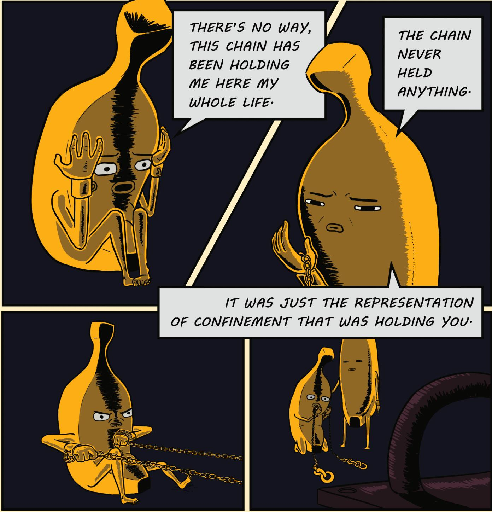
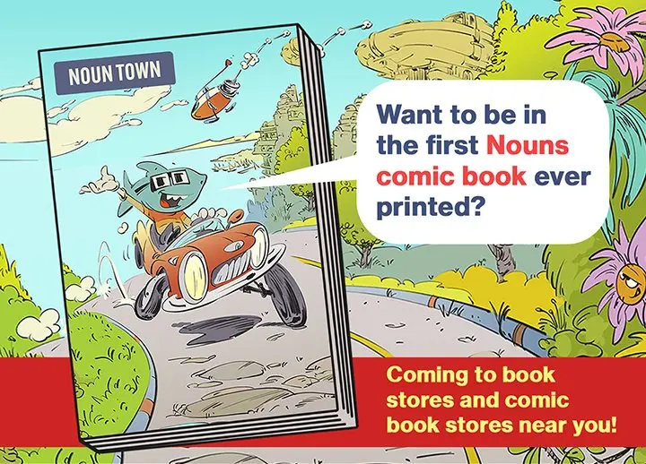
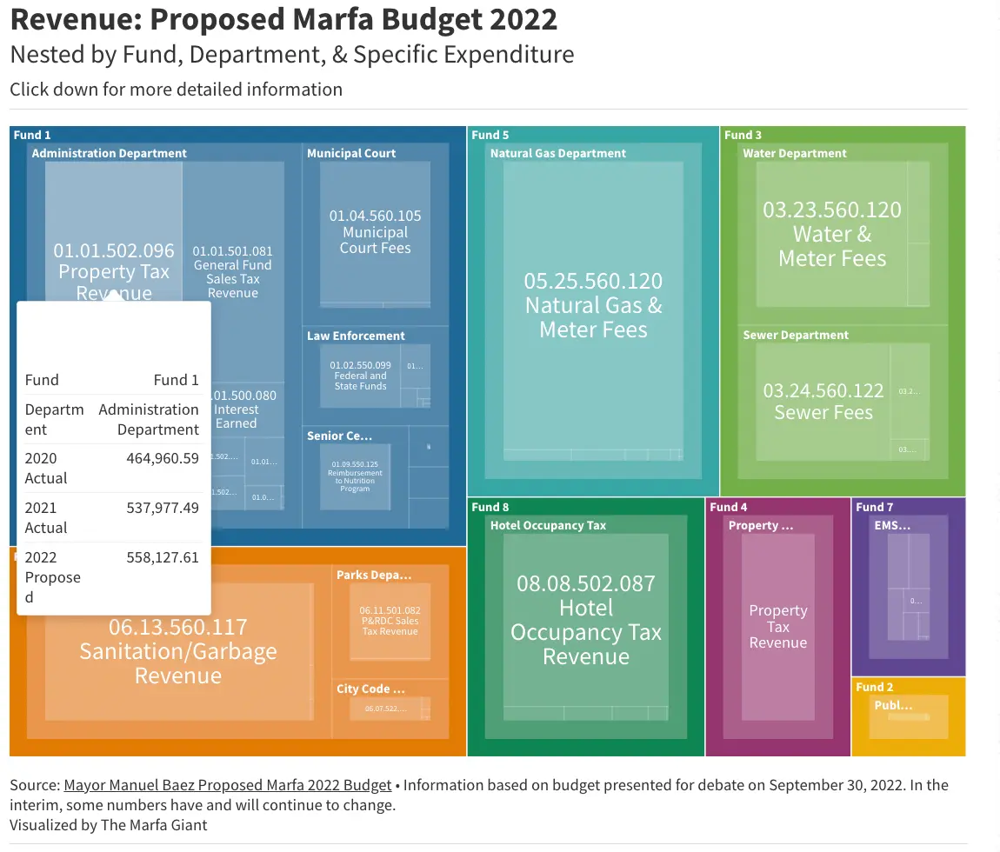
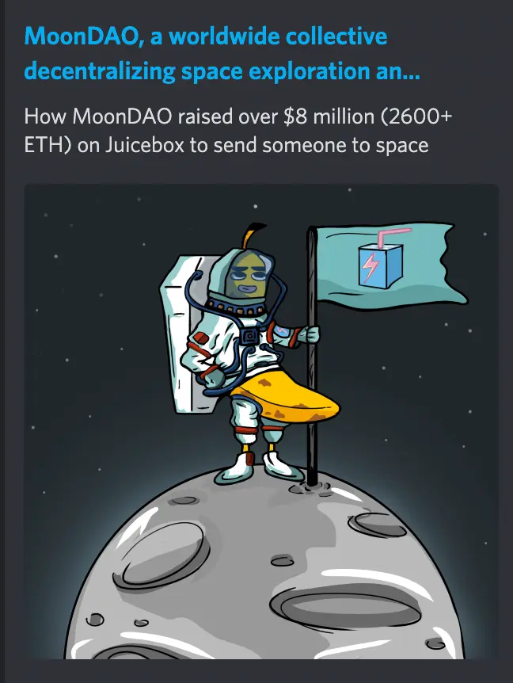
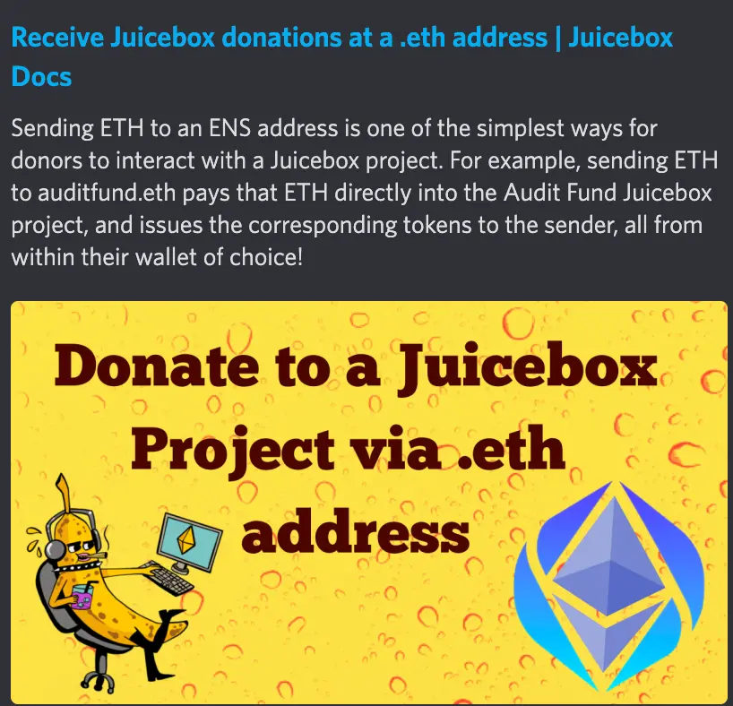

Art by [Sage Kellyn](https://twitter.com/SageKellyn)

## 开发工作汇报 Jango

- 预计 NFT Rewards 合约的 Code4rena 审计比赛将在下周开始
- NFT Rewards 合约的开发工作将于本周五完成并部署到 Goerli 测试网
- 完成审计和部署之后，团队的工作重点将转到 V1 => V3 及 V2=> V3 的迁移路径设计上面。计划于 12 月完成开发工作及前端的全面支持。
- 年底前将进行一系列的扫尾工作，明年 1 月将进行 JBX 迁移，并推出手续费模块及 veBanny 治理 NFT 系列。

## 为艺术而艺术 Felixander

Felixander 和 Burtula 一同制作了 [Banny 图像小说](https://drive.google.com/file/d/1dvpGwf5Yh4aasmhq97fJc1nXMrbQJb-h/view), 他认为这是艺术为自身做的一个有趣小证明，同时提出我们社区应该更注重在艺术方面的工作。

## Nouns 漫画广告页 Gogo

ComicsDAO 正在帮助 Nouns 出版一本关于 Nouns 生态的漫画书，这本书将在链下全美各大书店发行。

他们手上掌握了其中 8 页的广告页面，提供给与 Nouns 相关各个 DAO 及项目进行宣传。ComicsDAO 考虑把其中的一页无偿提供给 JuiceboxDAO, 以便我们可以为自己做一些宣传。

## NFT Rewards 审计基金 Nicholas

由于 NFT Rewards 合约比较复杂且功能比较全面，我们决定像上次审计 V2 协议那样，对这些合约进行一次审计比赛。我们创建了一个[审计基金项目](https://juicebox.money/@auditfund)，让有兴趣支持这次审计的人可以捐款来进行支持。

我们目前计划启动 10 月 18 日启动这次审计，因此在 10 月 17 日前这个审计基金项目必须获得审计所需的 73,000 美元资金。Nicholas 早前发起一个提案，建议 JuiceboxDAO 承担这次审计的所有费用。如果这个提案获得批准，DAO 将会向审计基金项目存入 73,000 美元，但不会铸造任何新的项目代币，也就是说项目的其他捐款人都可以通过赎回项目代币来获得全额退款（扣除 gas）。

由于 DAO 的款项最早要 10 月 22 日才能到位，所以比较理想的情况还是先由大家众筹足够的款项来提前启动审计。因此 Nicholas 同时在提案中请求 DAO 拨出 300 万个 JBX 用于奖励提前捐款支持审计的人。他把捐款数量分成三个等级，分别是 >0.1ETH、 1ETH 和 10 ETH，每个捐款等级都会获得合共 100 万个 JBX 共捐款人分享。同时他提出会考虑搞一个追溯有效的 NFT 奖励活动，将来对这三个等级的捐款人进行 NFT 空投奖励。

同时，这个审计基金项目也将作为一个概念证明供 Code4rena 团队的人参考，因为他们有兴趣在 Juicebox 上面分别为各个各个智能合约和协议创建项目，这样大家都可以无需许可地互相赞助其他协议的审计工作。

最后，Nicholas 提出来，这个项目可能会作为一个专用的审计项目保留下来，以供将来使用。

## Marfa Giant ONNI

[Marfa Giant 项目](https://juicebox.money/@marfagiant)是 ONNI 创建的一个印刷出版项目, 立足于美国得克萨斯州的一个 1700 人的小镇 Marfa，着眼美国全球甚至国际化的发展。

他之前也参加过周会并进行了项目的介绍，但那之后的发展并不是太理想。因此项目进行了一些调整，先集中于本地的发展。他们建立了一个 [marfagiant.com](https://marfagiant.com/) 网站并进行当地新闻、艺术动态等方面的报道，以期在本地先培育一定数量的受众再实现向外的发展。

他们的网站目前实时报道镇市政厅的各项活动，采访一些当地的艺术家、诗人及作家及刊登他们的作品。

ONNI 创建了一个数据可视化工作，在网站上详细列出镇子的各项预算及成本支出等数据，让居民可以查阅参考。

他们还计划向每个镇上居民颁发项目代币，让这个项目变成一个社区共同拥有及管理的项目。但在这样一个偏远小镇，居民的 web3 甚至 web2 认知都还不完全成熟的情况下，怎样教育大家接受新的支付方式会是一个不小的挑战。同时他们还考虑到发行以诗歌和菜谱为内容的 NFT 的可行性，NFT 的销售收入可以反哺社区用于支持艺术家们的创作。

ONNI 提出希望在以下方面得到 JBDAO 社区的帮助和支持：
- 希望得到更多的捐款支持
- 网站前端设计方面需要大量帮助
- 在系统构建、后端开发和数据可视化等方面也需要帮忙

## 社区能见度工作汇报 Nicholas 及 Matthewbrooks

Matthew 和 Brileigh 刚刚推出新一期的 [Juicenew](https://juicenews.beehiiv.com/p/juicenews-oct-11)。

同时他们还撰写了一篇[文章](https://docs.juicebox.money/blog/2022-10-11-moondao/
)，详细介绍 MoonDAO 创建背景、发展历程和社区的最新情况。

Nicholas 在创建审计基金项目的过程中，摸索出一个用 ENS 域名来作为项目直接支付地址的模式，他把这个做法详细地写成一个[教程](https://docs.juicebox.money/blog/juicebox-donate-with-ens/)，供大家需要时进行参考。

## FORMING 工作报告 Lexicon Devils

Lexicon Devils 目前不定期与其他项目合作，在 Juicebox 在 Cryptovoxels 的总部举行一些现场表演活动。最近一次的活动安排在 10 月 29 日，万圣节的前夕，所以本期活动也是相关的惊悚主题。

这一期的表演活动开放申请，任何人有意参加演出都可以到 [Forming 的网站](http://forming.lexicondevils.xyz/)提交申请，截止日期为 10 月 25 日。

同时，Lexicon Devils 计划对他们的网站进行一次全面的整修，希望可以更加清晰地展示他们的目标及展望。

