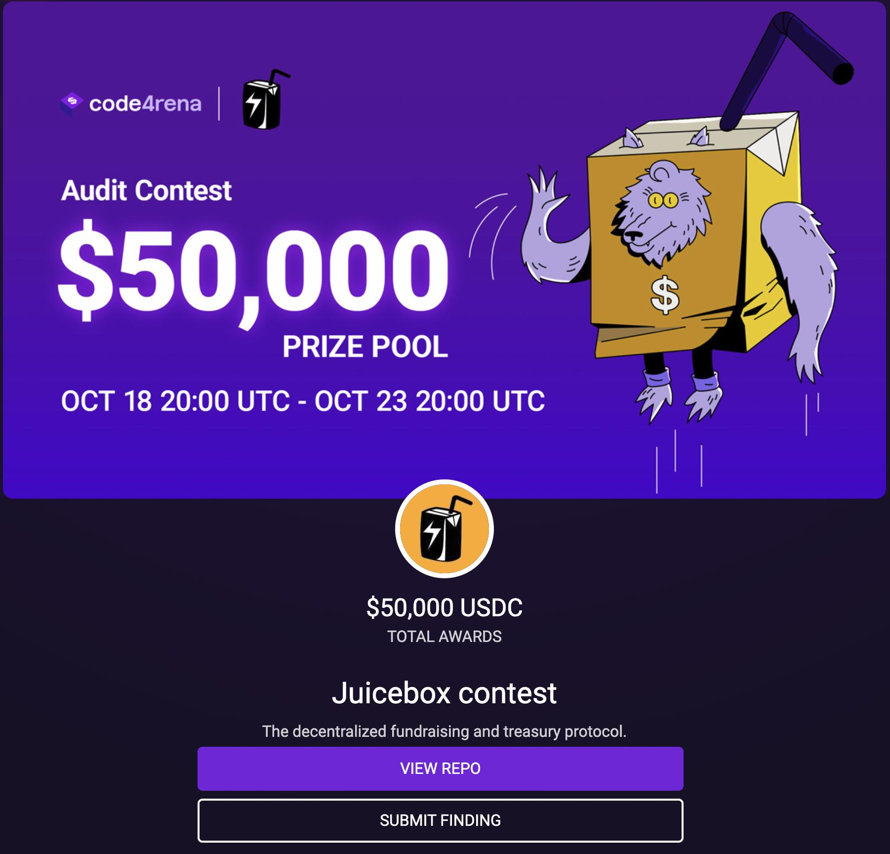
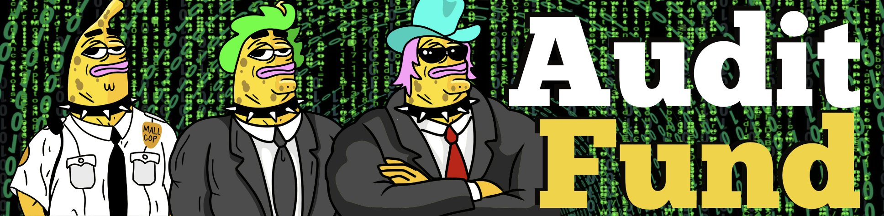
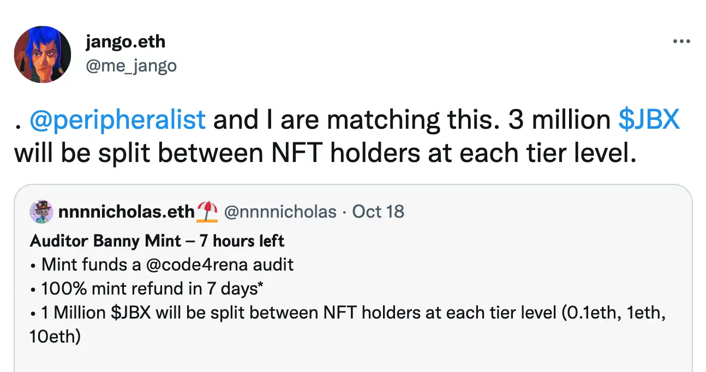
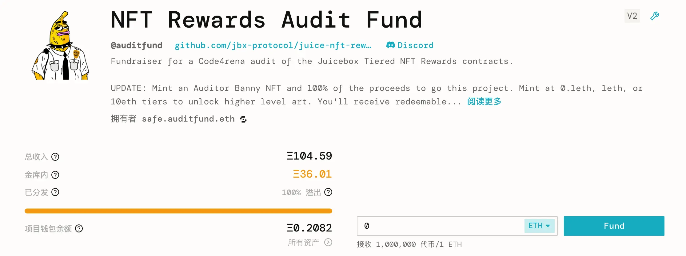
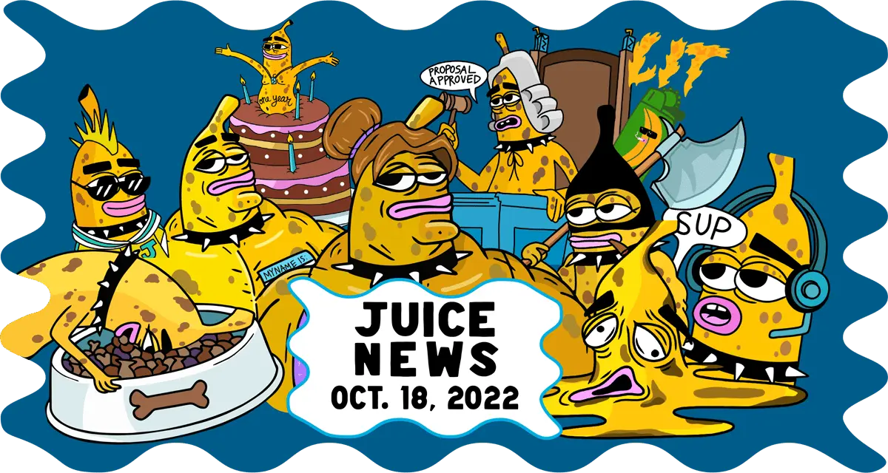
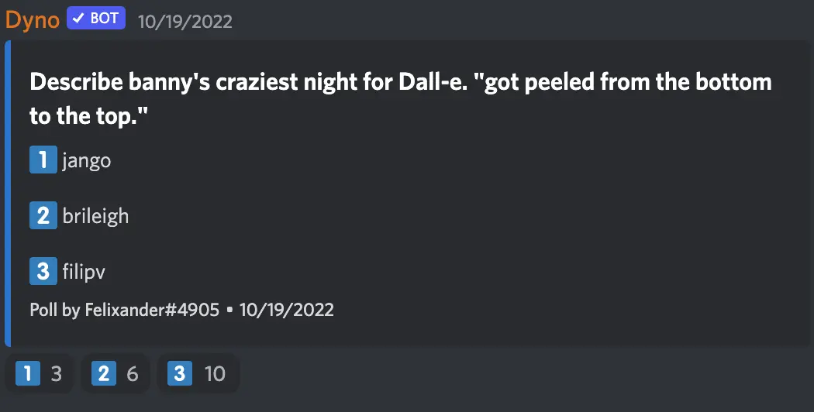

主题图片作者： [Sage Kellyn](https://twitter.com/SageKellyn)

## Code4rena 审计及审计基金项目 Nicholas

NFT 奖励合约的 Code4rena 审计比赛今天早些时间已经开始。

审计比赛的总奖金为 50,000 美元，将历时 5 天，预计于北京时间 2022 年 10 月 24 日结束。审计完成后，NFT 奖励合约将会于本月底在主网部署并合并到 Juicebox.money 网站。

尽管 JuiceboxDAO 已经批准了资助这个审计比赛的提案，但由于治理流程安排，款项要 10 月 23 日才能拨出，这与团队原先 10 月18 日开始审计的计划相背。

因此 Nicholas 创建了这个[审计基金项目](https://juicebox.money/@auditfund)来筹款帮助垫付资金先启动审计，等 DAO 的拨款划到审计基金项目的金库余额，所有其他的捐款人都可以获得全额退款

Nicholas 同时启动了一个三级 NFT （0.1 ETH / 1 ETH / 10 ETH） 系列来助力筹款， mint NFT 的款项直接转到审计基金项目金库作为捐款，这样一来，mint 的人可以获得项目代币以便将来赎回捐款，但同时又可以保留他们的 NFT。

同时，DAO 同意分拨 3,000,000 个 JBX 代币来奖励审计基金项目的捐款人, 每一个分级 NFT的持有人将一起分享 1,000,000 个 JBX。后来 Jango 和 Peri 宣布各自追加 300 万 JBX 的奖励，所以最后每一个分级 NFT 的持有人将共同分享 300万 个 JBX。

审计基金项目获得空前成功，募集到的总资金大大超过审计费用所需资金。

同时，这个项目也将会作为  JuiceboxDAO x Code4rena 合作概念的可行性证明，两者的合作将有助支持其他协议无需许可审计工作的开展。

## DevCon Casa 活动总结汇报 Jango

这个活动的背景如下：

Jango 提交的[关于这个活动的提案](https://juicetool.xyz/snapshot/jbdao.eth/proposal/0xbb9be15ce8a231861218fc907a0068bfbf289d3dbd49cfd85f10ae4ca56afa81)早些时候已经获得 JuiceboxDAO 的批准。

*“鉴于 JuiceboxDAO 希望鼓励和支持创新项目及资本形成架构利用 Juicebox 协议来成形，DAO 应考虑赞助由熟悉协议及其在大局观概念应用的贡献者组织的现实生活的活动，并组织热情的建设者、设计者及资本分配者参与。*

*Thirsty Thirsty 社区和我正打算筹划一个 DevCon 活动期间在波哥大举行的庆典安排，庆祝我们的传统农业的回归，以及举行着眼以 Web 3 为出发点对以土地为本的项目可持续资助的设计比赛。“*

--- 摘自提案原文 

**Jango's first-day-back reflections:**

**以下是 Jango 活动回来以后的感悟：**

- Our ability to pull multi-disciplinary passionate people together was key to unlocking new creative avenues. Ahead of time, I was less sold on the need for a videographer as a value add to the experience. Turns out the budget wasn't just spent on getting a videographer there, they were spent on a Fernando. Same goes for Juanda, everyone who brought +1's, and everyone folks invited to our space for deliberate design/learning sessions and casual moments. Next time we need to double down on this. It's all about the people, the work orders are just an excuse.

- Having a few focused scheduled moments around food and ceremony were grounding and set a perfect tone. It wasn't a greasy hacker house, it was a welcoming space where we could be caring, curious, and warm towards one another.

- It would be nice to have a few more optional excursions planned for people to take part if their schedules allowed, though it seemed most people were happy sitting around the house with laptops out together, exchanging ideas out loud and on notebooks.

- It was great having an extra house in Guasca. Though we didn't use it to its full capacity each day and had some trouble accessing it at times (dirt roads, annoying hosts), the times we did use it were monumental. The dinner we threw with our friends from Mochi was epic, and it was great to have extra bedrooms for folks who wanted more space for themselves.

- Epic having Pablo, Alejandro, Thomas, Mark, Steve, Juanda, Fernando and Bruxa there alongside more day-to-day JuiceboxDAO contributors. It was a focused enough group of people where I felt I could build relationships with everyone. I'm more of an intimate 1-on-1, small group, few real friends kind of person, the cadence of this event catered well towards that. Epic group of big-brain big-heart people.

- Despite spending loads of time online together, getting time to hang and bullshit with peri, zeugh, nicholas, filip, and jmill was necessary to gluing new ideas together. The whole week was high-bandwidth communication with a bias towards doing. big love to the family.

- One of our super powers is empowering creative and passionate people to pronounce their creative muscle through their own projects, in the way they feel most comfortable, encouraging them to push against discomforts their curious to explore, while helping make connections within our expanding ecosystem of builders who might offer support and specialization to round out a project's needs. It'll be difficult to measure this event's immediate value add to the broader JuiceboxDAO community, but seeds were sown and I look forward to referencing this Bogota week as an origin story for many projects/partnerships that may sprout over the next several months.

- We need to be aware of people's financial circumstances when inviting multi-disciplinary friends. We did a good job in helping Fernando, Juanda, Bruxa, and Zacharias (didn't make it but we did what we could) arrive by compensating their airline fees, while all others were responsible for sourcing flights themselves. We each have our own accesses and constraints, we have to be comfortable talking about them so we can help one another make stuff happen and leverage what each of us can bring to the table. This is tricky to scale, but important to get right.

- We could've used more help sourcing ingredients and planning foods. We had this in place with Zacharias, fell apart last minute. Stoked with how we all came together and made it work, but we all spent a grain too much time throughout the offsite week planning meals.

- I liked over-indexing on supporting Thirsty Thirsty. It allowed us all to problem solve with confidence as the weeks went on. I'm excited to see how we can continue working together to help them raise and sustain funds used to power land-and-people-based experiences, and how they can help JuiceboxDAO bring it's community together around earnest moments alongside neighboring communities.

## 前端工作报告 Aeolian

- Rinkeby.juicebox.money 测试网站已弃用；
- Juicebox 的 V3 版本合约已部署到 Goerli 测试网；
- V3 协议的主网部署正在进行中，但由于最近发现涉及 subgraph 的问题，具体部署时间仍待宣布。

## 可视化工作报告  Matthewbrooks and Brileigh

[新一期的 Juicenews 通讯](https://juicenews.beehiiv.com/p/juicenews-oct-18)已经开布，本期主要内容有：

- 0xSTVG 做的每周总结
- Nicholas 撰写的一篇关于如何使用 ENS 地址来把募集资金转入某个 Juicebox 项目的文章。
- Felixander 撰写的关于 SharkDAO 发展历史及其项目配置情况的文章。
- Matthew 及 Brileigh 编写的分别关于 MoonDAO 及期项目配置的两篇文章。
- 在 Youtube 上发布的第一期采访视频，采访嘉宾为 JokeDAO 的创始人 David Phelps。
- WAGMI Studios 工作室制作的 Defifa 预告视频。
- zhape 编辑的 10 月 11 日周会概要。

同时，两位还将过往的 Juicecast 播客节目用 4k 波形可视化来重新渲染，并上传到 [Youtube 的 JuiceobxDAO 官方账号](https://www.youtube.com/c/JuiceboxDAO)，希望重新利用这些内容来提升内容的可搜索度，从而进一步提升 JuiceboxDAO 的影响力。

## 艺术品鉴比赛 Felixander

Felixander 事前让三个人用自己的话描述一下 “ Banny 最疯狂之夜” 应该是怎么样的，然后用他们的描述分别去 Dall-E 生成 AI 绘图。他在周会上展示其中一副作品，并请大家猜一猜，这副作品是来自以下哪位的描述。

正确答案是 ...... **Jango**。

## Defifa 简短工作报告 Jango

大家正在按步就班地推进这个 Defifa 项目。

前端的来说，非常感谢 Blaza 和 Deviant 搭建及托管我们的网站，并开始原型化游戏的各个阶段部分。接下来，我们会再请其他人来帮忙进行网站最后的风格和细节的改进。

至于合约端，有赖于 Viraz 和 0xBA5ED 对赎回计算和得分认证流程的几个不同方案的产品原型化，我们现在已经有了一个有效的赎回机制，而且感觉非常完善。

合约端的下一个工作安排是要编写 4 个可公开提交交易的筹款周期，分别对应游戏的 4 个阶段。这个项目的项目方是一个合约，它会把规则推送到杯赛开始、mint 阶段、交易终止期限和游戏结束日期。在某个筹款周期的期间，任何人都可以依照这些规则来提交生成下一周期的交易。

感谢 Mieos 逐个国家地制作图像文件，这个工作相当耗费时间精力。也多谢 Sage 的 Banny 图像设计，一如既往的出色。

还要多谢 Tankbottoms 上周帮忙把这些图像文件打包到元数据并推送到 IFPS，以便我们接下来生成 NFT 的时候使用。

下周我们将会有所有元素打包到 Goerli 测试网，虽然 Jango 还没有决定要不要在测试网上测试 NFT 的铸造，所有的组成部分都已经成型，而且都感觉良好。

这个游戏结束之后，我们将计划把它的框架和界面扩展为一个能用化的版本，这样其他人也能利用它来实现自己的玩法。

##  ComicsDAO 关于 NFT 奖励合约的提问

Defaulteduser 是 ComicsDAO 的创始人，他在会上解释，最近漫画书慢慢从阅读的内容变成了一种收藏品，这种情况对真正喜欢漫画的人来说不是一件好事。因此他们在计划把漫画书发送至链上，这样在保存这些书籍的同时，还能够让更多的人来欣赏它们的内容。他们的做法是要把一些稀有漫画逐页扫描并上传到链上。

因此，他想问一下，有没有可能逐页扫描稀有漫画书，并把单页扫描图片以一种随机 NFT 奖励的形式分发给获得 NFT 的人。

Jango 认为这个想法难点在于这个随机性上面，因为 NFT 奖励设计上是以确定选择的方式构建的。他提议 ComicsDAO 可以考虑先分发 NFT，然后再用某种随机化的流程来决定每一个 NFT 分配的是哪一页漫画。分发 NFT 之后， 他们可以用一个专用的 URI 解释合约来解释每个 NFT 元数据的图像文件。再之后，他们放弃这个解释合约的所有权，让之前解释的 NFT 元数据固化不能再变更。这个工作方向应该会比较有意思。Jango 也表示如有需要，他很乐意提供帮助。

