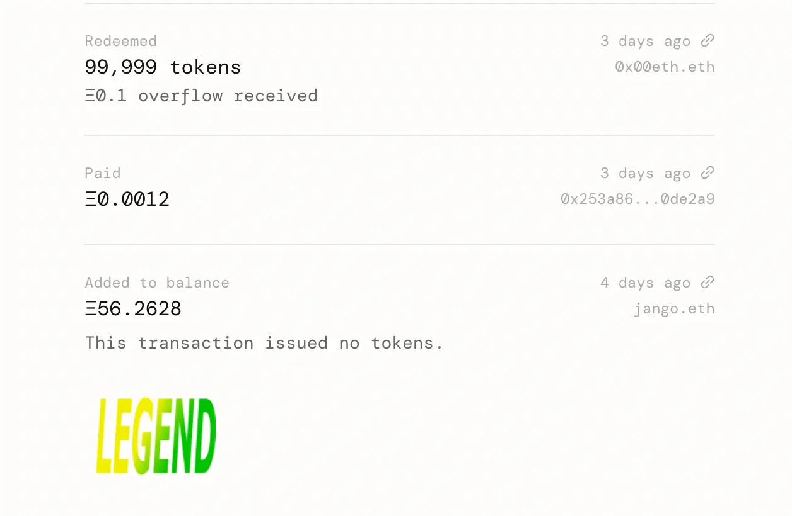
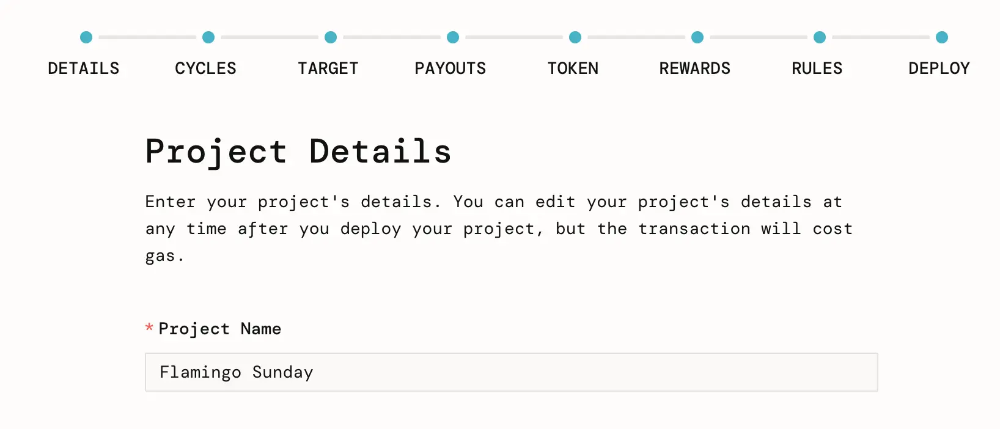
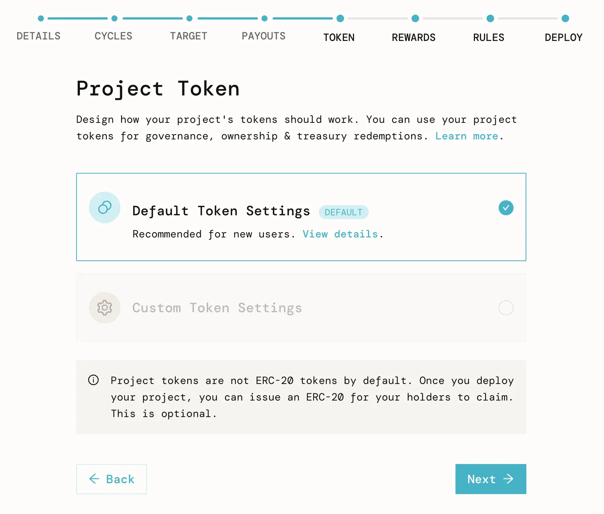
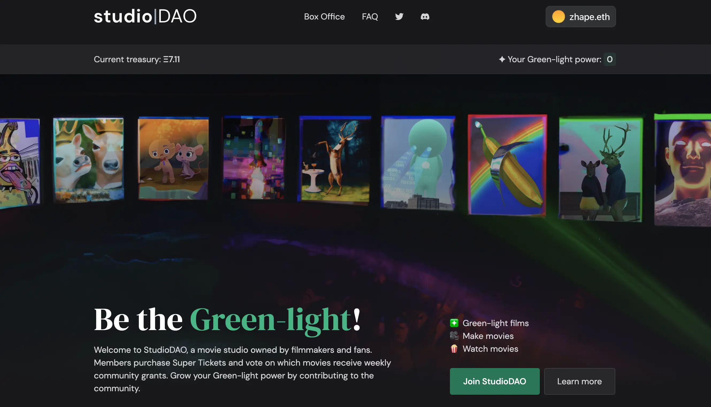
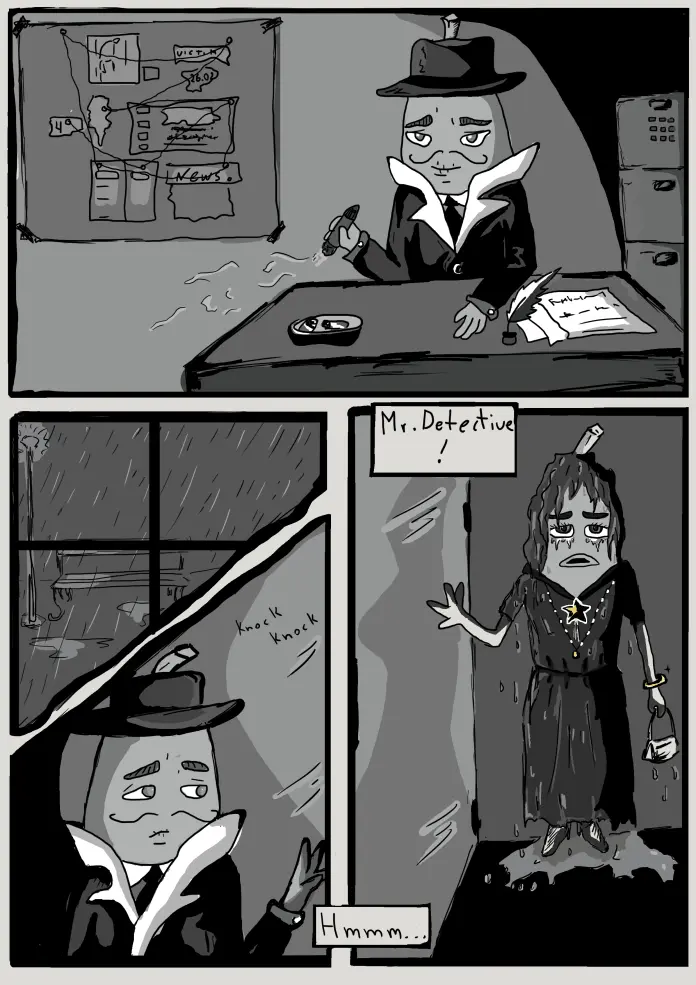
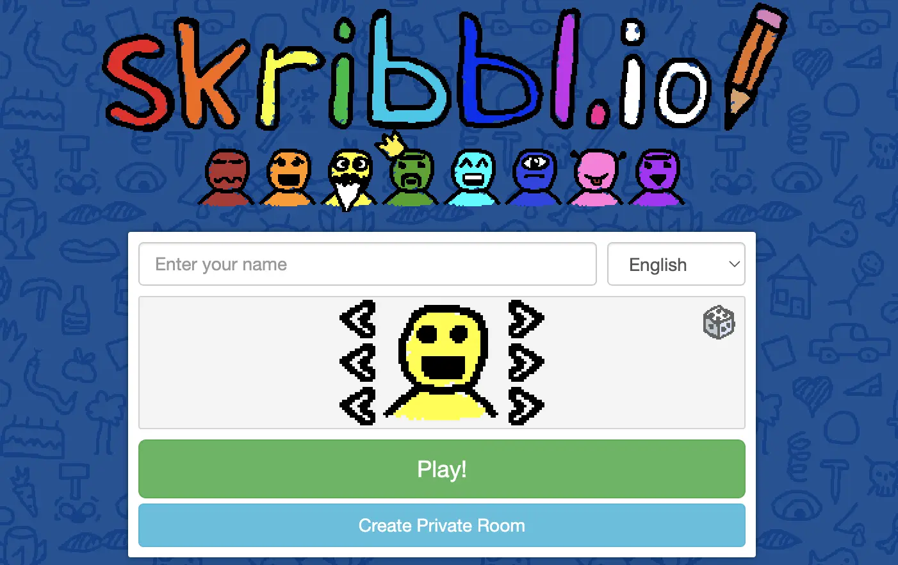
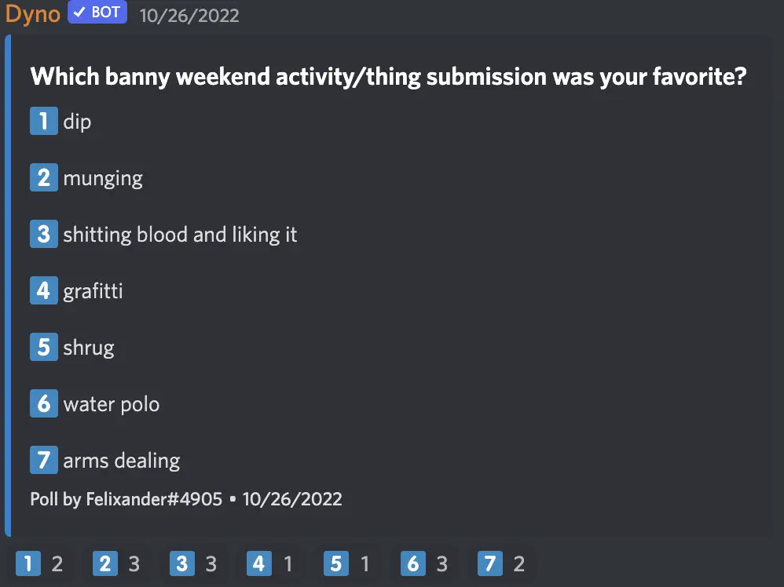

Art by [Sage Kellyn](https://twitter.com/SageKellyn)

## 审计基金项目总结报告 Nicholas

Nicholas 创建了一个审计基金项目，在我们社区成员之间筹款，以便在 DAO 的审计拨款下来之前能够向 Code4rena 垫款按时启动审计。请查看[上周的周会概要](https://docs.juicebox.money/zh/blog/2022-10-18-town-hall)了解更多关于这个项目的详细情况。

10 月 23 日，DAO 的拨款用 Add to balance 的方法（`Add to balance` 即增加金库余额，这个方式不会铸造新代币，这样就可以确保此项目的赎回不会受到新增代币的稀释）转到审计基金项目的金库，之前的捐款人可以赎回他们数天前捐款时获得的项目代币来获得全额 ETH 退款。

同时发放了总额为 9,000,000 个 JBX （其中 300 万个来自 DAO，创始人 Jango 及 Peri 各追加 300 万个) 用于奖励参与此次筹款基金项目的社区成员，这些奖励代币已经由 Nicholas 于今天空投完毕。

Code4rena 方面也表示对这个众筹项目的模式非常感兴趣，将来可能会存在 JuiceboxDAO 与 Code4rena 合作的机会。

Nicholas 同时表示，这个项目将会长期保留下来，以用于日后的审计用途，例如之后我们会开发的 veNFT 的审计或者在此期间一些更小型的审计活动。

## NFT 奖励合约审计报告  Jango

我们的 NFT 奖励合约的 Code4rena 审计比赛已经结束。

目前审计结果总体良好，我们共收到接近 200 项报告，Code4rena 把它们分类为高严重度、中等严重度、gas 优化建议等几个等级。 JuiceboxDAO 的相关开发人员最近几天仔细研究这些问题，同时与一些审计参赛者保持沟通。

好消息是，目前暂时没有发现会影响项目进度的重大问题，因此我们仍将按原计划下周进行主网的部署。

Jango 认为尽管没有问题重大问题，但部署前审计仍不失是一个比较好的做法。在 V2 协议审计中，我们获得经验是，即使一个项目酝酿了较长时间也运行良好，但有时仍然可能会出现一些大麻烦。在开发项目的最后阶段，最好还是要认真审查，同时通过激励的方式让外面更多人来帮忙查找问题。

接下来的几天，合约开发组成员将会参照发现的问题更新我们的测试套件。如果一切顺利，我们准备在下周初部署上主网。在这之后，项目就可以把这个合约加入到他们的筹款周期并设置 NFT 奖励。

## 全新项目创建流程 Wraeth

前端团队，尤其是 Strath 和 Wraeth 两位，近两个月在升级项目创建流程的工作上做了不少工作。升级的主要目的是争取简化目前的项目创建流程，让用户的创建体验更加友好。

Strath 先前在 9 月 14 日的周会上曾对这个工作做过初步的介绍。

今天，新的创建流程已经部署到 [goerli.juicebox.money](https://goerli.juicebox.money/create)。Wraeth 在会上通过创建一个 [Flamingo Sunday](https://goerli.juicebox.money/v2/p/72) 的项目来对流程的每个步骤进行演示。

这个创建流程的几个特点如下：

- 新流程把原有流程分拆成多个不用的步骤，这样的话，项目方每个步骤只需要做一个大的决策，从而减轻他们对协议参数的认知负担。

- 新流程的 UI 简化，操作界面简洁干净，把一些可选项和非常用项折叠或隐藏起来，让项目方不用在面对太多冗余信息。
- 新流程提供了一些常用的参数模板如 `自动筹款周期`、`黑夜代币设置`等这样的默认值，项目方可以选用一些常用的配置，不用每一步都非得定制化。

-  新流程整合了全新的 NFT 奖励合约，项目方在奖励支持者的时候有了更多的选择，但由于该合约涵括面比较广，还需要进行多次迭代把更多功能整合进来。

This product is not yet finished and might need some iterations to improve it a little bit more. Try it out, and if you have feed back, please come to share with us in the [Project Creation Feedback](https://discord.com/channels/775859454780244028/1034595089374257192) thread under the Frontend channel of JuiceboxDAO Discord.

这一产品仍未最后完成，需要迭代进一步地完善。大家可以试用一下，如果有任何反馈，可以到 JuiceboxDAO Discord 的前端频道的 [Project Creation Feedback](https://discord.com/channels/775859454780244028/1034595089374257192) 讨论组提出。

## StudioDAO 工作汇报 by Kenbot

Kenbot 作为 StudioDAO 的创始人，表示很感谢 Jango 的支持和鼓励。他们在 JuiceboxDAO 的 Discord 开设了专门的讨论频道来孵化这个项目，在那里项目得到进一步推进并逐渐成形。同时 Kenbot 也很多谢前端组的 Aeolian, 帮忙开发了一些关键功能，同时调动整个工作进度的积极性。

Kenbot 还在会上演示了 StudioDAO 的主页，介绍页面上不同的项目和内容。他表示希望这个页面能成为一个有趣的面板，同时与社区成员的 NFT 藏品实现关联。随着项目启动，创新思维会不断萌发，募集资金也将不断增多，将会实现项目最终的成功。

## DevCon Casa 活动总结报告 Bruxa

Bruxa 作为 Thirsty Thirsty 的创建人，对这个项目对他们的大力帮助表示了深深的感激之情。

她表示，Juicebox DAO 这个项目的拨款，不但帮助实现一次完美感受的活动，同时也实实在在对他们社区产生了正面的影响。一方面，部分拨款帮助他们社区作为非盈利机构获得一定的运营跑道，另一个方面，也帮助社区成员实质性地改善生活条件、改变对社区潜力的看法态度。

Jango 也对 Bruxa 及 Thirsty Thirsty 社区为这个活动做出的贡献表示感谢。他指出我们有很多社区成员都非常关注及希望与同样看好 JuiceboxDAO 未来的人展开合作，因此举办这类活动，让大家在不同时间不同地点与不同的人聚在一起，是一个非常好的事。

Bruxa 还邀请计划参加 SF Blockchain Week 2022 的 Juicebox 社区成员，去参加 Thirsty Thirsty 社区在这段期间举办的活动。他们将组织一些酒庄参观之类的活动，非常欢迎 Juicebox 的朋友去参加。

## Banny小宇宙漫画第二期及 Defifa 发布会 with Felixander

Felixander 在会上他将会更加致力于 Banny 小宇宙的设计工作，争取给 Banny 这个主题形象带来更多 meme 的元素。

同时关于 ComicsDAO 在他们即将出版的 NounsDAO 漫画中提供给 JuiceboxDAO 的一个广告页面，他说会和 Brutula 一起工作，并将开设新的 Discord 频道与大家一起讨论页面内容的设计。

Banny 漫画第二期即将推出，下图是侦探 Banny 故事的预告图。

关于 Defifa 项目的发布一事，Felixander 表示他一直在与媒体接洽，希望对我们即将推出的 Defifa 项目进行追踪报道。他也邀请有兴趣的人一同参与推进这个工作。

## 堕落的字谜  Felixander

在会上，Felixander 请大家用一个词或一个物品来形容一下 Banny 的狂野周末。然后他请大家在 skribble.io 网站上玩一个画图猜字的游戏。

最后，他在会上发起问卷调查，看一下谁想出来的词或物品最受到大家的认同。

