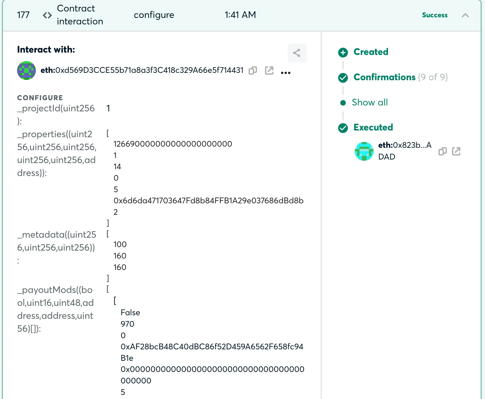
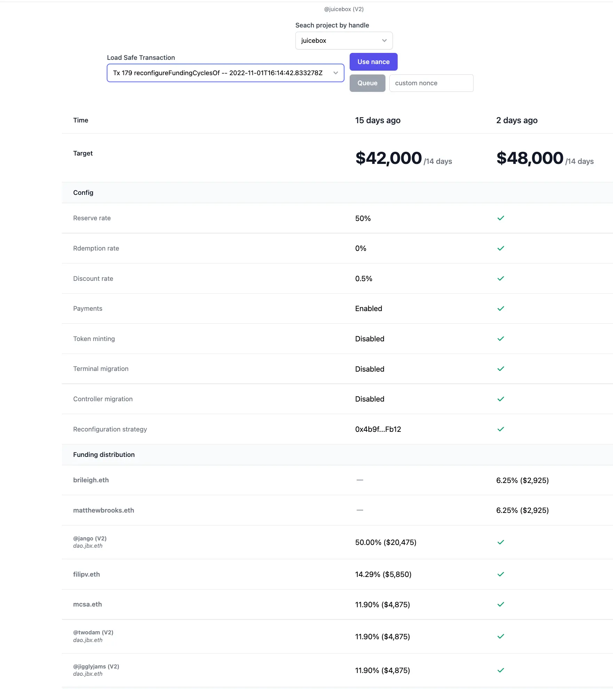
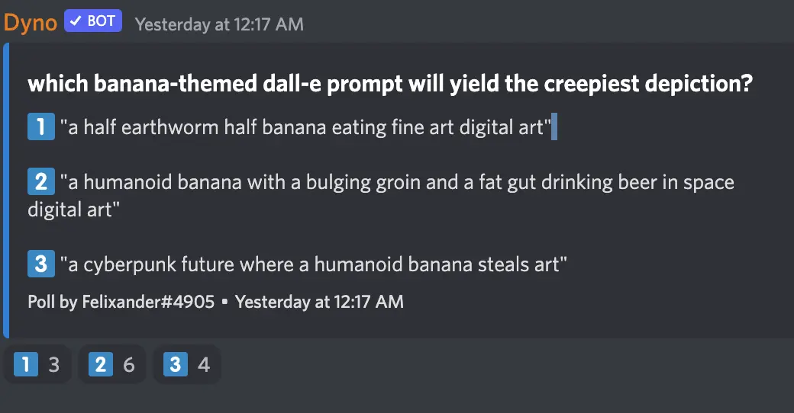

Art by [Sage Kellyn](https://twitter.com/SageKellyn)

## 重新配置助手 by Jigglyjams

这个[重新配置助手](https://juicetool.xyz/juicebox) 工具由 Twodam 及 Jigglyjams 共同合作开发。

### 背景材料：

向 Gnosis 多签提交项目重新配置交易过去是一个非常繁复的流程：

- 治理流程结束后，要有人按通过的提案来梳理支出的变化，然后编辑一个新的数据列表；
- 然后要有人对这些新支出进行复核，并逐项在网站的重新配置界面进行更改，经常还要计算新的百分比；（如果某一周期有十几个提案支出提案的话，这个工作是非常辛苦的。这个工作在过去主要先后由 Jango 和 Twodam 来承担。）
- 如下图，Gnosis 多签的交易细节比较复杂，对非技术人员来说极不友好，更不用说要判断其内容的对错。

### 这个工具的原理

Twodam 和 Jigglyjams 共同合作，解决了这一问题。治理流程结束后，首先通过 Nance 治理机器人去 Notion 的在册贡献者支出名录中获取数据，然后在页面上与上一周期的数据对应排列起来，这样操作员或者多签成员就能够很轻松地比较两个周期间的差异，看是否与本周期治理的提案结果相一致。

这个重新配置助手把相邻两个周期的重新配置参数并排排列，左侧为当前周期数据，右侧为下一周期数据。操作员可以通过比对两个周期参数的差异来确定配置是否与治理投票的结果相符。如果相符，操作员就会签署及提交新的 Gnosis 多签交易，经过多签成员签名之后就可以排队交易上链。同时，多签成员也可以在签名之前用这个工具来确定交易内容正确无误。交易执行之后，项目的重新配置就完成了。

正因为能够从 Notion 数据库获得数据，操作员不用再手工在 Juicebox.money 界面进行计算及填写的操作。尤其是 JuiceboxDAO 接下来可能每个周期要重新配置三个金库的参数（V1、V2 及 V3），这一工具将会大减轻操作员或多签成员的负担。

## 简短提示 by Jango

Jango 本周有事未能出席会议，在会议议题频道留了几条简短提示：

- NFT 奖励的 721 委托已经部署到主网。
- Defifa 项目进入收尾阶段。各方面已经就绪，就差最后的整合工作。
- 请多签成员复核及签署交易。

## 前端关于 NFT 创建流程及版本控制部署的时间计划 by JohnnyD

如果是创建新的 NFT 项目的话，前端目前已经有效覆盖了。部署工作基本上就是打开某个标记的事情，目前他们正在等待合约部署完成的消息就可以着手部署。完成之后，就可以在主网上创建带 NFT 奖励的新项目了。

他们工作的下一步是发布重新配置功能，让已配置 NFT 奖励功能的项目可以重新配置项目的 NFT。

在此之后，就是要让没有配置 NFT 奖励功能的现有项目能够重新配置项目来添加上这一功能。之后这项工作就将全部完成。

## Juice RSS 订阅源 by Filipv

Filipv 编写了一个 Deno 脚本来实现 Juicebox 项目的 RSS 订阅源服务。每次 Juicebox 上面有新的项目创建，都会推送相关信息到订阅f的 RSS 阅读器。

大家如果想要及时获得 Juicebox 上新建项目的最新资讯，可以把这个链接加上自己的 RSS 阅读器上面：https://juice-rss.deno.dev/。

这个脚本的源代码在[这里](https://github.com/filipvvv/juice-rss)。

## Banny宇宙工作汇报 Felixander

Felixander 为 Banny宇宙搭建了一个简单的[网站](https://felixanderfelixand.wixsite.com/bannyverse)，他建议可以在网站上展示一些关于 Banny 的作品和组织一些艺术创作比赛。

在社区能见度工作上，他尝试给我们当前能见度工作建立了的起始值，作为日后衡量工作成果的一个标准。他同时指出，九月我们网站的博客的浏览量达到了开始监测以后的最高值。

他还创建了一个[JB 眼球收藏基金](https://juicebox.money/v2/p/293)的项目，用来专门为我们的市场营销工作筹集资金，这个项目的想法来自之前社区内关于不同形式市场推广形式的一个讨论。他目前计划将会把募集的资金用于以下方面：

- 为 Defifa 项目举办某种形式的新闻发布会，
- 跟其他 Web 3 艺术家合作，举行一些 Banny 的 meme 创意比赛，
- 举办一个 Banny 宇宙主题的寻宝活动。

 ## AI 绘画鉴赏家 by Felixander

Felixander 准备了三个指令，让参会成员猜一下，把这些指令提交到 Dall-E AI 绘画，哪个指令画出来的图画最为恐怖恶心。

## ConstitutionDAO 系列播客工作报告 by Matthewbrooks and Brileigh

他们两人最近正在制作一组关于 ConstitutionDAO 的播客，来作为 ConstitutionDAO 成立一周年纪念活动的一部分。

目前他们成功邀请到苏富比拍卖行的主席 Brooke Lampley, 她当时是作为 ConstitutionDAO 的代理人在现场参与竞拍。

同时他们还计划参访 ConstitutionDAO 的核心成员 Juilian Weisser 和 Will Papper。

这个 ConstitutionDAO 播客节目计划制作大概三到四集，第一集将于 11 月中左右发布，希望能够赶上拍卖活动的一周年纪念。

