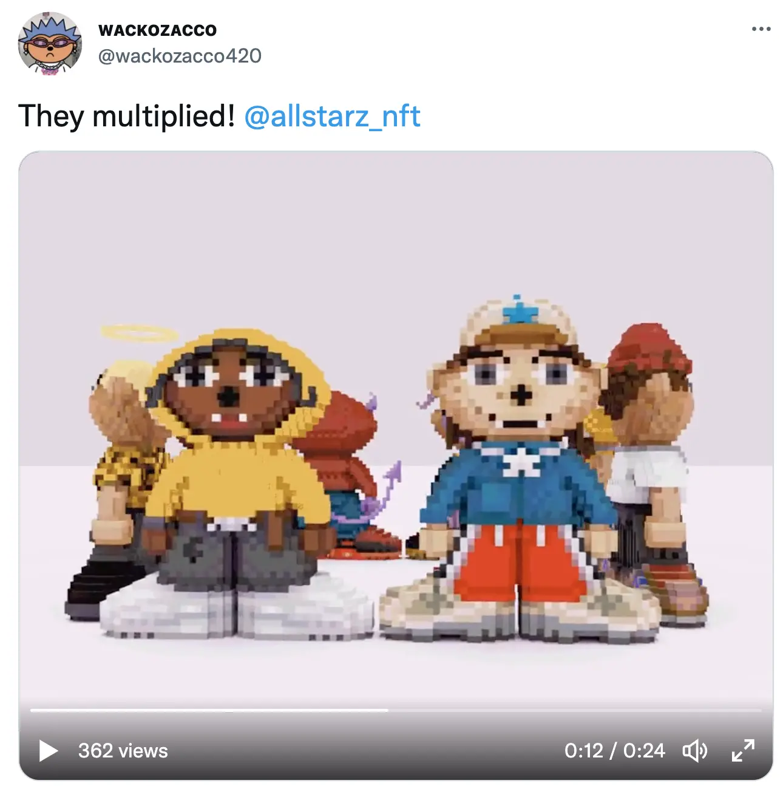
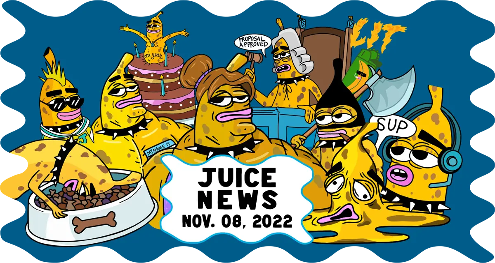
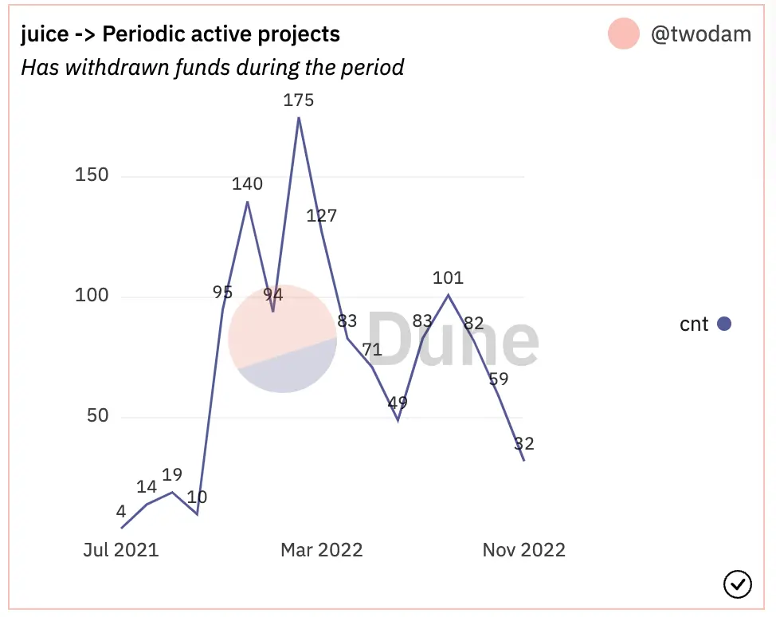

Art by [Sage Kellyn](https://twitter.com/SageKellyn)

## Defifa 工作报告 by Jango

Defifa 项目在 11 月 6 日启动。这一周的工作非常紧张，一直到启动都在做各种整合。前端小组在其他合约部署后只有最后 48 小时处理，搭建了一个非常美观的 [defifa.net](https://www.defifa.net/) 网站页面。项目先是在 Goerli 测试运行几轮后再正式在主网上启动。

非常感谢 0xBA5ED 很快在合约的所有权设置发现了一个 bug，因为在启动早期仅有 1.8 ETH 投入项目金库，所以还算是相对较好的情况。项目团队决定暂停 NFT 铸造，并过去 24 小时清理完成这个 bug 之后，重新创建了一个 Juicebox 项目，在这期间同时改进了一些前端的功能。

所有在第一个版本 mint 过 NFT 的人，都可以到[这里](https://take1.defifa.net/)来进行退款。团队决定将会用项目的预算资金来补偿这些人的 gas 费用。

目前新的版本已经就绪，测试也已经基本完成。这个 Defifa 项目虽然主要是基于 NFT 奖励合约，但还是有些细节需要琢磨，尤其是资金归属及资金的准确数量等方面要反复确认无误。

迄今为止一直感觉良好，整个开发过程相当顺利，也很高兴看到这个试验顺利地展开。Jango 预料项目初期的接受度应该会偏低，我们要利用好这段时间来更好地介绍或解释这个项目、必要时候还要对项目加以改良。希望随着世界杯开幕战来临，整个世界都会发现世界杯已近在眼前，这里大家突然发现有个非常酷的 Defifa 世界杯游戏正逐渐成为讨论的焦点。

## V3 Frontend Update V3 前端工作报告 by Aeolian

目前 V3 协议已经完成在 Juicebox.money 上面的部署。

- 对于新项目的创建人来说

  如果当前项目创建人通过新的项目创建流程在 juicebox.money 上创建新项目，这个项目将在 Juicebox V3 合约上面启动。

- 对于现有项目的项目方来说

  我们会很快发布一些工具和文档来帮助现有的项目升级到 V3 协议。这个升级是可选的，并不会强制进行。现有的 V2 项目应将正常运行，我们肯定也将会策划及实施协议的向后妆容。

最重要的一点，在 V3 协议上启动的新项目，稍后在 NFT 奖励合约部署之后就可以使用这一功能。在些之后，从 V2 协议迁移过来的项目也将可以使用这一功能。

负责设计及实现新的项目创建流程的两位开发人员 Strath 和 Wraeth，欢迎大家发现问题及时报告及反馈使用意见。

## Joke 代币空投 by Seanmc

先 Seanmc 对 Juicebox 社区一直以来给予 JokeDAO 的支持表示非常感激，Juicebox 的拨款对他们的发展帮助良多。

就在周会的前一天，他们按每 ETH 5000 Joke 代币的比例，向之前为 [JokeDAO 的 Juicebox 项目](https://juicebox.money/@jokedao)捐款的人空投 Joke 代币。JuiceboxDAO 的多签钱包因为之前之前向 JokeDAO 项目发放拨款，共收到 27,096.482 个 Joke 代币。

批准向 JokeDAO 拨款的提案是 [JBP-211-Sponsor Development of JokeDAO V2](https://juicetool.xyz/snapshot/jbdao.eth/proposal/0xecb6ba5ca205acb63cb430d6e94cb48e8b0ff8f1e83a0d1478d35f729ab1532f)，拨款分成三个阶段。 JokeDAO 已经完成第一个阶段并在 8 月17 日的周会上进行过新功能的演示。目前他们正努力为第二阶段的工作努力。

Seanmc 同时介绍，Joke 代币是 JokeDAO 的治理代币，将用于决定 JokeDAO 的发展方向及具体工作安排。同时 JokeDAO 每周都会举行搞笑段子比赛，持有 Joke 代币的人每周都将会收到比赛投票代币的空投，以便参与段子比赛的投票活动。这个搞笑段子比赛是他们 JokeDAO 的一个最简化可行产品（MVP) , 也是他们在自己创建的治理平台上的一个游戏。这是一个自下而上、以社区为中心的应急治理平台，兼顾有趣的特性，区别于现在的由核心团队提案社区表决的自上而下的治理体系。

目前他们主要的工作重点是实现 Juicebox 拨款的第二阶段目标，即可执行合约。这个合约允许人们部署一个模块，从而在某个比赛中对不同名次实施不同的奖励，可以定制具体获奖名次及使用任何 ERC-20 标准代币来发放。基于不同的比赛，任何人都可以制定自己的奖励模式。

## 记账工具演示 by Gulan

Gulan 目前在 JuiceboxDAO 主要负责会计记账工作， 他在会上演示了新的记账工具。这个工具主要用于把各个提案内的信息整合到一个地方，必要时可以清晰展示 DAO 在将来的筹款周期需要承担的费用。同时他宣称这个工具可以实时从链上自动抓取数据，我们多签的交易可记录进行归档储存。也可以把这些数据改善到 Notion 由 Jigglyjams 的 Nance 治理机器人来读取，实现不同工作流下面数据的延续性。

他还介绍了他创建的 CogniDAO。这个 CogniDAO 的主要用途是，不用他向每个个人收取费用清单或收据再人工录入这些数据，CogniDAO 其实把付款的路径统一化，所以付款相关的记录都可以自动整合到系统之内。按他的说话，CogniDAO 是一个被动执行各种付款交易的实体，以期能帮助其他工作尽快展开。

## Forming Update Forming 工作报告 by Darbytrash

月底大概 11 月 27 日，Lexicon Devil 将会举办一场 FORMING 携手 [AllSTARZ](https://twitter.com/allstarz_nft) 的艺术展示活动。 Wachozacco 为他们的 NFT 系列制作了一些 Voxel 模型并将用于制作 Voxels 空间的可穿戴物品。

他们同时打算把之前举办过活动做一个混剪编辑，用来向其他社区宣传和分享 Forming 文化。昨天他们召开了一个会议，商讨下步工作方向及计划接触的社区，不断地推动 Forming 的向前发展。

## Governance Cycle Update 治理周期总结 by Matthewbrooks

Matthew 在会上对当前治理周期的各个提案逐一进行粗略的介绍。可以到[这里](https://twitter.com/zhape1112/status/1588775349433040896?s=20&t=ncktgQxFLGn6sNDJZx9xQA)来查看本期提案内容概要。

Matthew 及 Brileigh 同时发布了[新一期的果汁新闻](https://juicenews.beehiiv.com/p/juicenews-nov-08)，总结最近一周发生在 Juicebox 生态内的主要大事。

## Juicebox 统计数据分析 by Filipv

11 月截至周会，协议共收到 266 ETH 付款，平均捐赠数量为 1.26 ETH。这段期间有 11 个新建项目及 21 个活跃项目。

同时协议周期性活跃项目的数字目前呈现下降的趋势。

## Alien to Me 演示 by Connor & Kenbot

[Alien to Me](https://twitter.com/Alien_to_Me) 是一个动画节目，将会在  [StudioDAO](https://www.studiodao.xyz/) 启动及在 Juicebox 创建项目。作为这个节目的创作人，Connor 来到周会介绍他们正在 StudioDAO 做的工作。他在会上展示他们正在制作的网站页面，逐一介绍页面每项内容。同时还详细介绍了他们的 NFT 奖励设置。

[这里](https://www.youtube.com/watch?v=SOE7Uw7y8H4)可以观看这个节目的预告短片。

Kenbot 赞扬了 Connor 的努力工作，表示他们将会把这个节目作为 StudioDAO 一个真实项目来进行推进。他的主要想法是创造一个氛围让更多的创作人在 Juicebox 上创建项目，并成为整个生态网络的组成部分。因为越来越多人在探索孵化及帮助新生艺术家的途径，Kenbot 表示会尽快搭建好他们的平台，并向更多内容创作方开放渠道，这将会成为 StudioDAO 网络的一个重要部分。

Kenbot 同时说，StudioDAO 将会启动他们的绿灯金库并向早期支持者开放，然后逐步建立治理、启动首批项目，并向大家开放讨论决定新项目加入 StudioDAO 的途径。

## 大学区块链俱乐部联系报告 by 0xSTVG

0xSTVG 最近一直努力与各大高校区块链俱乐部进行接洽。上个月早些时候，Jango、Nicholas 及 0xSTVG 就为斯坦福大学的区块链俱乐部做了一次 Juicebox 的技术概述讲解活动。

本期周会当天，他将与 Nicholas、Filipv 一同与密歇根大学的加密协会开会，向他们做一个关于 Juicebox 的概述介绍，然后与协会成员展开问答环节。

应 UCI（加利福尼亚大学欧文分校）邀请，0xSTVG 将于本月 21 日与他们见面并进一步介绍 Juicebox 的具体情况。

