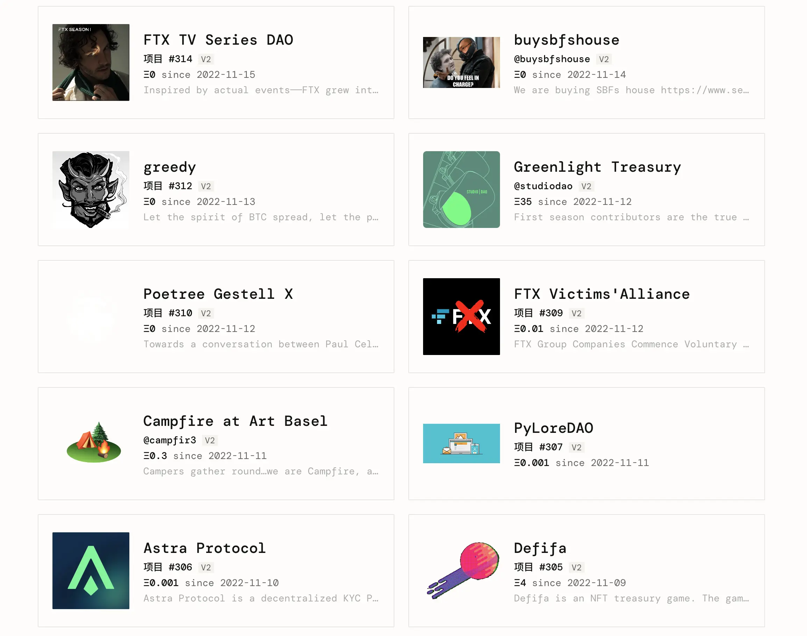
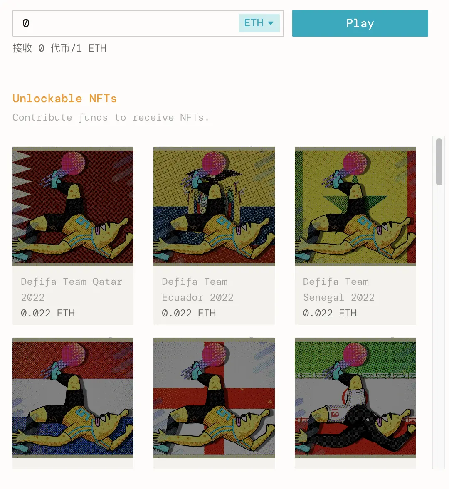
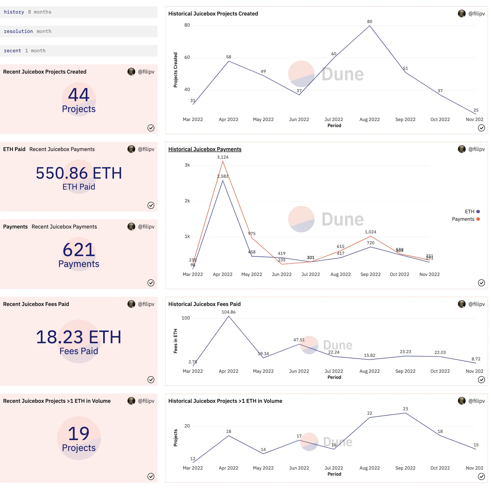
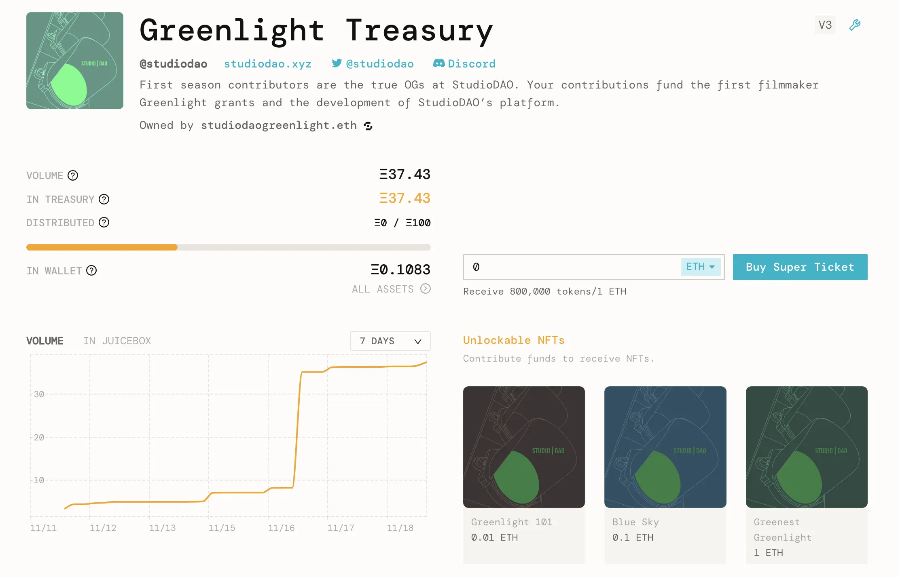
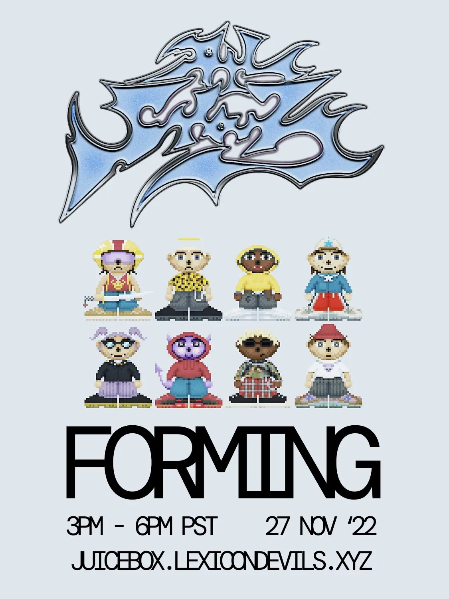
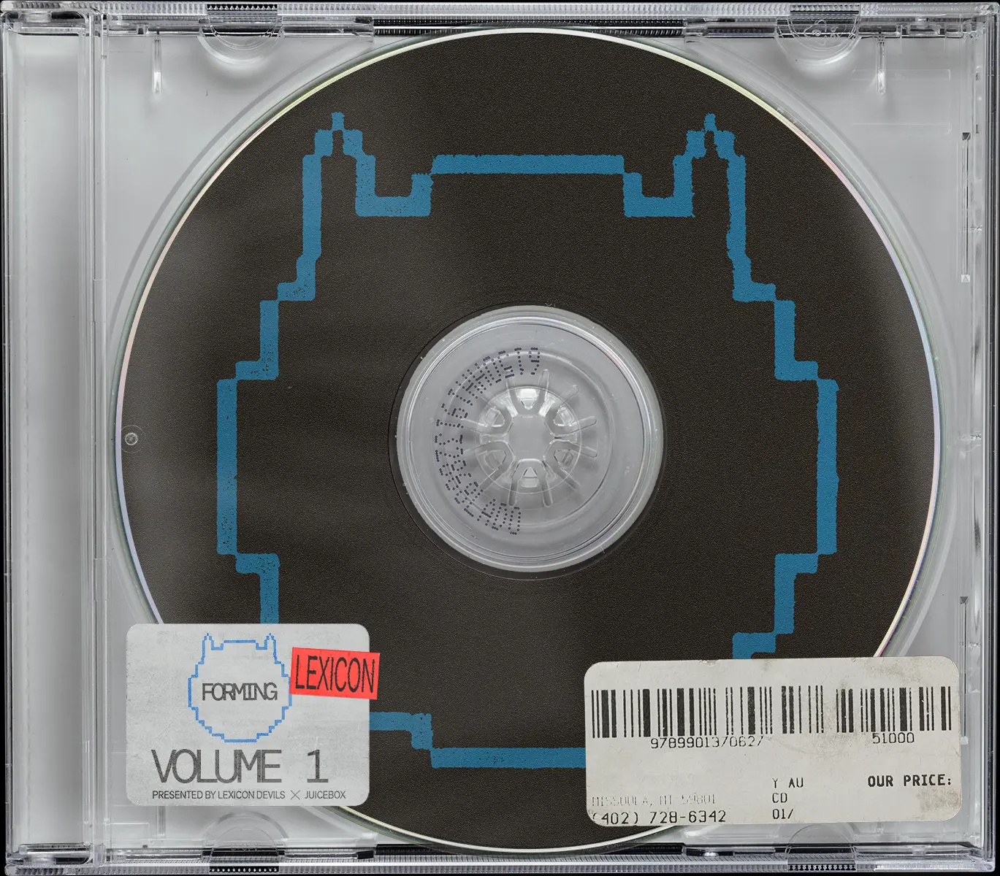
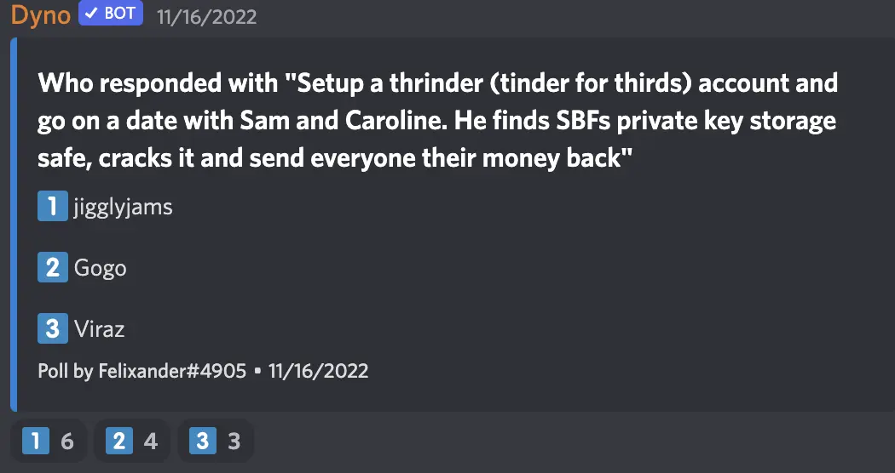

Art by [Sage Kellyn](https://twitter.com/SageKellyn)

## 前端工作报告 Peel 团队

- 我们的 NFT 功能已经上线，目前已经使用 NFT 奖励的主网项目。
- 初步的 V2 到 V3 升级路径大概本周做好，V2 项目很快可以在 V3 协议启动筹款周期。
- Peel 本周及下周的工作重点是清理一些 bug 及针对一些项目创建流程的用户反馈做一些整合改进。
- 本周会做一些新的 subgraph 的更新，接下来两周左右我们将可以在页面上的项目动态上显示筹款周期更新的情况。
- 非常感谢本周期 DAO 对 Peel 的长期报酬更新提案的支持。

## Defifa 工作报告 with Jango

我们目前正在想办法推广 Defifa 项目和进行相关的叙事，Jango 最近新撰写了一篇 [Defifa 的博客](https://docs.juicebox.money/zh/blog/2022-11-14-defifa)，解释这个项目的三个比较新颖的技术组件。

1. 首先，NFT 奖励机制作为协议的组成部分，现在可以附加到新建项目上，或者附加到现有项目以后的筹款周期上。Defifa 使用这一机制定义了 32 个等级，分别对应世界杯的 32 支参赛队伍，所有等级的价格都是 0.022 ETH。

    这些是 NFT 奖励合约里对所有人开放的功能。希望很多这些内含的功能组件能够加入到 juicebox.money 界面，这样大家也将有机会使用 NFT 代币的保留代币、治理相关的功能。

2. 另一个 Defifa 项目创建的特色是项目所有权的概念。

    正常情况下，Juicebox 项目的项目方多是个人或者多签钱包，他们有配置项目的专属权限。但 Defifa 这个项目有些特殊，项目方是一个合约，也就是说没有人可以控制项目的配置。项目硬编码了四个筹款周期，对应 Defifa 的四个不同的阶段，每个阶段结束前任何人都可以触发交易来开始下一阶段的筹款周期。所有定义游戏开始和其他时间线的时间戳都在游戏启动的时候固化下来了。

    整个 Defifa 的生命周期本质是在一个合约里面，不为任何人拥有。这是一个我们刚开始试验的设计空间，有一个实例来参考利用这些工具的应用明显更为有利。Jango 希望这个合同及构想能够为有意进一步试验的人们带来更多灵感。

3. 第三点也是最后一个创新的技术点，也是迄今还没有人尝试过的，就是用认证记分卡来开展治理这个思路。每个铸造的 NFT 实质上可以用于投票表决一揽子的特定决策，只不过 Defifa 将范围缩小到只有一个决策，即反映现实生活的实际结果。

    世界杯结束之后，NFT 代币持有人有责任认证比赛的所有结果，并按这个结果来决定项目金库的分配方案。谁都可以提交一个记分卡，NFT 持币人则要发送一个链上交易来认证出最为准确的那一个记分卡。

    一旦确定了准确的记分卡，金库就会重新打开，持币人可以赎回 NFT 来按记分卡的记录来获取金库相应的资产份额。

关于认证问题，32 支队伍各有一票来认证记分卡。同一队伍里的每个单位 NFT 则分享这一票的投票权重。例如说，有 300 个人 mint 了巴西队的 NFT，则每人获得 1/300 票的认证投票权重。如果有人累积了所有投票权重的 50%，就会出现操纵或篡改结果的可能性，因为这个比例的权重就可以确定并批准正确的记分卡。所以人们可能会有动力 mint 最少人持有的 NFT 来获得更高比例的投票权重。

Jango 同时认为在 juicebox.money 上展示[项目的页面](https://juicebox.money/v2/p/305)是很棒的。目前的项目创建流程只允许设置 3 个 NFT 等级，但协议其实支持无限数量的 NFT 等级。因此他建议 juicebox.money 前端的工作应该优先扩展支持合适的等级数量，他觉得这样做才是健康的，我们总不想花费这么多人力物力开发出来的东西因为太过局限而无人问津。

 Jango 很有信心，游戏过后，我们会对用于启动项目的各项参数的作用有更深认识，他很希望将来替换主题图案和网站设计后，来年再举办一次女足世界杯的相关游戏。

## V3 工作报告 by Jango

V1 到 V2 其实一个重大的升级，它打开了 Juicebox 协议很多的创新空间，相比之下，V2 到 V3 的转换其实只是修补 V2 审计中发现轻微问题所做的一个较小的改变。

接下来 JuiceboxDAO 将主要关注迁移系统的工作。未来的两个月，希望能在明年一月底前，我们可以清理好 V1  和 V2 的资产分配并把所有资产转移到 V3，同时开启 V1 JBX 代币转换成迭代版本 JBX 的流程。有关 JBX 的情况下周会有更多详细信息，目前正在协议频道展开相关的讨论。

我们希望 JuiceboxDAO 将来集中使用 V3 金库，同时在 V1 和 V2 金库分别设置一个支出。任何人都可以随时调用 `distribute`，资金就会自动从旧金库转到 V3 金库。这样一来，我们还可以在 V1、V2 金库上接受付款及收取费用，其筹款周期也照常更新。最终我们也可以决定把这两个金库关闭掉，同时停止在这两个地方收取费用，但这是后话了。

现在的目标是在合约的层面上把运营整合到 V3 协议，但同时我们要给前端团队多些时间来打磨最近新增的内容。我们还需要做很多的工作来改进、研究及深入认识它们，这些都需要时间。

如果 V2 项目选择升级到 V3，代表项目所有权的 NFT 在 V3 是保留下来的，因此无需重新创建新的项目。但是项目需要启动新的筹款周期及发行新的代币，因为这两项正是 V3 相对 V2 迭代的内容。项目方可以同时在 V2、V3 管理项目，也可以选择停止 V2 的筹款周期并把项目整体迁移到 V3 协议。JuiceboxDAO 因为同时有三个版本的金库及代币需要整合，迁移的情况会相对复杂一些。但其他大部分的项目的迁移操作都不会太难，只需要启动 V3 筹款周期，停掉 V2 周期，然后铸造新的项目代币并空投给当前的代币持有人即可。

## 协议数据分析 with Filipv

Filipv 制作了一个 [Dune 数据面板](https://dune.com/filipv/juiceboard)用于分析 Juicebox 协议的各项指标数据。以下图表左边是过去 30 天的情况，右边则是历史数据。

过去 30 天，协议有 44 个项目成功创建，高于 10 月的数字，但仍明显低于历史平均值。付款的数据也是类似的情况，从付款次数或者从付款金额来看都是这样。

 在此期间，JuiceboxDAO 从协议所有版本收到的平台费用大概是 20 ETH。另一个指标，收款金额高于 1 ETH 的活跃项目数指标则明显高于上月及历史平均值。

### Discussion about Juicebox fees 关于平台费用的讨论

**Filipv**:
平台费用只有在项目向协议外付款时才会产生，要么把资金转移到其他地方，要么向贡献者支持报酬。我们越能够追踪各个 DAO 实际运营情况，平台费用增长方面就越好。

**Nicholas**:
项目在 Juicebox 协议内相互付款不用交纳平台费用，我很喜欢这个做法。在某种程度上项目们会争取在 Juicebox 生态内向他们的服务提供方支付费用，这很酷。

**Jango**:
追踪这些不同的指标很有用。但现在真的很难说哪些指标更加重要，尤其是我们目前正在探索怎么设计一些有用的玩法并把它们传播出去。我举个最极端的例子，假如所有项目都在 Juicebox 内运营金库，并在协议内互相支付款项。这种情况下就完全不会有平台费用产生，只是在生态内产生潜在的能量，就好像平台的价值都锁定到合约里一样。说到底，协议是否收取费用并不是最重要的，生态内发生各种积极的活动才是最好的。人们在协议内交易不用支付费用，就有点像在协议内累积一些未来的现金流，我觉得这种情况更让人兴奋。我们可以从不同的角度来看待什么才算是成功。

**Filipv**:
不同指标有些相关度很高，有些则不然，很有意思。创建项目数和付款数似乎有很强的正相关性。但平台费用则没有太高的相关度，看来资金分配跟以上两个指标的正相关性并不是太强，收款高于 1 ETH 项目数量也同样关系不大。很多时候，每当付款量飙升，就会有很多人跟风创建大量的项目，但并不是所有项目都能培育出来可持续的社区。所以值得注意，类似创建项目数量这样的指标并不一定是正面的，因为这个指标高未必意味着真正建设的项目就非常多。

**jango**:
我觉得我们要时时提醒自己，平台费用的意义并不是让我们去延长和增加我们的报酬。它产生的能量要用于帮助推动很多将来的项目。我觉得我们应该从一个极端长期的角度回答什么样的费用架构和费率才是最合适的这个问题。从个人观点来说，我非常肯定我们的目标不是为了积累资产并一直支付报酬，收取平台费用在某种意义并不是为了允许我们扩张开支。一切都是为了积累 JBX 能量然后为将来的筹款活动服务。

## StudioDAO 项目启动 Kenbot

StudioDAO 已于本周启动。他们将于周四召开第一次市政例会，以展示他们有一个良好的分配机制，有很多愿意加入进来。

SudioDAO 成功启动并创建了第一个金库之后，他们的筹款目标是在一个月内筹集 100 ETH 资金，用于推动项目的发展。

接下来，他们将举行一次投票来决定 DAO 的第一批电影项目。目前有意向加入的有 Alien-To-Me 及其他几个项目。同时他们还有一项关于 MoonDAO 的提案。如果提案获得通过，他们会资助拍摄一部 MoonDAO 的纪录片，非常酷，而且对 StuidioDAO 来说就是一个完美项目。

 创始人 Kenbot 同时表示，他们不是一个 FOMO 项目，所以购买项目代币并没有硬性的截止时间。但当然是越早加入就越好。如果大家向 [StudioDAO Greenlight Treasury](https://juicebox.money/v2/p/311) 付款买入代币，目前的发行比率是 1 ETH 100 万代币附加 20% 保留比率，捐款人可以获得付款铸造代币总量的 80%。但随着他们的电影项目的启动，那些项目的保留比率会调高到 50%。

 同时 Kenbot 尝试与 Jigglyjams 合作来鼓励更大范围的社区来参与提案的温度测试，他们会用 Nance 机器人来追踪参与温度测试的人，并计划将来向这些参与治理的人发放或空投项目代币。

## Lexicon Devils 及 Forming 工作汇报  Darbytrash

11 月 27 日，Lexicon Devil 将携手 ALLSTARZ 举办一个 Forming 活动。ALLSTARZ 一个很酷的 NFT 系列，可以在[这里](https://allstarz.world/)查看。

他们计划为 ALLSTARZ 的 NFT 持有人准备一个特别的活动。NFT 持有人可以参与这个[Twitter 抽奖活动](https://twitter.com/allstarz_nft/status/1592274671520874496)，Wackozacco 将会为获奖者按他们持有的 ALLSTARZ NFT制作 Voxels 的可穿戴道具，然后穿上去参与上面提到的 Forming 活动。

他们正在制作过往[Forming 活动的混音带](https://soundcloud.com/lexicondevils/forming-mixtape-vol-1)，应该很快就可以完成。

## Felixander 的周会游戏

Felixander talked to three of our community members, Jigglyjam, Gogo and Viraz, and asked them the same question: "How would Banny get his funds out of FTX right now?" Felixander 分别问 Jigglyjams、Gogo和 Viraz 等三个社区成员一个同样的问题：“你觉得 Banny 现在要怎样才能从 FTX 取回自己的资金？”。

三个人的回答如下，次序不分先后：

- "he would disguise himself as shit, hide himself in SBF's toilet, then when SBF is taking a shit he will get inside of SBF though his anus... so you could say banny would fuck him up, then travel to SBF's cerebellum and take over his actions. He will then get in his account and get back his accounts and people that liked the this tweet. oh and he would share their private keys."

- "Setup a thrinder (tinder for thirds) account and go on a date with Sam and Caroline. He finds SBFs private key storage safe, cracks it and send everyone their money back"

- "funds are gone ser."

参与周会的成员猜一下究竟以上的第二句话是哪个人说的。

正确答案是 Jigglyjams。
