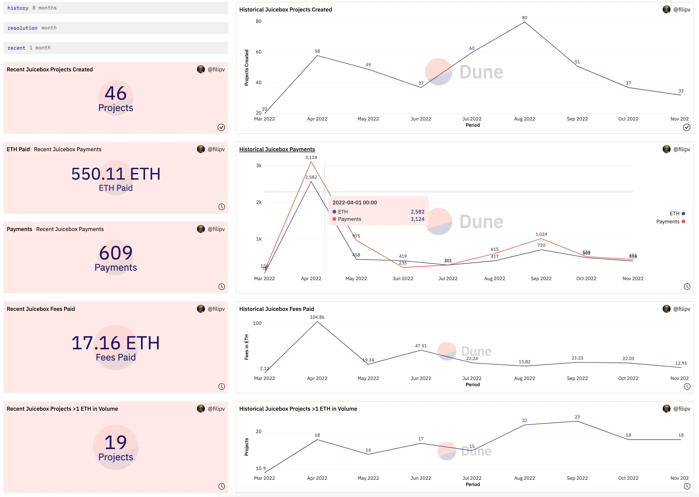
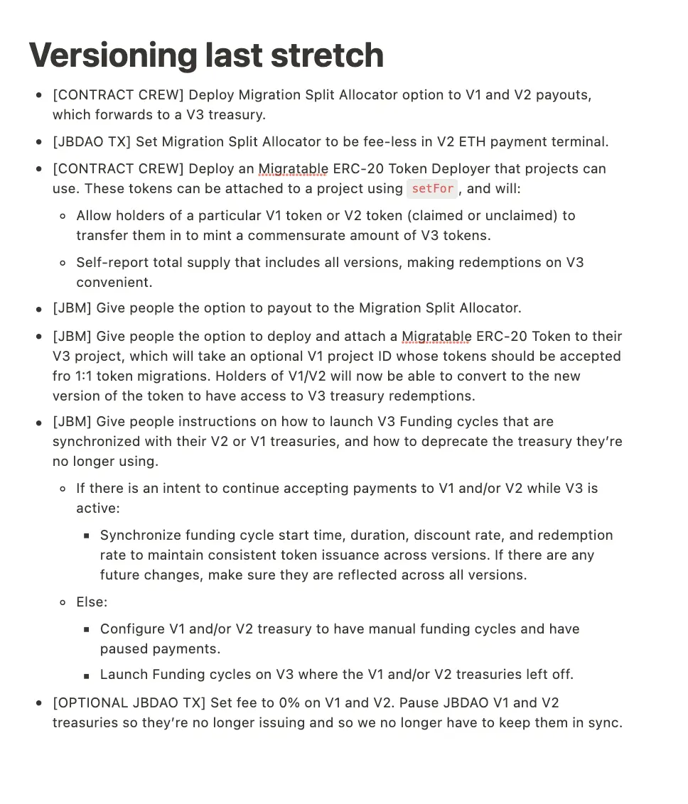
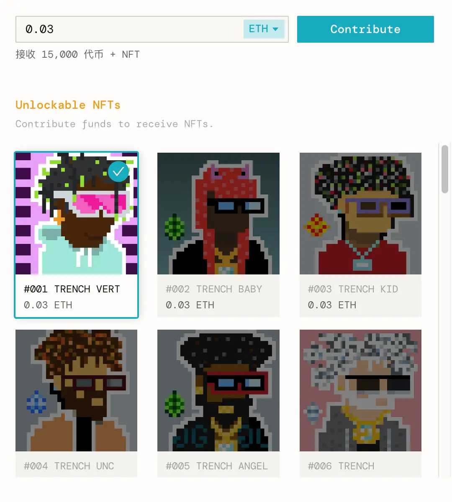
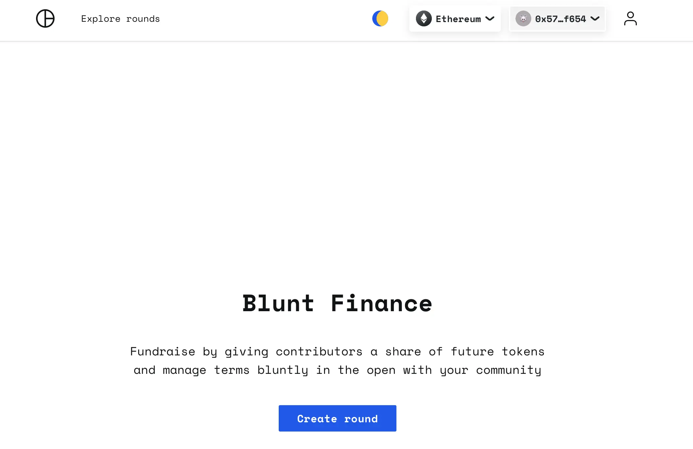
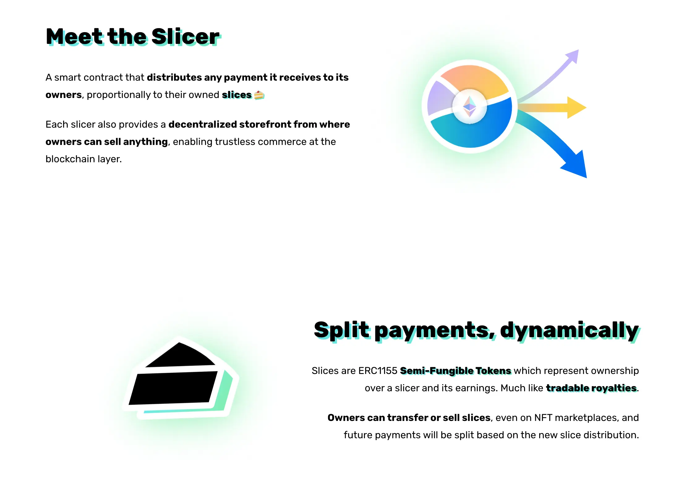
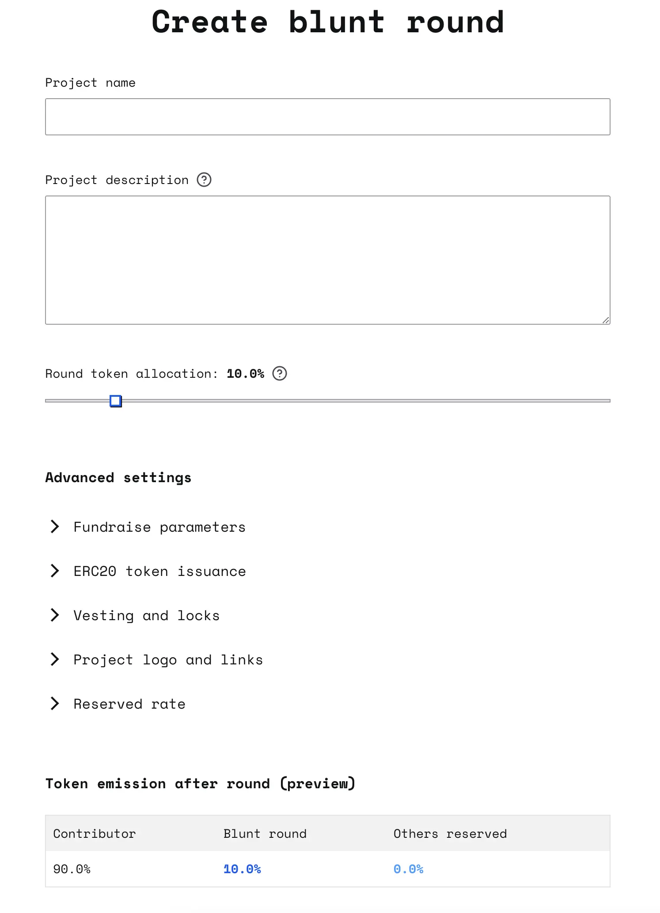
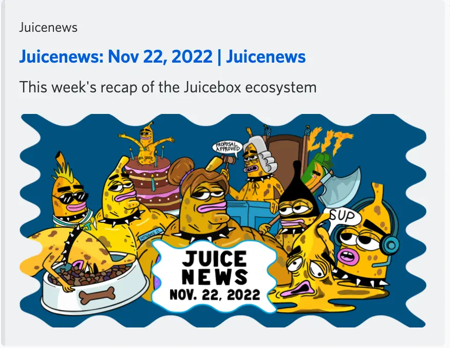
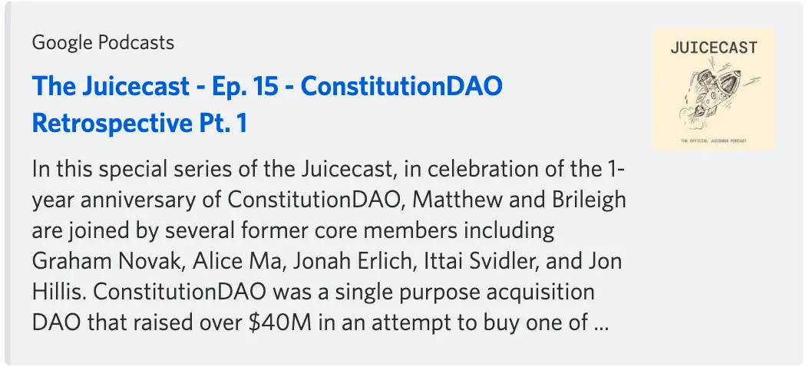
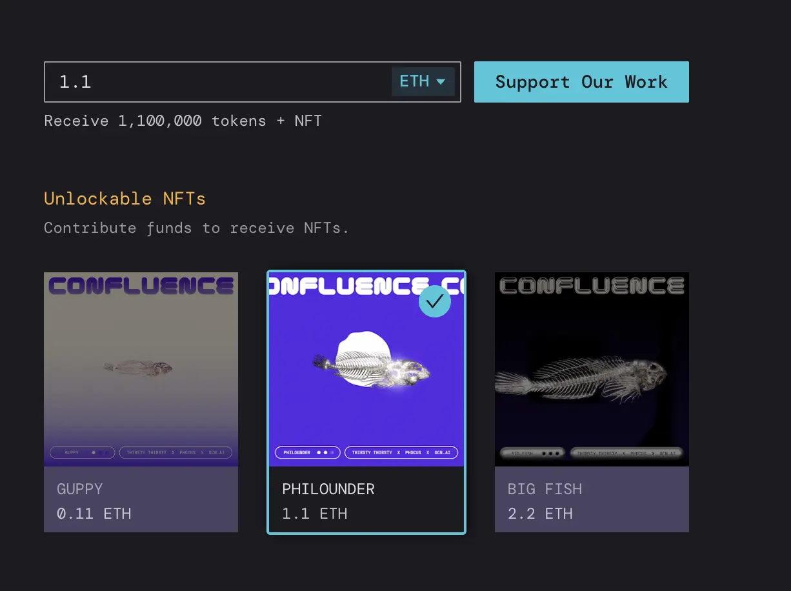
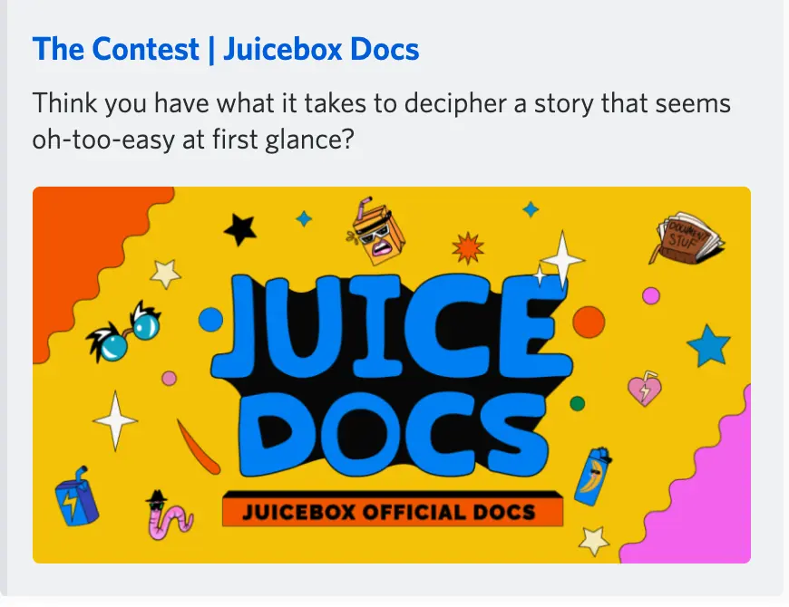

Art by [Sage Kellyn](https://twitter.com/SageKellyn)

## 协议数据分析 by Filipv

我们过去 30 天项目创建数量和付款数据都明显高于历史平均值。

## V3 版本控制 by Jango

ONNI 的[The Marfa Giant](https://juicebox.money/@marfagiant) 项目成功迁移到 V3 协议并增加了 NFT 系列，这是我们首个 V2 部署后成功启动 V3 金库的项目。我们正在与 Peel 前端团队一起改进 UX，有一些小的问题都很快得到解决。我们一直开发的产品终于到了投入真正的使用，这种感觉真好。

下一步是利用 Viraz 一直在开发的分发组件，这样希望保留 V1 及 V2 金库的项目就可以将收到的资金直接转到 V3 金库。这些分发组件已经编写及测试过，我们准备再审核一次，计划在未来数周部署。

同时迁移到 V3 的项目也可以选择使用 V3 的 ERC-20 标准代币，通过一个迁移函数来接收 V1 及 V2 代币，然后再相应向外分发 V3 代币，这样就得以保持项目所有版本代币总量的正确性。这项工作也是 Viraz 在做，已经编写好并等待最后审核。

目前 V2 项目已经可以启动 V3 筹款周期并添加 NFT 奖励功能。他们可以选择设置暂停 V2 金库并把所有运营集中到 V3 上去，又或者同时运营 V2、V3 两个金库，JuiceboxDAO 计划选择后者。

Jango 在战略频道列出了 V1、V2 社区安全启动 V3 版本还需要采取的一些最后工作步骤：

### 加强 JBX 代币机制

最后，Jango 提到，有两个项目在今年夏天已经产品原型化，但由于我们优先处理 V3 协议及 NFT 扩展功能等工作，就一直被搁置了下来。这两个项目的主要方向都是用于加强 JBX 的代币机制。

- JBX 费用模块。这是一个支付委托。每次有款项付入 JuiceboxDAO 金库的时候，这个委托就会决定究竟是按当前比率来铸造新的 JBX 代币，还是到 AMM 市场上购买 JBX，然后再把代币分发给付款的人或项目。

  这个功能会帮助向 Juicebox 支付费用的项目以最优价格获得 JBX，坏处是我们的金库可能不再有 ETH 的进账。这样的话，我们只是在支持现有 JBX 的流转。

  这个组件已经过研究并已完成原型化，但我们可能需要以提案的形式来一起商定是否最终要采取这个做法，提案将等我们完成 JBX 迁移到 V3 版本之后，最早于 2023 年年初提交。

- veNFT。这是一个锁定项目代币铸造的 NFT 代币，可以作为一个新的财务或者治理途径。很明显我们将会用 V3 来进行锁定，所以继续推进之前，我们要完成一部分以上提到的版本控制工作。

##  Lexicon Devils 工作报告

Lexicon Devils 将于 11 月 27 日下午 3 点 在 [Juicebox 的 Cryptovoxels 总部](http://juicebox.lexicondevils.xyz/).举行一场 Forming 联合 ALLSTARZ 的活动

Lexicon Devils 的 Youtube 频道在[这里](https://www.youtube.com/channel/UCdVQneduBYdjgHngd5zR79A)，可以观看之前的 Forming 活动。

## YouniDAO 成功启动 by Brenna and Saiko

YouniDAO 是一个致力于支持本地独立音乐人发挥自己的创意谋生存的一个 DAO。他们最近刚刚启动了自己的 [Juicebox 筹款项目](https://juicebox.money/@younidao) ，项目设置了一整个系列 33 个 NFT。YouniDAO 是首批利用我们 NFT 奖励功能的 Juicebox 项目。

他们正在开展一个 Uni Fest Summers 2023 的筹款活动，着眼于把它打造成首个依托 web3 支持独立音乐家的巡演活动。

Saiko 同时还说，YouniDAO 的字面意思就是你和我 DAO 的意思，围绕着它有一个巨大的心灵交应的一面，他们希望找到一个某种程度上大家可以和睦共生的途径，因为他们感觉到团结能带来力量，但同时又能日常互相之间尊重各自的个性。

他们对支持他们创建启动项目的 Juicebox 社区尤其是 Jango 表示了感激，同时对并肩 Juicebox 探索未来感到非常兴奋。

## Blunt Finance 项目 by Jacopo 与 Jango

其实 [Blunt Finance](https://blunt.finance/) 就是一个 Juicebox 项目的筹款周期，只不过有一些附近的功能以及遵循一些特殊的规则。他们现在标榜的是这个项目“通过给支持者未来的代币份额来开展筹款，同时公开与社区一起管理这些规则”。

Blunt Finance 有一些优点，其中之一就是你可以把相当于 Juicebox 项目保留代币的一部分授予你的捐款人。它是通过底层整合 Juicebox 及  [Slice](https://slice.so/) 来实现的这个操作的。

背景材料: <a href="https://slice.so/">Slicer and Slice</a>

Blunt 筹款轮结束之后，会创建一个 Slicer （Jacopo 编写的另一个智能合约）来接收 Juicebox 筹款的保留代币设置，通过按捐款金额来授予捐款人相应的份额并自动加入到保留代币分配方案里，来降低操作的复杂性。

人们在建立一个 blunt 项目的时候，可以使用一些高级设置参数。

一个 blunt 筹款轮实质上就是一个设置了某些特殊规则的筹款周期，它可以分成两个阶段：

1. 第一个阶段是筹款阶段，跟捐款给普通 Juicebox 项目差不多一样。不同之处在于 blunt 轮同时有筹款目标及筹款硬顶，这两点普通 Juicebox 项目是没有的。

1.  捐款达到筹款目标或者最终达到筹款硬顶的时候，项目发起人就可以结束这一轮筹款，让所有捐款人来领取自己在这个 slicer 里的 slice 份额，然后项目就会变成一个典型的 Juicebox 项目。

另一方面，如果这个筹款轮没有成功结束，也就是说筹款没有达到筹款目标，那么项目方就不能接收这个 Juicebox 项目的所有权，筹款活动结束，捐款人可以收回所有的捐款。

Blunt finance 就是要给某个筹款周期所有的捐款人一个未来筹款周期的代币分发份额，某种程度上说，第一个筹款周期就相当于一个筹款轮，后续的筹款周期项目方可以把项目的其他收入转进来，以产品轮的形式给予所有参与筹款轮融资的人一些特别的奖励。

基本上 blunt 筹款轮就是让项目方创建一个分配方案，以一个地址来统一代表所有第一轮的参与者，并将它加入到后续筹款周期的保留代币名单里去。如果有人想要投资某个项目但又不希望在后续的代币增发中份额被不断地稀释掉，这个机制就可以实现这一目标。 Jacopo 最初构想这一个想法正是出于从私人投资者或者机构融资可行性的考虑。

虽然项目方也可以收集第一轮所有参与者名单并手工输入到后续筹款周期的保留代币名单中去，通过 blunt 筹款轮理论上可以把项目方设置为一个第三方，整个项目会自动处理这些细节，又或者可以把这个筹款轮发送到其他治理合约里去。同时它还添加了一些具体的筹款参数，诸如硬顶、退款及其他围绕筹款的心理因素，并把这些都预先写入到第一个筹款周期的配置中。

Jacopo 还介绍说，合约的编写工作大致已经完成，可能还有一些细节的调整和额外功能的添加，但总体上开发工作已经结束。很快大家就可以在 Goerli 测试网上对这个项目进行测试。

## 社区能见度 by Matthewbrooks 及 Brileigh

他们刚刚发布了[最新一期的 Juicenews](https://juicenews.beehiiv.com/p/juicenews-nov-22)，你可以在页面上订阅，每周会有新一期的通讯发送到你的邮箱。

Matthew 和 Brileigh 上周还推出了新一辑的 Juicecast 播客节目，这是他们为 ConstitutionDAO 一周年制作的系列播客节目的第一期。所有的 Juicecast 播客节目可以去[这里](https://anchor.fm/thejuicecast)收听。

## Confluence Miami 活动 by Bruxa

Bruxa 与她的朋友们准备在 2022 年 Art Basel 期间举行一个非常有意思的 [Confluence](https://www.confluencetalks.xyz/) 活动。

Confluence 的主题是“加密货币与气候变化的交汇”，旨在把气候和 web3 两个领域的创新者汇聚到一起，讨论新生的区块链基础设施能够带来的好处和影响。活动上还将举行一个筹款拍卖，为 Thirsty Thirsty （再生农业）及 [OCN.ai](http://ocn.ai/) 社区进行融资。

他们在 Juicebox 上创建了一个[Confluence @Art Basel 2022](https://juicebox.money/v2/p/315) 来筹款支持举办这个 Confluence 活动， 在利用 Juicebox 新的 NFT 奖励功能的同时，还对未来支持类似活动的可行性进行试验。

## 寻宝比赛  by Felixander

Felixander 创办了一个比赛活动，详情参阅他撰写的[这篇博客](https://docs.juicebox.money/blog/the-contest-part-1/)。活动的目的是要吸引更多新的或者加密世界外的人加入到我们 Juicebox 社区。

这个比赛实质上是一个寻宝大赛，宝物为一个[以太坊钱包](https://etherscan.io/address/0xf9d30330af73687cda29dfe51479d0eaa05a30fe)，Felixander 和 WAGMI 工作室都投了一些资金进去。目前钱包里有 1.29 ETH，最重要的是里面还有 4 个 Defifa NFT （巴西、阿根廷、法国和葡萄牙），这些 NFT 所代表的球队如果在 2022 年世界杯比赛上能有不俗的战绩，它们可能也会变得价格不菲。

找到这个以太坊钱包 12 个记忆词的提示藏在 Felixander 准备要讲的一个故事里。故事分为 5 个部分，第一部分将于感恩节当日发布，其余四部分将于之后的每周一发布一部分，12 月 19 日发布最后一部分。通读整个故事，就有机会解开 Felixander 的这个谜题并找到打开宝箱的钥匙！

