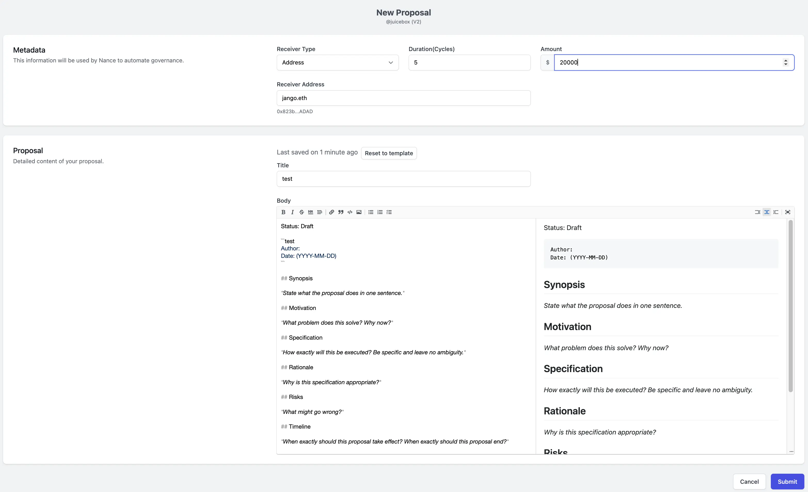
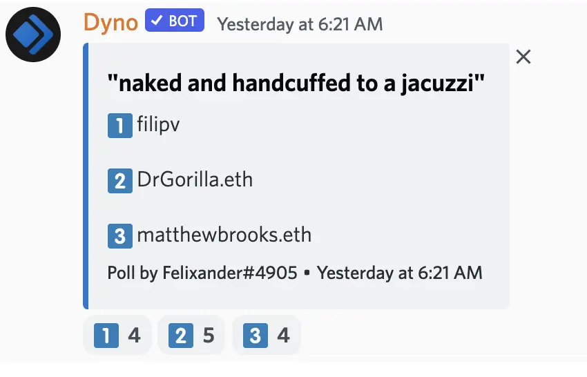
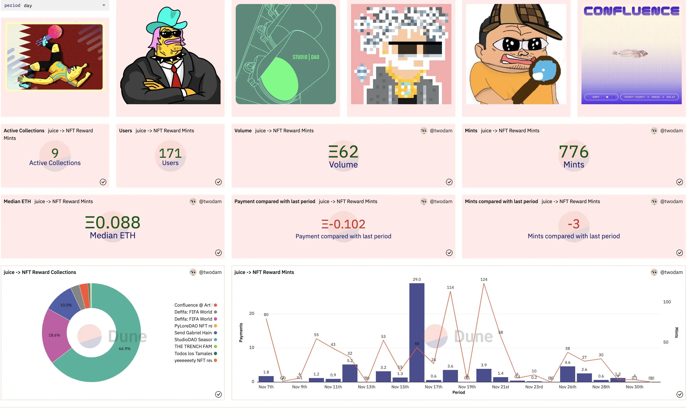

Art by [Sage Kellyn](https://twitter.com/SageKellyn)

## Infura 事后剖析 by Peri and Filipv

11 月 25日，juicebox.money 网址宕机大约 40 分钟。这是由于[Gabriel 项目](https://juicebox.money/v2/p/327) 的访问流量快速增加，最终导致我们使用的 Infura 服务超过请求限额引起的。我们的账户应该不存在所谓的 Infura 请求限额，所以可能是什么地方出了问题。

我们还没有对事件的原因形成最后的结论，不过 Infura 目前正采取措施来移除我们账户的费用限制，我们最近应该不会再发生类似的问题。

这个问题带来的好处是帮助我们发现了应用里的一些不足。很感谢 Aeolian, 他已经针对这一事件实现了一些关于应用的快速优化改进。即使将来出现比 ConstitutionDAO 更大规模的项目，我们也能更好避免出现类似的情况。还要感谢 Filipv 周六帮忙快速地解决这个问题，还有 Peel 团队每一个参与快速修复工作的成员。

## Juicetool 提案演示 by Jigglyjams

Jigglyjams 在会上简单介绍了[juicetool](https://juiccetool.xyz) 上的提案界面并演示如何填写及提交一个提案。

同时他还介绍，提案提交之后，会自动在我们的 Discord 服务生成一个讨论频道。除此之外，还会在[dolthub 的 Juicebox 治理页面](https://www.dolthub.com/repositories/jigglyjams/juicebox-governance) 生成一个新的目录，提案也会推送至数据库。这些是 Jigglyjams 计划逐步把 Notion 迁移到 MySQL 数据库的一些步骤。

## JokeDAO 工作报告 by Seanmc

JokeDAO 的负责人 Seanmc 来到周会，对 JuiceboxDAO 对 JokeDAO 的拨款提案[JBP-211-Sponsor Development of JokeDAO V2](https://juicetool.xyz/snapshot/jbdao.eth/proposal/0xecb6ba5ca205acb63cb430d6e94cb48e8b0ff8f1e83a0d1478d35f729ab1532f) 内容的第二阶段实现情况进行演示。第一阶段的目标是在 8 月 16 日的周期上进行演示的，所以这个第二阶段的实现比原设想时间慢了许多。

第二阶段目标里，他们计划开发一个奖励模块，用于在某一个比赛中按不同比例奖励不同名次。奖金全部发送到比赛并由奖励模块来进行分配，这个奖励模块其实就是附加到比赛上面的一个合约，合约的执行全部在链上完成。

奖励可以用比赛所部署任意区块链上不同的原生代币或 ERC-20 标准代币来支付。Seanmc 很期待看到这个模块应用于什么场景，他们觉得黑客松将是一个非常不错的用例，用户可以提交他们的黑客松项目并由黑客松比赛的奖励模块来按照比赛结果来自动分配奖金。

## 猜谜游戏 with Felixander

Felixander 向 Filipv、Dr.Gorilla 及 Matthewbrooks 等三人提了一个问题：“ 你觉得 Gabriel Haines 最后会怎样找到 SBF？“。他要求周会参会者猜一下，”赤裸地铐在按摩池上“ 这个回答是以下哪一位给出来的？这个问题的背景，请参考 [Gabriel Haines 项目](https://juicebox.money/v2/p/327) 的项目描述。

正确答案是 **Matthewbrooks**。

## Forming 工作报告 Darbytrash

本周日，Forming 与 ALLSTARZ 合作的活动在 [Juicebox 的 Cryptovoxels 总部](http://juicebox.lexicondevils.xyz/)举行。

这次活动非常成功。很多人第一次了解并与 Juicebox 进行了互动，并由此开始了解 Juicebox。此次活动中 ALLSTARZ 的一个 DJ，L444U，今天也来参加我们的周会，希望能进一步对 Juicebox 进行探索。

Lexicon Devils 把活动的[表演内容](https://www.youtube.com/watch?v=zNxjgpl3fp8)上传到 Youtube, 同时还推出了活动内容的[混音带](https://soundcloud.com/lexicondevils/forming-mixtape-vol-5)。

同时 Lexicon Devils 还计划与以下社区展开合作：

-  与 [Songcamp](https://twitter.com/songcamp_) 合作，这是一个非常酷的 NFT 社区。
-  与 [LowEffortPunk](https://twitter.com/LowEffortPunks) 合作。

## NFT 奖励 Dune 数据面板 by Twodam

Twodam 制作了一个非常酷的 Dune 数据面板来展示整个 Juicebox 协议的各种 NFT 奖励统计数据。

